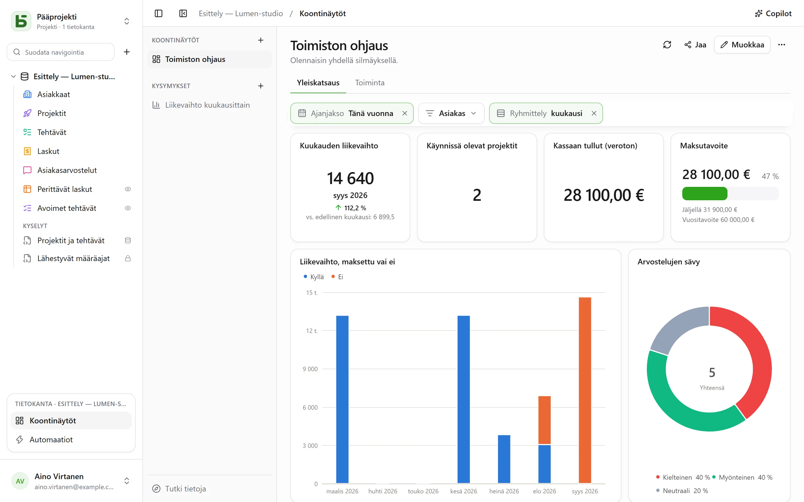
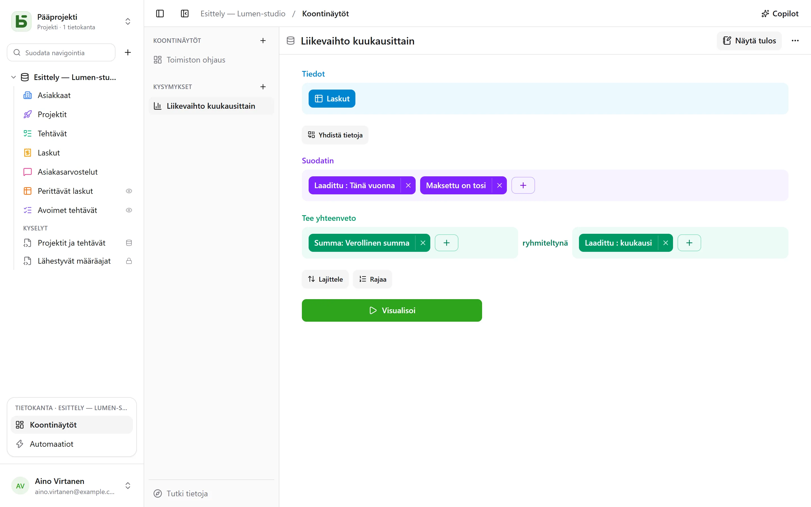
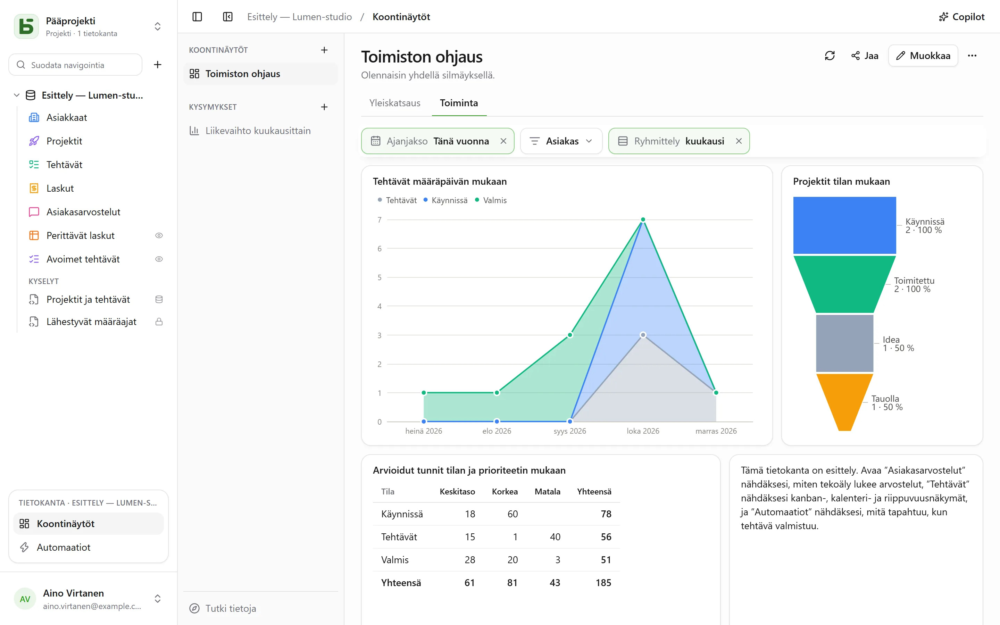

**Koontinäyttö** kokoaa yhdelle sivulle sen, mitä tiimi katsoo joka päivä: tärkeät luvut,
niiden kehityksen kuukaudesta toiseen, tilan jakauman ja lähimmät eräpäivät. Jokainen sen kortti
näyttää **kysymyksen** – tietokannan lukemisen, joka on rakennettu hiirellä tai kirjoitettu
SQL:llä – ja sivun yläosan **suodattimet** ohjaavat niihin yhdistettyjä kortteja.



Kaikki avataan kohdasta **Koontinäytöt** sivupalkin alaosan avoimen tietokannan lohkosta.
Vasemmalla ovat tietokannan koontinäytöt ja tallennetut kysymykset sekä **Tutki tietoja**, jolla
voi esittää kysymyksen tallentamatta mitään. Jokainen tietokannan lukija voi selata niitä,
tutkia niitä ja tallentaa omia kysymyksiään; koontinäytön rakentaminen ja kysymyksen jakaminen
vaativat **Hallintaoikeus**-tason.

Tallennettu kysymys on **henkilökohtainen** – vain sinä näet sen –, **koko tietokannalle** tai
**ryhmille**. Sen valikko, hiiren oikealla painikkeella tai **⋯**-kuvakkeesta, avaa sen
välilehdelle taulukoiden vierelle, muuttaa sen nimen ja jakamisen tai poistaa sen.
Välilehtipalkin **+** tarjoaa myös **Uusi kysymys** ja **Uusi SQL-kysymys**.

**Tallenna**, kysymyksen otsakkeessa, säilyttää sen; kysymys, jota et voi muokata, tarjoaa sen
sijaan **Tallenna kopio**, josta tulee sinun. **⋯** (**Lisää toimintoja**) tarjoaa myös **Nimi ja
jakaminen…**, **Tallenna kopio…** ja **Poista kysymys**; sitä näyttänyt välilehti säilyttää
sisältönsä, josta tulee jälleen tallentamaton.

## Kysymyksen rakentaminen hiirellä

Kysymys rakennetaan vaiheittain, vaihe toisensa alle:



| Vaihe | Mitä siinä valitaan |
|---|---|
| **Tiedot** | lähtötaulukko ja sarakkeet, jotka näytetään, kun mitään ei tiivistetä |
| **Yhdistä tietoja** | toinen tietokannan taulukko, joka on yhdistetty viittauksella – ehdotetaan automaattisesti – tai kahdella samantyyppisellä sarakkeella; vasen, sisä-, oikea tai täysi liitos |
| **Suodatin** | sarakkeittain sen tyypin tarjoamin vaihtoehdoin: on / ei ole, sisältää, välillä, tyhjä…; päivämäärälle **ajanjakso**: tänään, viimeiset 30 päivää, tämä kuukausi, edellinen vuosineljännes, alkaen … päättyen …; tai lauseke, joka kirjoitetaan kuten näkymien palkissa |
| **Tee yhteenveto** | mittarit – rivien lukumäärä, summa, keskiarvo, mediaani, minimi, maksimi, erilliset arvot, keskihajonta, kumulatiiviset summat – **ryhmiteltynä** yhden–kolmen sarakkeen mukaan |
| **Lajittele**, **Rajaa** | rivien järjestys ja niiden enimmäismäärä |

Päivämäärät ryhmitellään **päivittäin, viikoittain, kuukausittain, vuosineljänneksittäin tai
vuosittain** tai järjestyksen mukaan – viikonpäivä, vuoden kuukausi, vuorokauden tunti; luvut
väleihin. Monivalinta laskee jokaisen rivin jokaiseen sen valintaan. Ajanjaksot luetaan omalla
aikavyöhykkeelläsi, ja viikko alkaa asetuksissasi määritettynä päivänä.

**Visualisoi** suorittaa kysymyksen. Tulos näytetään sille sopivalla tavalla – lukuna, viivana,
palkkeina, taulukkona – ja sitä voi vaihtaa näytön alaosasta:

| Visualisointi | Mitä sillä näytetään |
|---|---|
| **Luku**, **Trendi**, **Edistyminen**, **Mittari** | yksi arvo; viimeisin ajanjakso verrattuna edelliseen ja viime vuoden vastaavaan; eteneminen kohti tavoitetta |
| **Pylväät**, **Palkit**, **Viiva**, **Alueet**, **Yhdistelmä** | mittarit ulottuvuuden varrella, sarjat rinnakkain, pinottuina tai 100 %:iin |
| **Piirakka**, **Suppilo** | osuudet, vaiheet |
| **Hajontakaavio** | kaksi mittaria toisiaan vastaan, kolmas koon mukaan |
| **Taulukko**, **Ristiintaulukko** | rivit lajiteltavina; rivit yhden ulottuvuuden ja sarakkeet toisen mukaan summineen |
| **Kartta** | Ranskan alueet tai departementit tai maat arvon mukaan väritettyinä; tai pisteet leveys- ja pituusasteen mukaan |

**Asetukset** säätää, mitä näytetään, ja tuloksen voi ladata **CSV**-muodossa.

### Kaavion mukauttaminen

| Visualisointi | Mitä **Asetukset** tarjoaa |
|---|---|
| **Palkit, viivat, alueet, yhdistelmä** | kunkin sarjan väri ja nimi; pinoaminen ja summa pinojen yläpuolella; palkkien leveys; pehmennetyt tai porrastetut viivat pisteineen tai ilman; luokkien järjestys; akselien otsikot, asteikkomerkit, selitteiden kallistus, rajat, logaritminen asteikko; arvot kaaviossa; tavoite |
| **Piirakka** | rengas ja sen paksuus, puoliympyrä, ruusu; summa keskellä; osuuksien määrä ennen ryhmää ”Muut”; kunkin osuuden väri ja nimi; selitteet osuuksien päällä tai vieressä; selitteen paikka |
| **Suppilo** | kunkin vaiheen väri ja nimi, niiden järjestys |
| **Luku, trendi, edistyminen, mittari** | väri, arvon mukaiset värit, seliteteksti luvun alla, vertailu – ja onko lasku hyvä uutinen |
| **Taulukko, ristiintaulukko** | sarakkeiden uudelleennimeäminen ja järjestäminen, palkit soluissa, arvon mukaiset värit – soluittain tai riveittäin –, tiiviys, rivit sivua kohden, rivinumerot, summat |
| **Kartta** | sävy, alueiden nimet |

Kaikille lukujen muoto: desimaalit, etu- ja jälkiliite, lyhennys muotoon `1,2 k`.

## Tutkiminen yhdellä napsautuksella

Palkin, pisteen tai osuuden napsauttaminen avaa sen, mitä se edustaa:

- **Näytä nämä rivit**: pisteen takana olevat rivit sen edustaman arvon mukaan suodatettuina;
- **Tarkenna viikoittain**: ajanjakso avattuna tarkemmaksi – vuosi vuosineljänneksiinsä,
  kuukausi viikkoihinsa;
- **Jaottele…**: sama mittari tälle pisteelle toisen sarakkeen mukaan;
- **Vain tämä arvo**, **Jätä tämä arvo pois**.

Jokainen askel on erillinen kysymys, jonka voi halutessaan tallentaa; paluunuoli palaa
edelliseen askeleeseen. Taulukon rivi avaa rivin tiedot.

Koontinäytössä sama napsautus tarjoaa myös **Suodata koontinäyttö: ”Lyon”** sekä niiden
korttien määrän, joita se koskee: **väliaikainen** suodatin, jota ei koskaan tallenneta, joka
näkyy suodatinpalkissa katkoviivalla ja jonka voi poistaa yhdellä napsautuksella, ja joka
koskee jokaista korttia, jonka kysymys lukee samaa saraketta – taulukkonsa tai liitoksen kautta.
Sitä tarjotaan vain, jos mikään koontinäytön suodatin ei ole jo yhdistetty tähän sarakkeeseen
kortilla, ja se pysyy harmaana (”ainoa kortti”), kun mikään muu kortti ei lue saraketta.
SQL-kysymykset eivät huomioi sitä.

## Kysymyksen kirjoittaminen SQL:llä

**SQL-kysymys** on `SELECT` tietokannan taulukoista niiden oikeilla nimillä. Se suoritetaan
**vain luku -tilassa omilla käyttöoikeuksillasi** – kaikille, myös hallinnoijille: sinulta
suljettua taulukkoa ei ole olemassa, piilotettu kenttä hylätään, eikä kirjoittaminen ole
mahdollista. Jos haluat vain tallentaa kyselyn taulukoiden alle ilman kaaviota tai tehdä siitä
oikean PostgreSQL-näkymän, katso [Kyselyt ja SQL-näkymät](/basedb/fi/fonctionnalites/requetes-et-vues-sql/).

**Muuttuja** kirjoitetaan `{{nom}}`; osa, joka poistetaan, kun sillä ei ole arvoa, merkkien
`[[` ja `]]` väliin:

```sql
SELECT statut, count(*) AS taches
  FROM taches
 WHERE {{periode}} [[AND priorite = {{priorite}}]]
 GROUP BY statut
```

Muuttuja on teksti, luku, päivämäärä – tai **sarakesuodatin**: `{{periode}}` muuttuu silloin
kokonaiseksi ehdoksi valitulle sarakkeelle, tässä `echeance`, tai arvoksi `TRUE`, kun mitään ei
ole valittu. Näin koontinäytön suodatin voi ohjata SQL-kysymystä kuten muitakin.

## Koontinäytön järjestäminen

**Muokkaa** vie koontinäytön muokkaustilaan:

- **Kysymys** sijoittaa tallennetun kysymyksen – henkilökohtainen kysymys kopioituu sinne –, tai
  luo kortille oman kysymyksen;
- **Otsikko** lisää osion otsikon, **Teksti** muotoillun tekstin – otsikkoja, luetteloita,
  linkkejä – joka voi sisältää lukuja (katso alempana);
- **Upotettu sivu** näyttää `https://`-osoitteen eristetyssä kehyksessä, joka ei saa istuntoa
  eikä tietoja;
- **Välilehti** jakaa kortit usealle sivulle; kaksoisnapsautus nimeää välilehden uudelleen.

Kortteja siirretään kahvasta ja niiden kokoa muutetaan kulmasta 24 sarakkeen ruudukossa.
**Tallenna** tallentaa kaiken; **Peruuta** palaa edelliseen versioon. Lukutilassa kortin otsikko
avaa sen kysymyksen tutkittavaksi koontinäytön suodattimineen.

### Lukuja tekstissä

Teksti viittaa arvoon nimellä kaksoisaaltosulkeiden sisällä: ”Tässä kuussa liikevaihtoa
`{{chiffre_affaires}}`, `{{commandes}}` tilauksella.” Jokaisesta nimestä tulee pieni merkki,
jonka voi yhdistää yhdellä napsautuksella – tai editorin palkin **Muuttuja**-painikkeella –
johonkin näistä:

| Lähde | Mitä teksti näyttää |
|---|---|
| **kortti** koontinäytöllä | se, mitä se näyttää, omilla suodattimillaan |
| **koko tietokannan tallennettu kysymys** | sen arvo, ja koontinäytön suodattimet yhdistyvät siihen kuten korttiin |
| **tekstiin tallennettu kysymys** | sen arvo; näin viitataan henkilökohtaiseen kysymykseen |
| **koontinäytön suodatin** | valittu arvo, sen ohjaimen mukaisesti |

Kysymyksen arvo on se, jonka sen **Luku**-visualisointi näyttäisi: sen ensimmäinen mittari,
viimeisellä rivillä. Se lasketaan lukijan käyttöoikeuksilla, ja se näkyy aina tekstinä. Teksti
voi viitata enintään 20 arvoon; nimi kirjoitetaan pienin kirjaimin, numeroin ja merkillä `_`.
Ennen editoria Markdownilla kirjoitetut tekstit näkyvät kuten ennenkin, ja muuttuvat
muotoilluiksi heti, kun ne kirjoitetaan uudelleen. Copilot puolestaan kirjoittaa tekstinsä
Markdownilla.

## Suodattimet

**Suodatin** lisää ohjaimen koontinäytön yläosaan: **päivämäärä** (ajanjakso), **luokka**
(valittavat arvot), **teksti**, **luku** tai **päivämäärän ryhmittely**, joka vaihtaa viivojen
tarkkuuden kuukaudesta viikkoon tai vuoteen.

Suodatin ohjaa siihen yhdistettyjä kortteja – yhtä, useita tai kaikkia. Luotaessa se yhdistyy
itsestään sille sopiviin sarakkeisiin; valittuna se näyttää jokaisella kortilla suodattamansa
sarakkeen, jonka voi vaihtaa tai poistaa, ja **Yhdistä kaikkiin yhteensopiviin kortteihin**
täydentää loput. Sillä voi olla **oletusarvo** – esimerkiksi ”Tämä vuosi”.

Lukutilassa pisteen napsauttaminen voi myös asettaa suodattimen: **Suodata: ”Lyon”** kortilla,
jonka kaupunkisarake on yhdistetty ”Ville”-suodattimeen.



## Copilot

Koontinäytöt-osion otsakkeen **Copilot** avaa oikealle luonnollisen kielen keskustelun
tietokannasta: ”liikevaihto kuukausittain”, ”lisää asiakassuodatin”, ”miksi elokuu laskee?”.
Jokainen ehdotus saapuu korttina, joka otetaan käyttöön yhdellä napsautuksella:

| Ehdotus | Mitä se tekee |
|---|---|
| **Kysymys** | suoritetaan ja piirretään keskusteluun; se avautuu editoriin tai lisätään koontinäyttöön |
| **Koontinäytön muutoksia** tai uusi koontinäyttö | lisätyt, muokatut tai poistetut kortit, tekstit, suodattimet, jotka yhdistyvät itsestään sarakkeen sisältäviin kortteihin, välilehdet, nimi – yksi tallennus, joka on **kumottavissa** kortista |
| **Arvoja näytetyille suodattimille** | ”näytä viime kuukausi”: suodattimet asettuvat, mitään ei tallenneta |

Kysymyksen esittäminen tai suodattimien asettaminen on avoinna jokaiselle tietokannan lukijalle;
koontinäytön muokkaaminen tai luominen vaatii **Hallintaoikeus**-tason.

Oletuksena tekoälypalveluntarjoajalle lähtee keskustelun lisäksi **vain rakenne**: taulukot ja
niiden kentät, tietokannan koontinäytöt ja tallennetut kysymykset sekä näytetty koontinäyttö –
sen välilehdet, suodattimet ja korttien määritelmät (niiden kysymykset, niiden tekstit). Ei
rivejä, korttien tuloksia eikä **suodattimiin valittuja arvoja**, jotka voivat olla tietoja:
suodattimesta lähtee vain tieto siitä, että sillä on arvo. Agenteille näkymättömäksi merkitty
kenttä ei lähde, eikä myöskään sellaisen kortin kysymys, joka viittaa siihen.

**Salli tietojen lukeminen** -valinta lisää keskustelun ajaksi näytettyjen suodattimien arvot ja
korttien tulokset näillä suodattimilla (enintään 50 riviä lukukertaa kohden, lueteltuina
vastauksen alla), jotta lukuja voidaan kommentoida niiden perusteella. Katso
[Tekoäly](/basedb/fi/fonctionnalites/ia/).

## Koontinäytön jakaminen

Koontinäytön otsakkeen **Jaa** on tarjolla sille, jolla on tietokantaan **Hallintaoikeus**-taso.
Kaksi tapaa:

- **Jaa tietokanta…** kutsuu henkilöitä tietokantaan: he avaavat koontinäytön basedb:ssä, ja
  jokainen kortti lukee heidän omilla käyttöoikeuksillaan;
- **Luo linkki** antaa linkin **vain** tähän koontinäyttöön, eikä se vaadi mitään käyttöoikeuksia
  tietokantaan.

| Linkin pääsy | Kuka lukee |
|---|---|
| **Julkinen** | kuka tahansa, jolla on linkki, ilman tiliä |
| **Kirjautuneet jäsenet** | työtilan jäsen kirjauduttuaan – tarvittaessa vain tietyistä ryhmistä |

Linkin sivu näyttää koontinäytön välilehdet, suodattimet ja kortit **vain luku -muodossa**: ei
tutkimista, ei pääsyä riveihin eikä omia kysymyksiä. Sen kortit lukevat **linkin julkaisseen
henkilön käyttöoikeuksilla**, jotka tarkistetaan uudelleen jokaisella lukukerralla: jos hän
menettää pääsyn tietokantaan, linkki **keskeytetään**. **Linkki käytössä** -kytkin katkaisee sen
menettämättä sitä, ja **Luo uudelleen** mitätöi vanhan.

Valitse **Salli upottaminen toiselle sivustolle**: valintaikkuna antaa `<iframe>`-**upotuskoodin**,
jolla koontinäytön voi näyttää intranetissä tai wikissä. Mekanismi on sama kuin
[jaetuissa näkymissä](/basedb/fi/fonctionnalites/vues-partagees/).

## Kullakin omat käyttöoikeutensa

Jokainen kortti lukee **katsojan käyttöoikeuksilla**: sama koontinäyttö näyttää kullekin sen,
mitä hänellä on oikeus nähdä – paitsi jakolinkin kautta, joka lukee sen julkaisseen henkilön käyttöoikeuksilla. Kortti, joka koskee sinulta suljettua taulukkoa tai kenttää, näyttää
”Tieto ei saatavilla” sen sijaan, että näyttäisi luvun, joka valehtelisi puuttuvilla tiedoilla.
Kysymyksen tallentaminen jakaa vain kysymyksen, ei koskaan sitä, mitä sen tekijä saa lukea.

## Rajoitukset

- Kysymys palauttaa enintään 2 000 riviä; yhteenvedolle se riittää lähes aina.
- Jokainen kortti tekee kyselynsä avattaessa ja jokaisen suodatinmuutoksen yhteydessä ilman
  välimuistia.
- Karttapohjat kattavat Manner-Ranskan (alueet, departementit) ja maailman maat. Lähde: IGN,
  Admin Express (Licence ouverte); Natural Earth.
