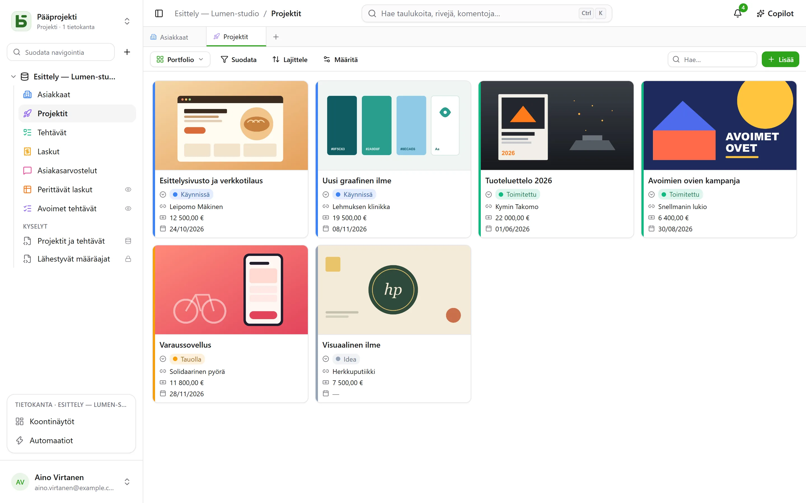
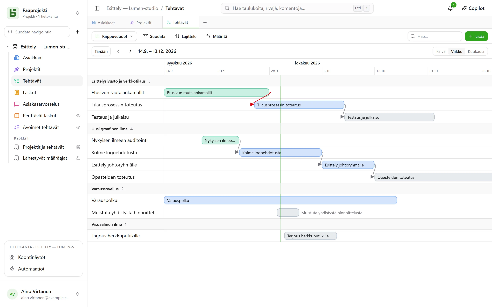
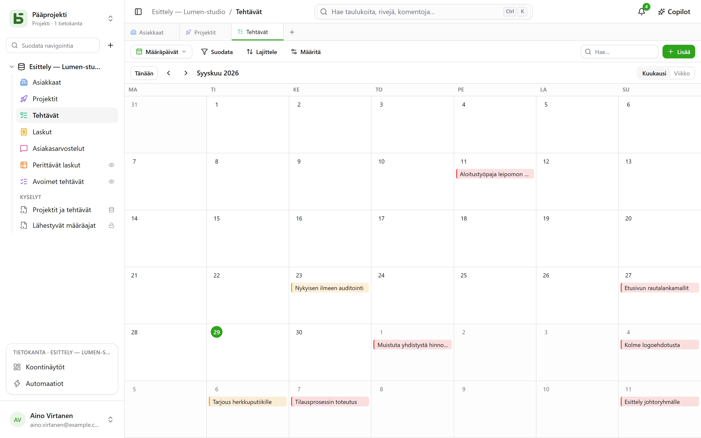
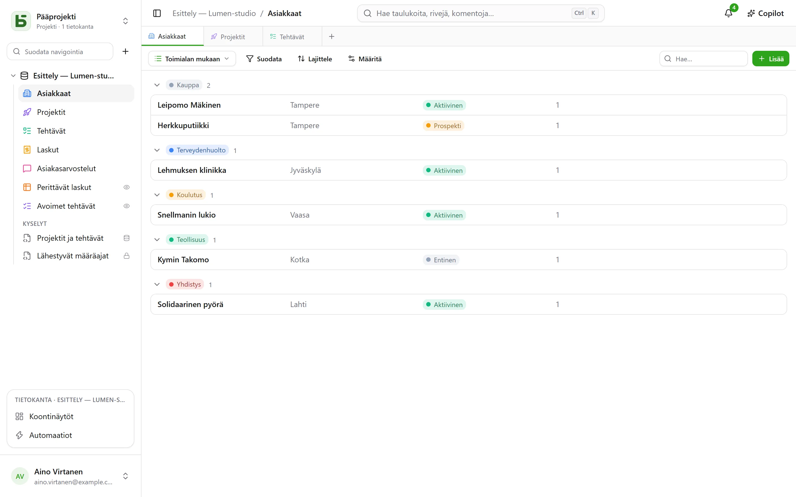

Taulukon voi näyttää **kymmenellä tavalla**. Näkymä ei kopioi tietoja eikä anna enempää
käyttöoikeuksia kuin taulukko itse.

:::note
Nämä näkymät ovat tapoja näyttää **yksi** taulukko. [SQL-näkymä](/basedb/fi/fonctionnalites/requetes-et-vues-sql/)
on eri asia: oikea PostgreSQL-näkymä, joka kirjoitetaan SQL:llä tietokannan taulukoiden päälle ja
sijoitetaan niiden joukkoon sivupalkissa.
:::

| Näkymä | Mitä se näyttää | Mitä se tarvitsee |
|---|---|---|
| **Ruudukko** | rivit suodatettuina, lajiteltuina ja ryhmiteltyinä, valitut sarakkeet | – |
| **Kanban** | kortit sarakkeissa | yksi valinta -kentän |
| **Kalenteri** | rivit päivämääränsä kohdalla, kuukausittain tai viikoittain | päivämääräkentän |
| **Aikajana** | palkit kahden päivämäärän välillä ja niiden riippuvuudet | alkupäivämäärän |
| **Galleria** | kortit kansikuvineen | – |
| **Luettelo** | yksi rivi tietuetta kohden, kutistettavissa ryhmissä | – |
| **Kartta** | jokainen rivi sijoitettuna kartalle | osoite, tai leveys- ja pituusaste |
| **Lomake** | kysymyssivu rivin luomiseen | – |
| **Kyselylomake** | samat kysymykset, yksi kerrallaan | – |
| **Tietovisa** | pisteytettyjä kysymyksiä, yksi kerrallaan, ja pistemäärä lopussa | – |

## Näkymävalitsin

Se on ”Suodata”-painikkeen vasemmalla puolella. ”Kaikki rivit” on taulukon ruudukko, jota
kukaan ei ole tallentanut eikä voi poistaa; sen jälkeen tulevat **yhteiset näkymät** tietokannan
rakentajan valitsemassa järjestyksessä ja sitten **Omat näkymät**. Alaosassa **Luo näkymä** jakaa
kymmenen lajia kahteen ryhmään: niihin, jotka **näyttävät rivit**, ja niihin, jotka **keräävät
vastauksia** (lomake, kyselylomake, tietovisa).

- **Yhteinen näkymä** näkyy kaikille. Sen luominen, määrittäminen, uudelleennimeäminen,
  järjestäminen tai poistaminen vaatii **Hallintaoikeus**-tason. Sen voi **lukita**: lukon kuva
  kertoo sen, eikä kukaan voi muuttaa näkymää avaamatta ensin lukitusta.
- **Henkilökohtainen näkymä** näkyy vain sinulle ja vaatii vain taulukon lukuoikeuden.
  **Luo henkilökohtainen näkymä** tai **Tallenna näkymäksi** suodatuksen ja lajittelun jälkeen:
  kukin tallentaa omat lukutapansa muuttamatta mitään muille. Yhteisen näkymän **monistaminen**
  tekee siitä henkilökohtaisen kopion.

## Työkalupalkki

Ruudukon yläpuolella tässä järjestyksessä:

- **Suodata** yhdistää kenttäkohtaisia ehtoja;
- **Sarakkeet** valitsee, mitä näytetään – järjestelmäsarakkeet ovat erikseen kohdassa
  ”Järjestelmätiedot”;
- **Ryhmittele** järjestää rivit yksiarvoisen kentän – yksi valinta, viittaus, henkilö,
  päivämäärä, luku, teksti, valintaruutu… – mukaan kutistettaviin ryhmiin, joista kullakin on
  koko suodatuksen kattava lukumäärä;
- **Värit** värittää rivit yksi valinta -kentän tai **sääntöjen** mukaan – suodatin ja väri,
  enintään kaksikymmentä – reunaviivana, taustana tai molempina;
- **Rivin korkeus**: matala, keskikorkea, korkea, erittäin korkea;
- oikealla oleva **Hae…** hakee kaikista sarakkeista kirjoittaessasi; Esc tyhjentää haun. Se
  toimii myös kanbanissa, kalenterissa, aikajanassa, galleriassa ja luettelossa, eikä sitä
  koskaan tallenneta näkymään.

Jokaisen sarakkeen alla on **Yhteenveto**, joka lasketaan kaikista suodatuksen riveistä eikä
vain sivusta: täytetyt, tyhjät, yksilölliset arvot, summa, keskiarvo, minimi, maksimi,
valitut ruudut.

## Kanban, kalenteri, aikajana

- **Kanban** järjestää kortit yksi valinta -kentän mukaan; kortin vetäminen muuttaa riviä, ja
  sarakkeen yläosan ”+” luo rivin, jolla on jo kyseinen valinta. Jokainen kortti näyttää
  otsikon, kansikuvan, valitut kentät ja **kuvauksen**, joka viittaa rivin arvoihin –
  ”Toimituspäivä `{{Date}}`, asiakas `{{Client}}`” –, ja joka kirjoitetaan näkymän
  asetuksissa **Lisää kenttä** -painikkeella.
- **Kalenteri** sijoittaa jokaisen rivin sen päivämäärän kohdalle, mahdollisen
  loppupäivämäärän kanssa; rivin vetäminen päivästä toiseen siirtää sitä.
- **Aikajana** piirtää palkit alku- ja loppupäivämäärän välille yksi valinta -kentän tai
  viittauksen mukaan ryhmiteltyinä. **Riippuu**-asetuksella – taulukon viittaus itseensä –
  nuoli yhdistää jokaisen tehtävän niihin, joista se riippuu, ja on punainen, kun se kulkee
  ajassa taaksepäin.

## Galleria ja luettelo

- **Galleria** näyttää kortteja: **kansikuva** (rajattu tai kokonainen), koko (pienet,
  keskikokoiset, suuret kortit) ja väri yksi valinta -kentän mukaan.
- **Luettelo** näyttää yhden rivin tietuetta kohden **ryhmiteltynä** yksi valinta -kentän,
  viittauksen tai henkilön mukaan.

Kanbanissa, galleriassa ja luettelossa kortit ja rivit voi **järjestää käsin** vetämällä –
enintään 5 000; valittu lajittelu ohittaa tämän järjestyksen.

## Kartta

**Kartta** sijoittaa jokaisen rivin sen paikalle seuraavien perusteella:

- **osoite** – lyhyt teksti, mieluiten **Osoite**-muodossa (katso
  [Taulukot ja kentät](/basedb/fi/fonctionnalites/tables-et-champs/)): ”12 rue des Lilas, Lyon”;
- tai **leveysaste** ja **pituusaste**, kaksi lukukenttää, sellaisenaan sijoitettuina.

Neula saa **värinsä** yksi valinta -kentästä, näyttää rivin **otsikon** hiiren ollessa päällä ja
avaa rivin tiedot napsauttamalla. Kartta noudattaa näkymän suodatinta ja lajittelua, enintään
2 000 riviä.

Osoite **paikannetaan kerran ja pysyvästi** instanssin geokoodauspalvelun avulla – oletuksena
OpenStreetMapin – sen määräämällä tahdilla: uudella kartalla neulat ilmestyvät vastausten
mukaan, noin yksi sekunnissa, ja sen jälkeen heti. Merkki laskee sijoitetut rivit, vielä
paikannettavat osoitteet ja ne, joita ei voitu paikantaa: löytymätön osoite on tarkennettava
(kaupunki, postinumero), ei koskaan hiljaa hylättävä.

:::note[Mitä palvelimeltasi lähtee]
Osoitteiden teksti lähtee geokoodauspalveluun, ja jokaisen lukijan selain lataa karttapohjan
laattapalvelimelta. Instanssin ylläpitäjä voi valita toiset palvelut, tai olla käyttämättä
niitä lainkaan: katso
[Ympäristömuuttujat](/basedb/fi/hebergement/variables/#kartat-ja-osoitteet).
:::

## Lomake ja kyselylomake

Kysymykset valitaan ja järjestetään; kullakin on otsikko, ohje ja esimerkkivastaus, ja sen voi
merkitä pakolliseksi. Lomakkeella on otsikko, esittely, painikkeen teksti ja kiitosviesti. Sen voi
täyttää basedb:ssä tai [jakaa linkillä](/basedb/fi/fonctionnalites/formulaires-partages/).

Mitään ei tarvitse säätää aluksi: uusi lomake kysyy sitä, mitä henkilö vastaa – ei tilaa,
vastuuhenkilöä eikä suhteita, jotka tiimi täyttää myöhemmin, elleivät ne ole pakollisia –, kantaa
taulukkonsa väriä ja vaaleaa teemaa, ja jokainen tyhjä kenttä näyttää sopivan esimerkin. Kaiken
muun voi muuttaa milloin haluaa:

- **Ulkoasu**: kahdeksan teemaa – Vaalea, Pehmeä, Aamurusko, Meri, Metsä, Yö, Paperi, Minimalistinen
  –, korostusväri, kirjasin, vasen tai keskitetty tasaus;
- **Täytä valmiiksi tämän päivän päivämäärällä**: päivämääräkysymys on valmiiksi täytetty tällä
  päivällä – päivämäärä ja aika -kysymyksessä myös kellonajalla –, jonka vastaaja pitää tai
  vaihtaa;
- **Kysy vain, jos…**: kysymys esitetään vain, jos aiempi vastaus sitä edellyttää (”Tunnelma on
  Negatiivinen”, ”Arvosana on enintään 2”). Piilotettu kysymys ei ole pakollinen eikä sitä
  lähetetä;
- **Lisää asetuksia**: aloitus- ja lähetyspainikkeet, numerot, edistymispalkki, automaattinen
  siirtyminen seuraavaan, viesti ja lopetuspainike (”Takaisin sivustolle”), konfetti.

**Kyselylomake** täyttää koko näytön: aluksi näkyy, kuinka kauan siihen menee, sitten yksi kysymys
kerrallaan, joka liukuu näkyviin. Kaiken voi tehdä myös näppäimistöllä: **Enter** jatkaa, kirjaimet
**A**, **B**, **C**… valitsevat vaihtoehdon, **K** tai **E** vastaa kyllä tai ei, numerot antavat
arvosanan – yksi valinta siirtää suoraan seuraavaan kysymykseen. Lähettäminen juhlistetaan:
piirtyvä valintamerkki ja lomakkeen väreissä oleva konfetti.

## Tietovisa

Tietovisa on kyselylomake, joka laskee pisteet. Jokaisen kysymyksen alla ilmoitetaan sen **oikea
vastaus** ja mitä se tuottaa – **1 piste**, jos mitään ei sanota, enintään 100:

| Kysymys | Oikea vastaus |
|---|---|
| yksi valinta | yksi vaihtoehto |
| monivalinta | valinnat, jotka pitää valita – kaikki ne ja vain ne |
| valintaruutu | kyllä tai ei |
| luku, arvio | luku |
| päivämäärä | päivä |
| lyhyt teksti, sähköposti, URL | yksi tai useampi hyväksytty vastaus, `;`-merkillä erotettuina – välittämättä isoista kirjaimista tai aksenteista |

Kysymys ilman oikeaa vastausta – etunimi, kommentti – esitetään ilman pisteytystä. Tietovisan
luomiseen tarvitaan vähintään yksi pisteytetty kysymys.

**Pisteytys**-osio määrittää loput:

- **Palaute**: **jokaisen kysymyksen jälkeen** – vastaus tarkistetaan heti, vihreällä tai
  punaisella oikean vastauksen kanssa, ja pistemäärä kasvaa näytön yläreunassa –, **lopussa** –
  ensin pistemäärä, sitten palaute –, tai **ei koskaan** – pelkkä pistemäärä, oikeat vastaukset
  pysyvät salassa;
- **Läpäisyraja**: prosenttiosuus pisteistä; lopetusnäyttö sanoo silloin ”Läpäisty!” tai ”Ei
  tällä kertaa…”;
- **Tallenna pisteet kenttään**: taulukon lukukenttä, joka saa jokaisen vastauksen pistemäärän.
  Lajittele ruudukko sen mukaan: siinä on tulostaulukko. Kenttä, jonka nimi on ”Score”,
  ”Points” tai ”Note”, valitaan oletuksena.

Lopetusnäyttö näyttää pistemäärän täyttyvässä renkaassa, prosenttiosuuden ja sitten, paitsi
kohdassa ”ei koskaan”, jokaisen pisteytetyn kysymyksen annetun vastauksen ja oikean vastauksen.
Kysymys, jonka aiempi vastaus on piilottanut, ei lasketa kokonaissummaan.

:::note
Sovelluksessa se, joka voi lukea näkymän, voi lukea myös sen oikeat vastaukset. [Jaetun
linkin](/basedb/fi/fonctionnalites/formulaires-partages/#jaettu-tietovisa) kautta ne eivät
koskaan poistu palvelimelta: se korjaa ja laskee pisteet.
:::

## Näkymän jakaminen

Tietonäkymän – ruudukko, kanban, kalenteri, aikajana, galleria, luettelo – voi **jakaa vain
luku -muodossa** linkillä, upottaa toiselle sivustolle, ja kalenterista tulee
kalenterisyöte. Katso [Jaetut näkymät](/basedb/fi/fonctionnalites/vues-partagees/).

## Mitä lukija ei näe

Näkymä **muodostetaan uudelleen lukijalleen**: häneltä piilotettu kenttä katoaa sarakkeista,
korteista ja kysymyksistä. Näkymää, jonka suodatin viittaa piilotettuun kenttään, ei näytetä
lainkaan: ilman suodatintaan näytettynä se näyttäisi enemmän kuin sen oli tarkoitus näyttää.
