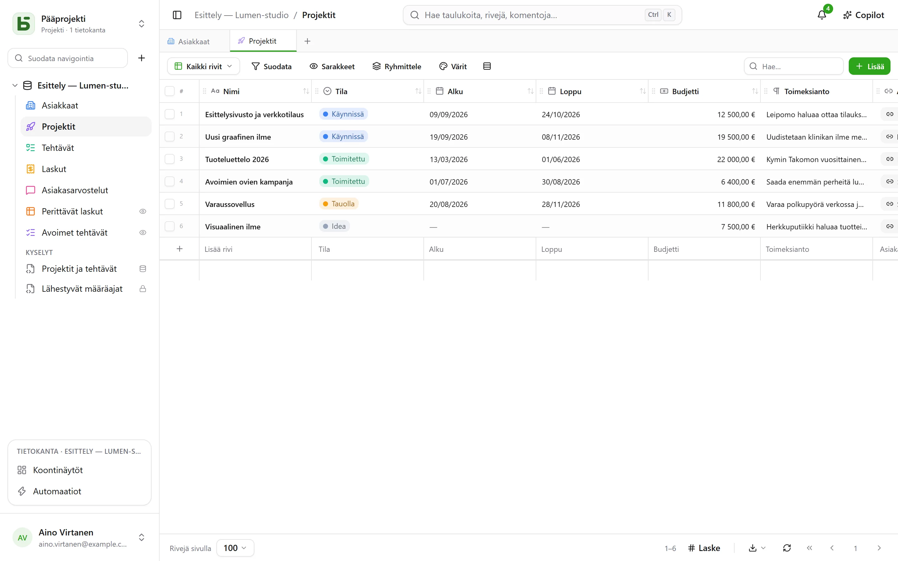

**basedb** on yhteiskäyttöinen tietokanta yhteiskäyttöisten taulukkolaskentaohjelmien hengessä,
ja ylläpidät sen itse – yhdellä erolla, joka määrää kaiken muun: **tietosi ovat oikeissa
PostgreSQL-taulukoissa**, tyypitettyinä ja selkeästi nimettyinä.

## Yksinkertainen lupaus

Ei geneeristä mallia, ei kaiken nielevää `JSONB`-saraketta, ei `field_1837`:ää:

| basedb:ssä | PostgreSQL:ssä |
|---|---|
| Tietokanta ”Ventes” | skeema `b_t4z56fq_ventes` |
| Taulukko ”Opportunités” | taulukko `opportunites` |
| Kenttä ”Échéance” (Päivämäärä) | sarake `echeance date` |
| Yksi valinta -kenttä ”Statut” | `text`-sarake ja sen `CHECK`-rajoite |
| Viittaus ”Client” | sarake `clients_id uuid` ja sen `FOREIGN KEY` |

Voit siis avata `psql`:n, BI-työkalun tai Python-skriptin ja lukea tietosi kulkematta tuotteen
kautta – ja jopa kirjoittaa niihin: rajoitteet pitävät, ja historia tallentaa kirjoituksen.

## Kenelle?

- **Liiketoimintatiimeille**, jotka haluavat ruudukon, näkymät ja lomakkeet odottamatta
  kehitysprojektia.
- **Teknisille tiimeille**, jotka eivät halua tietojensa jäävän suljetun formaatin vangiksi ja
  haluavat liittää niihin tutut työkalunsa.
- **Tekoälyagenteille**, jotka löytävät MCP-palvelimen, selkeät käyttöoikeudet ja ihmisen
  hyväksyttäviksi lähetettävät ehdotukset.

## Mitä löydät

- Tyypitettyjä [taulukoita ja kenttiä](/basedb/fi/fonctionnalites/tables-et-champs/), viittauksia,
  jotka ovat oikeita vierasavaimia – tai moniviittauksia –, PostgreSQL:n laskemia kaavoja sekä
  hakuja ja koosteita viittausten yli.
- Kymmenen [näkymää](/basedb/fi/fonctionnalites/vues/): ruudukko, kanban, kalenteri, aikajana,
  galleria, luettelo, kartta, lomake, kyselylomake, tietovisa – yhteisiä tai henkilökohtaisia.
- Linkillä jaettuja [lomakkeita](/basedb/fi/fonctionnalites/formulaires-partages/) ja
  [näkymiä](/basedb/fi/fonctionnalites/vues-partagees/) sekä kalentereita, jotka voi tilata
  kalenterisovellukseen.
- [Yhteistyö](/basedb/fi/fonctionnalites/collaboration/): kommentit ja maininnat, ilmoitukset,
  reaaliaikaiset päivitykset.
- [Automaatioita](/basedb/fi/fonctionnalites/automatisations/) ja
  [koontinäyttöjä](/basedb/fi/fonctionnalites/tableaux-de-bord/) kysymyksineen, hiirellä tai SQL:llä rakennettuina.
- [SQL:ää kaikille](/basedb/fi/fonctionnalites/requetes-et-vues-sql/) kunkin omilla
  käyttöoikeuksilla: taulukoiden alle tallennettuja kyselyjä ja oikeita PostgreSQL-näkymiä
  taulukoiden joukossa.
- [Tietokantamalleja](/basedb/fi/fonctionnalites/modeles/), valittuina galleriasta tai
  tekoälyltä pyydettyinä.
- [Ympäristöjä](/basedb/fi/fonctionnalites/environnements/) – tuotanto, testi –, joita verrataan
  ja siirretään.
- Jokaisen kirjoituksen [historia](/basedb/fi/fonctionnalites/historique/), suora SQL mukaan
  lukien, ja Ctrl+Z kumoamiseen.
- Ryhmäkohtaiset [käyttöoikeudet](/basedb/fi/fonctionnalites/droits/) kenttätasolle asti.
- [REST API](/basedb/fi/integrations/api-rest/), [MCP-palvelin](/basedb/fi/integrations/mcp/),
  [webhookit](/basedb/fi/integrations/webhooks/), Slack ja
  [synkronoidut taulukot](/basedb/fi/integrations/synchronisation/).
- Valinnainen [tekoäly](/basedb/fi/fonctionnalites/ia/): mallin laskemat kentät, Copilot.

## Projektin tila

basedb on vapaa ohjelmisto (AGPL-3.0), jota kehittää tekoälyä alusta asti hyödyntävä
ohjelmistostudio [Eodia](https://eodia.com/fr/), ja sen kehitys on aktiivista. Ydin, API,
MCP-palvelin ja käyttöliittymä toimivat, ja niitä kattaa yli tuhat testiä;
[tiekartta](/basedb/fi/feuille-de-route/) kertoo, mitä on vielä tulossa. Sen noin
kaksikymmentälukuinen
[arkkitehtuuridokumentti](https://github.com/eodia/basedb/tree/main/docs/architecture) kirjaa
jokaisen päätöksen.

:::tip[Kokeile]
Kun olet kloonannut tietovaraston, yksi komento riittää: `docker compose up -d`. Katso
[asennus](/basedb/fi/guides/installation/).
:::
