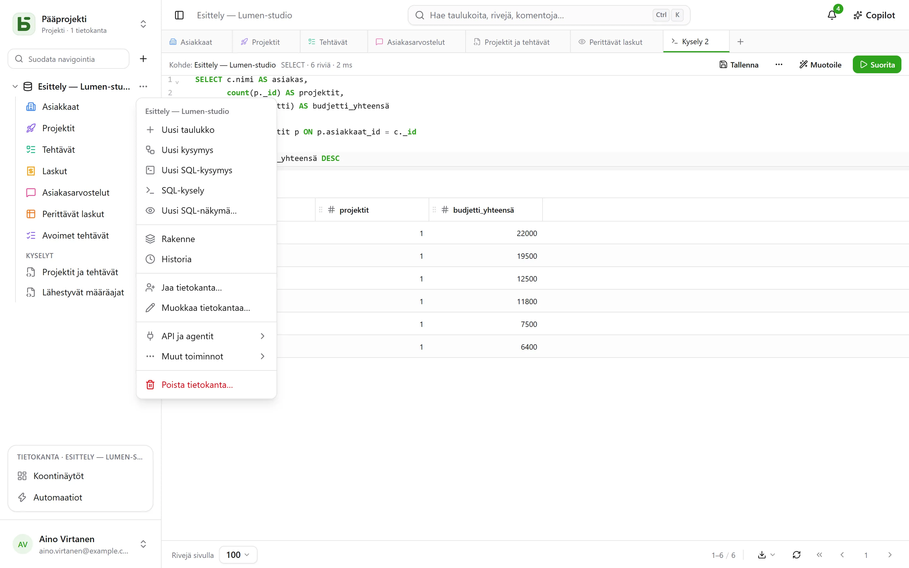
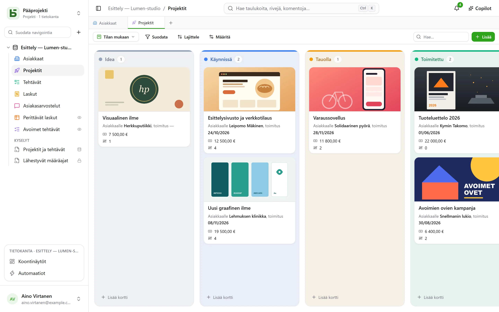

Tämä kierros vie kymmenen minuuttia ja kattaa olennaisen: lopuksi sinulla on taulukko,
kanban-näkymä ja julkinen lomake, joka kirjoittaa taulukkoon.

:::tip[Kaikki kerralla nähtäväksi]
Tyhjä projekti tarjoaa **esittelytietokannan**: pieni toimisto asiakkaineen, projekteineen,
tehtävineen, laskuineen ja arvioineen, mukana kaavoja, kaikenlaisia näkymiä, koontinäyttö ja
automaatioita. **Uusi tietokanta** avaa myös [mallien gallerian](/basedb/fi/fonctionnalites/modeles/),
jossa tietokannan voi kuvailla tekoälylle.
:::

## 1. Luo tietokanta

Kaikki järjestyy **projekteittain**: sivupalkin yläosan valitsin vaihtaa projektia tai luo
uuden. Palkissa suodattimen oikealla puolella oleva **+** luo tietokannan. Anna sille nimike
– ”Ventes” – ja halutessasi kuvaus, väri ja kuvake.

Tietokannasta tulee **PostgreSQL-skeema**: sen fyysinen nimi (`b_t4z56fq_ventes`) näkyy
lomakkeessa ja luodussa dokumentaatiossa.

## 2. Luo taulukko ja sen kentät

Tietokannan **⋯**-valikosta: **Uusi taulukko**. Lisää sitten sen kentät **Rakenne**-näkymästä
– samasta valikosta – ja sen **Kenttä**-painikkeella:

| Kenttä | Tyyppi |
|---|---|
| Nom | Lyhyt teksti |
| Statut | Yksi valinta – Nouveau, Qualifié, Gagné, Perdu |
| Montant | Valuutta |
| Échéance | Päivämäärä |
| Client | Viittaus → Clients |
| Notes | Pitkä teksti (Markdown) |

Myöhemmin kaava (`DAYS([Échéance], TODAY())`), haku (asiakkaan kaupunki) tai kooste
(kokonaissumma asiakasta kohden) lisätään samalla tavalla – katso
[Taulukot ja kentät](/basedb/fi/fonctionnalites/tables-et-champs/).

Voit myös **tuoda tiedoston** – Excel-työkirjan (`.xlsx`), CSV- tai JSON-tiedoston: tuonti
arvaa tyypit, antaa sinun korjata ne, luo taulukon tai täydentää olemassa olevaa ja kertoo rivi
riviltä, mitä se hylkää. Usean välilehden työkirjasta valitset välilehden; päivämäärät, summat
ja valintaruudut tuodaan sellaisina kuin Excel ne pitää, ja kaava tuo sen lasketun arvon.



## 3. Syötä ja suodata

Ruudukkoa muokataan kuin taulukkolaskentaa: kaksoisnapsautus tai Enter muokkaa solua, Esc
peruuttaa. **Suodata** yhdistää kenttäkohtaisia ehtoja; lajittelu tehdään sarakkeen
otsikosta; palkin oikean reunan **Hae…** hakee kaikista sarakkeista. Jokainen muutos
tallennetaan heti – ja [kirjataan historiaan](/basedb/fi/fonctionnalites/historique/):
**Ctrl+Z** kumoaa viimeisimmän.

## 4. Lisää näkymä

Näkymävalitsin ”Suodata”-painikkeen vasemmalla puolella tarjoaa ”Kaikki rivit” ja sitten omat
näkymäsi. Luo ”Statut”-kentän mukaan ryhmitelty **kanban**: kortin vetäminen sarakkeesta
toiseen muuttaa riviä.



## 5. Jaa lomake

Luo **Lomake**-näkymä, valitse kysymykset ja valitse sitten **Jaa**: valitse ”Julkinen” ja
kopioi linkki. Jokainen vastaus lisää taulukkoon rivin antamatta vastaajalle mitään
käyttöoikeuksia. Lisätietoja: [Jaetut lomakkeet](/basedb/fi/fonctionnalites/formulaires-partages/).

## 6. Lue SQL:llä

Tietokannan **⋯**-valikko → **SQL-kysely**: taulukkosi ovat siellä oikeilla nimillään.

```sql
SELECT nom, statut, montant
FROM b_t4z56fq_ventes.opportunites
WHERE statut = 'gagne'
ORDER BY montant DESC;
```

**Tallenna** sijoittaa kyselyn taulukoiden alle ”Kyselyt”-osioon – itsellesi tai koko
tietokannalle – ja **⋯** → **Luo SQL-näkymä…** tekee siitä oikean PostgreSQL-näkymän
taulukoiden joukkoon. Kukin lukee niitä omilla käyttöoikeuksillaan. Katso
[Kyselyt ja SQL-näkymät](/basedb/fi/fonctionnalites/requetes-et-vues-sql/).

Sama onnistuu `psql`:stä tai BI-työkalustasi. Katso [Suora SQL](/basedb/fi/integrations/sql/).
