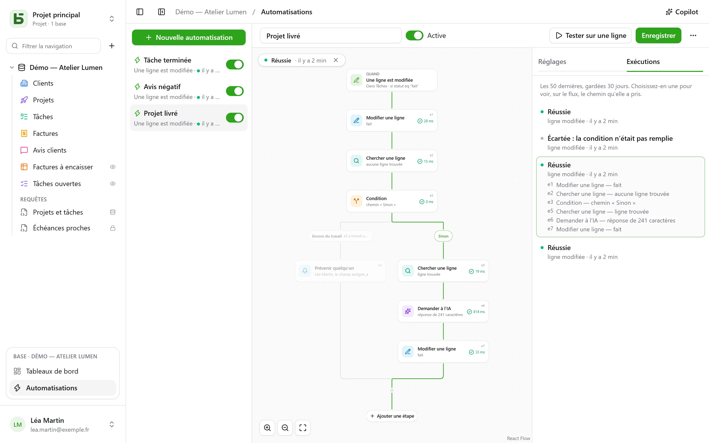

Une automatisation dit **quand**, **si** et **alors** : quand une tâche passe à « Fait », noter
l’heure ; quand un avis négatif arrive, prévenir la responsable et écrire sur Slack ; chaque
lundi à 9 h, créer la ligne du point d’équipe. Et quand une action ne suffit pas, elle suit un
**flux** : chercher une ligne, prendre un chemin ou un autre selon ce qu’elle dit, répéter des
étapes sur chaque ligne qui répond à un filtre, réutiliser dans une étape ce qu’une étape
précédente a trouvé ou écrit, **attendre** trois jours avant une relance, envoyer un **PDF** en
pièce jointe.

Elles s’ouvrent depuis **Automatisations**, dans le bloc de la base ouverte en bas de la barre
latérale, et demandent le niveau **Gestion**.



## Le flux

Le flux se dessine de haut en bas : le déclencheur, puis chaque étape. Un **+** sur un trait
ouvre la liste des étapes, rangées par catégorie — Lignes, Communiquer, Documents, IA,
Logique — avec une recherche, et ajoute celle choisie à cet endroit ; une carte ouvre ses
réglages à droite. Une automatisation
simple — un déclencheur et une action — tient en deux cartes, et se règle comme avant.

## Quand

| Déclencheur | Réglages |
|---|---|
| **Une ligne est créée** | la table |
| **Une ligne est modifiée** | la table, et au besoin les seuls champs à surveiller |
| **À heure fixe** | toutes les heures, chaque jour ou chaque semaine, à l’heure et dans le fuseau choisis |
| **On clique sur un bouton** | un [champ Bouton](/basedb/fonctionnalites/tables-et-champs/#bouton) de la table |
| **Une ligne est supprimée** | la table ; les étapes citent la ligne telle qu’elle était |
| **Une ligne entre dans un filtre** | la table et le filtre : l’automatisation part quand une ligne y entre, et ne repart qu’après en être sortie — « une facture passe en retard », pas « une facture en retard est modifiée » |
| **Une date arrive** | un champ Date de la table, un décalage — trois jours avant, le jour même, une semaine après — et l’heure : relances d’échéance, anniversaires de contrat |
| **Un webhook est reçu** | rien : l’automatisation reçoit sa propre adresse, qu’un autre logiciel appelle ([détails](#un-service-qui-appelle-basedb)) |

Un déclencheur sur les lignes voit **toutes** les écritures : l’interface, l’API, un agent, un
formulaire partagé, et même le SQL direct — les automatisations partent de l’historique, qui les
capture toutes.

## Seulement si

Une condition facultative, dans le [langage des filtres](/basedb/integrations/api-rest/#lire) —
`statut eq "fait"`, `montant gte 10000 and payee eq false` — évaluée sur la ligne **au moment
d’agir**. Une exécution dont la condition n’est pas remplie est « écartée », et le dit.

## Alors

Jusqu’à quarante étapes, dans l’ordre ; la première qui échoue arrête les suivantes — sauf
dans un bloc **Essayer** ([détails](#essayer)).

| Étape | Ce qu’elle fait |
|---|---|
| **Modifier une ligne** | écrit des valeurs dans la ligne qui a déclenché — ou dans celle qu’une étape a trouvée ou créée |
| **Créer une ligne** | dans cette table ou une autre de la base |
| **Chercher une ligne** | la première ligne d’une table qui répond à un filtre, pour que les étapes suivantes la citent ou la modifient |
| **Prévenir quelqu’un** | une [notification](/basedb/fonctionnalites/collaboration/#notifications) à des personnes choisies, ou à celle d’un champ Personne |
| **Envoyer un courriel** | à des personnes de l’équipe, à celle d’un champ Personne, à l’adresse d’un champ E-mail — un client, un fournisseur — ou à des adresses écrites ; l’objet et le texte citent la ligne et les étapes précédentes |
| **Appeler un webhook** | une requête HTTPS vers un service — méthode, adresse, en-têtes et corps à votre main ([détails](#appeler-un-service)) ; sa réponse se cite ensuite |
| **Envoyer sur Slack** | un message dans un canal [connecté](/basedb/integrations/synchronisation/#slack) |
| **Demander à l’IA** | une réponse du [fournisseur d’IA](/basedb/fonctionnalites/ia/) à une consigne qui cite la ligne et les étapes précédentes — rédiger, résumer, classer —, lue comme un texte, un nombre, oui ou non, une date ou un choix dans une liste |
| **Condition** | plusieurs chemins : le premier dont la condition est remplie est pris, « Sinon » quand aucun ne l’est ; les chemins se rejoignent ensuite |
| **Pour chaque ligne** | les étapes qu’elle contient, une fois pour chaque ligne d’une table qui répond à un filtre ([détails](#pour-chaque-ligne)) |
| **Supprimer une ligne** | la ligne qui a déclenché, ou celle qu’une étape a trouvée — elle va à la corbeille |
| **Compter et additionner** | le nombre de lignes d’un filtre, leur somme, leur moyenne, leur minimum ou maximum, à citer ou à tester ensuite |
| **Générer un PDF** | le [document](/basedb/fonctionnalites/documents/) d’une ligne, rangé dans un champ Document ou joint à un courriel |
| **Attendre** | une durée, ou jusqu’à la date d’un champ ([détails](#attendre)) |
| **Essayer** | des étapes, et d’autres à faire si l’une d’elles échoue ([détails](#essayer)) |
| **Lancer une automatisation** | une autre automatisation de la base, sur une ligne de sa table |

Une recherche qui ne trouve rien n’arrête pas le flux : les étapes qui devaient modifier sa
ligne sont passées. Pour faire autre chose dans ce cas, **Si aucune ligne n’est trouvée…**,
sous la recherche, ajoute une condition qui le teste.

Une **condition** teste une ligne avec un filtre, ou une **valeur** : la réponse de l’IA, le
code d’un webhook, un total — « `{{e2.reponse}}` est égal à Urgent », « `{{e3.somme.montant}}`
est supérieur ou égal à 1000 ». Les nombres se comparent en nombres, les textes sans accents ni
majuscules.

## Pour chaque ligne

L’étape **Pour chaque ligne** lit les lignes d’une table qui répondent à son filtre — vide :
toutes —, dans l’ordre choisi, jusqu’à sa limite (50 par défaut, 200 au plus), puis exécute
une fois pour chacune les étapes placées dans son cadre. « Chaque lundi, relancer les factures
impayées » s’écrit : **À heure fixe**, puis **Pour chaque ligne** des factures
`payee eq false and relancee eq false`, et dans la boucle un courriel au contact de la facture
et **Modifier une ligne** qui coche « Relancée ».

Dans la boucle, l’identifiant de l’étape nomme la **ligne du tour** : `{{e1.client}}` la cite,
et **Modifier une ligne** la propose parmi les lignes à modifier. Après la boucle,
`{{e1.nombre}}` dit combien de lignes elle a parcourues — pour un récapitulatif sur Slack, par
exemple. Le filtre peut citer ce qui précède : déclenchée par une facture payée,
`facture eq {{_id}}` parcourt ses lignes de détail.

Au-delà de la limite, les lignes restantes attendent la prochaine exécution, qui le signale :
faites sortir du filtre celles qui sont traitées — une case « relancée », une date — pour les
traiter toutes au fil des exécutions. Une boucle ne contient pas d’autre boucle, et une
exécution s’arrête au bout de deux minutes.

## Attendre

L’étape **Attendre** met l’exécution en pause — trois heures, deux jours — ou jusqu’à la date
d’un champ d’une ligne, avec un décalage et une heure : « la veille de l’échéance, à 9 h ».
L’exécution apparaît **En pause** dans l’onglet **Exécutions**, avec la date de sa reprise.

Elle reprend à l’étape suivante en **relisant** ses lignes : « trois jours après l’envoi du
devis, s’il n’est toujours pas accepté, relancer » s’écrit **Attendre** 3 jours, puis une
condition sur le statut du devis, tel qu’il est ce jour-là. Désactiver l’automatisation arrête
les exécutions en pause ; une attente ne se place ni dans une boucle ni dans un bloc
**Essayer**, et dure un an au plus.

## Essayer

Le bloc **Essayer** a deux chemins. Le premier est exécuté ; si l’une de ses étapes échoue, le
flux continue par le second, **En cas d’échec**, qui cite l’échec — `{{e4.erreur}}`, le code,
et `{{e4.etape}}`, l’étape —, puis reprend après le bloc. De quoi prévenir quelqu’un quand un
service ne répond pas, sans tout arrêter.

Plus simplement : un webhook peut **réessayer** de lui-même jusqu’à trois fois après une panne
du service, et une boucle peut **continuer** malgré une ligne en échec.

## Un PDF et un courriel

**Générer un PDF** fait le document d’une ligne — avec un [modèle de
document](/basedb/fonctionnalites/documents/) de sa table, ou la fiche de tous ses champs — et
peut le ranger dans un champ Document. **Envoyer un courriel** peut ensuite le joindre, avec
les fichiers d’un champ Document ou Image :

- un courriel **à chacun**, ou **un seul à tous**, avec des destinataires **en copie** ;
- un message en **texte riche** — gras, listes, liens — qui cite la ligne ;
- une adresse de **réponse** : la vôtre par défaut, ou celle d’un champ E-mail ;
- jusqu’à 50 destinataires, 10 pièces jointes et 15 Mo.

« Quand un devis passe à Accepté, envoyer la facture au client, la comptabilité en copie » :
**Une ligne entre dans un filtre** `statut eq "accepte"`, **Générer un PDF** avec le modèle
Facture, **Envoyer un courriel** au champ E-mail du client, la facture jointe.

## Un service qui appelle basedb

Avec le déclencheur **Un webhook est reçu**, l’automatisation a sa propre adresse secrète, à donner
au logiciel qui doit la lancer — une boutique en ligne, un formulaire externe, un outil
d’automatisation :

```bash
curl -X POST "https://basedb.example.com/api/v1/hooks/<secret>" \
  -H "content-type: application/json" \
  -d '{"client": {"nom": "Dupont"}, "total": 120}'
```

Les étapes citent ce qu’il a envoyé : `{{trigger.client.nom}}`, `{{trigger.total}}` ; un
formulaire se lit de même, un texte par `{{trigger.texte}}`. L’adresse se copie depuis les
réglages du déclencheur ; **Changer d’adresse** la remplace, et l’ancienne cesse aussitôt. Un
appel reçoit `202`, l’automatisation tourne dans la seconde.

## Appeler un service

L’étape **Appeler un webhook** envoie par défaut, en `POST`, les données de l’automatisation :
la ligne choisie et ce que les étapes précédentes ont trouvé ou écrit. Pour parler à un
service tel qu’il l’attend, on règle :

- la **méthode** : `POST`, `PUT`, `PATCH`, `GET` ou `DELETE` — ces deux derniers sans corps ;
- l’**adresse**, qui peut citer après son hôte — `https://api.exemple.fr/clients/{{e2.numero}}` ;
  chaque valeur y est encodée ;
- des **en-têtes**, dont la valeur peut citer : `Idempotency-Key: {{_id}}` ;
- le **corps** : les données de l’automatisation, un **JSON à composer**, un **formulaire**
  (une paire `clé=valeur` par ligne) ou un **texte**. Dans un JSON, une citation entre
  guillemets est du texte, et hors guillemets une valeur — un nombre, oui ou non, une liste :

```json
{ "facture": "{{e1.numero}}", "montant": {{e1.montant}}, "payee": {{e1.payee}} }
```

Une clé d’API ou un jeton se met dans un en-tête **secret** (le cadenas) : chiffré par la clé
de l’instance, il n’est plus jamais affiché — ni à l’écran, ni par l’API, ni au Copilot — et ne
part que vers l’hôte pour lequel vous l’avez donné. Changer l’hôte de l’adresse demande de le
redonner ; **Remplacer** en saisit un nouveau.

## Demander à l’IA

Comme un [champ IA](/basedb/fonctionnalites/ia/#loption-ia-dun-champ), l’étape envoie au
fournisseur sa consigne, où chaque citation est remplacée par sa valeur :

```text
Cet avis de {{auteur}} demande-t-il une action de notre part ? {{avis}}
```

On choisit la **réponse attendue** — un texte libre ou court, un nombre, oui ou non, une date,
une adresse web, ou un choix dans une liste, que l’on peut reprendre d’un champ Choix. Le modèle
en est averti, et une réponse qui n’en contient pas fait échouer l’étape. Les étapes suivantes
la citent par `{{e1.reponse}}` : dans le titre d’une tâche créée, un message, ou un champ Choix,
où elle est rangée au choix de même libellé.

Ce que la consigne cite part chez le fournisseur : l’étape demande votre **accord**, à redonner
quand la consigne change. Chaque appel est journalisé et compte, avec les champs IA, dans
`BASEDB_AI_FIELD_QUOTA` (300 par heure par défaut). L’IA ne fait rien d’elle-même : ce sont les
étapes posées après elle qui écrivent ou préviennent.

## Citer

Les valeurs, les messages et les filtres citent ce qui précède, depuis le bouton **{ }** à côté
de chaque texte :

- `{{Titre}}`, `{{_id}}` : la ligne qui a déclenché ;
- `{{e2.titre}}`, `{{e2._id}}` : la ligne trouvée, créée ou modifiée par l’étape `e2` — chaque
  étape porte son identifiant sur sa carte ;
- `{{e3.statut}}`, `{{e3.reponse.numero}}` : ce qu’a répondu le webhook `e3` ;
- `{{e4.reponse}}` : la réponse de l’étape IA `e4` ;
- `{{e5.client}}` dans la boucle `e5`, la ligne du tour ; `{{e5.nombre}}` après elle, le nombre
  de lignes parcourues ;
- `{{e6.nombre}}`, `{{e6.somme.montant}}`, `{{e6.moyenne.montant}}`, `{{e6.max.echeance}}` : ce
  qu’a compté l’étape `e6` ;
- `{{e7.erreur}}`, `{{e7.etape}}` : l’échec qu’a rattrapé le bloc **Essayer** `e7` ;
- `{{e8.nom}}` : le nom du PDF de l’étape `e8` ;
- `{{trigger.client.nom}}` : ce qu’a envoyé un webhook entrant ;
- `{{_maintenant}}` : l’instant de l’exécution.

Une valeur faite d’une seule citation passe la valeur elle-même : une relation, une personne, un
choix — c’est ainsi qu’une ligne créée se relie à celle qu’une recherche a trouvée. Dans un
filtre, une citation est toujours une valeur comparée, jamais du langage de filtre.

Une étape ne peut citer que ce qui a eu lieu à coup sûr avant elle : ce qu’un chemin a trouvé
ne se cite plus après la condition. L’éditeur le signale sur la carte avant l’enregistrement.

## Le Copilot

**Copilot**, dans l’en-tête, ouvre à droite une conversation en langage naturel sur les
automatisations de la base : « quand une tâche passe en revue, préviens la personne
assignée », « ajoute un résumé par l’IA dans les notes », « pourquoi la dernière exécution a-t-elle
échoué ? ». Il répond et **propose** une automatisation entière — celle que vous avez à l’écran,
modifiée, ou une nouvelle —, avec la liste de ce qui change.

Rien n’est enregistré par le Copilot : **Poser sur le flux** montre la proposition dans l’éditeur,
où vous la relisez avant d’enregistrer — et **Annuler**, sur la carte, rend le flux tel qu’il
était. Une nouvelle automatisation s’ouvre dans l’éditeur, à créer. Chaque proposition est
vérifiée comme le serait un enregistrement ; ce qui ne tient pas est écarté, et dit.

Par défaut, **seule la structure** part chez le fournisseur d’IA, avec la conversation : les tables
et leurs champs, les automatisations de la base, celle à l’écran telle que l’éditeur la montre, et
ses dernières exécutions — leurs statuts et leurs codes d’erreur, jamais une valeur. Les personnes
et les canaux Slack partent sous des repères (`p1`, `s1`), jamais par leur identifiant. La case
**Autoriser la lecture des données** permet au Copilot, pour la conversation, de lire des lignes
(50 au plus par lecture), chaque lecture listée sous sa réponse.

## Tester, suivre

**Tester sur une ligne** exécute l’automatisation enregistrée sur une ligne choisie, pour de
vrai. L’onglet **Exécutions** garde les 50 dernières, 30 jours : en attente, en cours, réussie,
écartée avec sa raison, échouée avec son code. En choisir une la pose sur le flux — le chemin
pris est tracé, chaque étape passée dit ce qu’elle a fait et en combien de temps, le reste est
estompé. Dans une boucle, chaque étape dit aussi combien de fois elle a tourné.

## Au nom de qui elle agit

Une automatisation agit avec les **droits de la personne qui l’a enregistrée en dernier**,
redécidés à chaque exécution : si cette personne perd un droit, l’étape qui en avait besoin
échoue au lieu de passer outre, et une recherche ne trouve que ce qu’elle peut lire.
L’historique l’affiche « Automatisation « Tâche terminée » · au nom de … », et ses écritures
s’annulent comme les autres.

## Limites

- Ce qu’écrit une automatisation n’en déclenche aucune autre : ce qui doit s’enchaîner s’écrit
  dans un seul flux, ou par **Lancer une automatisation**, trois niveaux au plus.
- Une recherche donne une ligne, la première ; une boucle en parcourt 200 au plus par
  exécution. Une exécution dure deux minutes au plus, attentes non comprises.
- Pas de script. Un courriel part par le [serveur d’envoi](/basedb/hebergement/variables/#courriels)
  de l’instance.
- Un [modèle de base](/basedb/fonctionnalites/modeles/) n’emporte que les automatisations sans
  recherche, boucle, condition ni étape IA, et jamais un webhook.
- Un webhook ne suit pas de redirection et attend 10 secondes au plus ; une réponse autre que
  2xx fait échouer l’étape, après ses réessais.
- Une date qui arrive est cherchée chaque minute ; seules comptent celles arrivées après
  l’enregistrement de l’automatisation.
- 100 exécutions par heure et par automatisation ; une échéance horaire manquée n’est rattrapée
  qu’une fois.
- Le délai entre l’écriture et l’action est de l’ordre de la seconde.
