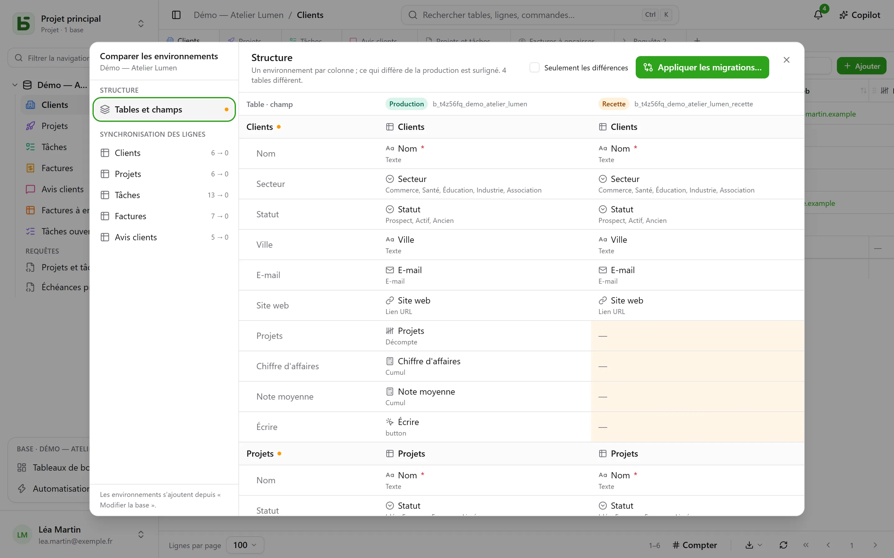

Une base peut avoir des **environnements** : production, recette, développement… Chacun est une
base à part entière — son schéma, ses tables, ses lignes, ses droits — et tous partagent la
**lignée** de la base, de ses tables et de ses champs.

## Dans l’interface

La barre latérale montre **une ligne par base**, avec un badge qui dit l’environnement ouvert et
permet d’en changer. Le badge n’apparaît pas tant qu’il n’y a que la production.

Les environnements s’ajoutent, se renomment et se suppriment dans **Modifier la base…** : un
nouvel environnement naît d’une **copie de la structure** d’un autre, sans ses lignes.

## Comparer les environnements

Depuis le menu de la base, sous **Autres actions**, **Comparer les environnements…** ouvre un dialogue :

- **Structure** : les environnements en colonnes, tables et champs en lignes ; ce qui diffère de
  la production est surligné.
- **Appliquer les migrations…** prépare le plan pour passer d’un environnement à un autre, étape
  par étape. Il ne coche jamais d’office ce qui annulerait une modification plus récente de la
  cible.
- **Synchronisation des lignes** : table par table, reporter des lignes d’un environnement vers
  un autre, par identifiant.

## Comment basedb sait qui a changé quoi

La comparaison s’appuie sur l’**historique des structures** : chaque création, modification ou
suppression de table ou de champ est capturée par déclencheur sur le catalogue, et se lit dans
l’onglet « Structure » de l’historique. Les identifiants de lignée relient un champ de recette
à son homologue de production, même renommé.

## Par l’API, le SDK et le MCP

Un **jeton créé pour toute la base** ouvre tous ses environnements, ceux d’aujourd’hui et ceux qu’on
ajoutera : un seul jeton pour la production et la recette. Le programme ou l’agent choisit
l’environnement à chaque appel :

| Où | Comment |
|---|---|
| [API REST](/basedb/integrations/api-rest/#choisir-lenvironnement) | l’en-tête `X-Basedb-Environment: recette`, ou `?environment=recette` |
| [SDK](/basedb/integrations/sdk/#les-environnements) | `db.environment('recette')` |
| [MCP](/basedb/integrations/mcp/#choisir-lenvironnement) | l’adresse `…/mcp?environment=recette`, ou l’argument `environment` d’un outil |
| [n8n](/basedb/integrations/n8n/#les-identifiants) | le champ **Environment** de l’identifiant |

Sans rien de tout cela, chaque base désigne son propre environnement : le nom de la production ouvre
la production, celui de la recette la recette. Un jeton peut aussi, à sa création, être limité à
l’environnement affiché : il n’en voit alors aucun autre. Dans les deux cas, ses droits sont recoupés,
environnement par environnement, avec ceux de la personne qui l’a créé.

## En SQL

Chaque environnement est un schéma : `b_t4z56fq_ventes` pour la production,
`b_t4z56fq_ventes_recette` pour la recette. Vos requêtes changent d’environnement en changeant
de schéma — ou de `search_path`.
