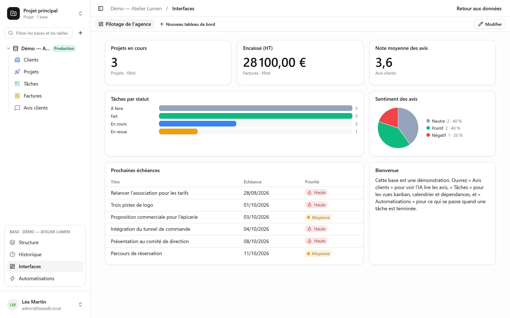

Une **interface** est un tableau de bord posé sur une base : les chiffres qui comptent, la
répartition d’un statut, les prochaines échéances, un mot d’accueil — sur une page, sans ouvrir
une table.

Elles s’ouvrent depuis **Interfaces**, dans le bloc de la base ouverte en bas de la barre
latérale : un onglet par tableau de bord. Tout lecteur de la base les consulte ; **Modifier**
(puis **Terminer**) et **Nouveau tableau de bord** demandent le niveau **Gestion**.

## Les blocs

Un tableau de bord range jusqu’à 24 blocs sur une grille de trois colonnes.

| Bloc | Ce qu’il montre |
|---|---|
| **Chiffre** | un nombre de lignes, une somme, une moyenne, un minimum ou un maximum — sur toute la table ou sur un filtre |
| **Graphique** | le nombre de lignes par valeur d’un champ, en barres ou en secteurs |
| **Liste** | jusqu’à 20 lignes, six champs, un tri ; une ligne ouvre sa fiche |
| **Texte** | du Markdown : une consigne, un contexte, des liens |
| **Page intégrée** | une adresse `https://` dans un cadre isolé, qui ne reçoit ni session ni donnée |

## Chacun ses droits

Chaque bloc lit **avec les droits de qui regarde** : la même interface montre à chacun ce qu’il
a le droit de voir. Un bloc qui porte sur une table ou un champ qui vous est fermé affiche
« Donnée inaccessible », plutôt qu’un chiffre qui mentirait par omission.

## Limites

- Un graphique compte des lignes ; il ne somme pas encore un champ par groupe.
- Chaque bloc fait sa requête à l’ouverture, sans cache.
