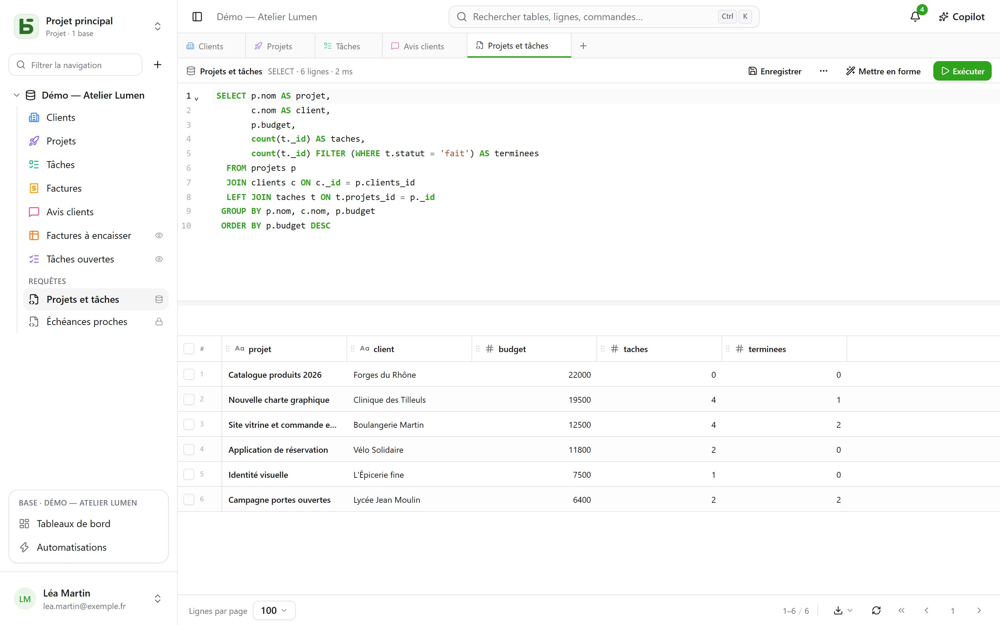
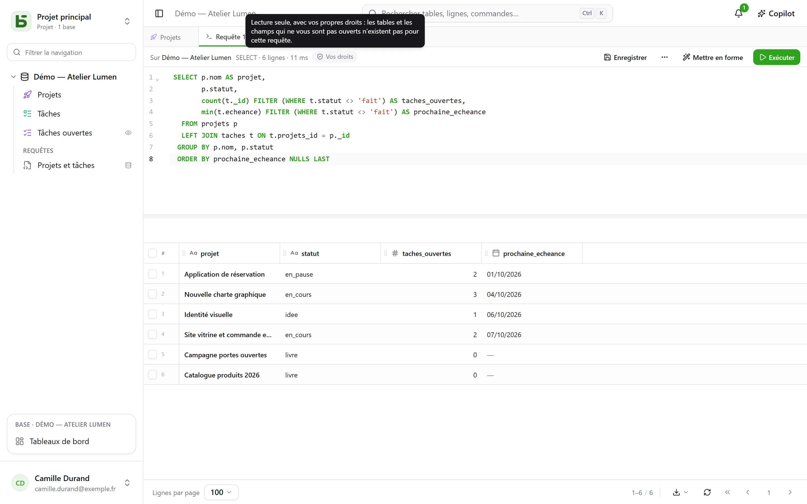
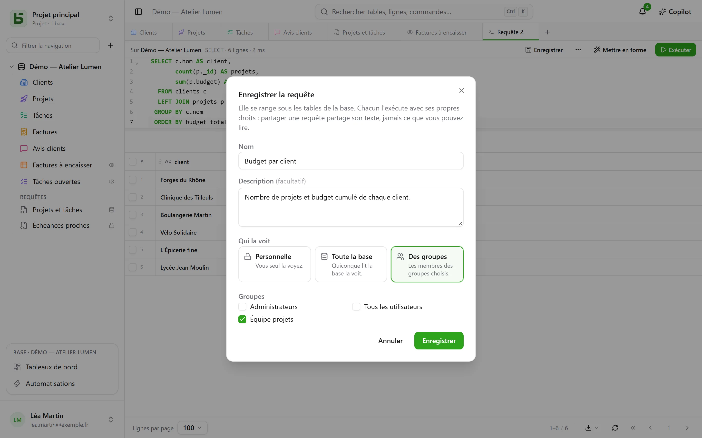
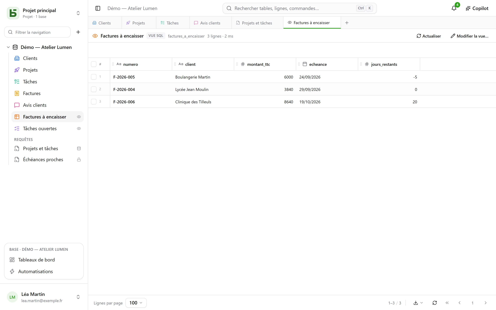
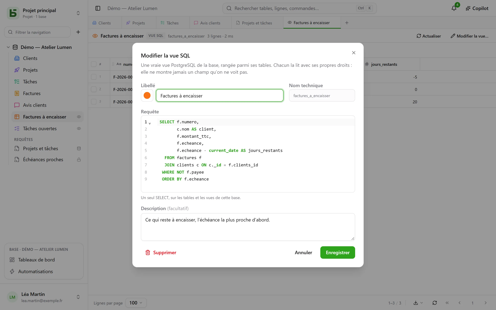

Vos tables sont de vraies tables PostgreSQL, et l’interface les interroge en SQL, sous leur vrai
nom. Chaque membre de la base peut écrire une requête, l’**enregistrer** sous les tables — pour
lui seul, pour toute la base ou pour quelques groupes —, et qui gère la base peut en faire une
**vue SQL** : une vraie vue PostgreSQL, rangée parmi les tables, que `psql` et vos outils lisent
aussi.



## Chacun avec ses droits

Le **+** de la barre d’onglets, ou menu **⋯** de la base → **Requête SQL**, ouvre un
onglet SQL : un éditeur avec coloration et complétion, **Ctrl+Entrée** pour exécuter, et le
résultat dans la même grille que vos tables. Ce que la requête peut lire dépend de qui la lance :

- avec le niveau **Gestion** sur la base, toute la base, écritures comprises ;
- avec les niveaux **Lecture** ou **Édition**, la requête s’exécute **en lecture seule, avec vos
  propres droits**. Une table qui vous est fermée n’existe pas pour elle ; un champ qui vous est
  masqué disparaît de `SELECT *` et est refusé si vous le nommez, même en qualifiant la table ;
  une écriture est refusée. Le résultat porte la pastille **Vos droits**.



Ce n’est pas l’écran qui trie : PostgreSQL lui-même applique vos droits, colonne par colonne, sur
un rôle qui vous est propre. Une requête ne peut donc rien vous montrer que la grille, l’API ou le
serveur MCP ne vous montreraient pas.

## Enregistrer une requête

**Enregistrer**, dans la barre de l’onglet, range la requête sous les tables de la base, dans la
rubrique **Requêtes**. Elle se rouvre d’un clic ; **⋯** → **Enregistrer sous…** en fait une
copie, **Nom et partage…** (dans l’onglet ou dans son menu de la barre latérale) la renomme, change
qui la voit, ou la supprime — **Supprimer** est aussi dans son menu, d’un clic droit. Un onglet
qui la montrait garde son texte.



| Portée | Qui la voit | Qui peut la créer et la modifier |
|---|---|---|
| **Personnelle** — un cadenas | vous seul | quiconque voit la base, pour soi |
| **Toute la base** | quiconque voit la base | le niveau **Gestion** sur la base |
| **Des groupes** | les membres des groupes choisis | le niveau **Gestion** sur la base |

**Partager une requête partage son texte, jamais ce que son auteur peut lire.** Chacun l’exécute
avec ses propres droits : la même requête, ouverte par deux personnes, montre à chacune ce qu’elle
a le droit de voir — ou lui dit qu’une colonne n’existe pas pour elle.

Une requête ouverte depuis la barre latérale **s’exécute aussitôt, en lecture seule** : vous voyez
son résultat sans avoir rien décidé. **Exécuter** la relance ensuite telle qu’elle est. Un point
à côté de son nom signale que vous avez changé son texte depuis l’enregistrement ; **Enregistrer**
l’y range si vous pouvez la modifier, et propose sinon d’en faire une nouvelle.

## Les vues SQL

Une **vue SQL** est une vraie vue PostgreSQL du schéma de la base. Elle prend place **parmi les
tables**, avec sa couleur et son pictogramme comme une table, et un petit **œil** à droite qui dit
que c’est une vue. Un clic l’ouvre dans un onglet : ses lignes dans la grille, **Actualiser** pour
les relire.



Elle se crée par le menu **⋯** de la base → **Nouvelle vue SQL…**, ou depuis un onglet SQL :
**⋯** → **Créer une vue SQL…**, et la requête de l’onglet devient sa définition. Le dialogue
demande :

- son **libellé** et son **apparence** — couleur, pictogramme ou image, choisis comme pour une
  table ;
- son **nom technique**, tiré du libellé si vous n’en donnez pas — celui qu’on écrit après
  `FROM` ;
- sa **requête** : un seul `SELECT`, sur les tables et les autres vues de la base. PostgreSQL
  refuse ce qu’il refuse, et l’éditeur pointe l’endroit.



La vue se lit ensuite sous son nom, depuis l’interface comme depuis `psql` ou votre outil de BI :

```sql
SELECT * FROM b_t4z56fq_demo_atelier_lumen.factures_a_encaisser;
```

**Une vue ne montre jamais un champ qu’on ne voit pas.** Chacun la lit avec ses propres droits,
sur chaque table et chaque colonne qu’elle lit ; la barre latérale ne la liste qu’à qui peut tout
lire de ce qu’elle lit. Elle ne lit que **sa** base : une autre base, ou le catalogue de basedb,
sont refusés dès la création. La créer, la modifier ou la supprimer demande le niveau **Gestion**
sur la base. **Supprimer**, dans son menu de la barre latérale, la retire pour tout le monde,
scripts et outils compris ; les tables qu’elle lit ne sont pas touchées.

### Quand la structure change

- **Renommer** une table ou un champ ne casse pas une vue : PostgreSQL la suit.
- **Changer la formule** d’un champ calculé qu’elle lit la retire un instant, puis la remet sur la
  nouvelle colonne. Si elle ne tient plus, elle reste **à corriger** — un triangle l’indique dans
  la barre latérale — avec sa définition gardée : **Modifier la vue…**, corrigez, enregistrez.
- Une table n’est pas purgée tant qu’une vue la lit, et une vue n’est pas supprimée tant qu’une
  autre vue la lit : le refus nomme la vue en cause.

## Requête, vue SQL ou question ?

| | Ce que c’est | Où elle vit | Pour |
|---|---|---|---|
| **Requête enregistrée** | un texte SQL | sous les tables, rubrique « Requêtes » | retrouver une requête, la partager comme texte |
| **Vue SQL** | une vraie vue PostgreSQL | parmi les tables | donner un nom à une lecture, pour l’interface **et** pour `psql`, vos scripts, vos outils |
| **Question** | une lecture construite à la souris ou en SQL, et sa visualisation | dans les [tableaux de bord](/basedb/fonctionnalites/tableaux-de-bord/) | un chiffre, un graphique, un tableau croisé, sous des filtres |

## Limites

- La grille montre au plus le nombre de **lignes par page** choisi en bas de l’écran ; « tronqué »
  le signale. Une requête s’arrête au bout de 15 secondes.
- Une vue SQL se lit en SQL et dans l’interface ; l’API REST et le serveur MCP ne l’exposent pas.
- Une vue SQL reste dans l’environnement où elle a été créée : créer un environnement, comparer
  la structure ou enregistrer un modèle ne l’emportent pas encore.
