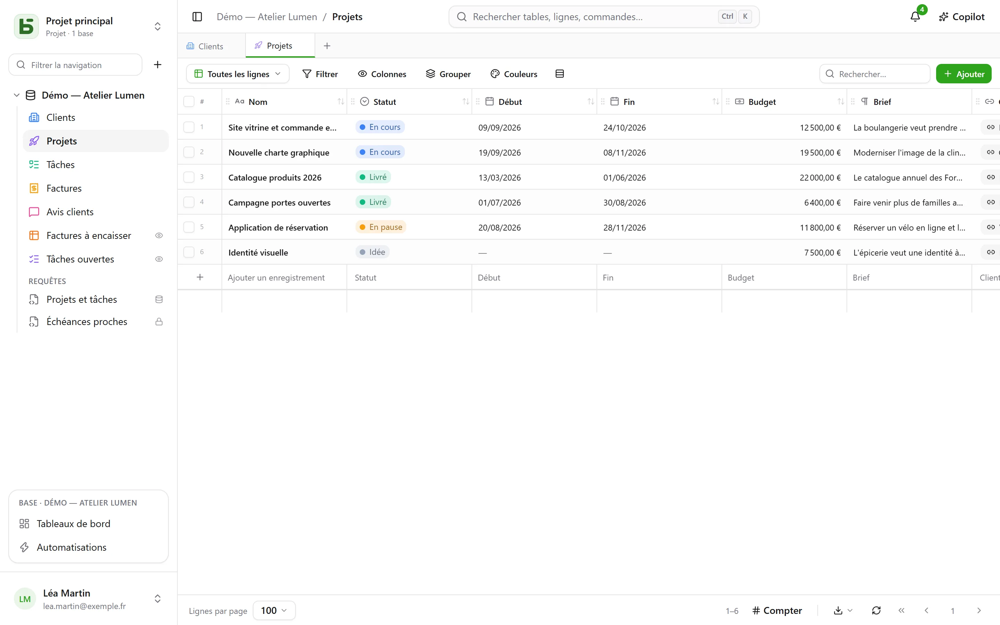
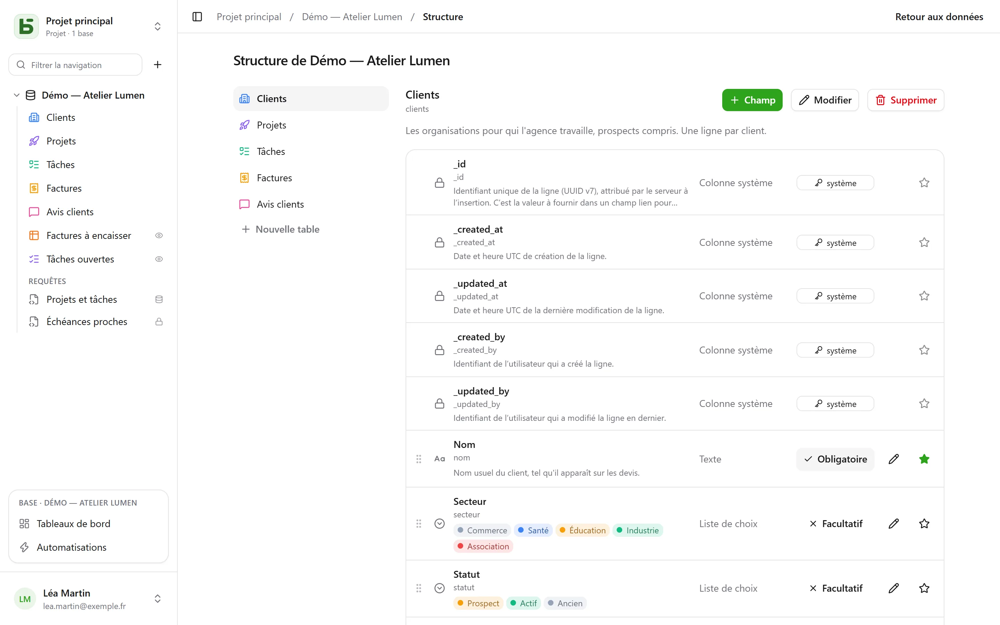

Chaque table de basedb est une table PostgreSQL ; chaque champ, une colonne typée. Le libellé
que vous saisissez (« Échéance ») devient un nom physique lisible (`echeance`) par une
**slugification** stable : sans accent, en minuscules, sans mot réservé.

## Les types

| Type | Colonne PostgreSQL | Remarques |
|---|---|---|
| Texte court | `text` | une ligne |
| Texte long | `text` | Markdown : un extrait dans la grille, le rendu au survol, un éditeur dédié ; peut [citer une colonne](#texte-riche-et-variables) |
| Texte riche | `text` + `CHECK` | du HTML assaini à l’écriture, écrit dans un éditeur visuel — [voir plus bas](#texte-riche-et-variables) |
| Nombre | `numeric` | jamais de flottant : un montant ne dérive pas |
| Monnaie, Pourcentage, Durée, Note | `numeric` | un nombre et son [format d’affichage](#formats-daffichage) : `12,50 €`, `15 %`, `1:30`, ★★★★☆ |
| Case à cocher | `boolean` | |
| Date | `date` | |
| Date et heure | `timestamptz` | un instant absolu, affiché dans le fuseau du lecteur |
| Liste de choix | `text` + `CHECK` | couleur, pictogramme ou image par option |
| Choix multiple | `text[]` + `CHECK` | filtrable avec les opérateurs de tableau |
| E-mail | `text` + `CHECK` | une adresse vérifiée par la base, ouverte d’un clic |
| Téléphone, Code-barres, Adresse | `text` | un texte court et son format : lien d’appel, chasse fixe, lien vers la carte |
| Lien URL | `text` + `CHECK` | complété à la saisie (`exemple.fr` → `https://exemple.fr`) |
| Personne | `uuid` | un membre de l’espace ; le désigner le [prévient](/basedb/fonctionnalites/collaboration/) |
| Numéro automatique | `bigint` identité | numérote aussi les lignes déjà là ; personne ne le saisit |
| Relation | `uuid` + `FOREIGN KEY` | une vraie clé étrangère vers la table cible |
| Relation multiple | `uuid[]` | plusieurs lignes liées, dont l’intégrité est tenue par déclencheur |
| Formule | colonne générée `STORED` | calculée par PostgreSQL — ou à la lecture, voir [Formules](#formules) |
| Recherche, Cumul, Décompte | aucune | calculés à la lecture, à travers une relation |
| Bouton | aucune | ouvre une adresse ou lance une [automatisation](/basedb/fonctionnalites/automatisations/) |
| Document, Image | `jsonb` (métadonnées) | les octets vont dans le [stockage de fichiers](/basedb/fonctionnalites/fichiers/) |

Chaque table porte aussi ses **colonnes système** : `_id` (UUID v7), `_created_at`,
`_updated_at`, `_created_by`, `_updated_by` — tenues par un déclencheur, jamais inscriptibles
par l’API. La grille les range sous **Informations système**, dans le menu des colonnes :
elles sont sur chaque table, et utiles sur peu.



## Des contraintes tenues par la base

Ce que l’interface promet, PostgreSQL le garantit. Une liste de choix est une contrainte
`CHECK` ; une relation, une `FOREIGN KEY` ; un lien URL ou une adresse e-mail, une expression
régulière. Une écriture en SQL direct qui les viole est refusée, comme dans l’interface :

```text
Check constraints:
  "ck_opportunites__statut__enum" CHECK (statut = ANY (ARRAY['nouveau', 'qualifie', …]))
Foreign-key constraints:
  "fk_opportunites__clients_id" FOREIGN KEY (clients_id) REFERENCES b_t4z56fq_ventes.clients(_id)
```

## Formats d’affichage

Monnaie, Pourcentage, Durée, Note, Téléphone, Code-barres et Adresse se choisissent comme des types,
mais ce sont des **formats** : la colonne reste un nombre ou un texte, seule la lecture change.

| Format | Sur | Se lit et se saisit |
|---|---|---|
| Monnaie | un nombre | `12 500,00 €` — euro, dollar, livre, franc suisse, dollar canadien, yen |
| Pourcentage | un nombre | `15 %` |
| Durée | un nombre de secondes | `1:30`, et se saisit `1h30`, `90 min` |
| Note | un nombre | de 1 à 10 étoiles, réglée d’un clic |
| Téléphone | un texte court | un lien d’appel |
| Code-barres | un texte court | en chasse fixe |
| Adresse | un texte court | un lien vers la carte ; dans la fiche, **Trouver l’adresse** propose les adresses qui correspondent, écrites en entier ; la vue [Carte](/basedb/fonctionnalites/vues/#carte) la place |

Un format se change après coup (**Affichage**, dans la modification du champ) sans toucher aux
valeurs enregistrées. Il ne borne pas la valeur : une note de 7 sur une échelle de 5 reste 7.

## Valeurs par défaut

Dans la modification d’un champ, **Valeur par défaut** fixe ce que prend une ligne créée sans
lui :

| Choix | Sur | La ligne créée reçoit |
|---|---|---|
| Une valeur fixe | la plupart des types | la valeur choisie — un statut « Nouveau », une priorité 3 |
| La date du jour | une date | le jour de sa création, dans le fuseau de la personne |
| L’instant de la création | une date et heure | l’heure exacte |
| La personne qui crée la ligne | une personne | qui l’a créée — « Responsable : moi » |

La fiche nouvelle et les formulaires s’ouvrent préremplis ; vider le champ le laisse vide. Le
défaut vaut pour toute création — interface, API, MCP, import, formulaire partagé,
automatisation —, y compris sur un champ que la personne ne peut pas modifier : c’est la règle
de la table. Les lignes existantes ne changent pas, et une insertion en SQL direct n’en reçoit
aucun : basedb l’applique, pas la colonne.

## Formules

Une formule s’écrit en français ou en anglais, les champs entre crochets, les arguments séparés
par `;` (ou `,`) :

```text
ARRONDI([Montant HT] * (1 + [Taux de TVA]); 2)
SI([Payée]; FAUX; JOURS(AUJOURDHUI(); [Échéance]) > 0)
JOURS([Fin]; [Début])
```

L’éditeur propose les champs à insérer et un volet des fonctions ; une erreur nomme le champ ou
le caractère en cause. Les deux langues se lisent partout, et l’interface réécrit la formule dans
la sienne : en français sur un écran en français, en anglais dans toutes les autres langues.

| Famille | Fonctions | En anglais |
|---|---|---|
| Logique | `SI`, `SIVIDE`, `ESTVIDE`, `ET`, `OU`, `NON`, `VRAI`, `FAUX` | `IF`, `IFBLANK`, `ISBLANK`, `AND`, `OR`, `NOT`, `TRUE`, `FALSE` |
| Nombres | `ARRONDI`, `ABS`, `PLAFOND`, `PLANCHER`, `MIN`, `MAX` | `ROUND`, `ABS`, `CEILING`, `FLOOR`, `MIN`, `MAX` |
| Texte | `MAJUSCULE`, `MINUSCULE`, `SANSESPACES`, `GAUCHE`, `DROITE`, `LONGUEUR`, `TEXTE`, `NOMBRE` | `UPPER`, `LOWER`, `TRIM`, `LEFT`, `RIGHT`, `LEN`, `TEXT`, `VALUE` |
| Dates | `ANNEE`, `MOIS`, `JOUR`, `JOURSEMAINE`, `JOURS`, `AJOUTER_JOURS`, `DATE`, `AUJOURDHUI`, `MAINTENANT` | `YEAR`, `MONTH`, `DAY`, `WEEKDAY`, `DAYS`, `ADD_DAYS`, `DATE`, `TODAY`, `NOW` |
| Opérateurs | `+ - * /`, `&` pour joindre du texte, `= <> < <= > >=` | les mêmes |

Une formule devient une **colonne générée** par PostgreSQL : `psql` et vos outils la lisent
comme les autres. Celle qui dépend du jour (`AUJOURDHUI()`, `MAINTENANT()`) ou qui cite une
recherche ou un cumul est **calculée à la lecture** : elle se filtre et se trie dans basedb, mais
n’existe pas en SQL direct.

Une formule ne cite ni une autre formule, ni une relation directement — une recherche le fait.
Extraire ou remplacer une partie d’un texte viendra ensuite.

## Recherches, cumuls et décomptes

Trois champs lisent **à travers une relation**, dans un sens ou dans l’autre — « le client du
projet », mais aussi « les tâches liées par Projet » :

- une **recherche** ramène une valeur de la ligne liée, ou la liste des valeurs : la ville du
  client d’un projet ;
- un **cumul** calcule sur les lignes liées : nombre de valeurs, somme, moyenne, minimum,
  maximum — le chiffre d’affaires d’un client, la note moyenne de ses avis ;
- un **décompte** compte les lignes liées : le nombre de tâches d’un projet.

Ils sont calculés à chaque lecture, **avec les droits de qui lit** : si la table liée vous est
fermée, le champ l’est aussi. Ils se filtrent et se trient. Ils suivent une seule relation, ne
s’écrivent pas, n’ont pas de colonne — donc pas d’existence en SQL direct — et ne figurent ni
dans l’import, ni dans les formulaires, ni dans l’historique.

## Les relations

Une **relation** relie une ligne à une ligne d’une autre table de la même base. La grille
affiche la **valeur d’affichage** de la ligne cible — la colonne que vous désignez comme telle
pour sa table — et les filtres traversent la relation (`clients_id.ville eq "Lyon"`). Les lignes
qui pointent vers une ligne s’affichent dans sa fiche.

Cochez **Plusieurs lignes par enregistrement** et la relation devient **multiple** : une tâche
dépend de plusieurs tâches, un article appartient à plusieurs catégories. Les lignes liées
s’affichent en pastilles, se choisissent par une recherche, et s’ouvrent d’un clic depuis la
fiche. Supprimer une ligne cible la retire des listes qui la citaient — ou est refusé, si vous
l’avez choisi. Les filtres `has_any`, `has_all` et `is_null` s’appliquent, et traversent eux
aussi la relation (`taches_ids.titre contains "logo"`). Une relation multiple ne se trie pas, ne
groupe pas, et ne s’importe pas encore.

## Bouton

Un champ **Bouton** n’a pas de valeur : il agit. Il **ouvre une adresse** — `https://` ou
`mailto:`, qui peut citer la ligne (`mailto:{{E-mail}}`) — ou **lance une automatisation**
déclenchée par un bouton sur la même table. Il s’affiche dans la cellule, sur la carte et dans
la fiche.

## Descriptions

Une base, une table et un champ portent une **description**, modifiable sans migration. Elle est
recopiée dans le `COMMENT ON` que lit `psql`, dans la documentation générée, et dans ce qu’un
agent lit par `describe_table`.

## Texte riche et variables

Le **texte riche** est la variante HTML du texte long, choisie à la création du champ
(« Texte riche (HTML) ») : titres, gras, italique, souligné, barré, listes, citations, code,
liens et séparateurs, dans un éditeur visuel. Le HTML est **assaini à l’écriture**, qu’il vienne
de l’interface, de l’API, du serveur MCP ou d’un import, et une contrainte `CHECK` refuse en plus
les formes dangereuses écrites directement en SQL (`<script>`, attributs `on…`, `javascript:`).
Ni image, ni tableau, ni couleur : ce que la base ne garderait pas n’est pas proposé.

Un texte long — simple ou riche — peut **citer une colonne de sa ligne**. Le menu **Colonne** de
l’éditeur insère la citation au curseur : une pastille dans le texte riche, `{{Ville}}` dans le
Markdown.

> Livraison prévue le `{{Livraison}}` à `{{Ville}}`.

- La colonne garde la citation telle qu’écrite — `{{ville}}`, par son nom physique : c’est ce
  que lit `psql`.
- Partout ailleurs — la grille, la fiche, l’API, le serveur MCP, les vues partagées, les
  automatisations — le texte se lit **avec la valeur de la ligne** : « Livraison prévue le
  02/10/2026 à Lyon. » Changer la ville change le texte.
- Une liste de choix se lit par son libellé, une personne par son nom, une date dans votre
  format ; une valeur insérée dans du texte riche n’est jamais du balisage.
- Une colonne que le lecteur ne peut pas lire ne donne rien : ni sa valeur, ni son nom.

Le texte riche ne peut pas être rempli par l’IA : un modèle écrit du texte, pas du HTML assaini.

## Modifier la structure

L’écran **Structure** de la base — dans son menu **⋯** de la barre latérale — liste les tables et leurs champs : ajouter, renommer, rendre obligatoire, réordonner,
décrire, désigner la colonne d’affichage.



Changer la structure demande le niveau **Gestion**. Sans lui, l’écran se consulte et ne propose
rien : ni bouton, ni crayon, ni poignée — l’obligation et la colonne d’affichage sont dites, pas
offertes. Le serveur refuse de toute façon chaque changement ; l’écran ne fait plus mine de
l’accepter.

Ajouter, renommer, changer le type d’un champ passe par le **moteur de migrations** : un plan en
étapes, des verrous courts, et un refus nommé quand une donnée ne se convertit pas.

**Renommer** une base, une table ou un champ se fait dans un seul dialogue. Le libellé change
toujours, sans migration. Un administrateur voit en dessous « Renommer aussi en base :
`clients` → `comptes` » : cochée, elle change aussi le nom physique, et l’analyse d’impact
s’affiche — les requêtes, les vues SQL et les automatisations qui citent l’ancien nom. L’ancien
nom reste servi par un **alias de compatibilité** — une vue — le temps de mettre à jour vos
requêtes.

Supprimer n’efface rien tout de suite : la table ou la base est reléguée
(`zz_supprime_…`) et reste lisible en SQL. Une base supprimée se restaure ; ramener une table
seule depuis l’interface est [à venir](/basedb/feuille-de-route/). La **purge** définitive est
réservée à l’administration, trente jours après, et commence par un export CSV vérifié.
