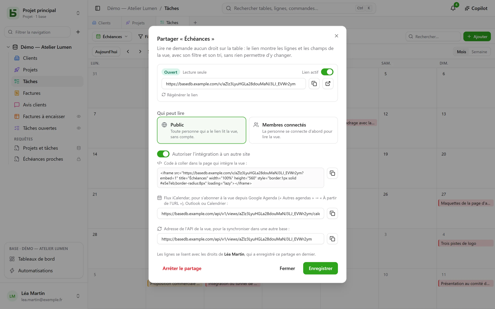
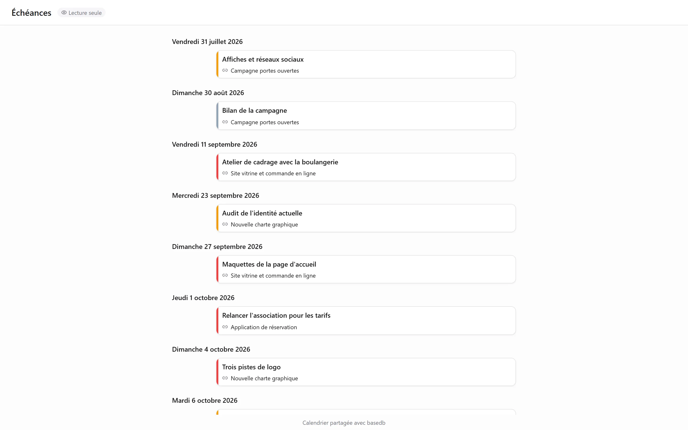

Une vue de données — grille, kanban, calendrier, chronologie, galerie, liste — se **partage en
lecture seule** : un lien `/v/<jeton>` la montre à qui ne peut pas ouvrir basedb, sans rien
permettre d’écrire. C’est le pendant des [formulaires partagés](/basedb/fonctionnalites/formulaires-partages/),
qui laissent répondre sans rien laisser lire. Un [tableau de bord](/basedb/fonctionnalites/tableaux-de-bord/#partager-un-tableau-de-bord)
se partage de la même façon.

## Partager

Menu de la vue → **Partager…**, puis :

| Accès | Qui lit |
|---|---|
| **Public** | quiconque a le lien, sans compte |
| **Membres connectés** | un membre de l’espace, après connexion — au besoin, de certains groupes seulement |

L’interrupteur **Lien actif** suspend le lien sans le perdre. La page s’ouvre hors de
l’application : ni barre latérale, ni nom de base, ni nom de table — la vue, ses filtres, ses
colonnes, et rien d’autre. Un calendrier ou une chronologie s’y lit comme un agenda.

## Au nom de qui on lit

La vue se lit avec les **droits de la personne qui l’a publiée**, redécidés à chaque lecture :
un champ qui lui est masqué ne s’affiche pas, et si elle perd l’accès à la table, le lien cesse
de montrer quoi que ce soit.

## Intégrer à un autre site

Cochez **Autoriser l’intégration à un autre site** : le dialogue donne un **code
d’intégration** `<iframe>`, à coller dans un intranet, un wiki, un site vitrine. Sans cette
case, la page refuse d’être affichée dans le cadre d’un autre site.

## Un calendrier dans votre agenda

Pour un calendrier ou une chronologie partagés en **public**, le dialogue donne l’**adresse du
flux d’agenda** : un flux iCalendar (`…/calendar.ics`, 1 000 événements au plus) auquel
s’abonnent Google Agenda, Outlook ou Apple Calendar. Les échéances de l’équipe apparaissent
dans l’agenda de chacun, et suivent la table.

## Une source pour d’autres bases

Un lien public donne aussi l’**adresse de l’API de la vue** : les lignes qu’elle montre, en
JSON. Une [table synchronisée](/basedb/integrations/synchronisation/) — sur cette instance ou
une autre — peut la prendre pour source.

## Limites

- La lecture est limitée à 120 requêtes par minute, par adresse et par lien.
- Un formulaire ne se partage pas en lecture : il se partage [pour recevoir des réponses](/basedb/fonctionnalites/formulaires-partages/).
