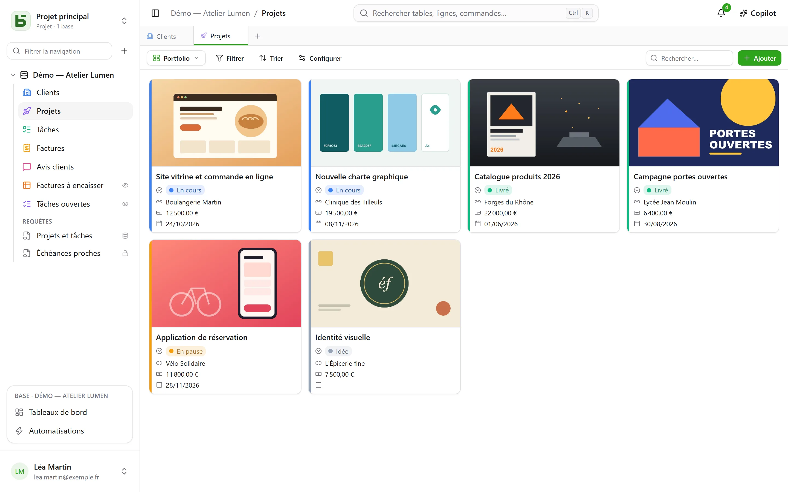
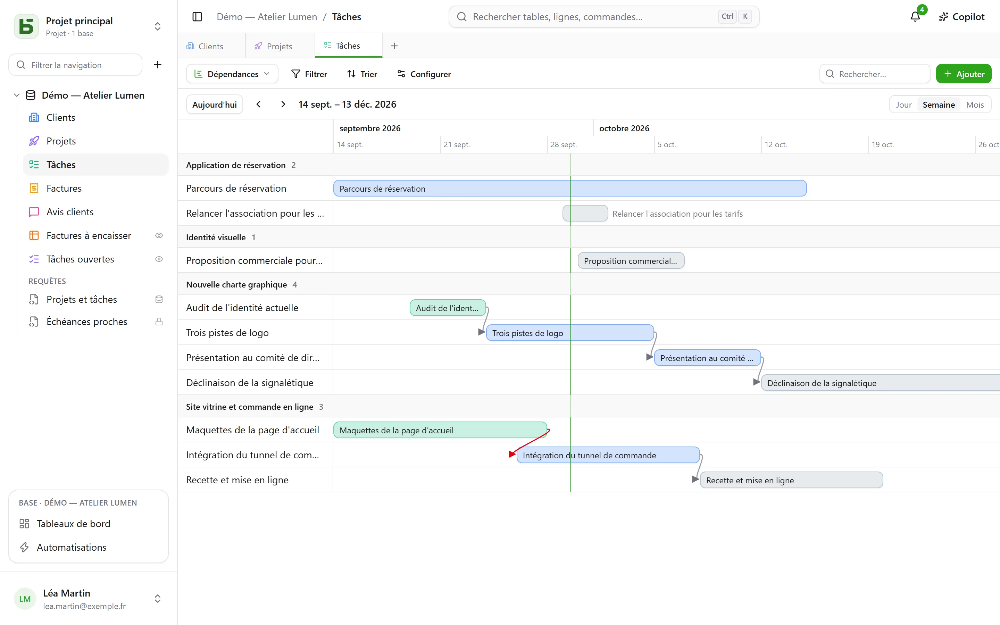
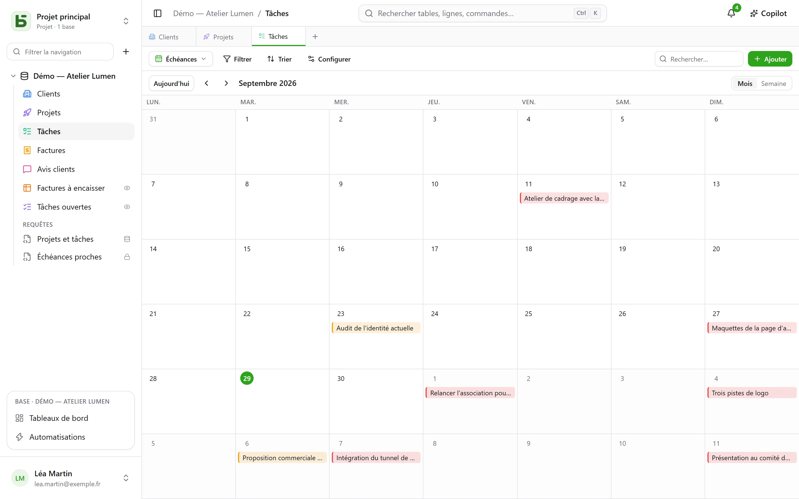
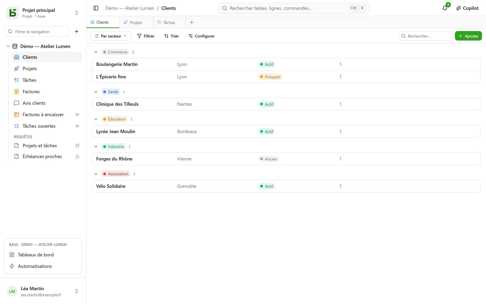

Une table se montre de **dix façons**. Une vue ne copie aucune donnée, et ne donne aucun droit
de plus que la table elle-même.

:::note
Ces vues sont des façons de montrer **une** table. Une [vue SQL](/basedb/fonctionnalites/requetes-et-vues-sql/)
est autre chose : une vraie vue PostgreSQL, écrite en SQL sur les tables de la base, rangée parmi
elles dans la barre latérale.
:::

| Vue | Ce qu’elle montre | Ce qu’il lui faut |
|---|---|---|
| **Grille** | des lignes, filtrées, triées, groupées, colonnes choisies | — |
| **Kanban** | des cartes en colonnes | une liste de choix |
| **Calendrier** | des lignes à leur date, par mois ou par semaine | un champ date |
| **Chronologie** | des barres entre deux dates, et leurs dépendances | une date de début |
| **Galerie** | des cartes, avec une image de couverture | — |
| **Liste** | une ligne par enregistrement, en groupes repliables | — |
| **Carte** | chaque ligne posée sur une carte | une adresse, ou une latitude et une longitude |
| **Formulaire** | une page de questions pour créer une ligne | — |
| **Questionnaire** | les mêmes questions, une par écran | — |
| **Quiz** | des questions notées, une par écran, et le score à la fin | — |

## Le sélecteur de vues

Il est à gauche de « Filtrer ». « Toutes les lignes » est la grille de la table, que personne
n’a enregistrée ni ne peut supprimer ; viennent ensuite les **vues collaboratives**, dans
l’ordre choisi par qui construit la base, puis **Mes vues**. En bas, **Créer une vue** range les
dix sortes en deux familles : celles qui **montrent les lignes** et celles qui **recueillent
des réponses** (formulaire, questionnaire, quiz).

- Une **vue collaborative** est vue de tous. La créer, la configurer, la renommer, la
  réordonner ou la supprimer demande le niveau **Gestion**. Elle peut être **verrouillée** : un
  cadenas le dit, et plus personne ne la modifie avant de l’avoir déverrouillée.
- Une **vue personnelle** n’est vue que de vous, et ne demande que de pouvoir lire la table.
  **Créer une vue personnelle**, ou **Enregistrer comme vue** après avoir filtré et trié :
  chacun range ses propres façons de lire, sans rien changer pour les autres. **Dupliquer** une
  vue collaborative en fait une copie personnelle.

## La barre d’outils

Au-dessus de la grille, dans cet ordre :

- **Filtrer** combine des conditions par champ ;
- **Colonnes** choisit ce qui s’affiche — les colonnes système sont à part, sous
  « Informations système » ;
- **Grouper** range les lignes selon un champ à valeur unique — liste de choix, relation,
  personne, date, nombre, texte, case à cocher… — en groupes repliables, chacun avec son
  décompte sur tout le filtre ;
- **Couleurs** colore les lignes selon une liste de choix, ou selon des **règles** — un filtre et
  une couleur, vingt au plus — en trait, en fond, ou les deux ;
- **Hauteur des lignes** : courte, moyenne, haute, très haute ;
- **Rechercher…**, à droite, cherche dans toutes les colonnes pendant que vous tapez ; Échap
  vide la recherche. Elle vaut aussi pour le kanban, le calendrier, la chronologie, la galerie
  et la liste, et n’est jamais enregistrée dans la vue.

Sous chaque colonne, un **Résumé** calculé sur toutes les lignes du filtre, pas seulement sur
la page : remplies, vides, valeurs uniques, somme, moyenne, minimum, maximum, cases cochées.

## Kanban, calendrier, chronologie

- Le **kanban** range les cartes selon une liste de choix ; glisser une carte modifie la ligne,
  un « + » en tête de colonne crée une ligne déjà dotée de ce choix. Chaque carte montre un
  titre, une image de couverture, les champs choisis, et une **description** qui cite les
  valeurs de la ligne — « Livraison prévue le `{{Date}}` pour `{{Client}}` » —, écrite dans le
  réglage de la vue avec le bouton **Insérer un champ**.
- Le **calendrier** place chaque ligne à sa date, avec une date de fin éventuelle ; glisser une
  ligne d’un jour à l’autre la décale.
- La **chronologie** trace des barres entre une date de début et une date de fin, regroupées par
  une liste de choix ou une relation. Avec le réglage **Dépend de** — une relation de la table
  vers elle-même — une flèche relie chaque tâche à celles dont elle dépend, rouge quand elle
  remonte le temps.

## Galerie et liste

- La **galerie** montre des cartes : une **image de couverture** (recadrée ou entière), une
  taille (petites, moyennes, grandes cartes), une couleur selon une liste de choix.
- La **liste** montre une ligne par enregistrement, **regroupée** par une liste de choix, une
  relation ou une personne.

Dans le kanban, la galerie et la liste, les cartes et les lignes se **rangent à la main** en les
glissant — jusqu’à 5 000 ; un tri choisi l’emporte sur cet ordre.

## Carte

La **carte** pose chaque ligne à son endroit, d’après :

- une **adresse** — un texte court, de préférence au format **Adresse** (voir
  [Tables et champs](/basedb/fonctionnalites/tables-et-champs/)) : « 12 rue des Lilas, Lyon » ;
- ou une **latitude** et une **longitude**, deux champs nombre, placées telles quelles.

Une épingle prend la **couleur** d’une liste de choix, montre le **titre** de la ligne au
survol, et ouvre sa fiche au clic. La carte suit le filtre et le tri de la vue, jusqu’à 2 000
lignes.

Une adresse est **située une fois pour toutes** par le service de géocodage de l’instance —
celui d’OpenStreetMap par défaut —, au rythme qu’il impose : sur une carte neuve, les épingles
apparaissent au fil des réponses, une par seconde environ, puis tout de suite les fois
suivantes. Une pastille compte les lignes placées, les adresses encore à situer et celles qui
n’ont pu l’être : une adresse introuvable est à préciser (ville, code postal), jamais écartée en
silence.

:::note[Ce qui quitte votre serveur]
Le texte des adresses part vers le service de géocodage, et le navigateur de chaque lecteur
charge le fond de carte depuis le serveur de tuiles. L’exploitant de l’instance peut choisir
d’autres services, ou n’en vouloir aucun : voir
[Variables d’environnement](/basedb/hebergement/variables/#cartes-et-adresses).
:::

## Formulaire et questionnaire

On coche les questions et on les ordonne ; chacune a un intitulé, une aide, un exemple de
réponse, et peut être rendue obligatoire. Le formulaire a son titre, sa présentation, le
libellé de son bouton et son message de remerciement. Il se remplit dans basedb, ou se
[partage par un lien](/basedb/fonctionnalites/formulaires-partages/).

Rien n’est à régler pour commencer : un formulaire neuf pose ce qu’une personne répond — pas
le statut, la personne assignée ni les relations que l’équipe remplit ensuite, sauf s’ils sont
obligatoires —, porte la couleur de sa table et un thème clair, et chaque champ vide montre un
exemple adapté. Tout le reste se change quand on veut :

- **Apparence** : huit thèmes — Clair, Doux, Aurore, Océan, Forêt, Nuit, Papier, Minimal —,
  une couleur d’accent, une police, un alignement à gauche ou centré ;
- **Préremplir avec la date du jour** : une question date arrive déjà remplie du jour — et de
  l’heure, pour une date et heure —, que la personne garde ou change ;
- **Poser seulement si…** : une question ne se pose que si une réponse précédente le demande
  (« Sentiment est Négatif », « Note vaut au plus 2 »). Une question cachée n’est ni exigée ni
  envoyée ;
- **Plus d’options** : les boutons d’accueil et d’envoi, les numéros, la barre de progression,
  le passage automatique à la suite, le message et un bouton de fin (« Retour au site »), les
  confettis.

Le **questionnaire** occupe tout l’écran : un accueil qui dit combien de temps il faut, puis
une question à la fois, qui arrive en glissant. Tout se fait aussi au clavier : **Entrée** pour
continuer, les lettres **A**, **B**, **C**… pour un choix, **O** ou **N** pour oui ou non, les
chiffres pour une note — un choix unique fait passer seul à la question suivante. L’envoi se
fête : une coche qui se dessine et des confettis aux couleurs du formulaire.

## Quiz

Un quiz est un questionnaire qui compte les points. Sous chaque question, on donne sa **bonne
réponse** et ce qu’elle rapporte — **1 point** si l’on ne dit rien, jusqu’à 100 :

| Question | Bonne réponse |
|---|---|
| liste de choix | un choix |
| choix multiples | les choix qu’il faut cocher, tous et rien qu’eux |
| case à cocher | oui ou non |
| nombre, note | un nombre |
| date | un jour |
| texte court, e-mail, URL | une ou plusieurs réponses acceptées, séparées par `;` — sans tenir compte des majuscules ni des accents |

Une question sans bonne réponse — un prénom, un commentaire — est posée sans être notée. Il en
faut au moins une notée pour créer le quiz.

La section **Notation** règle le reste :

- **Corriger** : **après chaque question** — la réponse se vérifie aussitôt, en vert, ou en rouge
  avec la bonne réponse, et le score grandit en haut de l’écran —, **à la fin** — le score puis
  le corrigé —, ou **jamais** — le score seul, les bonnes réponses restent secrètes ;
- **Seuil de réussite** : un pourcentage des points ; l’écran de fin dit alors « Réussi ! » ou
  « Pas cette fois… » ;
- **Enregistrer le score dans** : un champ nombre de la table, qui reçoit le score de chaque
  réponse. Triez la grille dessus : voilà le classement. Un champ nommé « Score », « Points » ou
  « Note » est choisi d’office.

L’écran de fin montre le score dans un anneau qui se remplit, le pourcentage, puis, sauf
« jamais », chaque question notée avec la réponse donnée et la bonne. Une question qu’une
réponse précédente a cachée ne compte pas dans le total.

:::note
Dans l’application, qui peut lire la vue peut en lire les bonnes réponses. Par un
[lien partagé](/basedb/fonctionnalites/formulaires-partages/#un-quiz-partagé), elles ne quittent
jamais le serveur : c’est lui qui corrige et qui compte.
:::

## Partager une vue

Une vue de données — grille, kanban, calendrier, chronologie, galerie, liste — se **partage en
lecture seule** par un lien, s’intègre à un autre site, et un calendrier devient un flux
d’agenda. Voir [Vues partagées](/basedb/fonctionnalites/vues-partagees/).

## Ce que le lecteur ne voit pas

Une vue est **reprojetée pour son lecteur** : un champ qui lui est masqué disparaît des
colonnes, des cartes et des questions. Une vue dont le filtre cite un champ masqué n’est pas
montrée du tout : montrée sans son filtre, elle montrerait plus qu’elle n’a été faite pour
montrer.
