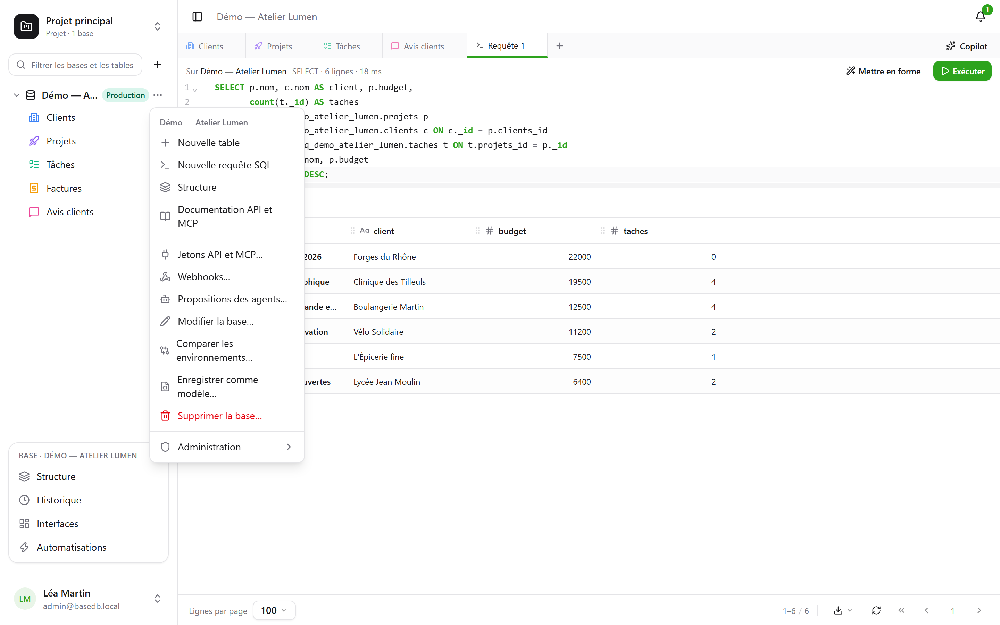
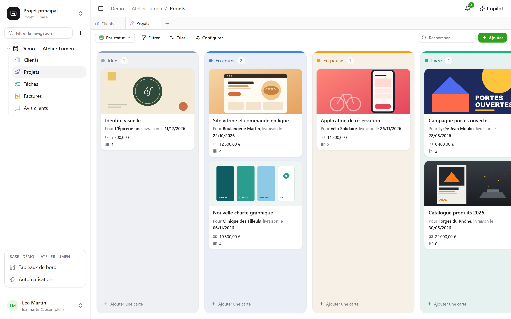

Ce parcours prend dix minutes et couvre l’essentiel : à la fin, vous aurez une table, une vue
kanban et un formulaire public qui écrit dedans.

:::tip[Pour tout voir d’un coup]
Un projet vide propose la **base de démonstration** : une petite agence, ses clients, projets,
tâches, factures et avis, avec des formules, des vues de chaque sorte, un tableau de bord et
des automatisations. **Nouvelle base** ouvre aussi la [galerie des modèles](/basedb/fonctionnalites/modeles/),
où l’on peut décrire sa base à l’IA.
:::

## 1. Créer une base

Tout s’organise par **projet** : le sélecteur en haut de la barre latérale change de projet ou
en crée un. Dans la barre, le **+** à droite du filtre crée une base. Donnez-lui un libellé
— « Ventes » — et, si vous voulez, une description, une couleur, un pictogramme.

La base devient un **schéma PostgreSQL** : son nom physique (`b_t4z56fq_ventes`) apparaît dans
le formulaire et dans la documentation générée.

## 2. Créer une table et ses champs

Depuis le menu **⋯** de la base : **Nouvelle table**. Ajoutez ensuite ses champs depuis
**Structure** — dans ce même menu — et son bouton
**Champ** :

| Champ | Type |
|---|---|
| Nom | Texte court |
| Statut | Liste de choix — Nouveau, Qualifié, Gagné, Perdu |
| Montant | Monnaie |
| Échéance | Date |
| Client | Relation → Clients |
| Notes | Texte long (Markdown) |

Plus tard, une formule (`JOURS([Échéance]; AUJOURDHUI())`), une recherche (la ville du client)
ou un cumul (le montant total par client) s’ajoutent de la même façon — voir
[Tables et champs](/basedb/fonctionnalites/tables-et-champs/).

Vous pouvez aussi **importer un fichier** CSV ou JSON : l’import devine les types, vous laisse
les corriger, crée la table ou complète une table existante, et dit ligne par ligne ce qu’il
refuse.



## 3. Saisir et filtrer

La grille s’édite comme un tableur : double-clic ou Entrée pour modifier une cellule, Échap pour
annuler. **Filtrer** combine des conditions par champ ; le tri se fait depuis l’en-tête de
colonne ; **Rechercher…**, à droite de la barre, cherche dans toutes les colonnes. Chaque
modification est enregistrée aussitôt — et [historisée](/basedb/fonctionnalites/historique/) :
**Ctrl+Z** annule la dernière.

## 4. Ajouter une vue

Le sélecteur de vues, à gauche de « Filtrer », propose « Toutes les lignes » puis vos vues.
Créez un **kanban** groupé par « Statut » : glisser une carte d’une colonne à l’autre modifie la
ligne.



## 5. Partager un formulaire

Créez une vue **Formulaire**, cochez les questions, puis **Partager** : choisissez « Public »,
copiez le lien. Chaque réponse ajoute une ligne à la table, sans donner aucun droit à celui qui
répond. Détails dans [Formulaires partagés](/basedb/fonctionnalites/formulaires-partages/).

## 6. Lire en SQL

Menu **⋯** de la base → **Requête SQL** : vos tables sont là, sous leur vrai nom.

```sql
SELECT nom, statut, montant
FROM b_t4z56fq_ventes.opportunites
WHERE statut = 'gagne'
ORDER BY montant DESC;
```

**Enregistrer** la range sous les tables, rubrique « Requêtes » — pour vous, ou pour toute la
base — et **⋯** → **Créer une vue SQL…** en fait une vraie vue PostgreSQL, rangée parmi les
tables. Chacun les lit avec ses propres droits. Voir
[Requêtes et vues SQL](/basedb/fonctionnalites/requetes-et-vues-sql/).

C’est la même chose depuis `psql` ou votre outil de BI. Voir [SQL direct](/basedb/integrations/sql/).
