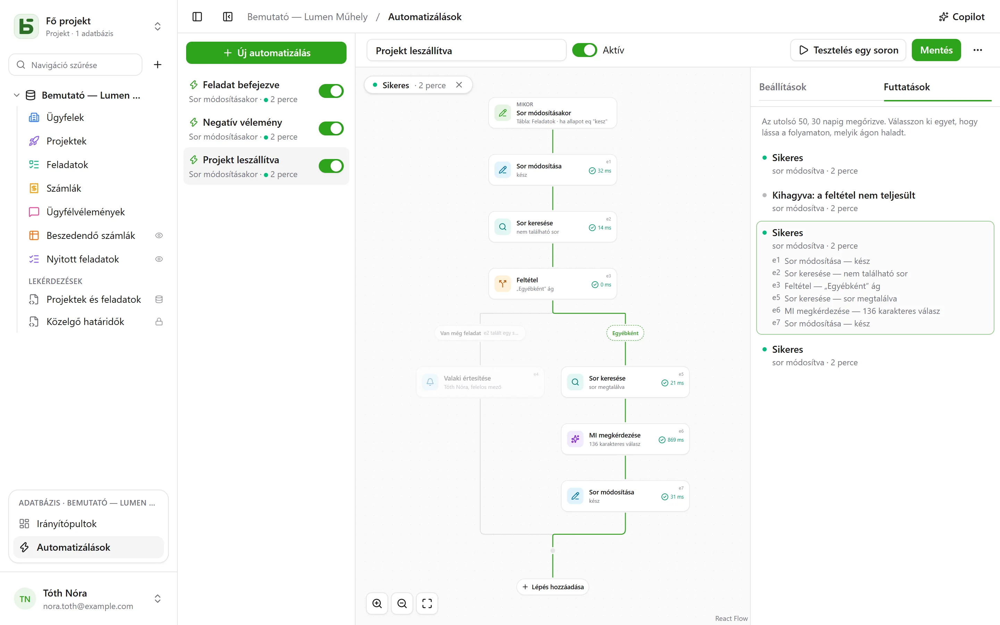

Az automatizálás egy **mikor**, egy **ha** és egy **akkor** részből áll: amikor egy feladat „Fait”
állapotba kerül, rögzíti az időpontot; amikor negatív értékelés érkezik, értesíti a felelőst,
és ír a Slackre; minden hétfőn 9 órakor létrehozza a csapatmegbeszélés sorát. Ha pedig egy
művelet nem elég, egy **folyamatot** követ: megkeres egy sort, az alapján, amit a sor tartalmaz,
egyik vagy másik ágon halad tovább, lépéseket ismétel egy szűrőnek megfelelő minden egyes során,
és egy lépésben újra felhasználja, amit egy korábbi lépés talált vagy írt, három napot **vár**
egy ismétlés előtt, és mellékletként egy **PDF**-et küld.

Az **Automatizálások** menüpontból nyithatók meg, az oldalsáv alján, a megnyitott adatbázis
blokkjában, és **Kezelés** szintű jogosultságot igényelnek.



## A folyamat

A folyamat fentről lefelé rajzolódik ki: az eseményindító, majd az egyes lépések. Egy vonalon
lévő **+** megnyitja a lépések listáját, kategóriánként – Sorok, Kommunikáció, Dokumentumok, MI,
Logika – rendezve, kereséssel, és hozzáadja a kiválasztottat azon a helyen; egy kártya jobb
oldalt nyitja meg a beállításait. Egy egyszerű automatizálás – egy eseményindító és egy művelet
– két kártyán elfér, és ugyanúgy állítható be, mint korábban.

## Mikor

| Eseményindító | Beállítások |
|---|---|
| **Sor létrehozásakor** | a tábla |
| **Sor módosításakor** | a tábla, és szükség esetén csak a figyelendő mezők |
| **Ütemezetten** | óránként, naponta vagy hetente, a választott időpontban és időzónában |
| **Gombra kattintáskor** | a tábla egy [Gomb mezője](/basedb/hu/fonctionnalites/tables-et-champs/#gomb) |
| **Egy sor törlődik** | a tábla; a lépések a sort olyannak idézik, amilyen volt |
| **Egy sor belép egy szűrőbe** | a tábla és a szűrő: az automatizálás akkor indul, amikor egy sor belép a szűrőbe, és csak azután indul újra, hogy előbb kilépett belőle – „egy számla késésbe kerül”, nem „egy késésben lévő számla módosul” |
| **Egy dátum eljön** | a tábla egy Dátum mezője, egy eltolás – három nappal előtte, aznap, egy héttel utána – és az időpont: határidő-emlékeztetők, szerződés-évfordulók |
| **Egy webhook beérkezik** | semmi: az automatizálás saját címet kap, amelyet egy másik szoftver hív meg ([részletek](#egy-szolgáltatás-amely-a-basedb-t-hívja)) |

A sorokra vonatkozó eseményindító **minden** írást lát: a felületét, az API-ét, egy ügynökét,
egy megosztott űrlapét, sőt a közvetlen SQL-ét is – az automatizálások az előzményekből
indulnak, amelyek mindegyiket rögzítik.

## Csak akkor, ha

Egy opcionális feltétel a [szűrők nyelvén](/basedb/hu/integrations/api-rest/#olvasás) –
`statut eq "fait"`, `montant gte 10000 and payee eq false` –, amelyet a rendszer a soron **a
művelet pillanatában** értékel ki. Az a futtatás, amelynek feltétele nem teljesül, „kihagyva”
állapotú lesz, és ezt jelzi is.

## Akkor

Legfeljebb negyven lépés, sorrendben; az első sikertelen lépés leállítja a következőket – kivéve
egy **Próbálkozás** blokkban ([részletek](#próbálkozás)).

| Lépés | Mit csinál |
|---|---|
| **Sor módosítása** | értékeket ír az eseményt kiváltó sorba – vagy abba, amelyet egy lépés talált vagy létrehozott |
| **Sor létrehozása** | ebben a táblában vagy az adatbázis egy másik táblájában |
| **Sor keresése** | egy tábla első olyan sora, amely megfelel egy szűrőnek, hogy a következő lépések hivatkozhassanak rá vagy módosíthassák |
| **Valaki értesítése** | [értesítés](/basedb/hu/fonctionnalites/collaboration/#értesítések) kiválasztott személyeknek, vagy egy Személy mezőben szereplő személynek |
| **E-mail küldése** | a csapat egy tagjának, egy Személy mezőben szereplő személynek, egy E-mail mezőben szereplő címre – egy ügyfélnek, egy beszállítónak – vagy beírt címekre; a tárgy és a szöveg a sorra és a korábbi lépésekre hivatkozik |
| **Webhook hívása** | HTTPS-kérés egy szolgáltatás felé – metódus, cím, fejlécek és törzs az Ön kezében ([részletek](#szolgáltatás-hívása)); a válaszára ezután hivatkozni lehet |
| **Küldés Slackre** | üzenet egy [csatlakoztatott](/basedb/hu/integrations/synchronisation/#slack) csatornába |
| **MI megkérdezése** | az [MI-szolgáltató](/basedb/hu/fonctionnalites/ia/) válasza egy utasításra, amely a sorra és a korábbi lépésekre hivatkozik – megfogalmazás, összefoglalás, besorolás –, szövegként, számként, igen/nem értékként, dátumként vagy egy lista egyik elemeként értelmezve |
| **Feltétel** | több ág: az első, amelynek feltétele teljesül, kerül sorra, az „Egyébként” ág pedig akkor, ha egyiké sem; az ágak ezután újra összefutnak |
| **Minden sorra** | a benne található lépéseket egyszer végrehajtja egy tábla minden olyan sorára, amely megfelel egy szűrőnek ([részletek](#minden-sorra)) |
| **Sor törlése** | az eseményt kiváltó sor, vagy az, amelyet egy lépés talált – a kukába kerül |
| **Számlálás és összeadás** | egy szűrő sorainak száma, összege, átlaga, minimuma vagy maximuma, amelyre később hivatkozni vagy amelyet tesztelni lehet |
| **PDF létrehozása** | egy sor [dokumentuma](/basedb/hu/fonctionnalites/documents/), amely egy Fájl mezőbe kerül, vagy egy e-mailhez csatolható |
| **Várakozás** | egy időtartam, vagy egy mező dátumáig ([részletek](#várakozás)) |
| **Próbálkozás** | lépések, és mások, amelyeket akkor kell elvégezni, ha egyikük sikertelen ([részletek](#próbálkozás)) |
| **Automatizálás indítása** | az adatbázis egy másik automatizálása, a táblájának egy során |

Az eredmény nélküli keresés nem állítja le a folyamatot: azok a lépések, amelyeknek a talált
sort kellett volna módosítaniuk, kimaradnak. Ha ilyenkor valami mást szeretne tenni, a keresés
alatt a **Ha nem található sor…** feltételt ad hozzá, amely ezt ellenőrzi.

Egy **feltétel** egy sort vizsgál egy szűrővel, vagy egy **értéket** – az MI válaszát, egy
webhook kódját, egy összeget – „`{{e2.reponse}}` egyenlő Urgent”, „`{{e3.somme.montant}}`
nagyobb vagy egyenlő, mint 1000”. A számok számként hasonlítódnak össze, a szövegek ékezetek és
nagybetűk nélkül.

## Minden sorra

A **Minden sorra** lépés beolvassa egy tábla azon sorait, amelyek megfelelnek a szűrőjének –
üres szűrő esetén az összeset –, a választott sorrendben, a korlátjáig (alapértelmezés szerint
50, legfeljebb 200), majd a keretében elhelyezett lépéseket egyszer végrehajtja mindegyikre. A
„Minden hétfőn küldjön emlékeztetőt a kifizetetlen számlákról” így írható meg: **Ütemezetten**,
majd **Minden sorra** a `payee eq false and relancee eq false` szűrőjű számlákon, a ciklusban
pedig egy e-mail a számla kapcsolattartójának és egy **Sor módosítása** lépés, amely bejelöli a
„Relancée” mezőt.

A ciklusban a lépés azonosítója a **kör sorát** nevezi meg: a `{{e1.client}}` erre hivatkozik,
és a **Sor módosítása** lépés ezt ajánlja fel a módosítható sorok között. A ciklus után az
`{{e1.nombre}}` megmondja, hány sort járt be – például egy Slack-összefoglalóhoz. A szűrő
hivatkozhat arra, ami előtte történt: egy kifizetett számla által kiváltva, a
`facture eq {{_id}}` a hozzá tartozó tételsorokat járja be.

A korláton túli sorok a következő futtatásra várnak, amely ezt jelzi is: a feldolgozottakat –
egy „relancée” jelölőnégyzettel, egy dátummal – vegye ki a szűrőből, hogy a futtatások során
mindegyiket feldolgozza a rendszer. Egy ciklus nem tartalmaz másik ciklust, és egy futtatás két
perc után megáll.

## Várakozás

A **Várakozás** lépés szünetelteti a futtatást – három órát, két napot –, vagy egy sor egy
mezőjének dátumáig, egy eltolással és egy időponttal: „a határidő előestéjén, 9 órakor”. A
futtatás **Szüneteltetve** állapotban jelenik meg a **Futtatások** lapon, a folytatás
dátumával.

A következő lépésnél folytatódik, **újraolvasva** a sorait: „három nappal az árajánlat
elküldése után, ha még nem fogadták el, küldjön emlékeztetőt” így írható meg: **Várakozás** 3
napig, majd egy feltétel az árajánlat akkori állapotáról. Az automatizálás letiltása leállítja
a szünetelő futtatásokat; egy várakozás nem helyezhető el sem egy ciklusban, sem egy
**Próbálkozás** blokkban, és legfeljebb egy évig tart.

## Próbálkozás

A **Próbálkozás** blokknak két ága van. Az első fut le; ha egyik lépése sikertelen, a folyamat
a második ágon, a **Hiba esetén** ágon folytatódik, amely hivatkozik a hibára – `{{e4.erreur}}`,
a kód, és `{{e4.etape}}`, a lépés –, majd a blokk után folytatódik. Ezzel lehet értesíteni
valakit, amikor egy szolgáltatás nem válaszol, anélkül, hogy minden megállna.

Egyszerűbben: egy webhook magától **újra próbálkozhat**, legfeljebb háromszor, egy
szolgáltatáshiba után, és egy ciklus **folytatódhat** egy sikertelen sor ellenére.

## Egy PDF és egy e-mail

A **PDF létrehozása** elkészíti egy sor dokumentumát – a táblájának egy
[dokumentumsablonjával](/basedb/hu/fonctionnalites/documents/), vagy minden mezőjének
adatlapjával –, és elhelyezheti egy Fájl mezőben. Az **E-mail küldése** ezután csatolhatja,
egy Fájl vagy Kép mező fájljaival együtt:

- egy-egy e-mail **mindenkinek**, vagy **egy közös mindenkinek**, **másolatban** szereplő
  címzettekkel;
- egy üzenet **formázott szövegben** – félkövér, listák, hivatkozások –, amely a sorra
  hivatkozik;
- egy **válaszcím**: alapértelmezés szerint az Öné, vagy egy E-mail mezőé;
- legfeljebb 50 címzett, 10 melléklet és 15 MB.

„Amikor egy árajánlat Elfogadott állapotba kerül, küldje el a számlát az ügyfélnek, a
könyvelésnek másolatban”: **Egy sor belép egy szűrőbe** `statut eq "accepte"`, **PDF
létrehozása** a Számla sablonnal, **E-mail küldése** az ügyfél E-mail mezőjére, a számlával
csatolva.

## Egy szolgáltatás, amely a basedb-t hívja

Az **Egy webhook beérkezik** eseményindítóval az automatizálásnak saját titkos címe van,
amelyet át kell adni annak a szoftvernek, amelynek el kell indítania azt – egy webáruháznak,
egy külső űrlapnak, egy automatizálási eszköznek:

```bash
curl -X POST "https://basedb.example.com/api/v1/hooks/<secret>" \
  -H "content-type: application/json" \
  -d '{"client": {"nom": "Dupont"}, "total": 120}'
```

A lépések hivatkoznak arra, amit küldött: `{{trigger.client.nom}}`, `{{trigger.total}}`; egy
űrlap ugyanígy olvasható, egy szöveg a `{{trigger.texte}}` alakban. A cím az eseményindító
beállításaiból másolható; a **Cím módosítása** lecseréli, és a régi azonnal megszűnik. Egy
hívás `202`-t kap válaszul, az automatizálás egy másodpercen belül lefut.

## Szolgáltatás hívása

A **Webhook hívása** lépés alapértelmezés szerint `POST`-tal küldi el az automatizálás
adatait: a kiválasztott sort és amit a korábbi lépések találtak vagy írtak. Ahhoz, hogy egy
szolgáltatással úgy beszéljen, ahogyan az elvárja, beállítható:

- a **metódus**: `POST`, `PUT`, `PATCH`, `GET` vagy `DELETE` – ez utóbbi kettő törzs nélkül;
- a **cím**, amely a hosztja után hivatkozhat – `https://api.exemple.fr/clients/{{e2.numero}}`;
  minden érték kódolva kerül bele;
- **fejlécek**, amelyek értéke szintén hivatkozhat: `Idempotency-Key: {{_id}}`;
- a **törzs**: az automatizálás adatai, egy **Összeállítandó JSON**, egy **Űrlap**
  (soronként egy `kulcs=érték` pár) vagy egy **Szöveg**. Egy JSON-ban az idézőjelek közötti
  hivatkozás szöveg, az idézőjeleken kívüli pedig érték – szám, igen vagy nem, lista:

```json
{ "facture": "{{e1.numero}}", "montant": {{e1.montant}}, "payee": {{e1.payee}} }
```

Egy API-kulcsot vagy egy tokent egy **titkos** fejlécbe kell tenni (a lakat): a példány
kulcsával titkosítva, ez soha többé nem jelenik meg – sem a képernyőn, sem az API-ban, sem a
Copilotnak –, és csak arra a hosztra kerül, amelyhez megadta. A cím hosztjának
megváltoztatása esetén újra meg kell adni; a **Csere** egy újat kér be.

## MI megkérdezése

Az [MI-mezőhöz](/basedb/hu/fonctionnalites/ia/#a-mező-mi-beállítása) hasonlóan a lépés elküldi a
szolgáltatónak az utasítását, amelyben minden hivatkozás helyére az értéke kerül:

```text
Cet avis de {{auteur}} demande-t-il une action de notre part ? {{avis}}
```

Kiválasztja a **várt választ** – szabad vagy rövid szöveg, szám, igen vagy nem, dátum,
webcím, vagy egy lista egyik eleme, amelyet egy választás típusú mezőből is átvehet. A modell
erről tájékoztatást kap, és ha a válasz nem tartalmaz ilyet, a lépés sikertelen lesz. A
következő lépések a `{{e1.reponse}}` alakkal hivatkoznak rá: egy létrehozott feladat címében,
egy üzenetben, vagy egy választás típusú mezőben, ahol az azonos címkéjű lehetőséghez kerül.

Amire az utasítás hivatkozik, az a szolgáltatóhoz kerül: a lépés az Ön **hozzájárulását**
kéri, amelyet az utasítás minden módosításakor újra meg kell adni. Minden hívás naplózásra
kerül, és az MI-mezőkkel együtt beleszámít a `BASEDB_AI_FIELD_QUOTA` keretbe (alapértelmezés
szerint óránként 300). Az MI magától nem tesz semmit: az utána következő lépések írnak vagy
értesítenek.

## Hivatkozás

Az értékek, az üzenetek és a szűrők hivatkozhatnak arra, ami előttük történt, az egyes
szövegek melletti **{ }** gombbal:

- `{{Titre}}`, `{{_id}}`: az eseményt kiváltó sor;
- `{{e2.titre}}`, `{{e2._id}}`: az `e2` lépés által talált, létrehozott vagy módosított sor –
  minden lépés kártyáján ott az azonosítója;
- `{{e3.statut}}`, `{{e3.reponse.numero}}`: amit az `e3` webhook válaszolt;
- `{{e4.reponse}}`: az `e4` MI-lépés válasza;
- `{{e5.client}}` az `e5` ciklusban a kör sora; `{{e5.nombre}}` utána a bejárt sorok száma;
- `{{e6.nombre}}`, `{{e6.somme.montant}}`, `{{e6.moyenne.montant}}`, `{{e6.max.echeance}}`: amit
  az `e6` lépés számolt;
- `{{e7.erreur}}`, `{{e7.etape}}`: a hiba, amelyet a **Próbálkozás** `e7` blokk elkapott;
- `{{e8.nom}}`: az `e8` lépés PDF-jének a neve;
- `{{trigger.client.nom}}`: amit egy bejövő webhook küldött;
- `{{_maintenant}}`: a futtatás időpontja.

Az egyetlen hivatkozásból álló érték magát az értéket adja át: egy kapcsolatot, egy személyt,
egy választást – így kapcsolódik egy létrehozott sor ahhoz, amelyet egy keresés talált. Egy
szűrőben a hivatkozás mindig összehasonlított érték, soha nem a szűrőnyelv része.

Egy lépés csak arra hivatkozhat, ami biztosan megtörtént előtte: amit egy ág talált, arra a
feltétel után már nem lehet hivatkozni. A szerkesztő ezt mentés előtt jelzi a kártyán.

## A Copilot

A fejlécben lévő **Copilot** jobb oldalt természetes nyelvű beszélgetést nyit az adatbázis
automatizálásairól: „ha egy feladat ellenőrzésre kerül, értesítsd a hozzárendelt személyt”,
„adj hozzá MI-összefoglalót a jegyzetekhez”, „miért volt sikertelen az utolsó futtatás?”.
Válaszol, és **javasol** egy teljes automatizálást – a képernyőn lévőt módosítva, vagy egy
újat –, a változások listájával együtt.

A Copilot semmit nem ment: az **Alkalmazás a folyamatra** megmutatja a javaslatot a
szerkesztőben, ahol mentés előtt átnézheti – a kártyán lévő **Mégse** pedig visszaállítja a
folyamatot a korábbi állapotára. Az új automatizálás létrehozásra várva nyílik meg a
szerkesztőben. Minden javaslatot ugyanúgy ellenőriz a rendszer, mint egy mentést; ami nem
állja meg a helyét, azt elveti, és ezt jelzi is.

Alapértelmezés szerint **csak a struktúra** kerül az MI-szolgáltatóhoz a beszélgetéssel
együtt: a táblák és a mezőik, az adatbázis automatizálásai, a képernyőn lévő úgy, ahogy a
szerkesztő mutatja, és a legutóbbi futtatásai – azok állapotai és hibakódjai, soha egyetlen
érték sem. A személyek és a Slack-csatornák jelölőkkel (`p1`, `s1`) kerülnek átadásra, soha
nem az azonosítójukkal. Az **Adatok olvasásának engedélyezése** jelölőnégyzet lehetővé teszi a
Copilot számára, hogy a beszélgetés idejére sorokat olvasson (olvasásonként legfeljebb 50-et),
és minden olvasás a válasza alatt fel van sorolva.

## Tesztelés, követés

A **Tesztelés egy soron** a mentett automatizálást egy kiválasztott soron futtatja, élesben.
A **Futtatások** lap az utolsó 50-et őrzi meg, 30 napig: függőben, folyamatban, sikeres,
kihagyva az okával, sikertelen a kódjával. Ha kiválaszt egyet, a rendszer ráhelyezi a
folyamatra – a bejárt ág ki van rajzolva, minden végrehajtott lépés megmutatja, mit csinált és
mennyi idő alatt, a többi elhalványul. Egy ciklusban minden lépés azt is megmutatja, hányszor
futott le.

## Kinek a nevében cselekszik

Az automatizálás **annak a személynek a jogosultságaival** cselekszik, **aki utoljára
mentette**, és ezeket minden futtatáskor újra ellenőrzi a rendszer: ha ez a személy elveszít
egy jogosultságot, az azt igénylő lépés sikertelen lesz ahelyett, hogy átlépne rajta, és egy
keresés csak azt találja meg, amit ő olvashat. Az előzmények így jelenítik meg:
„Automatizálás »Tâche terminée« · … nevében”, és az írásai ugyanúgy visszavonhatók, mint a
többi.

## Korlátok

- Amit egy automatizálás ír, az nem indít el másikat: aminek egymás után kell következnie,
  azt egyetlen folyamatba kell írni, vagy az **Automatizálás indítása** lépéssel, legfeljebb
  három szinten.
- A keresés egy sort ad, az elsőt; egy ciklus végrehajtásonként legfeljebb 200-at jár be. Egy
  futtatás legfeljebb két percig tart, a várakozásokat nem számítva.
- Nincs szkript. Egy e-mail a példány
  [levélküldő szerverén](/basedb/hu/hebergement/variables/#e-mailek) keresztül megy ki.
- Az [adatbázissablon](/basedb/hu/fonctionnalites/modeles/) csak azokat az automatizálásokat
  viszi magával, amelyekben nincs keresés, ciklus, feltétel vagy MI-lépés – webhookot pedig
  sosem.
- Egy webhook nem követ átirányítást, és legfeljebb 10 másodpercet vár; a 2xx-től eltérő
  válasz a lépés sikertelenségét okozza, az újrapróbálkozásai után.
- Egy eljövő dátumot percenként megvizsgál a rendszer; csak azok számítanak, amelyek az
  automatizálás mentése után következnek be.
- Automatizálásonként óránként 100 futtatás; egy kimaradt óránkénti időpontot csak egyszer
  pótol a rendszer.
- Az írás és a művelet közötti késleltetés másodperces nagyságrendű.
