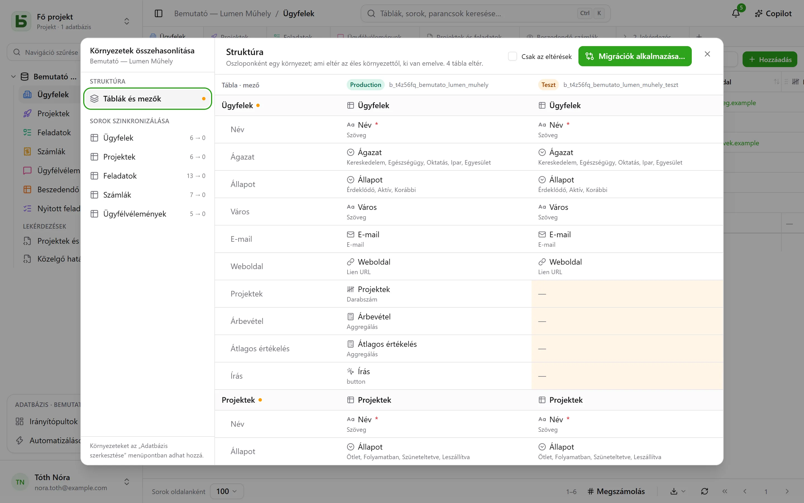

Egy adatbázisnak lehetnek **környezetei**: éles, teszt, fejlesztői… Mindegyik teljes értékű
adatbázis – saját sémával, táblákkal, sorokkal és jogosultságokkal –, és mindegyik osztozik az
adatbázis, a táblái és a mezői **leszármazási vonalán**.

## A felületen

Az oldalsáv **adatbázisonként egy sort** mutat, egy jelvénnyel, amely jelzi a megnyitott
környezetet, és lehetővé teszi a váltást. A jelvény addig nem jelenik meg, amíg csak az éles
környezet létezik.

A környezetek az **Adatbázis szerkesztése…** párbeszédablakban adhatók hozzá, nevezhetők át és
törölhetők: az új környezet egy másik környezet **struktúrájának másolataként** jön létre, a
sorai nélkül.

## Környezetek összehasonlítása

Az adatbázis menüjéből, a **További műveletek** alatt a **Környezetek összehasonlítása…**
egy párbeszédablakot nyit meg:

- **Struktúra**: a környezetek oszlopokban, a táblák és a mezők sorokban; ami eltér az éles
  környezettől, az ki van emelve.
- A **Migrációk alkalmazása…** lépésről lépésre előkészíti a tervet, amellyel egyik környezetből
  a másikba lehet jutni. Soha nem jelöli be automatikusan azt, ami a cél egy újabb módosítását
  vonná vissza.
- **Sorok szinkronizálása**: táblánként sorok átvitele egyik környezetből a másikba, azonosító
  alapján.

## Honnan tudja a basedb, ki mit változtatott

Az összehasonlítás a **struktúra előzményein** alapul: a táblák vagy mezők minden
létrehozását, módosítását vagy törlését egy, a katalóguson lévő trigger rögzíti, és ez az
előzmények „Struktúra” lapján olvasható. A leszármazási azonosítók egy teszt környezetbeli
mezőt az éles környezetbeli megfelelőjéhez kötnek, akkor is, ha át lett nevezve.

## API, SDK és MCP

Egy **az egész adatbázisra létrehozott token** az összes környezetét megnyitja, a maiakat és azokat
is, amelyeket később adnak hozzá: egyetlen token az élesre és a tesztre. A program vagy az ügynök
minden híváskor kiválasztja a környezetet:

| Hol | Hogyan |
|---|---|
| [REST API](/basedb/hu/integrations/api-rest/#környezet-kiválasztása) | az `X-Basedb-Environment: recette` fejléc, vagy az `?environment=recette` |
| [SDK](/basedb/hu/integrations/sdk/#környezetek) | `db.environment('recette')` |
| [MCP](/basedb/hu/integrations/mcp/#környezet-kiválasztása) | a `…/mcp?environment=recette` cím, vagy egy eszköz `environment` argumentuma |
| [n8n](/basedb/hu/integrations/n8n/#a-hitelesítő-adatok) | a hitelesítő adat **Environment** mezője |

Ezek nélkül minden adatbázis a saját környezetét jelöli: az éles neve az élest nyitja meg, a teszté a
tesztet. Egy token a létrehozásakor arra a környezetre is korlátozható, amely meg van jelenítve: ekkor
másikat nem lát. Mindkét esetben a jogosultságai, környezetenként, metszetet képeznek annak a
személynek a jogosultságaival, aki létrehozta.

## SQL-ben

Minden környezet egy séma: `b_t4z56fq_ventes` az éles, `b_t4z56fq_ventes_recette` a teszt
környezeté. A lekérdezései a séma – vagy a `search_path` – módosításával váltanak környezetet.
