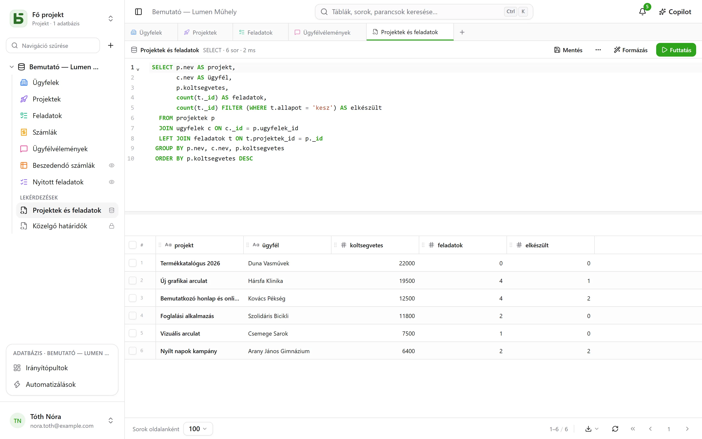
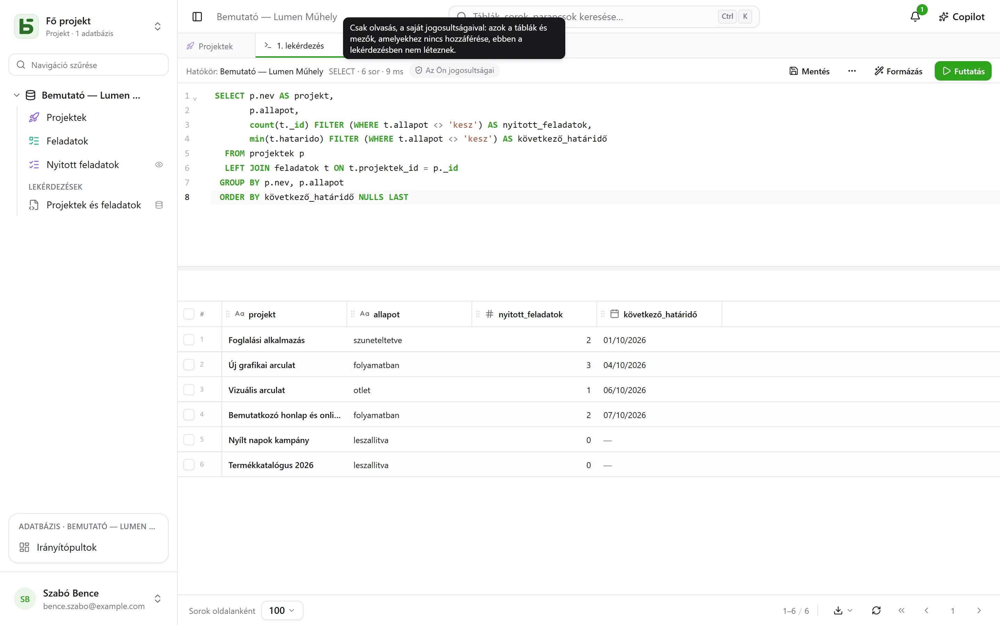
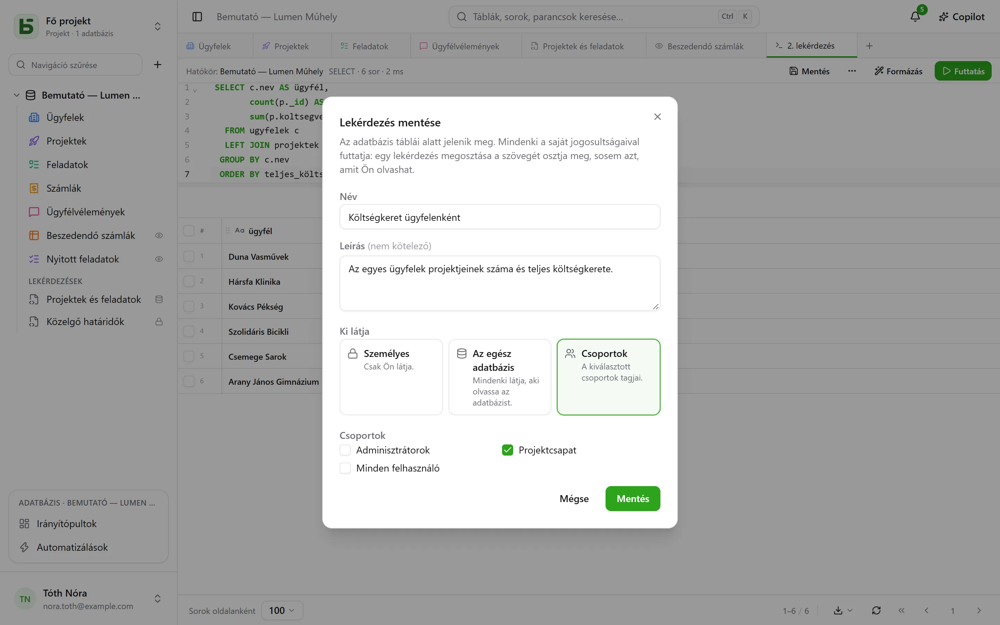
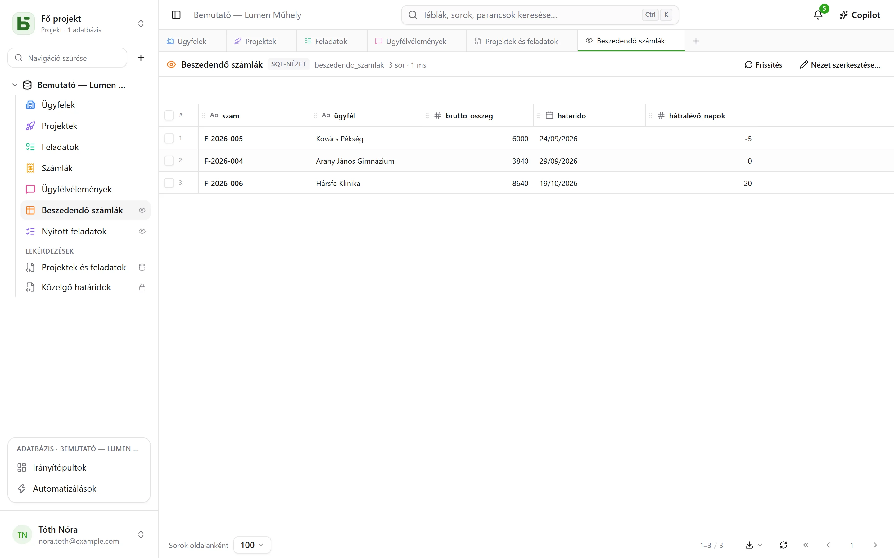
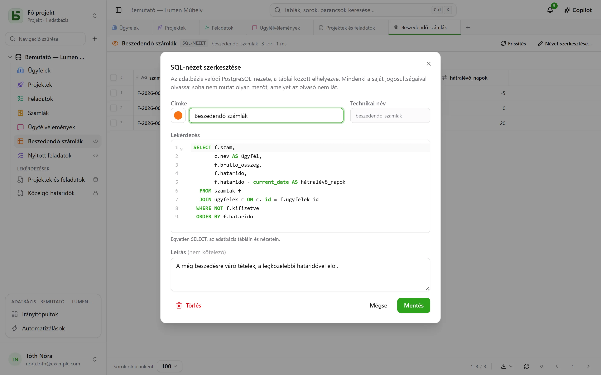

A táblái valódi PostgreSQL-táblák, és a felület SQL-ben, a valódi nevükön kérdezi le őket. Az
adatbázis minden tagja írhat lekérdezést, **mentheti** a táblák alá – csak magának, az egész
adatbázisnak vagy néhány csoportnak –, aki pedig kezeli az adatbázist, **SQL-nézetet** készíthet
belőle: egy valódi PostgreSQL-nézetet a táblák között elhelyezve, amelyet a `psql` és az Ön
eszközei is olvasnak.



## Mindenki a saját jogosultságaival

A lapsáv **+** gombja, vagy az adatbázis **⋯** menüje → **SQL-lekérdezés** megnyit egy
SQL-lapot: egy szerkesztőt szintaxiskiemeléssel és kódkiegészítéssel, a **Ctrl+Enter**
billentyűvel a futtatáshoz, és az eredményt ugyanabban a rácsban, mint a táblái. Hogy a
lekérdezés mit olvashat, az attól függ, ki futtatja:

- ha **Kezelés** szintje van az adatbázison, a teljes adatbázist, az írást is beleértve;
- **Olvasás** vagy **Szerkesztés** szinttel a lekérdezés **csak olvasási módban, az Ön saját
  jogosultságaival** fut. Az Ön számára hozzáférhetetlen tábla nem létezik a számára; az Ön elől
  elrejtett mező eltűnik a `SELECT *` eredményéből, és elutasításra kerül, ha megnevezi, még a
  tábla megadásával is; az írás elutasításra kerül. Az eredményen **Az Ön jogosultságai**
  címke látható.



Nem a képernyő válogat: maga a PostgreSQL alkalmazza a jogosultságait, oszlopról oszlopra, egy
Önhöz tartozó szerepkörön. Egy lekérdezés tehát semmi olyat nem mutathat, amit a rács, az API vagy
az MCP-szerver ne mutatna meg.

## Lekérdezés mentése

A lap sávjában lévő **Mentés** a lekérdezést az adatbázis táblái alá, a **Lekérdezések** rovatba
helyezi. Egy kattintással újra megnyitható; a **⋯** → **Mentés másként…** másolatot készít
róla, a **Név és megosztás…** (a lapon vagy az oldalsávbeli menüjében) átnevezi, módosítja, ki
látja, vagy törli – a **Törlés** jobb kattintással a menüjéből is elérhető. Az őt megjelenítő lap
megtartja a szövegét.



| Hatókör | Ki látja | Ki hozhatja létre és módosíthatja |
|---|---|---|
| **Személyes** – egy lakat | csak Ön | bárki, aki látja az adatbázist, saját magának |
| **Teljes adatbázis** | bárki, aki látja az adatbázist | **Kezelés** szint az adatbázison |
| **Csoportok** | a kiválasztott csoportok tagjai | **Kezelés** szint az adatbázison |

**Egy lekérdezés megosztása a szövegét osztja meg, soha nem azt, amit a szerzője olvashat.**
Mindenki a saját jogosultságaival futtatja: ugyanaz a lekérdezés, ha két személy nyitja meg,
mindkettőnek azt mutatja, amit látni jogosult – vagy közli vele, hogy egy oszlop az ő számára nem
létezik.

Az oldalsávból megnyitott lekérdezés **azonnal lefut, csak olvasási módban**: úgy látja az
eredményét, hogy semmit nem kellett eldöntenie. A **Futtatás** ezután változatlanul újra
lefuttatja. A neve melletti pont jelzi, hogy a mentés óta módosította a szövegét; a **Mentés**
elmenti, ha módosíthatja, ellenkező esetben pedig felajánlja, hogy újat készítsen belőle.

## Az SQL-nézetek

Az **SQL-nézet** az adatbázis sémájának egy valódi PostgreSQL-nézete. **A táblák között**
kap helyet, egy táblához hasonlóan saját színnel és ikonnal, és jobb oldalt egy kis **szemmel**,
amely jelzi, hogy nézetről van szó. Egy kattintással megnyílik egy lapon: a sorai a rácsban, a
**Frissítés** gombbal újraolvashatók.



Az adatbázis **⋯** menüje → **Új SQL-nézet…** menüponttal hozható létre, vagy egy SQL-lapról:
**⋯** → **SQL-nézet létrehozása…**, és a lap lekérdezése lesz a definíciója. A
párbeszédablak a következőket kéri:

- a **címkéjét** és a **megjelenését** – szín, ikon vagy kép, ugyanúgy választva, mint egy
  táblánál;
- a **technikai nevét**, amely a címkéből képződik, ha nem ad meg ilyet – ezt kell a `FROM` után
  írni;
- a **lekérdezését**: egyetlen `SELECT` az adatbázis tábláin és más nézetein. Amit a PostgreSQL
  elutasít, azt elutasítja, és a szerkesztő megmutatja a hely.



A nézet ezután a nevén olvasható, a felületről ugyanúgy, mint a `psql`-ből vagy a BI-eszközéből:

```sql
SELECT * FROM b_t4z56fq_demo_atelier_lumen.factures_a_encaisser;
```

**Egy nézet soha nem mutat meg olyan mezőt, amelyet az olvasó nem lát.** Mindenki a saját
jogosultságaival olvassa, minden olyan táblán és oszlopon, amelyet a nézet olvas; az oldalsáv
csak annak listázza, aki mindent olvashat abból, amit a nézet olvas. Csak a **saját**
adatbázisát olvassa: egy másik adatbázist vagy a basedb katalógusát már a létrehozáskor
elutasítja a rendszer. A létrehozásához, módosításához vagy törléséhez **Kezelés** szint
szükséges az adatbázison. A **Törlés**, az oldalsávbeli menüjében, mindenki számára megszünteti
azt – a szkripteket és az eszközöket is beleértve –; az általa olvasott táblákat nem érinti.

### Ha a struktúra változik

- Egy tábla vagy mező **átnevezése** nem teszi tönkre a nézetet: a PostgreSQL követi.
- Egy általa olvasott számított mező **képletének módosítása** egy pillanatra eltávolítja, majd
  az új oszlopra építve visszaállítja. Ha már nem állja meg a helyét, **javítandó** állapotban
  marad – ezt egy háromszög jelzi az oldalsávban –, a definíciója megőrzésével: **Nézet
  szerkesztése…**, javítsa ki, mentse.
- Egy tábla nem üríthető ki véglegesen, amíg egy nézet olvassa, és egy nézet nem törölhető, amíg
  egy másik nézet olvassa: az elutasítás megnevezi az érintett nézetet.

## Lekérdezés, SQL-nézet vagy kérdés?

| | Mi ez | Hol található | Mire való |
|---|---|---|---|
| **Mentett lekérdezés** | egy SQL-szöveg | a táblák alatt, a „Lekérdezések” rovatban | egy lekérdezés újbóli megtalálására, szövegként való megosztására |
| **SQL-nézet** | egy valódi PostgreSQL-nézet | a táblák között | hogy nevet adjon egy olvasásnak, a felület **és** a `psql`, a szkriptjei, az eszközei számára |
| **Kérdés** | egérrel vagy SQL-ben összeállított olvasás és a vizualizációja | az [irányítópultokon](/basedb/hu/fonctionnalites/tableaux-de-bord/) | egy szám, egy diagram, egy kereszttábla, szűrők alatt |

## Korlátok

- A rács legfeljebb a képernyő alján választott **sor oldalanként** számot mutatja; a „csonkolva”
  felirat ezt jelzi. Egy lekérdezés 15 másodperc után leáll.
- Az SQL-nézet SQL-ben és a felületen olvasható; a REST API és az MCP-szerver nem teszi
  elérhetővé.
- Az SQL-nézet abban a környezetben marad, amelyben létrehozták: egy környezet létrehozása, a
  struktúra összehasonlítása vagy egy sablon mentése egyelőre nem viszi magával.
