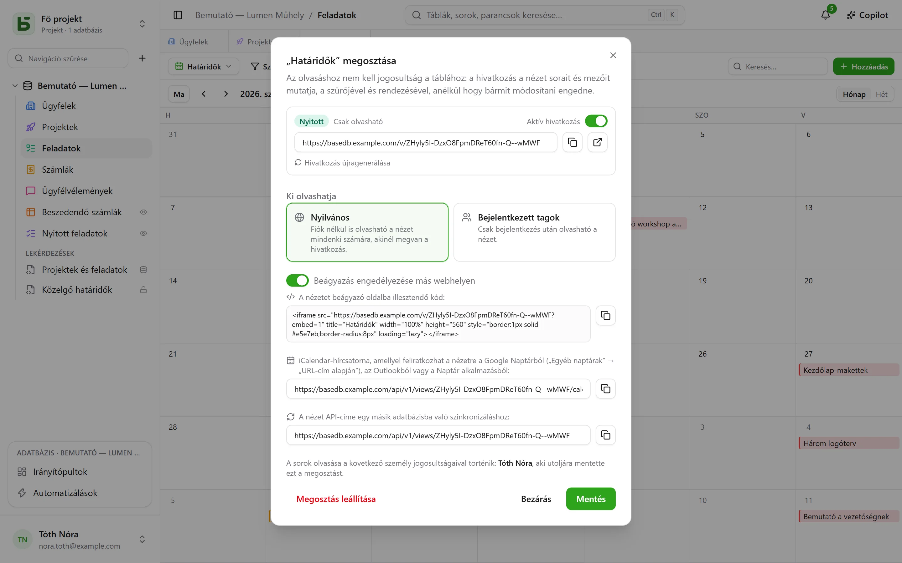
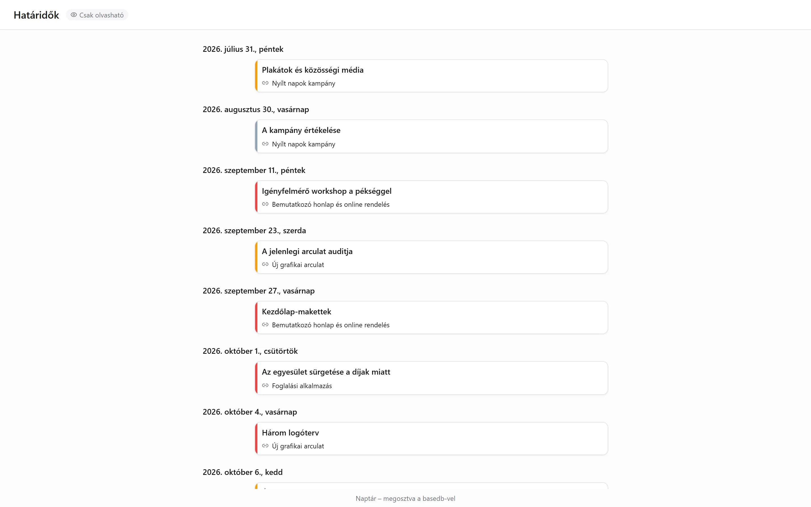

Egy adatnézet – rács, kanban, naptár, idővonal, galéria, lista – **csak olvasható módon
osztható meg**: egy `/v/<jeton>` hivatkozás megmutatja annak, aki nem tudja megnyitni a
basedb-t, anélkül, hogy bármit írni engedne. Ez a [megosztott űrlapok](/basedb/hu/fonctionnalites/formulaires-partages/)
párja, amelyek válaszolni engednek, de olvasni semmit. Egy [irányítópult](/basedb/hu/fonctionnalites/tableaux-de-bord/#irányítópult-megosztása)
ugyanígy osztható meg.

## Megosztás

A nézet menüje → **Megosztás…**, majd:

| Hozzáférés | Ki olvashatja |
|---|---|
| **Nyilvános** | bárki, akinek megvan a hivatkozás, fiók nélkül |
| **Bejelentkezett tagok** | a munkaterület egy tagja, bejelentkezés után – szükség esetén csak bizonyos csoportokból |

Az **Aktív hivatkozás** kapcsoló felfüggeszti a hivatkozást anélkül, hogy elveszne. Az oldal az
alkalmazáson kívül nyílik meg: se oldalsáv, se adatbázisnév, se táblanév – csak a nézet, a
szűrői, az oszlopai, és semmi más. Egy naptár vagy idővonal itt úgy olvasható, mint egy
naptáralkalmazás.

## Kinek a nevében történik az olvasás

A nézet **annak a személynek a jogosultságaival** olvasható, **aki közzétette**, és ezeket a
rendszer minden olvasáskor újra ellenőrzi: az előle elrejtett mező nem jelenik meg, és ha
elveszíti a hozzáférését a táblához, a hivatkozás semmit nem mutat többé.

## Beágyazás más webhelyre

Jelölje be a **Beágyazás engedélyezése más webhelyen** lehetőséget: a párbeszédablak egy
`<iframe>` **beágyazási kódot** ad, amelyet beilleszthet egy intranetbe, egy wikibe vagy egy
bemutatkozó webhelybe. E jelölőnégyzet nélkül az oldal nem hajlandó megjelenni egy másik
webhely keretében.

## Naptár a naptáralkalmazásában

**Nyilvánosan** megosztott naptár vagy idővonal esetén a párbeszédablak megadja a
**naptárcsatorna címét**: egy iCalendar-csatornát (`…/calendar.ics`, legfeljebb 1000
eseménnyel), amelyre a Google Naptár, az Outlook vagy az Apple Calendar feliratkozhat. A csapat
határidői mindenki naptárában megjelennek, és követik a táblát.

## Forrás más adatbázisok számára

A nyilvános hivatkozás a **nézet API-címét** is megadja: a nézet által mutatott sorokat,
JSON-ban. Egy [szinkronizált tábla](/basedb/hu/integrations/synchronisation/) – ezen a
példányon vagy egy másikon – forrásként használhatja.

## Korlátok

- Az olvasás címenként és hivatkozásonként percenként 120 kérésre korlátozott.
- Az űrlap nem osztható meg olvasásra: [válaszok fogadására](/basedb/hu/fonctionnalites/formulaires-partages/) osztható meg.
