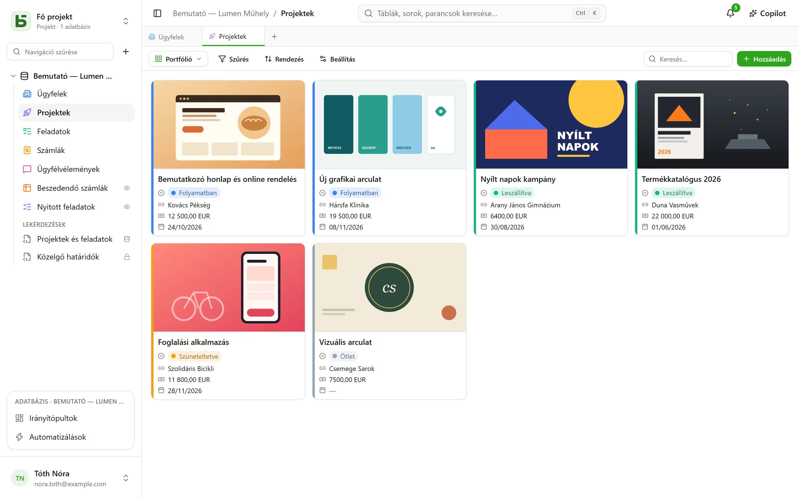
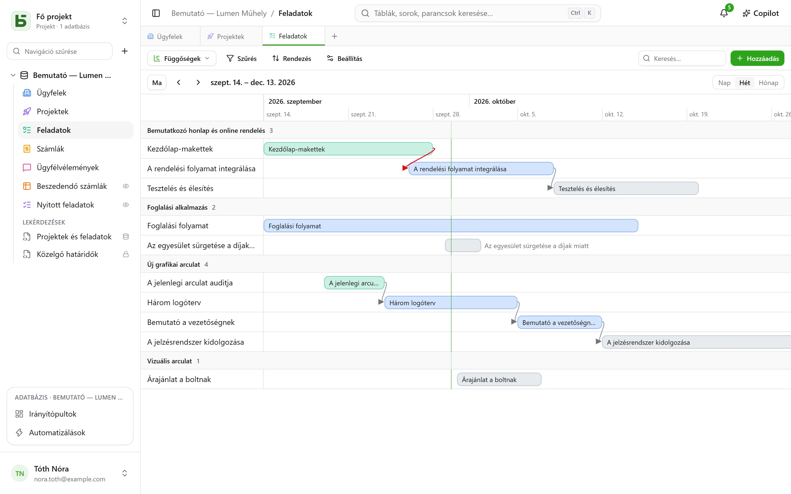
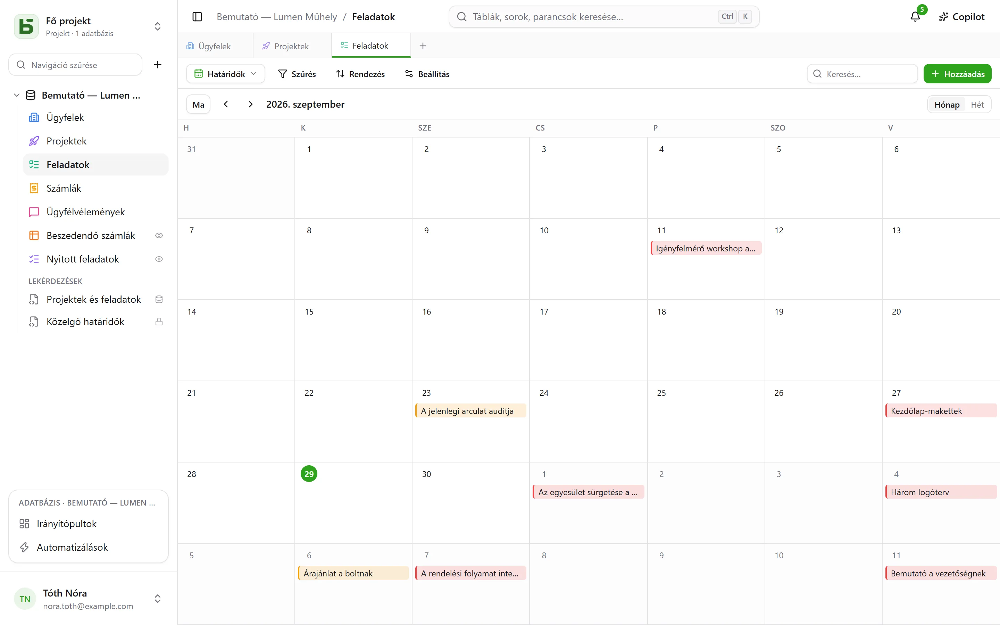
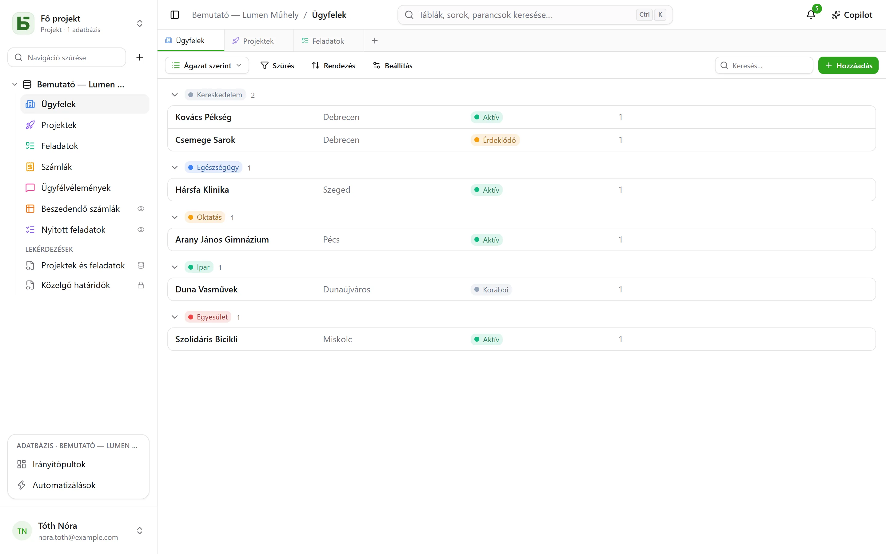

Egy tábla **tízféleképpen** jeleníthető meg. A nézet semmilyen adatot nem másol, és semmivel
sem ad több jogosultságot, mint maga a tábla.

:::note
Ezek a nézetek **egy** tábla megjelenítésének módjai. Az [SQL-nézet](/basedb/hu/fonctionnalites/requetes-et-vues-sql/)
más: valódi PostgreSQL-nézet, amelyet SQL-ben írnak az adatbázis tábláira, és az oldalsávban a
táblák között kap helyet.
:::

| Nézet | Mit mutat | Mire van szüksége |
|---|---|---|
| **Rács** | sorokat, szűrve, rendezve, csoportosítva, kiválasztott oszlopokkal | – |
| **Kanban** | kártyákat oszlopokban | egy egyszeres választás mezőre |
| **Naptár** | sorokat a dátumuknál, havi vagy heti nézetben | egy dátummezőre |
| **Idővonal** | sávokat két dátum között, és a függőségeiket | egy kezdő dátumra |
| **Galéria** | kártyákat borítóképpel | – |
| **Lista** | rekordonként egy sort, összecsukható csoportokban | – |
| **Térkép** | minden sort a térképre helyez | egy cím, vagy egy szélességi és hosszúsági fok |
| **Űrlap** | egy kérdésoldalt egy sor létrehozásához | – |
| **Kérdőív** | ugyanazokat a kérdéseket, képernyőnként egyet | – |
| **Kvíz** | pontozott kérdéseket, képernyőnként egyet, és a pontszámot a végén | – |

## A nézetválasztó

A „Szűrés” gombtól balra található. Az „Összes sor” a tábla rácsa, amelyet senki nem mentett, és
senki nem is törölhet; ezt követik a **közös nézetek**, abban a sorrendben, amelyet az
adatbázis felépítője választott, majd a **Saját nézetek**. Alul a **Nézet létrehozása** a tíz
fajtát két családra osztja: azokra, amelyek **megjelenítik a sorokat**, és azokra, amelyek
**válaszokat gyűjtenek** (űrlap, kérdőív, kvíz).

- A **közös nézetet** mindenki látja. A létrehozásához, beállításához, átnevezéséhez,
  átrendezéséhez vagy törléséhez **Kezelés** szint szükséges. **Zárolható** is: ezt egy lakat
  jelzi, és senki nem módosíthatja, amíg fel nem oldja a zárolást.
- A **személyes nézetet** csak Ön látja, és csak a tábla olvasásának jogát igényli.
  **Személyes nézet létrehozása**, vagy szűrés és rendezés után **Mentés nézetként**: mindenki
  elmentheti a saját olvasási módjait anélkül, hogy a többiek számára bármit megváltoztatna. Egy
  közös nézet **duplikálása** személyes másolatot készít belőle.

## Az eszköztár

A rács fölött, ebben a sorrendben:

- a **Szűrés** mezőnkénti feltételeket kombinál;
- az **Oszlopok** kiválasztja, mi jelenjen meg – a rendszeroszlopok külön, a
  „Rendszerinformációk” alatt találhatók;
- a **Csoportosítás** egyetlen értékű mező – egyszeres választás, kapcsolat, személy, dátum,
  szám, szöveg, jelölőnégyzet… – szerint rendezi a sorokat összecsukható csoportokba, mindegyiket
  a teljes szűrésre vonatkozó darabszámmal;
- a **Színek** egy egyszeres választás mező szerint, vagy **szabályok** – egy szűrő és egy szín,
  legfeljebb húsz – szerint színezi a sorokat, csíkkal, háttérrel vagy mindkettővel;
- **Sormagasság**: alacsony, közepes, magas, nagyon magas;
- a jobb oldalon lévő **Keresés…** gépelés közben minden oszlopban keres; az Esc törli a
  keresést. A kanbanra, a naptárra, az idővonalra, a galériára és a listára is érvényes, és
  soha nem kerül mentésre a nézetben.

Minden oszlop alatt egy **Összesítés**, amely a szűrés összes sorára számítódik, nem csak az
oldalra: kitöltött, üres, egyedi értékek, összeg, átlag, minimum, maximum, bejelölt négyzetek.

## Kanban, naptár, idővonal

- A **kanban** egy egyszeres választás mező szerint rendezi a kártyákat; egy kártya áthúzása
  módosítja a sort, az oszlop tetején lévő „+” pedig olyan sort hoz létre, amelyben már ez a
  választás szerepel. Minden kártya egy címet, egy borítóképet, a kiválasztott mezőket és egy
  **leírást** mutat, amely a sor értékeire hivatkozik – „A szállítás várható időpontja:
  `{{Date}}`, ügyfél: `{{Client}}`” –, és amelyet a nézet beállításaiban lehet megírni a **Mező
  beszúrása** gombbal.
- A **naptár** minden sort a dátumához helyez, egy esetleges záró dátummal; ha egy sort egyik
  napról a másikra húz, áthelyeződik.
- Az **idővonal** sávokat rajzol egy kezdő és egy záró dátum közé, egyszeres választás vagy
  kapcsolat szerint csoportosítva. A **Függőség** beállítással – a tábla önmagára mutató
  kapcsolatával – egy nyíl köti össze az egyes feladatokat azokkal, amelyektől függenek, és
  piros, ha visszafelé mutat az időben.

## Galéria és lista

- A **galéria** kártyákat mutat: egy **borítóképet** (vágva vagy teljes egészében), egy méretet
  (kis, közepes, nagy kártyák), egy egyszeres választás mező szerinti színt.
- A **lista** rekordonként egy sort mutat, egyszeres választás, kapcsolat vagy személy szerint
  **csoportosítva**.

A kanbanban, a galériában és a listában a kártyák és a sorok **kézzel rendezhetők** áthúzással
– legfeljebb 5000; a választott rendezés elsőbbséget élvez ezzel a sorrenddel szemben.

## Térkép

A **térkép** minden sort a saját helyére tesz, ez alapján:

- egy **cím** – egy rövid szöveg, lehetőleg **Cím** formátumban (lásd:
  [Táblák és mezők](/basedb/hu/fonctionnalites/tables-et-champs/)): „12 rue des Lilas, Lyon”;
- vagy egy **szélességi** és egy **hosszúsági fok**, két számmező, változatlanul elhelyezve.

Egy tű a **színét** egy egyszeres választás mezőtől kapja, rámutatáskor megjeleníti a sor
**cím**ét, és kattintásra megnyitja a sor részleteit. A térkép követi a nézet szűrőjét és
rendezését, legfeljebb 2000 sorig.

Egy címet a példány geokódolási szolgáltatása **egyszer és mindenkorra behatárol** –
alapértelmezés szerint az OpenStreetMapé –, az általa megszabott ütemben: egy új térképen a
tűk a válaszok érkezésével jelennek meg, körülbelül másodpercenként egy, majd a következő
alkalmakkor azonnal. Egy jelvény számolja az elhelyezett sorokat, a még behatárolandó címeket
és azokat, amelyeket nem lehetett behatárolni: egy nem található cím pontosításra vár (város,
irányítószám), soha nem kerül csendben félretéve.

:::note[Amit a szerver elhagy]
A címek szövege a geokódolási szolgáltatáshoz megy, és minden olvasó böngészője a térkép
alapját a csempeszerverről tölti be. A példány üzemeltetője más szolgáltatásokat is
választhat, vagy egyiket sem akarhatja: lásd:
[Környezeti változók](/basedb/hu/hebergement/variables/#térképek-és-címek).
:::

## Űrlap és kérdőív

Bejelöli a kérdéseket, és sorba rendezi őket; mindegyiknek van felirata, súgója, egy
válaszpéldája, és kötelezővé tehető. Az űrlapnak van címe, bemutatkozó szövege, gombfelirata és
köszönőüzenete. A basedb-ben tölthető ki, vagy [hivatkozással osztható meg](/basedb/hu/fonctionnalites/formulaires-partages/).

Kezdéshez semmit nem kell beállítani: egy új űrlap azt kérdezi, amit egy személy válaszol – nem az
állapotot, a hozzárendelt személyt vagy a kapcsolatokat, amelyeket a csapat később tölt ki, kivéve
ha kötelezők –, a táblája színét és egy világos témát visel, és minden üres mező egy hozzáillő
példát mutat. Minden más bármikor megváltoztatható:

- **Megjelenés**: nyolc téma – Világos, Lágy, Hajnal, Óceán, Erdő, Éjszaka, Papír, Minimalista –, egy
  kiemelőszín, egy betűtípus, bal oldali vagy középre igazított igazítás;
- **Előre kitöltés a mai dátummal**: a dátumkérdés már a mai nappal kitöltve érkezik – dátum és
  idő esetén az időponttal is –, amelyet a kitöltő megtart vagy módosít;
- **Feltétel hozzáadása…**: egy kérdés csak akkor jelenik meg, ha egy korábbi válasz ezt
  megkívánja („A hangulat Negatív”, „Az értékelés legfeljebb 2”). Egy elrejtett kérdés se nem
  kötelező, se nem kerül elküldésre;
- **További beállítások**: az üdvözlő és a beküldés gombok, a számozás, a folyamatjelző sáv, az
  automatikus továbblépés, az üzenet és egy záró gomb („Vissza a webhelyre”), a konfetti.

A **kérdőív** az egész képernyőt kitölti: egy üdvözlés, amely elmondja, mennyi ideig tart, majd
egyszerre egy kérdés, amely becsúszva jelenik meg. Mindent billentyűzettel is el lehet végezni:
**Enter** a továbblépéshez, az **A**, **B**, **C**… betűk egy választáshoz, **I** vagy **N** az
igenhez vagy nemhez, a számok egy értékeléshez – egy egyszeres választás önmagában továbblép a
következő kérdésre. A beküldést ünneplés kíséri: egy kirajzolódó pipa és az űrlap színeiben
pattogó konfetti.

## Kvíz

A kvíz olyan kérdőív, amely pontokat számol. Minden kérdés alatt megadható a **helyes válasz**,
és hogy mennyit ér – **1 pont**, ha nincs megadva, legfeljebb 100:

| Kérdés | Helyes válasz |
|---|---|
| egyszeres választás | egy választás |
| többszörös választás | a bejelölendő választások – mind, és csak azok |
| jelölőnégyzet | igen vagy nem |
| szám, értékelés | egy szám |
| dátum | egy nap |
| rövid szöveg, e-mail, URL | egy vagy több elfogadott válasz, `;`-vel elválasztva – a nagybetűket és az ékezeteket figyelmen kívül hagyva |

A helyes válasz nélküli kérdés – egy keresztnév, egy megjegyzés – pontozás nélkül tehető fel. A
kvíz létrehozásához legalább egy pontozott kérdés szükséges.

A **Pontozás** szakasz szabályozza a többit:

- **Javítás**: **minden kérdés után** – a válasz azonnal ellenőrződik, zölden, vagy pirosan a
  helyes válasszal, és a pontszám nő a képernyő tetején –, **a végén** – először a pontszám,
  majd a javítás –, vagy **soha** – csak a pontszám, a helyes válaszok titokban maradnak;
- **Teljesítési küszöb**: a pontok százaléka; a záróképernyő ekkor azt mondja: „Teljesítve!”
  vagy „Ezúttal nem sikerült…”;
- **Pontszám mentése**: a tábla egy számmezője, amely megkapja minden válasz pontszámát.
  Rendezze a rácsot eszerint: ez a ranglista. Az automatikusan kiválasztott mező neve „Score”,
  „Points” vagy „Note”.

A záróképernyő egy megtelő gyűrűben mutatja a pontszámot, a százalékot, majd – a „soha”
kivételével – minden pontozott kérdést az adott válasszal és a helyes válasszal együtt. Az a
kérdés, amelyet egy korábbi válasz elrejtett, nem számít bele az összesenbe.

:::note
Az alkalmazásban, aki a nézetet olvashatja, a helyes válaszokat is olvashatja. Egy [megosztott
hivatkozáson](/basedb/hu/fonctionnalites/formulaires-partages/#megosztott-kvíz) keresztül azok
soha nem hagyják el a szervert: a szerver javít és számol.
:::

## Nézet megosztása

Egy adatnézet – rács, kanban, naptár, idővonal, galéria, lista – **csak olvasható módon
osztható meg** hivatkozással, beágyazható egy másik webhelybe, a naptárból pedig
naptárcsatorna lesz. Lásd: [Megosztott nézetek](/basedb/hu/fonctionnalites/vues-partagees/).

## Amit az olvasó nem lát

A nézet **az olvasójához igazítva jelenik meg**: az előle elrejtett mező eltűnik az oszlopokból,
a kártyákról és a kérdésekből. Az a nézet, amelynek szűrője egy elrejtett mezőre hivatkozik,
egyáltalán nem jelenik meg: ha a szűrője nélkül jelenne meg, többet mutatna, mint amennyit
megmutatni hivatott.
