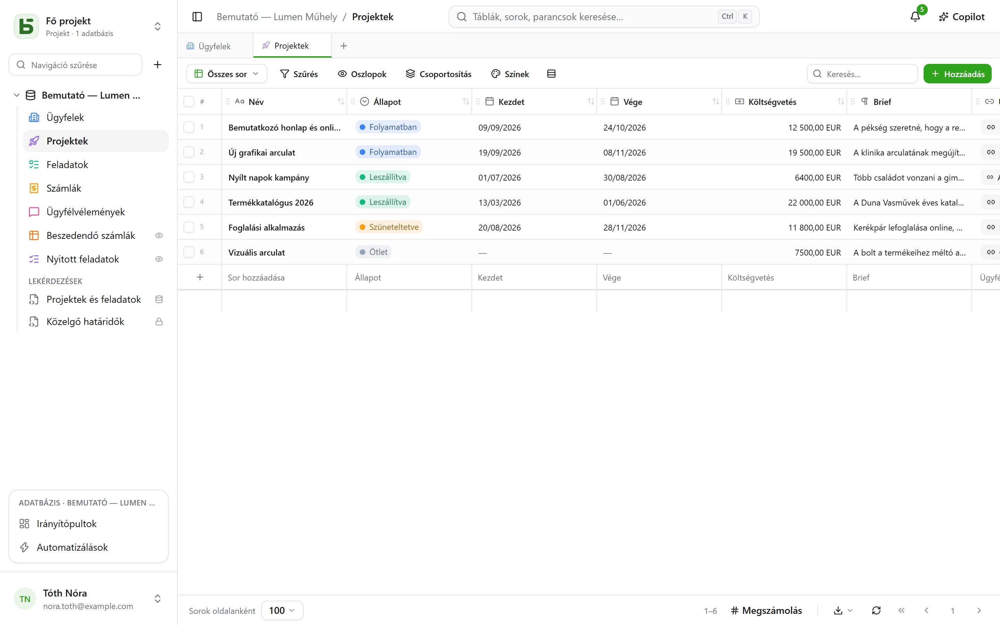

A **basedb** közös használatú adatbázis a közös táblázatkezelők szellemében, amelyet saját
maga üzemeltet – egy olyan különbséggel, amely minden mást meghatároz: **az adatai valódi
PostgreSQL-táblákban élnek**, típusosan és beszédes nevekkel.

## Egyszerű ígéret

Nincs általános modell, nincs mindent elnyelő `JSONB`, nincs `field_1837`:

| A basedb-ben | A PostgreSQL-ben |
|---|---|
| Egy „Ventes” nevű adatbázis | egy `b_t4z56fq_ventes` séma |
| Egy „Opportunités” nevű tábla | egy `opportunites` tábla |
| Egy „Échéance” nevű mező (Dátum) | egy `echeance date` oszlop |
| Egy „Statut” nevű egyszeres választás | egy `text` oszlop és a hozzá tartozó `CHECK` megszorítás |
| Egy „Client” nevű kapcsolat | egy `clients_id uuid` oszlop és a hozzá tartozó `FOREIGN KEY` |

Így megnyithatja a `psql`-t, egy BI-eszközt vagy egy Python-szkriptet, és a terméket
megkerülve olvashatja az adatait – sőt írhat is beléjük: a megszorítások érvényben maradnak,
és az előzmények rögzítik az írást.

## Kinek szól?

- **Az üzleti csapatoknak**, akik rácsot, nézeteket és űrlapokat szeretnének anélkül, hogy
  egy fejlesztésre kellene várniuk.
- **A technikai csapatoknak**, akik nem akarják, hogy az adataik egy zárt formátumba
  legyenek bezárva, és a megszokott eszközeiket szeretnék rákötni.
- **Az MI-ügynököknek**, amelyek MCP-szervert, egyértelmű jogosultságokat és egy ember elé
  kerülő javaslatokat találnak.

## Mit talál benne?

- Típusos [táblák és mezők](/basedb/hu/fonctionnalites/tables-et-champs/), kapcsolatok,
  amelyek valódi idegen kulcsok – vagy többszörösek –, a PostgreSQL által számított képletek,
  kikeresések és aggregálások a kapcsolatokon keresztül.
- Tíz [nézet](/basedb/hu/fonctionnalites/vues/): rács, kanban, naptár, idővonal,
  galéria, lista, térkép, űrlap, kérdőív, kvíz – közös vagy személyes.
- Hivatkozással megosztott [űrlapok](/basedb/hu/fonctionnalites/formulaires-partages/) és
  [nézetek](/basedb/hu/fonctionnalites/vues-partagees/), valamint naptárak, amelyekre egy
  naptáralkalmazásból fel lehet iratkozni.
- [Együttműködés](/basedb/hu/fonctionnalites/collaboration/): megjegyzések és említések,
  értesítések, valós idejű frissítések.
- [Automatizálások](/basedb/hu/fonctionnalites/automatisations/) és
  [irányítópultok](/basedb/hu/fonctionnalites/tableaux-de-bord/) a kérdéseikkel, egérrel vagy SQL-ben összeállítva.
- [SQL mindenkinek](/basedb/hu/fonctionnalites/requetes-et-vues-sql/), mindenki a saját
  jogosultságaival: a táblák alatt mentett lekérdezések, és közöttük elhelyezett valódi
  PostgreSQL-nézetek.
- [Adatbázissablonok](/basedb/hu/fonctionnalites/modeles/), galériából választva vagy az
  MI-től kérve.
- [Környezetek](/basedb/hu/fonctionnalites/environnements/) – éles, teszt –, amelyeket
  összehasonlíthat és migrálhat.
- Minden írás [előzményei](/basedb/hu/fonctionnalites/historique/), a közvetlen SQL-t is
  beleértve, és Ctrl+Z a visszavonáshoz.
- Csoportonkénti [jogosultságok](/basedb/hu/fonctionnalites/droits/), egészen mezőszintig.
- [REST API](/basedb/hu/integrations/api-rest/), [MCP-szerver](/basedb/hu/integrations/mcp/),
  [webhookok](/basedb/hu/integrations/webhooks/), Slack és
  [szinkronizált táblák](/basedb/hu/integrations/synchronisation/).
- Opcionális [MI](/basedb/hu/fonctionnalites/ia/): modell által számított mezők, Copilot.

## A projekt állapota

A basedb szabad szoftver (AGPL-3.0), amelyet az [Eodia](https://eodia.com/fr/), egy MI-natív
szoftverstúdió fejleszt, és aktív fejlesztés alatt áll. A mag, az API, az MCP-szerver és a
felület működik, és több mint ezer teszt fedi le őket; a
[fejlesztési ütemterv](/basedb/hu/feuille-de-route/) megmutatja, mi van még hátra. Az
[architektúra-dokumentuma](https://github.com/eodia/basedb/tree/main/docs/architecture) –
mintegy húsz fejezet – minden döntést rögzít.

:::tip[Kipróbálás]
A tároló klónozása után egyetlen parancs elég: `docker compose up -d`. Lásd:
[Telepítés](/basedb/hu/guides/installation/).
:::
