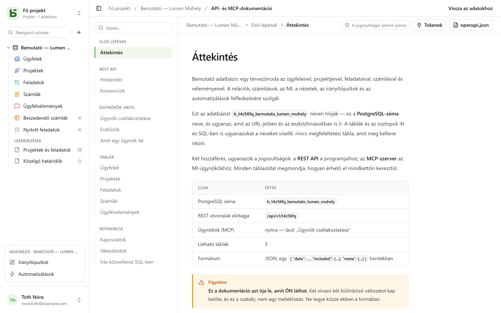

A REST API ugyanaz, amelyet a felület is használ: **nincs privát útvonal**. Az URL-jei a
fizikai neveket tartalmazzák – ugyanazokat, amelyeket SQL-ben is olvas.

```text
/api/v1/<tenant>/data/<base>/<table>
/api/v1/t4z56fq/data/b_t4z56fq_ventes/opportunites
```

## Token

A felületen az adatbázis **⋯** menüje → **API és ügynökök** → **API- és MCP-tokenek…**: itt hozhat
létre egy erre az adatbázisra korlátozott, alapértelmezés szerint csak olvasási **integrációs
tokent**, miután megerősítette a jelszavát. Csak egyszer jelenik meg; helyezze el egy környezeti
változóban.

Egy token olvas, és ha írási joggal hozták létre, létrehoz és módosít, de **soha nem töröl**, és
soha nincs több jogosultsága, mint annak a személynek, aki létrehozta.

```bash
export BASEDB_TOKEN=bdb_…
curl "http://localhost:3000/api/v1/t4z56fq/data/b_t4z56fq_ventes/opportunites?limit=20" \
  -H "Authorization: Bearer $BASEDB_TOKEN"
```

## Olvasás

| Paraméter | Szerep |
|---|---|
| `filter` | olvasható kifejezés: `statut eq "gagne" and montant gte 10000` |
| `sort` | `-montant,nom` |
| `fields` | a visszaadandó oszlopok |
| `limit`, `after` | lapozás titkosított kurzorral: egy oldal `meta.next_cursor` értékét `after`-ként átadva megkapja a következőt (`meta.has_next_page`) |
| `links=display` | a kapcsolatok a megjelenítési értékükkel |
| `count=exact` | a teljes darabszám, legfeljebb 100 000 |
| `variables=raw` | a hosszú szövegek úgy, ahogy le vannak írva, a `{{colonne}}` hivatkozásokkal együtt, nem pedig [a sor értékeivel](/basedb/hu/fonctionnalites/tables-et-champs/#formázott-szöveg-és-változók) |

Az operátorok: `eq`, `ne`, `eq_ci`, `contains`, `starts_with`, `ends_with`, `in`, `is_null`,
`gt`, `gte`, `lt`, `lte`, `between`, amelyek az `and`, `or`, `not` operátorokkal és zárójelekkel
kombinálhatók. A szűrő áthalad egy kapcsolaton: `clients_id.ville eq "Lyon"`.

## Írás

```bash
curl -X POST "http://localhost:3000/api/v1/t4z56fq/data/b_t4z56fq_ventes/opportunites" \
  -H "Authorization: Bearer $BASEDB_TOKEN" -H "content-type: application/json" \
  -d '{"values": {"nom": "Audit RGPD", "statut": "nouveau", "montant": 12000}}'
```

A `PATCH …/<table>/<_id>` ugyanazzal a `{"values": {…}}` törzzsel módosít egy sort. A hibák
egységes formájúak: `{ "code": "…", "details": {…}, "request_id": "…" }`, okonként stabil
kóddal.

Minden írás visszaadja az `x-basedb-transaction` fejlécet: ha ezt átadja a
`POST /api/v1/<tenant>/history/undo` végpontnak (`{"transaction": "…"}`), az visszavonja az
írást, ahogy a Ctrl+Z a felületen – és elutasítja, ha a sort azóta módosították.

## A sorokon túl

Ugyanazzal a tokennel:

| Útvonal | Szerep |
|---|---|
| `GET …/data/<base>/<table>/aggregate` | összesítések egy szűrő összes során: `aggregates=montant:sum,nom:filled`, `group=statut` |
| `GET …/data/<base>/<table>/<_id>/comments`, `POST` | egy sor megjegyzéseinek olvasása és írása |
| `POST /api/v1/<tenant>/automations/<id>/run` | gombbal kiváltott automatizálás indítása egy soron (`{"record": "…"}`) |
| `GET /api/v1/<tenant>/meta/bases/<base>/dashboards` | egy adatbázis irányítópultjai |
| `GET /api/v1/<tenant>/meta/users` | a munkaterület tagjai, egy Személy mezőhöz |
| `GET /api/v1/<tenant>/meta/templates` | a galéria adatbázissablonjai |

A [megosztott nézetek](/basedb/hu/fonctionnalites/vues-partagees/) fiók nélkül olvashatók:
`GET /api/v1/views/<jeton>` és `…/rows` JSON-ban, `…/calendar.ics` iCalendar formátumban.

Az építés – automatizálás, irányítópult, integráció létrehozása – a felületen nyitott
munkamenetnek van fenntartva: egy token sorokat olvas és ír, az adatbázist nem változtatja meg.

## A generált dokumentáció

Minden adatbázisnak van egy **API- és MCP-dokumentáció** oldala: minden táblához a végpontjai,
az oszlopai, cURL- és JavaScript-példák. **Az Ön jogosultságai szerint szűrt** – két olvasó
két különböző változatot kap –, **az Ön képernyőjének nyelvén** íródik, és OpenAPI 3.1
formátumban is elérhető (`/api/v1/<tenant>/meta/bases/<base>/openapi.json`). A nevek, az
útvonalak és a hibakódok minden nyelven ugyanazok maradnak.


