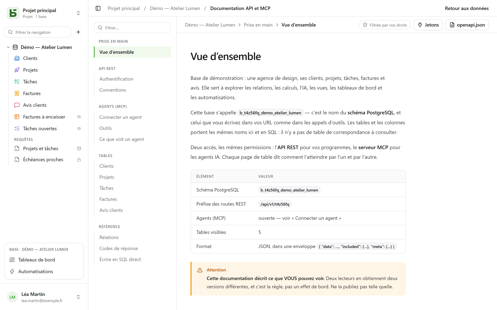

L’API REST est la même que celle qu’utilise l’interface : **il n’existe pas de route privée**.
Ses URL portent les noms physiques — ceux que vous lisez aussi en SQL.

```text
/api/v1/<tenant>/data/<base>/<table>
/api/v1/t4z56fq/data/b_t4z56fq_ventes/opportunites
```

## Un jeton

Dans l’interface, menu **⋯** de la base → **API et agents** → **Jetons API et MCP…** : qui a le
niveau **Gestion** sur la base, ou sur son projet, y crée un **jeton d’intégration** limité à cette
base — tous ses environnements, ou un seul —, en lecture seule par défaut, après avoir confirmé son
mot de passe — un compte qui se connecte par un fournisseur d’identité, sans mot de passe, ne le peut
pas encore. Il n’est affiché qu’une fois ; placez-le dans une variable d’environnement.

Un jeton lit ; il crée et modifie s’il a été créé en écriture, et **supprime s’il a été créé pour
cela** — droits « Lecture, écriture et suppression », sauf une ligne qu’une relation en cascade
emporterait avec d’autres. Il n’a jamais plus de droits que la personne qui l’a créé.

```bash
export BASEDB_TOKEN=bdb_…
curl "http://localhost:3000/api/v1/t4z56fq/data/b_t4z56fq_ventes/opportunites?limit=20" \
  -H "Authorization: Bearer $BASEDB_TOKEN"
```

## Choisir l’environnement

Une base qui a plusieurs [environnements](/basedb/fonctionnalites/environnements/) — production,
recette… — reste **une** base pour un jeton créé pour toute la base. Le chemin nomme la base par le
nom de sa production, et l’en-tête `X-Basedb-Environment` choisit l’environnement :

```bash
curl "http://localhost:3000/api/v1/t4z56fq/data/b_t4z56fq_ventes/opportunites" \
  -H "Authorization: Bearer $BASEDB_TOKEN" \
  -H "X-Basedb-Environment: recette"
```

- Sans l’en-tête, c’est l’environnement que nomme le chemin : `b_t4z56fq_ventes` est la production,
  `b_t4z56fq_ventes_recette` la recette — les deux écritures restent valables.
- `?environment=recette` fait de même pour un client qui ne pose pas d’en-tête.
- Un environnement se nomme par son badge, sans tenir compte des majuscules ni des accents, ou par
  `production`. Un environnement que la base n’a pas répond `404`, comme toute ressource absente.
- `GET /api/v1/<tenant>/meta/bases` liste chaque environnement avec son bloc `environment`
  (`label`, `production`) ; avec l’en-tête, il ne liste que celui-là.

Un jeton limité à un seul environnement, à sa création, n’en ouvre aucun autre : l’en-tête n’y change
rien. Ses droits sont toujours recoupés, environnement par environnement, avec ceux de la personne qui
l’a créé.

## Lire

| Paramètre | Rôle |
|---|---|
| `filter` | une expression lisible : `statut eq "gagne" and montant gte 10000` |
| `sort` | `-montant,nom` |
| `fields` | les colonnes à renvoyer |
| `limit`, `after` | pagination par curseur chiffré : `meta.next_cursor` d’une page, passé en `after`, donne la suivante (`meta.has_next_page`) |
| `links=display` | les relations avec leur valeur d’affichage |
| `count=exact` | le total, plafonné à 100 000 |
| `variables=raw` | les textes longs tels qu’écrits, `{{colonne}}` compris, plutôt qu’avec les [valeurs de la ligne](/basedb/fonctionnalites/tables-et-champs/#texte-riche-et-variables) |

Les opérateurs : `eq`, `ne`, `eq_ci`, `contains`, `starts_with`, `ends_with`, `in`, `is_null`,
`gt`, `gte`, `lt`, `lte`, `between`, combinés par `and`, `or`, `not` et des parenthèses. Un
filtre traverse une relation : `clients_id.ville eq "Lyon"`.

## Écrire

```bash
curl -X POST "http://localhost:3000/api/v1/t4z56fq/data/b_t4z56fq_ventes/opportunites" \
  -H "Authorization: Bearer $BASEDB_TOKEN" -H "content-type: application/json" \
  -d '{"values": {"nom": "Audit RGPD", "statut": "nouveau", "montant": 12000}}'
```

`PATCH …/<table>/<_id>` modifie une ligne avec le même corps `{"values": {…}}`. Les
erreurs ont une forme unique : `{ "code": "…", "details": {…}, "request_id": "…" }`, avec un
code stable par cause.

Chaque écriture renvoie l’en-tête `x-basedb-transaction` : le passer à
`POST /api/v1/<tenant>/history/undo` (`{"transaction": "…"}`) l’annule, comme Ctrl+Z dans
l’interface — refusé si la ligne a été modifiée depuis.

## Au-delà des lignes

Avec le même jeton :

| Route | Rôle |
|---|---|
| `GET …/data/<base>/<table>/aggregate` | des résumés sur toutes les lignes d’un filtre : `aggregates=montant:sum,nom:filled`, `group=statut` |
| `GET …/data/<base>/<table>/<_id>/comments`, `POST` | lire et écrire les commentaires d’une ligne |
| `POST /api/v1/<tenant>/automations/<id>/run` | lancer une automatisation déclenchée par un bouton, sur une ligne (`{"record": "…"}`) |
| `GET /api/v1/<tenant>/meta/bases/<base>/dashboards` | les tableaux de bord d’une base |
| `GET /api/v1/<tenant>/meta/users` | les membres de l’espace, pour un champ Personne |
| `GET /api/v1/<tenant>/meta/templates` | les modèles de base de la galerie |
| `GET /api/v1/<tenant>/events?base=<base>&table=<table>` | suivre une table en temps réel : des signaux, relus ensuite par les routes ci-dessus (voir [Webhooks](/basedb/integrations/webhooks/#sans-webhook--suivre-une-table)) |

Les [vues partagées](/basedb/fonctionnalites/vues-partagees/) se lisent sans compte :
`GET /api/v1/views/<jeton>` et `…/rows` en JSON, `…/calendar.ics` en iCalendar.

Construire — créer une automatisation, un tableau de bord, une intégration — reste réservé à
une session de l’interface : un jeton lit et écrit des lignes, il ne change pas la base.

## Couleurs et pictogrammes

Une table et chaque choix d’une liste de choix ont une couleur (`color`, `#rrggbb`) et un pictogramme
(`icon`, le nom d’une icône [Lucide](https://lucide.dev/icons/) que l’interface dessine : `truck`,
`circle-check`, `flame`…). `GET …/meta/bases/<base>` les rend pour la base, ses tables et les options
de ses champs.

Pour les choisir, avec le jeton d’accès d’une personne qui peut modifier la structure
(`POST /auth/session/access`) — un jeton d’intégration ne change pas la base :

| Route | Corps |
|---|---|
| `POST …/admin/bases/<base>/tables` | `{"label": "Tickets", "color": "#dc2626", "icon": "flame", "fields": […]}` |
| `PATCH …/admin/bases/<base>/tables/<table>` | `{"color": "#2563eb", "icon": "inbox"}` — les trois clés `color`, `icon`, `image` voyagent ensemble : en nommer une remplace les trois |
| `POST …/admin/bases/<base>/tables/<table>/fields` | `{"label": "Priorité", "kind": "select", "options": [{"value": "haute", "color": "#dc2626", "icon": "flame"}, …]}` |
| `PUT …/admin/bases/<base>/tables/<table>/fields/<champ>/options` | la liste entière des options, dans l’ordre, chacune avec sa couleur et son pictogramme |

Un agent passe par le [serveur MCP](/basedb/integrations/mcp/#couleurs-et-pictogrammes), où il
**propose** ces changements. Un champ n’a pas de pictogramme à choisir : l’interface dessine celui de
son type.

## Créer une base d’un modèle

Une application qui s’installe crée sa base en **un appel** : le serveur applique le modèle —
tables, champs, relations, lignes d’exemple, vues, tableaux de bord, automatisations — et, si
une étape échoue, ne laisse aucune base derrière lui.

```bash
curl -X POST "http://localhost:3000/api/v1/t4z56fq/admin/bases" \
  -H "Authorization: Bearer $ACCES" -H "content-type: application/json" \
  -d '{"template": "crm", "label": "Ventes", "rows": false}'
```

`template` est la clé d’un modèle de la galerie, ou un modèle entier au
[format des modèles](/basedb/fonctionnalites/modeles/). Avec l’en-tête
`Accept: application/x-ndjson`, la réponse arrive ligne à ligne : une ligne `{"step": …}` par
étape, puis la base créée. Cet appel demande le jeton d’accès d’une personne qui peut créer une
base (`POST /auth/session/access`, après connexion) : un jeton d’intégration n’ouvre qu’une base
existante.

## Vérifier un jeton

Les jetons de basedb ne se vérifient pas hors de basedb. Une application qui en reçoit un —
un outil ouvert depuis basedb avec le jeton de la personne, par exemple — demande ce qu’il vaut
(introspection, RFC 7662), avec son propre jeton d’intégration :

```bash
curl -X POST "http://localhost:3000/auth/introspect" \
  -H "Authorization: Bearer $BASEDB_TOKEN" \
  --data-urlencode "token=$JETON_RECU"
```

```json
{ "active": true, "token_type": "access_token",
  "sub": "0195a…", "email": "claire@example.com", "name": "Claire Martin",
  "tenant": "t4z56fq", "groups": ["Commerciaux"], "exp": 1790000000 }
```

Tout jeton qui ne vaut pas — inconnu, expiré, révoqué, session fermée, autre espace — répond
`{"active": false}`, sans dire pourquoi. La réponse est lue en direct : une déconnexion se voit
aussitôt. Pour un jeton d’intégration, la réponse dit aussi la base qu’il ouvre (`base`, sa
production), s’il en ouvre tous les environnements (`environments` : `all`) ou un seul (`one`), son
accès (`read`, `write` ou `delete`) et ses surfaces.

## La documentation générée

Chaque base a sa page **Documentation API et MCP** : pour chaque table, ses points d’accès, ses
colonnes, des exemples en cURL et en JavaScript. Elle est **filtrée par vos droits** — deux
lecteurs en obtiennent deux versions —, écrite **dans la langue de votre écran**, et existe aussi
en OpenAPI 3.1 (`/api/v1/<tenant>/meta/bases/<base>/openapi.json`), qui déclare le jeton Bearer et
l’en-tête `X-Basedb-Environment`. Les noms, les chemins et les codes d’erreur restent les mêmes dans
toutes les langues.


