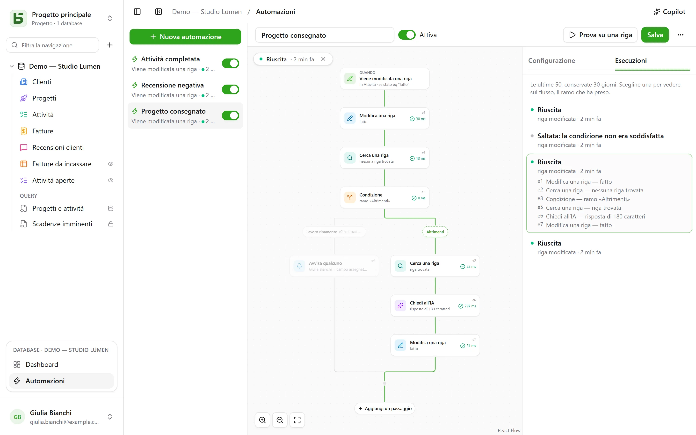

Un’automazione dice **quando**, **se** e **allora**: quando un’attività passa a «Fait», annotare
l’ora; quando arriva una recensione negativa, avvisare la responsabile e scrivere su Slack; ogni
lunedì alle 9, creare la riga della riunione di team. E quando un’azione non basta, segue un
**flusso**: cercare una riga, prendere un ramo o un altro in base a ciò che contiene, ripetere
passaggi su ogni riga che risponde a un filtro, riutilizzare in un passaggio ciò che un passaggio
precedente ha trovato o scritto, **attendere** tre giorni prima di un sollecito, inviare un
**PDF** in allegato.

Si aprono da **Automazioni**, nel riquadro del database aperto in fondo alla barra
laterale, e richiedono il livello **Gestione**.



## Il flusso

Il flusso si disegna dall’alto verso il basso: il trigger, poi ogni passaggio. Un **+** su un collegamento
apre l’elenco dei passaggi, raggruppati per categoria — Righe, Comunicare, Documenti, IA,
Logica — con una ricerca, e aggiunge quello scelto in quel punto; una scheda apre le sue
impostazioni a destra. Un’automazione
semplice — un trigger e un’azione — sta in due schede, e si configura come prima.

## Quando

| Trigger | Impostazioni |
|---|---|
| **Una riga viene creata** | la tabella |
| **Una riga viene modificata** | la tabella e, se serve, i soli campi da monitorare |
| **A orario fisso** | ogni ora, ogni giorno o ogni settimana, all’ora e nel fuso orario scelti |
| **Clic su un pulsante** | un [campo Pulsante](/basedb/it/fonctionnalites/tables-et-champs/#pulsante) della tabella |
| **Una riga viene eliminata** | la tabella; i passaggi citano la riga così com’era |
| **Una riga entra in un filtro** | la tabella e il filtro: l’automazione parte quando una riga vi entra, e riparte solo dopo che ne è uscita — «una fattura passa in ritardo», non «una fattura in ritardo viene modificata» |
| **Una data arriva** | un campo Data della tabella, uno scarto — tre giorni prima, lo stesso giorno, una settimana dopo — e l’ora: solleciti di scadenza, anniversari di contratto |
| **Un webhook viene ricevuto** | niente: l’automazione riceve un proprio indirizzo, che un altro software chiama ([dettagli](#un-servizio-che-chiama-basedb)) |

Un trigger sulle righe vede **tutte** le scritture: l’interfaccia, l’API, un agente, un
modulo condiviso, e persino l’SQL diretto — le automazioni partono dalla cronologia, che le
cattura tutte.

## Solo se

Una condizione facoltativa, nel [linguaggio dei filtri](/basedb/it/integrations/api-rest/#leggere) —
`statut eq "fait"`, `montant gte 10000 and payee eq false` — valutata sulla riga **al momento
di agire**. Un’esecuzione la cui condizione non è soddisfatta viene «scartata», e lo indica.

## Allora

Fino a quaranta passaggi, in ordine; il primo che fallisce ferma i successivi — tranne in un
blocco **Prova** ([dettagli](#prova)).

| Passaggio | Cosa fa |
|---|---|
| **Modifica una riga** | scrive valori nella riga che ha attivato il trigger — o in quella che un passaggio ha trovato o creato |
| **Crea una riga** | in questa tabella o in un’altra del database |
| **Cerca una riga** | la prima riga di una tabella che soddisfa un filtro, perché i passaggi successivi la citino o la modifichino |
| **Avvisa qualcuno** | una [notifica](/basedb/it/fonctionnalites/collaboration/#notifiche) a persone scelte, o a quella di un campo Persona |
| **Invia un’email** | a persone del team, a quella di un campo Persona, all’indirizzo di un campo E-mail — un cliente, un fornitore — o a indirizzi scritti; l’oggetto e il testo citano la riga e i passaggi precedenti |
| **Chiama un webhook** | una richiesta HTTPS verso un servizio — metodo, indirizzo, intestazioni e corpo a tua scelta ([dettagli](#chiamare-un-servizio)); la sua risposta si può poi citare |
| **Invia su Slack** | un messaggio in un canale [collegato](/basedb/it/integrations/synchronisation/#slack) |
| **Chiedi all’IA** | una risposta del [fornitore di IA](/basedb/it/fonctionnalites/ia/) a un’istruzione che cita la riga e i passaggi precedenti — redigere, riassumere, classificare —, letta come testo, numero, sì o no, data o scelta in un elenco |
| **Condizione** | più rami: viene preso il primo la cui condizione è soddisfatta, «Altrimenti» quando nessuna lo è; i rami poi si ricongiungono |
| **Per ogni riga** | i passaggi che contiene, una volta per ogni riga di una tabella che soddisfa un filtro ([dettagli](#per-ogni-riga)) |
| **Elimina una riga** | la riga che ha attivato il trigger, o quella che un passaggio ha trovato — va nel cestino |
| **Contare e sommare** | il numero di righe di un filtro, la loro somma, la loro media, il loro minimo o massimo, da citare o verificare in seguito |
| **Genera un PDF** | il [documento](/basedb/it/fonctionnalites/documents/) di una riga, salvato in un campo File o allegato a un’email |
| **Attendi** | una durata, oppure finché non arriva la data di un campo ([dettagli](#attendi)) |
| **Prova** | dei passaggi, e altri da eseguire se uno di essi fallisce ([dettagli](#prova)) |
| **Avvia un’automazione** | un’altra automazione del database, su una riga della sua tabella |

Una ricerca che non trova nulla non ferma il flusso: i passaggi che dovevano modificare la sua
riga vengono saltati. Per fare altro in questo caso, **Se non viene trovata nessuna riga…**,
sotto la ricerca, aggiunge una condizione che lo verifica.

Una **condizione** verifica una riga con un filtro, oppure un **valore**: la risposta dell’IA, il
codice di un webhook, un totale — «`{{e2.reponse}}` è uguale a Urgente», «`{{e3.somme.montant}}`
è maggiore o uguale a 1000». I numeri si confrontano come numeri, i testi senza accenti né
maiuscole.

## Per ogni riga

Il passaggio **Per ogni riga** legge le righe di una tabella che soddisfano il suo filtro — vuoto:
tutte —, nell’ordine scelto, fino al suo limite (50 per impostazione predefinita, 200 al massimo), poi esegue
una volta per ciascuna i passaggi posti nel suo riquadro. «Ogni lunedì, sollecitare le fatture
non pagate» si scrive così: **A orario fisso**, poi **Per ogni riga** delle fatture
`payee eq false and relancee eq false`, e nel ciclo un’email al contatto della fattura
e **Modifica una riga** che spunta «Relancée».

Nel ciclo, l’identificativo del passaggio nomina la **riga del giro**: `{{e1.client}}` la cita,
e **Modifica una riga** la propone tra le righe da modificare. Dopo il ciclo,
`{{e1.nombre}}` indica quante righe ha percorso — per un riepilogo su Slack, ad
esempio. Il filtro può citare ciò che precede: attivata da una fattura pagata,
`facture eq {{_id}}` percorre le sue righe di dettaglio.

Oltre il limite, le righe restanti attendono la prossima esecuzione, che lo segnala:
fai uscire dal filtro quelle già trattate — una casella «relancée», una data — per
trattarle tutte nel corso delle esecuzioni. Un ciclo non contiene un altro ciclo, e
un’esecuzione si ferma dopo due minuti.

## Attendi

Il passaggio **Attendi** mette l’esecuzione in pausa — tre ore, due giorni — oppure finché non
arriva la data di un campo di una riga, con uno scarto e un’ora: «il giorno prima della scadenza,
alle 9». L’esecuzione appare **In pausa** nella tab **Esecuzioni**, con la data della sua ripresa.

Riprende al passaggio successivo **rileggendo** le sue righe: «tre giorni dopo l’invio del
preventivo, se non è ancora stato accettato, sollecitare» si scrive **Attendi** 3 giorni, poi una
condizione sullo stato del preventivo, così com’è quel giorno. Disattivare l’automazione ferma
le esecuzioni in pausa; un’attesa non si inserisce né in un ciclo né in un blocco **Prova**, e
dura al massimo un anno.

## Prova

Il blocco **Prova** ha due rami. Il primo viene eseguito; se uno dei suoi passaggi fallisce, il
flusso continua con il secondo, **In caso di errore**, che cita l’errore — `{{e4.erreur}}`, il
codice, e `{{e4.etape}}`, il passaggio —, poi riprende dopo il blocco. Utile per avvisare
qualcuno quando un servizio non risponde, senza fermare tutto.

Più semplicemente: un webhook può **riprovare** da solo fino a tre volte dopo un guasto del
servizio, e un ciclo può **continuare** nonostante una riga in errore.

## Un PDF e un’email

**Genera un PDF** crea il documento di una riga — con un [modello di
documento](/basedb/it/fonctionnalites/documents/) della sua tabella, o la scheda di tutti i suoi
campi — e può salvarlo in un campo File. **Invia un’email** può poi allegarlo, con i file di un
campo File o Immagine:

- un’email **a ciascuno**, oppure **una sola a tutti**, con destinatari **in copia**;
- un messaggio in **testo formattato** — grassetto, elenchi, link — che cita la riga;
- un indirizzo di **risposta**: il tuo per impostazione predefinita, o quello di un campo E-mail;
- fino a 50 destinatari, 10 allegati e 15 MB.

«Quando un preventivo passa ad Accettato, invia la fattura al cliente, la contabilità in copia»:
**Una riga entra in un filtro** `statut eq "accepte"`, **Genera un PDF** con il modello Fattura,
**Invia un’email** al campo E-mail del cliente, con la fattura allegata.

## Un servizio che chiama basedb

Con il trigger **Un webhook viene ricevuto**, l’automazione ha un proprio indirizzo segreto, da
fornire al software che deve avviarla — un negozio online, un modulo esterno, uno strumento di
automazione:

```bash
curl -X POST "https://basedb.example.com/api/v1/hooks/<secret>" \
  -H "content-type: application/json" \
  -d '{"client": {"nom": "Dupont"}, "total": 120}'
```

I passaggi citano ciò che ha inviato: `{{trigger.client.nom}}`, `{{trigger.total}}`; un modulo si
legge allo stesso modo, un testo con `{{trigger.texte}}`. L’indirizzo si copia dalle
impostazioni del trigger; **Cambia indirizzo** lo sostituisce, e il vecchio cessa
immediatamente. Una chiamata riceve `202`, l’automazione parte entro un secondo.

## Chiamare un servizio

Il passaggio **Chiama un webhook** invia per impostazione predefinita, in `POST`, i dati dell’automazione:
la riga scelta e ciò che i passaggi precedenti hanno trovato o scritto. Per parlare con un
servizio come si aspetta, si impostano:

- il **metodo**: `POST`, `PUT`, `PATCH`, `GET` o `DELETE` — questi ultimi due senza corpo;
- l’**indirizzo**, che può citare dopo il suo host — `https://api.exemple.fr/clients/{{e2.numero}}`;
  ogni valore vi viene codificato;
- delle **intestazioni**, il cui valore può citare: `Idempotency-Key: {{_id}}`;
- il **corpo**: i dati dell’automazione, un **JSON da comporre**, un **modulo**
  (una coppia `chiave=valore` per riga) o un **testo**. In un JSON, una citazione tra
  virgolette è testo, e fuori dalle virgolette un valore — un numero, sì o no, un elenco:

```json
{ "facture": "{{e1.numero}}", "montant": {{e1.montant}}, "payee": {{e1.payee}} }
```

Una chiave API o un token si inserisce in un’intestazione **segreta** (il lucchetto): cifrato dalla chiave
dell’istanza, non viene più mostrato — né a schermo, né dall’API, né al Copilot — e
parte solo verso l’host per cui l’hai fornito. Cambiare l’host dell’indirizzo richiede di dare
di nuovo il valore segreto; **Sostituisci** ne inserisce uno nuovo.

## Chiedi all’IA

Come un [campo IA](/basedb/it/fonctionnalites/ia/#lopzione-ia-di-un-campo), il passaggio invia al
fornitore la sua istruzione, in cui ogni citazione è sostituita dal suo valore:

```text
Cet avis de {{auteur}} demande-t-il une action de notre part ? {{avis}}
```

Si sceglie la **risposta attesa** — un testo libero o breve, un numero, sì o no, una data,
un indirizzo web o una scelta in un elenco, che si può riprendere da un campo di selezione. Il modello
ne viene informato, e una risposta che non ne contiene fa fallire il passaggio. I passaggi successivi
la citano con `{{e1.reponse}}`: nel titolo di un’attività creata, in un messaggio o in un campo di selezione,
dove viene assegnata alla scelta con la stessa etichetta.

Ciò che l’istruzione cita viene inviato al fornitore: il passaggio richiede il tuo **consenso**, da ridare
quando l’istruzione cambia. Ogni chiamata viene registrata e conta, insieme ai campi IA, in
`BASEDB_AI_FIELD_QUOTA` (300 all’ora per impostazione predefinita). L’IA non fa nulla da sola: sono i
passaggi posti dopo di essa a scrivere o avvisare.

## Citare

I valori, i messaggi e i filtri citano ciò che precede, dal pulsante **{ }** accanto
a ogni testo:

- `{{Titre}}`, `{{_id}}`: la riga che ha attivato il trigger;
- `{{e2.titre}}`, `{{e2._id}}`: la riga trovata, creata o modificata dal passaggio `e2` — ogni
  passaggio mostra il proprio identificativo sulla sua scheda;
- `{{e3.statut}}`, `{{e3.reponse.numero}}`: ciò che ha risposto il webhook `e3`;
- `{{e4.reponse}}`: la risposta del passaggio IA `e4`;
- `{{e5.client}}` nel ciclo `e5`, la riga del giro; `{{e5.nombre}}` dopo di esso, il numero
  di righe percorse;
- `{{e6.nombre}}`, `{{e6.somme.montant}}`, `{{e6.moyenne.montant}}`, `{{e6.max.echeance}}`: ciò
  che ha contato il passaggio `e6`;
- `{{e7.erreur}}`, `{{e7.etape}}`: l’errore che ha intercettato il blocco **Prova** `e7`;
- `{{e8.nom}}`: il nome del PDF del passaggio `e8`;
- `{{trigger.client.nom}}`: ciò che ha inviato un webhook in ingresso;
- `{{_maintenant}}`: l’istante dell’esecuzione.

Un valore composto da una sola citazione passa il valore stesso: una relazione, una persona, una
scelta — è così che una riga creata si collega a quella che una ricerca ha trovato. In un
filtro, una citazione è sempre un valore da confrontare, mai linguaggio di filtro.

Un passaggio può citare solo ciò che è sicuramente avvenuto prima di esso: ciò che un ramo ha trovato
non si può più citare dopo la condizione. L’editor lo segnala sulla scheda prima del salvataggio.

## Il Copilot

**Copilot**, nell’intestazione, apre a destra una conversazione in linguaggio naturale sulle
automazioni del database: «quando un’attività passa in revisione, avvisa la persona
assegnata», «aggiungi un riassunto dell’IA nelle note», «perché l’ultima esecuzione non è
riuscita?». Risponde e **propone** un’intera automazione — quella che hai sullo schermo,
modificata, o una nuova —, con l’elenco di ciò che cambia.

Il Copilot non salva nulla: **Posiziona nel flusso** mostra la proposta nell’editor,
dove la rileggi prima di salvare — e **Annulla**, sulla scheda, riporta il flusso com’era.
Una nuova automazione si apre nell’editor, pronta da creare. Ogni proposta viene
verificata come lo sarebbe un salvataggio; ciò che non regge viene scartato, e lo si dice.

Per impostazione predefinita, **solo la struttura** viene inviata al fornitore di IA, insieme alla conversazione: le tabelle
e i loro campi, le automazioni del database, quella sullo schermo così come la mostra l’editor, e
le sue ultime esecuzioni — i loro stati e i loro codici di errore, mai un valore. Le persone
e i canali Slack vengono inviati con dei segnaposto (`p1`, `s1`), mai con il loro identificativo. La casella
**Consenti la lettura dei dati** permette al Copilot, per la conversazione, di leggere righe
(50 al massimo per lettura), con ogni lettura elencata sotto la sua risposta.

## Provare, monitorare

**Prova su una riga** esegue l’automazione salvata su una riga scelta, sul
serio. La tab **Esecuzioni** conserva le ultime 50, per 30 giorni: in attesa, in corso, riuscita,
scartata con il motivo, non riuscita con il codice. Sceglierne una la sovrappone al flusso — il ramo
percorso viene tracciato, ogni passaggio eseguito dice cosa ha fatto e in quanto tempo, il resto è
attenuato. In un ciclo, ogni passaggio indica anche quante volte è stato eseguito.

## Per conto di chi agisce

Un’automazione agisce con i **permessi della persona che l’ha salvata per ultima**,
rivalutati a ogni esecuzione: se questa persona perde un permesso, il passaggio che ne aveva bisogno
fallisce invece di procedere comunque, e una ricerca trova solo ciò che lei può leggere.
La cronologia la mostra come «Automazione “Attività completata” · per conto di …», e le sue scritture
si annullano come le altre.

## Limiti

- Ciò che scrive un’automazione non ne attiva nessun’altra: ciò che deve concatenarsi va scritto
  in un unico flusso, oppure con **Avvia un’automazione**, al massimo tre livelli.
- Una ricerca restituisce una riga, la prima; un ciclo ne percorre 200 al massimo per
  esecuzione. Un’esecuzione dura al massimo due minuti, attese escluse.
- Niente script. Un’email parte tramite il [server di invio](/basedb/it/hebergement/variables/#email)
  dell’istanza.
- Un [modello di database](/basedb/it/fonctionnalites/modeles/) include solo le automazioni senza
  ricerca, ciclo, condizione né passaggio IA, e mai un webhook.
- Un webhook non segue reindirizzamenti e attende 10 secondi al massimo; una risposta diversa da
  2xx fa fallire il passaggio, dopo i suoi tentativi.
- Una data che arriva viene cercata ogni minuto; contano solo quelle arrivate dopo il salvataggio
  dell’automazione.
- 100 esecuzioni all’ora per automazione; una scadenza oraria mancata viene recuperata
  una sola volta.
- Il ritardo tra la scrittura e l’azione è dell’ordine del secondo.
