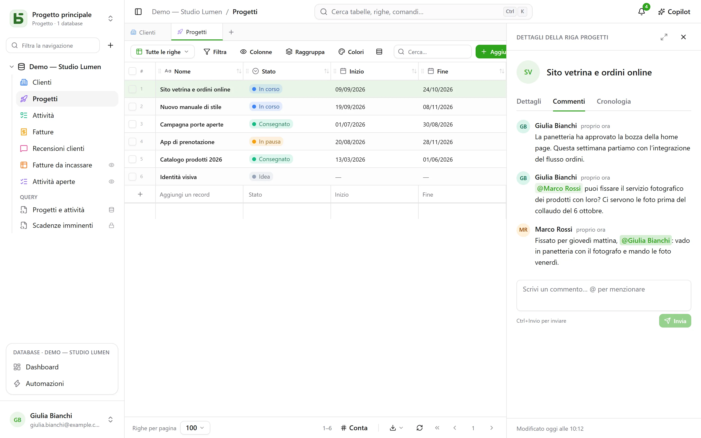
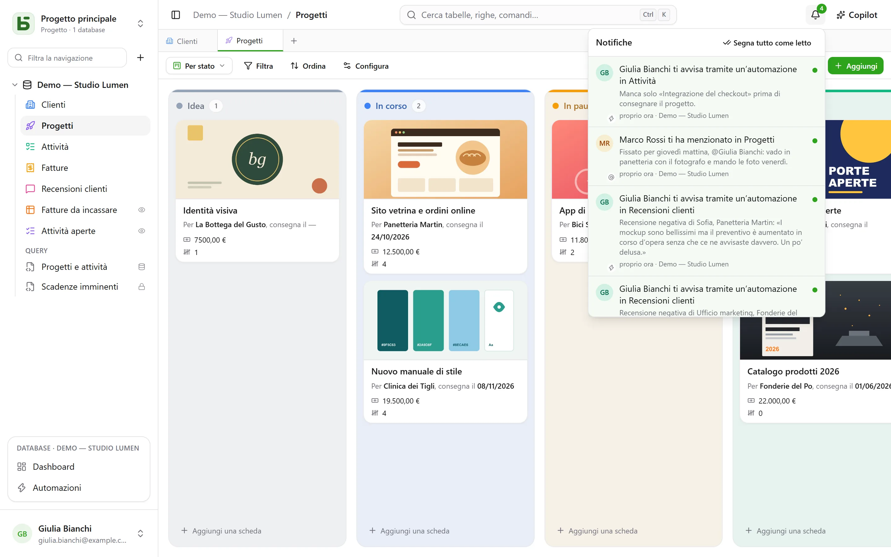

Più persone lavorano sullo stesso database contemporaneamente: ognuna vede arrivare le scritture
degli altri, sa chi sta guardando cosa, e discute di una riga proprio dove si trova.

## Commenti

I dettagli della riga hanno una tab **Commenti**, tra «Dettagli» e «Cronologia». Digita
`@` per **menzionare** un membro, Ctrl+Invio per inviare. Ognuno modifica o elimina i
propri commenti.

Poter leggere la riga basta per commentarla. Una persona menzionata che non può leggerla
non viene avvisata — e l’autore ne viene informato invece di credere che il messaggio sia partito.

## Notifiche

La campanella, in alto a destra, conta ciò che non è stato letto. Vi arrivano quattro cose:

- qualcuno ti **menziona** in un commento;
- qualcuno **risponde** in una conversazione in cui hai scritto;
- qualcuno ti **indica** in un campo Persona — dall’interfaccia, dall’API, da un modulo
  o da un’automazione;
- un’[automazione](/basedb/it/fonctionnalites/automatisations/) ti **avvisa**.

Aprire una notifica apre la riga. **Segna tutto come letto** azzera il contatore; le
notifiche vengono conservate 90 giorni.

### Via email

Quando l’istanza ha un [server di invio](/basedb/it/hebergement/variables/#email), una
notifica rimasta **dieci minuti senza essere letta** parte anche via email: un’unica email
per tutte quelle in attesa, con un link a ogni riga. Ciò che leggi in tempo non parte. In
**Impostazioni › Notifiche**, ogni tipo ha due interruttori: in basedb, e via email.

## Tempo reale

Le scritture degli altri compaiono **senza ricaricare**: una cella modificata, una scheda
spostata, una riga aggiunta — che provengano dall’interfaccia, dall’API, da un agente o dall’SQL
diretto. Il server invia solo un **segnale**, mai un dato: è lo schermo che rilegge, con
i tuoi permessi. Una cella che stai modificando non viene mai sostituita sotto le tue
dita.

## Presenza

I volti delle persone che guardano **la stessa tabella** compaiono in cima allo schermo; quelli
di chi ha aperto **la stessa riga**, nell’intestazione dei suoi dettagli. Nella griglia, il puntatore degli
altri compare sulla cella che stanno sorvolando.

## Un link per ogni schermata

L’indirizzo del browser segue quello che stai guardando: una tabella, una delle sue viste, i
dettagli di una riga, una dashboard, un’automazione, una domanda, le tue impostazioni. Incollalo
in un messaggio: il tuo collega arriva nello stesso punto, con i propri permessi. Salvalo nei
preferiti; i pulsanti indietro e avanti del browser ti riportano dove eri.

| Indirizzo | Cosa apre |
|---|---|
| `/bases/ventes/tables/opportunites` | la tabella «Opportunités» del database «Ventes» |
| `/bases/ventes/tables/opportunites?vue=…` | una delle sue viste |
| `/bases/ventes/tables/opportunites?ligne=…` | i dettagli di una delle sue righe |
| `/bases/ventes/tableaux-de-bord/…` | una dashboard |
| `/bases/ventes/automatisations/…` | un’automazione |
| `/parametres/apparence` | le tue impostazioni |

Un indirizzo indica un **luogo**, non lo stato in cui l’hai lasciato: filtri, ordinamenti e
larghezze delle colonne restano quelli di ciascun browser. Un database e una tabella vi
compaiono con il loro nome PostgreSQL: rinominati, il vecchio indirizzo non porta più da nessuna
parte. Un indirizzo che non porta da nessuna parte — un errore di battitura, un oggetto
eliminato, o che non hai il diritto di vedere — mostra «Questa pagina non esiste».

## Annullare

Ctrl+Z annulla la tua ultima scrittura — vedi [la cronologia](/basedb/it/fonctionnalites/historique/#annullare-ctrlz).

## Limiti

- Nessuna email senza un server di invio configurato da chi amministra l’installazione.
- Oltre cento righe modificate in una volta, lo schermo ricarica l’intera pagina invece di
  aggiornarla riga per riga.
