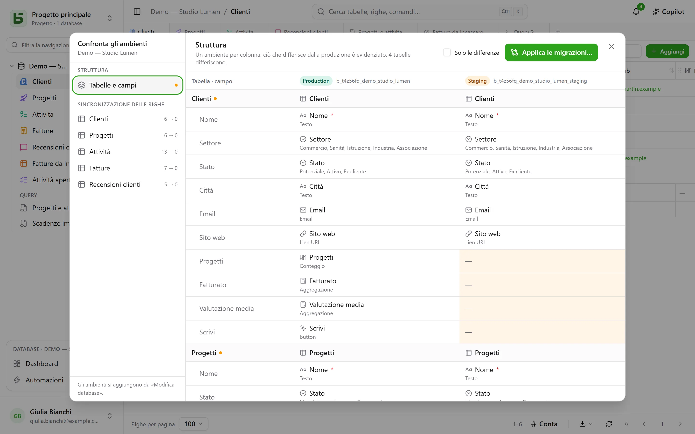

Un database può avere degli **ambienti**: produzione, collaudo, sviluppo… Ognuno è un
database a tutti gli effetti — il suo schema, le sue tabelle, le sue righe, i suoi permessi — e tutti condividono il
**lignaggio** del database, delle sue tabelle e dei suoi campi.

## Nell’interfaccia

La barra laterale mostra **una riga per database**, con un badge che indica l’ambiente aperto e
permette di cambiarlo. Il badge non compare finché esiste solo la produzione.

Gli ambienti si aggiungono, si rinominano e si eliminano in **Modifica database…**: un
nuovo ambiente nasce da una **copia della struttura** di un altro, senza le sue righe.

## Confrontare gli ambienti

Dal menu del database, sotto **Altre azioni**, **Confronta ambienti…** apre una finestra di dialogo:

- **Struttura**: gli ambienti in colonna, tabelle e campi in riga; ciò che differisce dalla
  produzione è evidenziato.
- **Applica migrazioni…** prepara il piano per passare da un ambiente a un altro, passaggio
  per passaggio. Non spunta mai d’ufficio ciò che annullerebbe una modifica più recente della
  destinazione.
- **Sincronizzazione delle righe**: tabella per tabella, riportare righe da un ambiente a
  un altro, per identificativo.

## Come basedb sa chi ha cambiato cosa

Il confronto si basa sulla **cronologia della struttura**: ogni creazione, modifica o
eliminazione di una tabella o di un campo viene catturata da un trigger sul catalogo, e si legge nella
tab «Struttura» della cronologia. Gli identificativi di lignaggio collegano un campo di collaudo
al suo omologo di produzione, anche se rinominato.

## Tramite API, SDK e MCP

Un **token creato per tutto il database** apre tutti i suoi ambienti, quelli di oggi e quelli che
si aggiungeranno: un solo token per la produzione e il collaudo. Il programma o l’agente sceglie
l’ambiente a ogni chiamata:

| Dove | Come |
|---|---|
| [API REST](/basedb/it/integrations/api-rest/#scegliere-lambiente) | l’intestazione `X-Basedb-Environment: recette`, oppure `?environment=recette` |
| [SDK](/basedb/it/integrations/sdk/#gli-ambienti) | `db.environment('recette')` |
| [MCP](/basedb/it/integrations/mcp/#scegliere-lambiente) | l’indirizzo `…/mcp?environment=recette`, oppure l’argomento `environment` di uno strumento |
| [n8n](/basedb/it/integrations/n8n/#le-credenziali) | il campo **Environment** della credenziale |

Senza nulla di tutto ciò, ogni database indica il proprio ambiente: il nome della produzione apre
la produzione, quello del collaudo il collaudo. Un token può anche, alla creazione, essere limitato
all’ambiente mostrato: non ne vede allora nessun altro. In entrambi i casi, i suoi permessi vengono
incrociati, ambiente per ambiente, con quelli della persona che l’ha creato.

## In SQL

Ogni ambiente è uno schema: `b_t4z56fq_ventes` per la produzione,
`b_t4z56fq_ventes_recette` per il collaudo. Le tue query cambiano ambiente cambiando
schema — o `search_path`.
