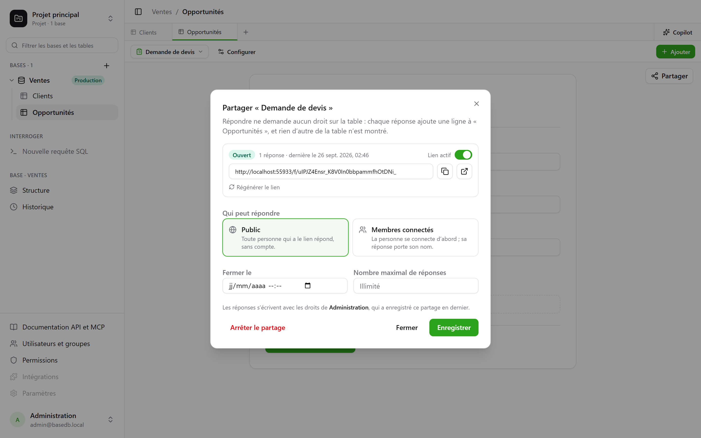
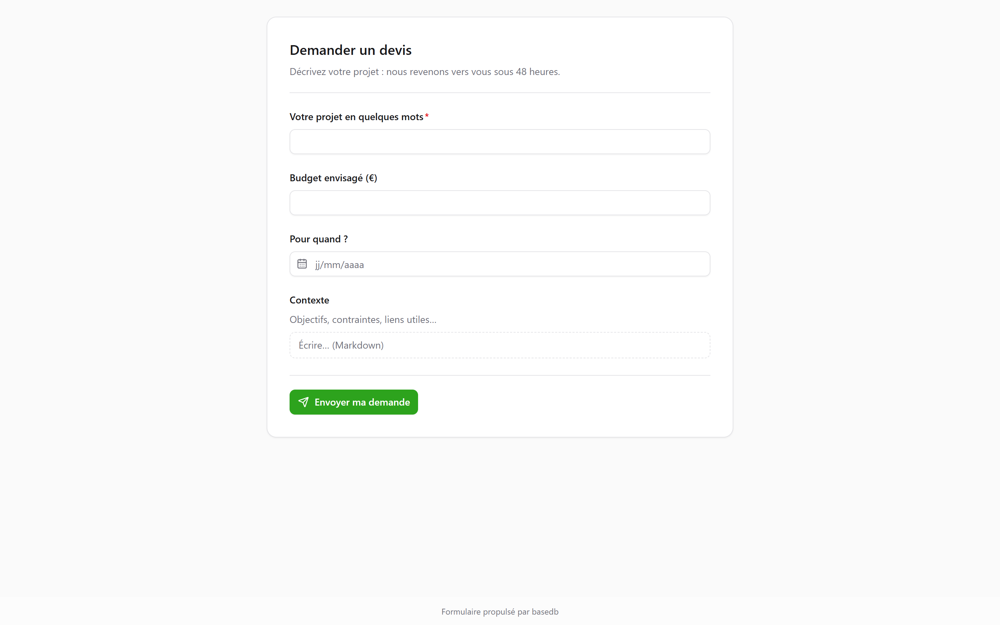

Un modulo o un questionario si **condivide tramite un link** `/f/<jeton>`. La persona che
risponde non ha bisogno di **alcun permesso sulla tabella**: ogni risposta aggiunge una riga, e nient’altro
della tabella le viene mostrato. Per mostrare righe anziché riceverne, una vista
si condivide [in sola lettura](/basedb/it/fonctionnalites/vues-partagees/).

## Chi può rispondere

| Accesso | Chi risponde | Cosa viene mostrato |
|---|---|---|
| **Pubblico** | chiunque abbia il link, senza account | il modulo, da solo |
| **Membri connessi** | un membro del tenant — se serve, solo di alcuni gruppi | l’accesso, poi il modulo e «Stai rispondendo come …» |

La pagina del link è fuori dall’applicazione: né barra laterale, né nome del database, né altre righe.
Porta l’aspetto del modulo — il suo tema, il suo colore, il suo carattere —, e pone solo le
domande che le risposte precedenti richiedono.

## Per conto di chi viene scritta la risposta

La riga viene scritta con l’**autorità della persona che ha pubblicato la condivisione** — l’ultima ad
averla salvata. Il suo permesso di creare righe viene verificato **a ogni risposta**, limitato alle
domande del modulo: se lo perde, il modulo viene sospeso finché qualcuno
che ce l’ha non lo salva di nuovo.

La cronologia indica chi ha risposto, non chi ha pubblicato:

- una risposta di un **membro** è attribuita alla persona;
- una risposta **pubblica** è attribuita al modulo stesso: «Modulo “Richiesta di
  preventivo” · risposta pubblica · pubblicato da Camille».

## Aprire e chiudere

La finestra di dialogo imposta:

- l’interruttore **Link attivo**;
- una **data di chiusura**;
- un **numero massimo di risposte** — esatto, anche con risposte simultanee;
- **Rigenera link**: il vecchio smette subito di funzionare;
- **Interrompi condivisione**: il link scompare, le risposte restano nella tabella.

Un modulo chiuso lo dice in una frase, prima ancora di chiedere l’accesso.

## Limiti

- Le domande di tipo **relazione**, **file** e **immagine** non vengono poste tramite un link
  condiviso; la finestra di dialogo le segnala.
- L’invio è limitato a 20 risposte al minuto, per indirizzo e per link. Dietro il proxy fornito
  (Caddy), l’indirizzo è quello del visitatore.

Il dettaglio è nel [capitolo 15](https://github.com/eodia/basedb/blob/main/docs/architecture/15-formulaires-partages.md)
del documento di architettura.
