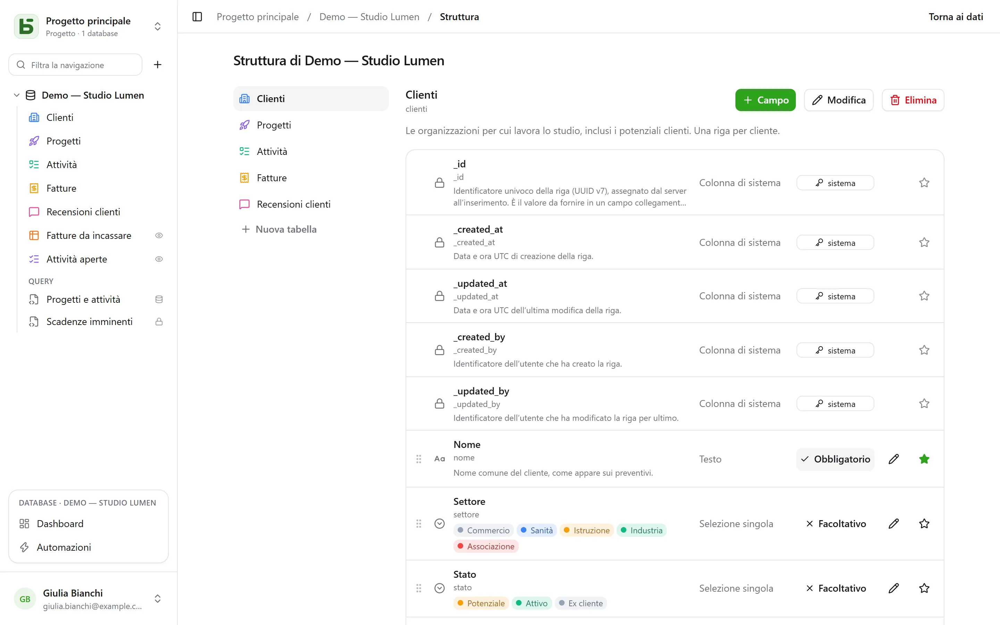

Ogni tabella di basedb è una tabella PostgreSQL; ogni campo, una colonna tipizzata. L’etichetta
che inserisci («Échéance») diventa un nome fisico leggibile (`echeance`) tramite una
**slugificazione** stabile: senza accenti, in minuscolo, senza parole riservate.

## I tipi

| Tipo | Colonna PostgreSQL | Note |
|---|---|---|
| Testo breve | `text` | una riga |
| Testo lungo | `text` | Markdown: un estratto nella griglia, l’anteprima al passaggio del mouse, un editor dedicato; può [citare una colonna](#testo-formattato-e-variabili) |
| Testo formattato | `text` + `CHECK` | HTML sanificato in scrittura, scritto in un editor visuale — [vedi più avanti](#testo-formattato-e-variabili) |
| Numero | `numeric` | mai in virgola mobile: un importo non subisce errori di arrotondamento |
| Valuta, Percentuale, Durata, Valutazione | `numeric` | un numero e il suo [formato di visualizzazione](#formati-di-visualizzazione): `12,50 €`, `15 %`, `1:30`, ★★★★☆ |
| Casella di controllo | `boolean` | |
| Data | `date` | |
| Data e ora | `timestamptz` | un istante assoluto, mostrato nel fuso orario di chi legge |
| Selezione singola | `text` + `CHECK` | colore, icona o immagine per ogni opzione |
| Selezione multipla | `text[]` + `CHECK` | filtrabile con gli operatori degli array |
| Email | `text` + `CHECK` | un indirizzo verificato dal database, apribile con un clic |
| Telefono, Codice a barre, Indirizzo | `text` | un testo breve e il suo formato: link di chiamata, carattere a spaziatura fissa, link alla mappa |
| URL | `text` + `CHECK` | completato durante l’inserimento (`exemple.fr` → `https://exemple.fr`) |
| Persona | `uuid` | un membro dello spazio di lavoro; indicarlo lo [avvisa](/basedb/it/fonctionnalites/collaboration/) |
| Numerazione automatica | `bigint` identity | numera anche le righe già presenti; nessuno la inserisce |
| Relazione | `uuid` + `FOREIGN KEY` | una vera chiave esterna verso la tabella di destinazione |
| Relazione multipla | `uuid[]` | più righe collegate, la cui integrità è garantita da un trigger |
| Formula | colonna generata `STORED` | calcolata da PostgreSQL — o in lettura, vedi [Formule](#formule) |
| Ricerca, Aggregazione, Conteggio | nessuna | calcolati in lettura, attraverso una relazione |
| Pulsante | nessuna | apre un indirizzo o avvia un’[automazione](/basedb/it/fonctionnalites/automatisations/) |
| File, Immagine | `jsonb` (metadati) | i byte vanno nell’[archiviazione dei file](/basedb/it/fonctionnalites/fichiers/) |

Ogni tabella ha anche le sue **colonne di sistema**: `_id` (UUID v7), `_created_at`,
`_updated_at`, `_created_by`, `_updated_by` — gestite da un trigger, mai scrivibili
tramite l’API. La griglia le raccoglie sotto **Informazioni di sistema**, nel menu delle colonne:
sono presenti in ogni tabella, e utili in poche.


## Vincoli garantiti dal database

Ciò che l’interfaccia promette, PostgreSQL lo garantisce. Una selezione singola è un vincolo
`CHECK`; una relazione, una `FOREIGN KEY`; un URL o un indirizzo email, un’espressione
regolare. Una scrittura in SQL diretto che li viola viene rifiutata, come nell’interfaccia:

```text
Check constraints:
  "ck_opportunites__statut__enum" CHECK (statut = ANY (ARRAY['nouveau', 'qualifie', …]))
Foreign-key constraints:
  "fk_opportunites__clients_id" FOREIGN KEY (clients_id) REFERENCES b_t4z56fq_ventes.clients(_id)
```

## Formati di visualizzazione

Valuta, Percentuale, Durata, Valutazione, Telefono, Codice a barre e Indirizzo si scelgono come
dei tipi, ma sono **formati**: la colonna resta un numero o un testo, cambia solo il modo in cui si legge.

| Formato | Su | Si legge e si inserisce |
|---|---|---|
| Valuta | un numero | `12 500,00 €` — euro, dollaro, sterlina, franco svizzero, dollaro canadese, yen |
| Percentuale | un numero | `15 %` |
| Durata | un numero di secondi | `1:30`, e si inserisce come `1h30`, `90 min` |
| Valutazione | un numero | da 1 a 10 stelle, impostata con un clic |
| Telefono | un testo breve | un link di chiamata |
| Codice a barre | un testo breve | a spaziatura fissa |
| Indirizzo | un testo breve | un link alla mappa; nei dettagli della riga, **Trova indirizzo** propone gli indirizzi corrispondenti, scritti per intero; la vista [Mappa](/basedb/it/fonctionnalites/vues/#mappa) lo posiziona |

Un formato si può cambiare in seguito (**Visualizzazione**, nella modifica del campo) senza
toccare i valori salvati. Non limita il valore: una valutazione di 7 su una scala di 5 resta 7.

## Valori predefiniti

Nella modifica di un campo, **Valore predefinito** stabilisce cosa riceve una riga creata senza
di esso:

| Scelta | Su | La riga creata riceve |
|---|---|---|
| Un valore fisso | la maggior parte dei tipi | il valore scelto — uno stato «Nuovo», una priorità 3 |
| La data di oggi | una data | il giorno della sua creazione, nel fuso orario della persona |
| Il momento della creazione | una data e ora | l’ora esatta |
| La persona che crea la riga | una persona | chi l’ha creata — «Responsabile: io» |

I dettagli di una riga nuova e i moduli si aprono già precompilati; svuotare il campo lo lascia
vuoto. Il valore predefinito vale per ogni creazione — interfaccia, API, MCP, importazione, modulo
condiviso, automazione —, anche su un campo che la persona non può modificare: è la regola della
tabella. Le righe esistenti non cambiano, e un inserimento in SQL diretto non ne riceve alcuno: è
basedb ad applicarlo, non la colonna.

## Formule

Una formula si scrive in inglese (funzionano anche i nomi francesi), con i campi tra parentesi quadre e gli argomenti separati da `,`:

```text
ROUND([Montant HT] * (1 + [Taux de TVA]), 2)
IF([Payée], FALSE, DAYS(TODAY(), [Échéance]) > 0)
DAYS([Fin], [Début])
```

L’editor propone i campi da inserire e un pannello delle funzioni; un errore indica il campo o
il carattere che lo causa.

| Famiglia | Funzioni |
|---|---|
| Logica | `IF`, `IFBLANK`, `ISBLANK`, `AND`, `OR`, `NOT`, `TRUE`, `FALSE` |
| Numeri | `ROUND`, `ABS`, `CEILING`, `FLOOR`, `MIN`, `MAX` |
| Testo | `UPPER`, `LOWER`, `TRIM`, `LEFT`, `RIGHT`, `LEN`, `TEXT`, `VALUE` |
| Date | `YEAR`, `MONTH`, `DAY`, `WEEKDAY`, `DAYS`, `ADD_DAYS`, `DATE`, `TODAY`, `NOW` |
| Operatori | `+ - * /`, `&` per unire testo, `= <> < <= > >=` |

Una formula diventa una **colonna generata** da PostgreSQL: `psql` e i tuoi strumenti la leggono
come le altre. Quella che dipende dal giorno (`TODAY()`, `NOW()`) o che cita una
ricerca o un’aggregazione è **calcolata in lettura**: si filtra e si ordina in basedb, ma
non esiste in SQL diretto.

Una formula non cita né un’altra formula né direttamente una relazione — lo fa una ricerca.
Estrarre o sostituire una parte di un testo arriverà più avanti.

## Ricerche, aggregazioni e conteggi

Tre campi leggono **attraverso una relazione**, in un senso o nell’altro — «il cliente del
progetto», ma anche «le attività collegate tramite il campo Projet»:

- una **ricerca** riporta un valore della riga collegata, o l’elenco dei valori: la città del
  cliente di un progetto;
- un’**aggregazione** calcola sulle righe collegate: numero di valori, somma, media, minimo,
  massimo — il fatturato di un cliente, la valutazione media delle sue recensioni;
- un **conteggio** conta le righe collegate: il numero di attività di un progetto.

Sono calcolati a ogni lettura, **con i permessi di chi legge**: se la tabella collegata ti è
preclusa, lo è anche il campo. Si possono filtrare e ordinare. Seguono una sola relazione, non
si scrivono, non hanno una colonna — quindi non esistono in SQL diretto — e non compaiono né
nell’importazione, né nei moduli, né nella cronologia.

## Le relazioni

Una **relazione** collega una riga a una riga di un’altra tabella dello stesso database. La griglia
mostra il **valore visualizzato** della riga di destinazione — quello della colonna che designi come
campo principale della sua tabella — e i filtri attraversano la relazione (`clients_id.ville eq "Lyon"`). Le righe
che puntano a una riga compaiono nei dettagli di quella riga.

Spunta **Più righe per record** e la relazione diventa **multipla**: un’attività
dipende da più attività, un articolo appartiene a più categorie. Le righe collegate
compaiono come badge, si scelgono tramite una ricerca e si aprono con un clic dai
dettagli della riga. Eliminare una riga di destinazione la rimuove dagli elenchi che la citavano — oppure viene rifiutato, se
l’hai scelto. I filtri `has_any`, `has_all` e `is_null` si applicano, e anch’essi attraversano
la relazione (`taches_ids.titre contains "logo"`). Una relazione multipla non si può ancora
ordinare, raggruppare né importare.

## Pulsante

Un campo **Pulsante** non ha valore: agisce. **Apre un indirizzo** — `https://` o
`mailto:`, che può citare la riga (`mailto:{{E-mail}}`) — oppure **avvia un’automazione**
attivata da un pulsante sulla stessa tabella. Compare nella cella, sulla scheda e nei
dettagli della riga.

## Descrizioni

Un database, una tabella e un campo hanno una **descrizione**, modificabile senza migrazione.
Viene ricopiata nel `COMMENT ON` che legge `psql`, nella documentazione generata e in ciò che un
agente legge tramite `describe_table`.

## Testo formattato e variabili

Il **testo formattato** è la variante HTML del testo lungo, scelta alla creazione del campo
(«Testo formattato (HTML)»): titoli, grassetto, corsivo, sottolineato, barrato, elenchi, citazioni, codice,
link e separatori, in un editor visuale. L’HTML viene **sanificato in scrittura**, che provenga
dall’interfaccia, dall’API, dal server MCP o da un’importazione, e un vincolo `CHECK` rifiuta inoltre
le forme pericolose scritte direttamente in SQL (`<script>`, attributi `on…`, `javascript:`).
Né immagini, né tabelle, né colori: ciò che il database non conserverebbe non viene proposto.

Un testo lungo — semplice o formattato — può **citare una colonna della sua riga**. Il menu **Colonna** dell’editor
inserisce la citazione nel punto del cursore: un badge nel testo formattato, `{{Ville}}` nel
Markdown.

> Consegna prevista il `{{Livraison}}` a `{{Ville}}`.

- La colonna conserva la citazione così come è scritta — `{{ville}}`, con il suo nome fisico: è ciò
  che legge `psql`.
- Ovunque altrove — la griglia, i dettagli della riga, l’API, il server MCP, le viste condivise, le
  automazioni — il testo si legge **con il valore della riga**: «Consegna prevista il
  02/10/2026 a Lyon.» Cambiare la città cambia il testo.
- Una selezione singola si legge tramite la sua etichetta, una persona tramite il suo nome, una data nel tuo
  formato; un valore inserito nel testo formattato non è mai markup.
- Una colonna che chi legge non può leggere non restituisce nulla: né il suo valore, né il suo nome.

Il testo formattato non può essere compilato dall’IA: un modello scrive testo, non HTML sanificato.

## Modificare la struttura

La schermata **Struttura** del database — nel suo menu **⋯** della barra laterale — elenca le tabelle e i loro campi: aggiungere, rinominare, rendere obbligatorio, riordinare,
descrivere, designare il campo principale.



Modificare la struttura richiede il livello **Gestione**. Senza di esso, la schermata si può consultare e non propone
nulla: né pulsanti, né matite, né maniglie — l’obbligatorietà e il campo principale vengono indicati, non
offerti. Il server rifiuta comunque ogni modifica; la schermata non finge più di
accettarla.

Aggiungere, rinominare, cambiare il tipo di un campo passa per il **motore di migrazione**: un piano in
passaggi, lock di breve durata e un rifiuto motivato quando un dato non si può convertire.

**Rinominare** un database, una tabella o un campo si fa in un’unica finestra di dialogo. L’etichetta cambia
sempre, senza migrazione. Un amministratore vede sotto «Rinomina anche nel database:
`clients` → `comptes`»: se spuntata, cambia anche il nome fisico, e compare l’analisi d’impatto
— le query, le viste SQL e le automazioni che citano il vecchio nome. Il vecchio
nome continua a essere servito da un **alias di compatibilità** — una vista — il tempo necessario per aggiornare le tue
query.

Eliminare non cancella nulla subito: la tabella o il database viene accantonato
(`zz_supprime_…`) e resta leggibile in SQL. Un database eliminato si può ripristinare; ripristinare una sola tabella
dall’interfaccia è [in arrivo](/basedb/it/feuille-de-route/). L’**eliminazione definitiva** è
riservata all’amministrazione, trenta giorni dopo, e inizia con un’esportazione CSV verificata.
