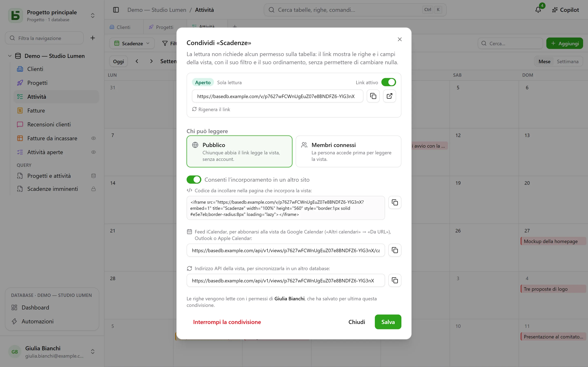
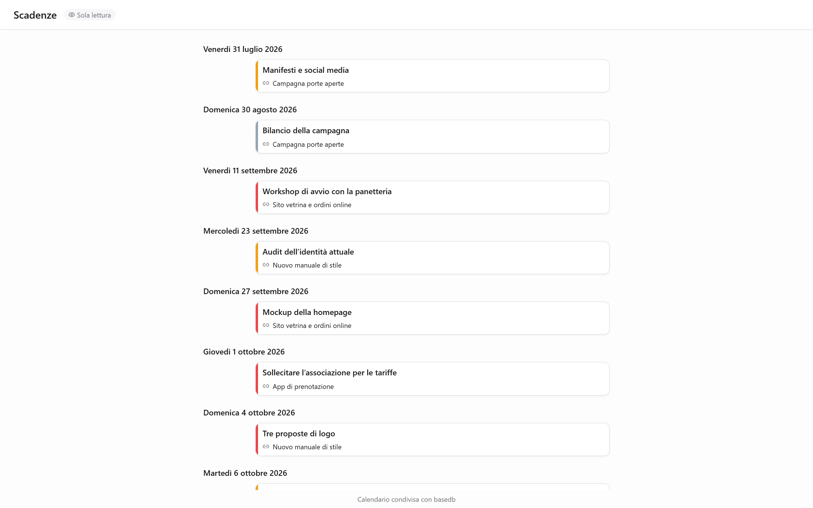

Una vista di dati — griglia, kanban, calendario, sequenza temporale, galleria, elenco — si **condivide in
sola lettura**: un link `/v/<jeton>` la mostra a chi non può aprire basedb, senza permettere di
scrivere nulla. È il corrispettivo dei [moduli condivisi](/basedb/it/fonctionnalites/formulaires-partages/),
che permettono di rispondere senza lasciar leggere nulla. Una [dashboard](/basedb/it/fonctionnalites/tableaux-de-bord/#condividere-una-dashboard)
si condivide allo stesso modo.

## Condividere

Menu della vista → **Condividi…**, poi:

| Accesso | Chi legge |
|---|---|
| **Pubblico** | chiunque abbia il link, senza account |
| **Membri connessi** | un membro dello spazio di lavoro, dopo l’accesso — se serve, solo di alcuni gruppi |

L’interruttore **Link attivo** sospende il link senza perderlo. La pagina si apre fuori
dall’applicazione: né barra laterale, né nome del database, né nome della tabella — la vista, i suoi filtri, le sue
colonne, e nient’altro. Un calendario o una sequenza temporale vi si legge come un’agenda.

## Per conto di chi si legge

La vista si legge con i **permessi della persona che l’ha pubblicata**, rivalutati a ogni lettura:
un campo che le è nascosto non viene mostrato, e se perde l’accesso alla tabella, il link smette
di mostrare qualsiasi cosa.

## Incorporare in un altro sito

Spunta **Consenti l’incorporamento in un altro sito**: la finestra di dialogo fornisce un **codice
di incorporamento** `<iframe>`, da incollare in una intranet, un wiki, un sito vetrina. Senza questa
casella, la pagina rifiuta di essere mostrata nel riquadro di un altro sito.

## Un calendario nella tua agenda

Per un calendario o una sequenza temporale condivisi in modo **pubblico**, la finestra di dialogo fornisce l’**indirizzo del
feed del calendario**: un feed iCalendar (`…/calendar.ics`, 1.000 eventi al massimo) a cui
si abbonano Google Calendar, Outlook o Apple Calendar. Le scadenze del team compaiono
nell’agenda di ognuno, e seguono la tabella.

## Una fonte per altri database

Un link pubblico fornisce anche l’**indirizzo API della vista**: le righe che mostra, in
JSON. Una [tabella sincronizzata](/basedb/it/integrations/synchronisation/) — su questa istanza o
su un’altra — può usarla come fonte.

## Limiti

- La lettura è limitata a 120 richieste al minuto, per indirizzo e per link.
- Un modulo non si condivide in lettura: si condivide [per ricevere risposte](/basedb/it/fonctionnalites/formulaires-partages/).
