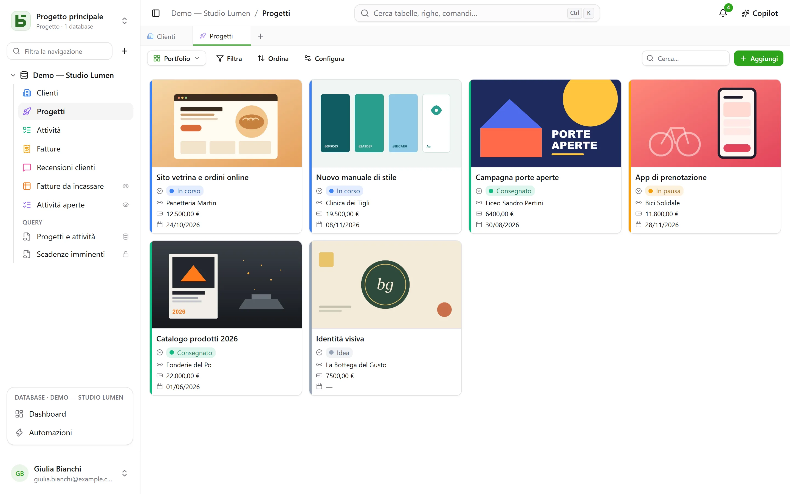
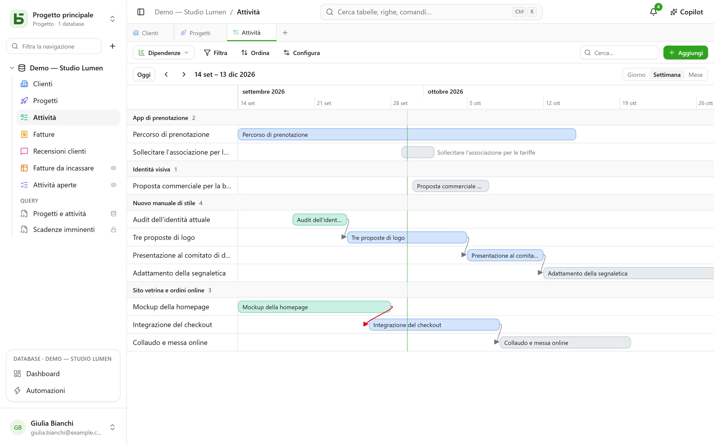
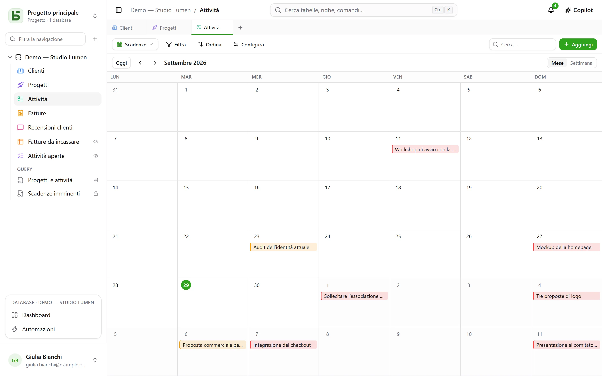
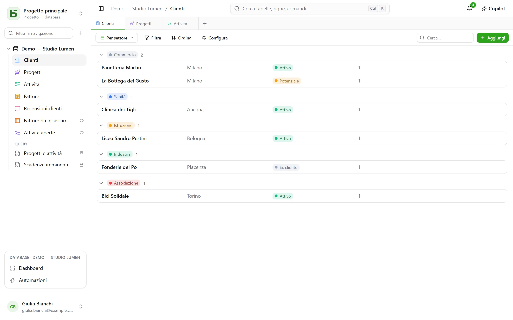

Una tabella si mostra in **dieci modi**. Una vista non copia alcun dato e non concede alcun permesso
in più rispetto alla tabella stessa.

:::note
Queste viste sono modi di mostrare **una** tabella. Una [vista SQL](/basedb/it/fonctionnalites/requetes-et-vues-sql/)
è un’altra cosa: una vera vista PostgreSQL, scritta in SQL sulle tabelle del database, disposta tra
di esse nella barra laterale.
:::

| Vista | Cosa mostra | Cosa le serve |
|---|---|---|
| **Griglia** | righe filtrate, ordinate, raggruppate, con le colonne scelte | — |
| **Kanban** | schede in colonne | una selezione singola |
| **Calendario** | righe alla loro data, per mese o per settimana | un campo data |
| **Sequenza temporale** | barre tra due date, e le loro dipendenze | una data di inizio |
| **Galleria** | schede, con un’immagine di copertina | — |
| **Elenco** | una riga per record, in gruppi comprimibili | — |
| **Mappa** | ogni riga collocata sulla mappa | un indirizzo, oppure una latitudine e una longitudine |
| **Modulo** | una pagina di domande per creare una riga | — |
| **Questionario** | le stesse domande, una per schermata | — |
| **Quiz** | domande valutate, una per schermata, e il punteggio alla fine | — |

## Il selettore delle viste

Si trova a sinistra di «Filtra». «Tutte le righe» è la griglia della tabella, che nessuno
ha salvato né può eliminare; seguono le **viste collaborative**, nell’ordine
scelto da chi costruisce il database, poi **Le mie viste**. In basso, **Crea una vista** dispone
i dieci tipi in due famiglie: quelle che **mostrano le righe** e quelle che **raccolgono
risposte** (modulo, questionario, quiz).

- Una **vista collaborativa** è visibile a tutti. Crearla, configurarla, rinominarla,
  riordinarla o eliminarla richiede il livello **Gestione**. Può essere **bloccata**: lo
  indica un lucchetto, e nessuno può più modificarla senza prima sbloccarla.
- Una **vista personale** è visibile solo a te, e richiede soltanto di poter leggere la tabella.
  **Crea vista personale**, oppure **Salva come vista** dopo aver filtrato e ordinato:
  ognuno conserva i propri modi di leggere, senza cambiare nulla per gli altri. **Duplica** una
  vista collaborativa ne crea una copia personale.

## La barra degli strumenti

Sopra la griglia, in quest’ordine:

- **Filtra** combina condizioni per campo;
- **Colonne** sceglie cosa mostrare — le colonne di sistema sono a parte, sotto
  «Informazioni di sistema»;
- **Raggruppa** dispone le righe secondo un campo a valore singolo — selezione singola, relazione,
  persona, data, numero, testo, casella di controllo… — in gruppi comprimibili, ognuno con il proprio
  conteggio su tutto il filtro;
- **Colori** colora le righe secondo una selezione singola, oppure secondo **regole** — un filtro e
  un colore, venti al massimo — come striscia, come sfondo o entrambi;
- **Altezza righe**: bassa, media, alta, molto alta;
- **Cerca…**, a destra, cerca in tutte le colonne mentre digiti; Esc
  svuota la ricerca. Vale anche per il kanban, il calendario, la sequenza temporale, la galleria
  e l’elenco, e non viene mai salvata nella vista.

Sotto ogni colonna, un **Riepilogo** calcolato su tutte le righe del filtro, non solo sulla
pagina: compilate, vuote, valori unici, somma, media, minimo, massimo, caselle spuntate.

## Kanban, calendario, sequenza temporale

- Il **kanban** dispone le schede secondo una selezione singola; trascinare una scheda modifica la riga,
  un «+» in cima alla colonna crea una riga che ha già quella scelta. Ogni scheda mostra un
  titolo, un’immagine di copertina, i campi scelti e una **descrizione** che cita i
  valori della riga — «Consegna prevista il `{{Date}}` per `{{Client}}`» —, scritta nelle
  impostazioni della vista con il pulsante **Inserisci campo**.
- Il **calendario** colloca ogni riga alla sua data, con un’eventuale data di fine; trascinare una
  riga da un giorno all’altro la sposta.
- La **sequenza temporale** traccia barre tra una data di inizio e una data di fine, raggruppate per
  una selezione singola o una relazione. Con l’impostazione **Dipende da** — una relazione della tabella
  verso sé stessa — una freccia collega ogni attività a quelle da cui dipende, rossa quando
  torna indietro nel tempo.

## Galleria ed elenco

- La **galleria** mostra schede: un’**immagine di copertina** (ritagliata o intera), una
  dimensione (schede piccole, medie, grandi), un colore secondo una selezione singola.
- L’**elenco** mostra una riga per record, **raggruppata** per una selezione singola, una
  relazione o una persona.

Nel kanban, nella galleria e nell’elenco, le schede e le righe si **ordinano a mano**
trascinandole — fino a 5.000; un ordinamento scelto prevale su quest’ordine.

## Mappa

La **mappa** posiziona ogni riga nel suo punto, in base a:

- un **indirizzo** — un testo breve, preferibilmente nel formato **Indirizzo** (vedi
  [Tabelle e campi](/basedb/it/fonctionnalites/tables-et-champs/)): «12 rue des Lilas, Lyon»;
- oppure una **latitudine** e una **longitudine**, due campi numero, collocate come sono.

Uno spillo prende il **colore** di una selezione singola, mostra il **titolo** della riga al
passaggio del mouse, e apre i suoi dettagli con un clic. La mappa segue il filtro e
l’ordinamento della vista, fino a 2.000 righe.

Un indirizzo viene **localizzato una volta per tutte** dal servizio di geocodifica dell’istanza
— quello di OpenStreetMap per impostazione predefinita —, al ritmo che impone: su una mappa
nuova, gli spilli compaiono man mano che arrivano le risposte, uno al secondo circa, poi subito
le volte successive. Un indicatore conta le righe posizionate, gli indirizzi ancora da
localizzare e quelli che non è stato possibile localizzare: un indirizzo non trovato va
precisato (città, codice postale), mai scartato in silenzio.

:::note[Ciò che lascia il tuo server]
Il testo degli indirizzi viene inviato al servizio di geocodifica, e il browser di ogni lettore
carica il fondo della mappa dal server delle tessere. Chi amministra l’istanza può scegliere
altri servizi, o non volerne nessuno: vedi
[Variabili d’ambiente](/basedb/it/hebergement/variables/#mappe-e-indirizzi).
:::

## Modulo e questionario

Si spuntano le domande e si mettono in ordine; ognuna ha un’etichetta, un testo di aiuto, un
esempio di risposta, e può essere resa obbligatoria. Il modulo ha il suo titolo, la sua
presentazione, l’etichetta del pulsante e il messaggio di ringraziamento. Si compila in basedb,
oppure si [condivide tramite link](/basedb/it/fonctionnalites/formulaires-partages/).

Non c’è nulla da impostare per iniziare: un modulo nuovo chiede quello che risponde una persona
— non lo stato, la persona assegnata né le relazioni che il team compila in seguito, a meno che
non siano obbligatorie —, porta il colore della sua tabella e un tema chiaro, e ogni campo vuoto
mostra un esempio adatto. Tutto il resto si cambia quando si vuole:

- **Aspetto**: otto temi — Chiaro, Morbido, Alba, Oceano, Foresta, Notte, Carta, Minimal —, un
  colore d’accento, un carattere, un allineamento a sinistra o centrato;
- **Precompila con la data di oggi**: una domanda data arriva già compilata con il giorno — e
  con l’ora, per una data e ora —, che la persona tiene o cambia;
- **Chiedi solo se…**: una domanda viene posta solo se una risposta precedente lo richiede
  («Sentimento è Negativo», «Valutazione è al massimo 2»). Una domanda nascosta non è né
  obbligatoria né inviata;
- **Altre opzioni**: i pulsanti di benvenuto e di invio, i numeri, la barra di avanzamento, il
  passaggio automatico alla domanda successiva, il messaggio e un pulsante finale («Torna al
  sito»), i coriandoli.

Il **questionario** occupa tutto lo schermo: una schermata di benvenuto che dice quanto tempo
serve, poi una domanda alla volta, che arriva scorrendo. Tutto funziona anche da tastiera:
**Invio** per continuare, le lettere **A**, **B**, **C**… per una scelta, **S** o **N** per sì o
no, le cifre per una valutazione — una scelta unica fa passare da sola alla domanda successiva.
L’invio si festeggia: un segno di spunta che si disegna e coriandoli nei colori del modulo.

## Quiz

Un quiz è un questionario che conta i punti. Sotto ogni domanda si indica la sua
**risposta corretta** e quanto vale — **1 punto** se non si dice nulla, fino a 100:

| Domanda | Risposta corretta |
|---|---|
| selezione singola | una scelta |
| selezione multipla | le scelte da spuntare, tutte e solo quelle |
| casella di controllo | sì o no |
| numero, valutazione | un numero |
| data | un giorno |
| testo breve, email, URL | una o più risposte accettate, separate da `;` — senza distinguere maiuscole né accenti |

Una domanda senza risposta corretta — un nome, un commento — viene posta senza essere valutata.
Ne serve almeno una valutata per creare il quiz.

La sezione **Valutazione** regola il resto:

- **Correzione**: **dopo ogni domanda** — la risposta viene verificata subito, in verde, o in
  rosso con la risposta corretta, e il punteggio cresce in alto nello schermo —, **alla fine** —
  il punteggio e poi la correzione —, oppure **mai** — solo il punteggio, le risposte corrette
  restano segrete;
- **Soglia di superamento**: una percentuale dei punti; la schermata finale dice allora
  «Superato!» o «Non questa volta…»;
- **Salva il punteggio in**: un campo numerico della tabella, che riceve il punteggio di ogni
  risposta. Ordina la griglia su di esso: ecco la classifica. Viene scelto d’ufficio un campo
  chiamato «Punteggio», «Punti» o «Voto».

La schermata finale mostra il punteggio in un anello che si riempie, la percentuale e, salvo
«mai», ogni domanda valutata con la risposta data e quella corretta. Una domanda nascosta da una
risposta precedente non conta nel totale.

:::note
Nell’applicazione, chi può leggere la vista può leggerne le risposte corrette. Tramite un
[link condiviso](/basedb/it/fonctionnalites/formulaires-partages/#un-quiz-condiviso), non
lasciano mai il server: è lui a correggere e a contare.
:::

## Condividere una vista

Una vista di dati — griglia, kanban, calendario, sequenza temporale, galleria, elenco — si **condivide in
sola lettura** tramite link, si incorpora in un altro sito, e un calendario diventa un feed
di calendario. Vedi [Viste condivise](/basedb/it/fonctionnalites/vues-partagees/).

## Ciò che il lettore non vede

Una vista viene **riproiettata per chi la legge**: un campo che gli è nascosto scompare dalle
colonne, dalle schede e dalle domande. Una vista il cui filtro cita un campo nascosto non viene
mostrata affatto: mostrata senza il suo filtro, mostrerebbe più di quanto è stata pensata per
mostrare.
