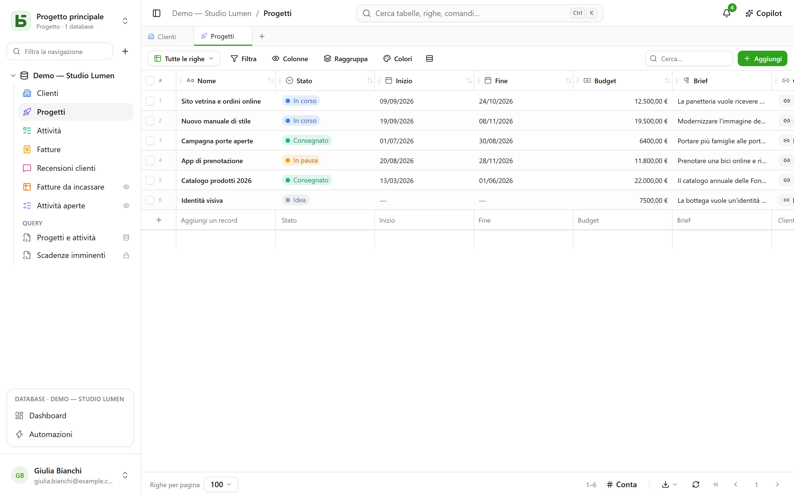

**basedb** è un database collaborativo, nello spirito dei fogli di calcolo collaborativi,
che ospiti tu stesso — con una differenza che determina tutto il resto: **i tuoi dati
vivono in vere tabelle PostgreSQL**, tipizzate e con nomi leggibili.

## Una promessa semplice

Nessun modello generico, nessun `JSONB` pigliatutto, nessun `field_1837`:

| In basedb | In PostgreSQL |
|---|---|
| Un database «Ventes» | uno schema `b_t4z56fq_ventes` |
| Una tabella «Opportunités» | una tabella `opportunites` |
| Un campo «Échéance» (Data) | una colonna `echeance date` |
| Una selezione singola «Statut» | una colonna `text` e il suo vincolo `CHECK` |
| Una relazione «Client» | una colonna `clients_id uuid` e la sua `FOREIGN KEY` |

Puoi quindi aprire `psql`, uno strumento di BI o uno script Python e leggere i tuoi dati senza
passare dal prodotto — e persino scriverci: i vincoli reggono e la cronologia registra la
scrittura.

## Per chi?

- **I team operativi** che vogliono una griglia, delle viste e dei moduli senza aspettare
  uno sviluppo.
- **I team tecnici** che rifiutano di vedere i propri dati chiusi in un formato
  proprietario e vogliono collegare i loro strumenti abituali.
- **Gli agenti IA**, che trovano un server MCP, permessi chiari e proposte sottoposte a una
  persona.

## Cosa ci troverai

- [Tabelle e campi](/basedb/it/fonctionnalites/tables-et-champs/) tipizzati, relazioni che
  sono vere chiavi esterne — anche multiple —, formule calcolate da PostgreSQL, ricerche e
  aggregazioni attraverso le relazioni.
- Dieci [viste](/basedb/it/fonctionnalites/vues/): griglia, kanban, calendario, sequenza
  temporale, galleria, elenco, mappa, modulo, questionario, quiz — collaborative o personali.
- [Moduli](/basedb/it/fonctionnalites/formulaires-partages/) e
  [viste](/basedb/it/fonctionnalites/vues-partagees/) condivisi tramite link, e calendari a cui
  abbonarsi da un’agenda.
- La [collaborazione](/basedb/it/fonctionnalites/collaboration/): commenti e menzioni,
  notifiche, aggiornamenti in tempo reale.
- [Automazioni](/basedb/it/fonctionnalites/automatisations/) e
  [dashboard](/basedb/it/fonctionnalites/tableaux-de-bord/) con le loro domande, costruite con il mouse o in SQL.
- [SQL per tutti](/basedb/it/fonctionnalites/requetes-et-vues-sql/), ognuno con i propri
  permessi: query salvate sotto le tabelle e vere viste PostgreSQL disposte tra di esse.
- [Modelli di database](/basedb/it/fonctionnalites/modeles/), da scegliere in una galleria o
  da chiedere all’IA.
- [Ambienti](/basedb/it/fonctionnalites/environnements/) — produzione, collaudo — che si
  confrontano e si migrano.
- Una [cronologia](/basedb/it/fonctionnalites/historique/) di ogni scrittura, SQL diretto
  compreso, e Ctrl+Z per annullare.
- [Permessi](/basedb/it/fonctionnalites/droits/) per gruppo, fino al singolo campo.
- Un’[API REST](/basedb/it/integrations/api-rest/), un [server MCP](/basedb/it/integrations/mcp/),
  i [webhook](/basedb/it/integrations/webhooks/), Slack e le
  [tabelle sincronizzate](/basedb/it/integrations/synchronisation/).
- L’[IA](/basedb/it/fonctionnalites/ia/) come opzione: campi calcolati da un modello, Copilot.

## Stato del progetto

basedb è software libero (AGPL-3.0) sviluppato da [Eodia](https://eodia.com/fr/), studio
software nativo IA, ed è in sviluppo attivo. Il nucleo, l’API, il server MCP e l’interfaccia
funzionano e sono coperti da oltre mille test; la
[roadmap](/basedb/it/feuille-de-route/) indica cosa resta da fare. Il suo
[documento di architettura](https://github.com/eodia/basedb/tree/main/docs/architecture), una
ventina di capitoli, fissa ogni decisione.

:::tip[Prova]
Una volta clonato il repository basta un comando: `docker compose up -d`. Vedi
[l’installazione](/basedb/it/guides/installation/).
:::
