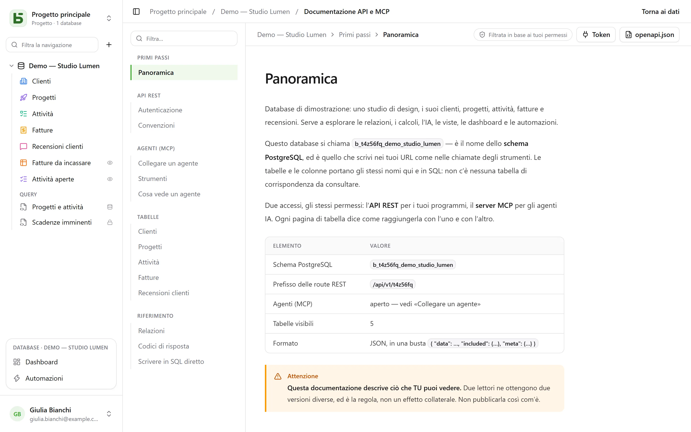

L’API REST è la stessa che usa l’interfaccia: **non esiste alcuna route privata**.
I suoi URL riportano i nomi fisici — quelli che leggi anche in SQL.

```text
/api/v1/<tenant>/data/<base>/<table>
/api/v1/t4z56fq/data/b_t4z56fq_ventes/opportunites
```

## Un token

Nell’interfaccia, menu **⋯** del database → **API e agenti** → **Token API e MCP…**: qui si crea un **token
di integrazione** limitato a questo database, in sola lettura per impostazione predefinita, dopo aver confermato la propria
password. Viene mostrato una sola volta; mettilo in una variabile d’ambiente.

Un token legge, crea e modifica se è stato creato in scrittura, **non elimina mai**, e non ha mai
più permessi della persona che l’ha creato.

```bash
export BASEDB_TOKEN=bdb_…
curl "http://localhost:3000/api/v1/t4z56fq/data/b_t4z56fq_ventes/opportunites?limit=20" \
  -H "Authorization: Bearer $BASEDB_TOKEN"
```

## Leggere

| Parametro | Ruolo |
|---|---|
| `filter` | un’espressione leggibile: `statut eq "gagne" and montant gte 10000` |
| `sort` | `-montant,nom` |
| `fields` | le colonne da restituire |
| `limit`, `after` | paginazione tramite cursore cifrato: `meta.next_cursor` di una pagina, passato come `after`, restituisce quella successiva (`meta.has_next_page`) |
| `links=display` | le relazioni con il loro valore visualizzato |
| `count=exact` | il totale, con un tetto di 100.000 |
| `variables=raw` | i testi lunghi così come sono scritti, `{{colonne}}` compreso, anziché con i [valori della riga](/basedb/it/fonctionnalites/tables-et-champs/#testo-formattato-e-variabili) |

Gli operatori: `eq`, `ne`, `eq_ci`, `contains`, `starts_with`, `ends_with`, `in`, `is_null`,
`gt`, `gte`, `lt`, `lte`, `between`, combinati con `and`, `or`, `not` e parentesi. Un
filtro attraversa una relazione: `clients_id.ville eq "Lyon"`.

## Scrivere

```bash
curl -X POST "http://localhost:3000/api/v1/t4z56fq/data/b_t4z56fq_ventes/opportunites" \
  -H "Authorization: Bearer $BASEDB_TOKEN" -H "content-type: application/json" \
  -d '{"values": {"nom": "Audit RGPD", "statut": "nouveau", "montant": 12000}}'
```

`PATCH …/<table>/<_id>` modifica una riga con lo stesso corpo `{"values": {…}}`. Gli
errori hanno una forma unica: `{ "code": "…", "details": {…}, "request_id": "…" }`, con un
codice stabile per ogni causa.

Ogni scrittura restituisce l’intestazione `x-basedb-transaction`: passarla a
`POST /api/v1/<tenant>/history/undo` (`{"transaction": "…"}`) la annulla, come Ctrl+Z
nell’interfaccia — con un rifiuto se la riga è stata modificata nel frattempo.

## Oltre le righe

Con lo stesso token:

| Route | Ruolo |
|---|---|
| `GET …/data/<base>/<table>/aggregate` | riepiloghi su tutte le righe di un filtro: `aggregates=montant:sum,nom:filled`, `group=statut` |
| `GET …/data/<base>/<table>/<_id>/comments`, `POST` | leggere e scrivere i commenti di una riga |
| `POST /api/v1/<tenant>/automations/<id>/run` | avviare un’automazione attivata da un pulsante, su una riga (`{"record": "…"}`) |
| `GET /api/v1/<tenant>/meta/bases/<base>/dashboards` | le dashboard di un database |
| `GET /api/v1/<tenant>/meta/users` | i membri dello spazio di lavoro, per un campo Persona |
| `GET /api/v1/<tenant>/meta/templates` | i modelli di database della galleria |
| `GET /api/v1/<tenant>/events?base=<base>&table=<table>` | seguire una tabella in tempo reale: dei segnali, riletti poi dalle route qui sopra (vedi [Webhook](/basedb/it/integrations/webhooks/#senza-webhook-seguire-una-tabella)) |

Le [viste condivise](/basedb/it/fonctionnalites/vues-partagees/) si leggono senza account:
`GET /api/v1/views/<jeton>` e `…/rows` in JSON, `…/calendar.ics` in iCalendar.

Costruire — creare un’automazione, una dashboard, un’integrazione — resta riservato a
una sessione dell’interfaccia: un token legge e scrive righe, non modifica il database.

## Creare un database da un modello

Un’applicazione che si installa crea il suo database in **una sola chiamata**: il server applica il modello —
tabelle, campi, relazioni, righe di esempio, viste, dashboard, automazioni — e, se
un passaggio fallisce, non lascia alcun database dietro di sé.

```bash
curl -X POST "http://localhost:3000/api/v1/t4z56fq/admin/bases" \
  -H "Authorization: Bearer $ACCES" -H "content-type: application/json" \
  -d '{"template": "crm", "label": "Ventes", "rows": false}'
```

`template` è la chiave di un modello della galleria, oppure un modello intero nel
[formato dei modelli](/basedb/it/fonctionnalites/modeles/). Con l’intestazione
`Accept: application/x-ndjson`, la risposta arriva riga per riga: una riga `{"step": …}` per
passaggio, poi il database creato. Questa chiamata richiede il token di accesso di una persona che può creare un
database (`POST /auth/session/access`, dopo l’accesso): un token di integrazione apre solo un database
esistente.

## Verificare un token

I token di basedb non si verificano fuori da basedb. Un’applicazione che ne riceve uno —
uno strumento aperto da basedb con il token della persona, per esempio — chiede quanto vale
(introspezione, RFC 7662), con il proprio token di integrazione:

```bash
curl -X POST "http://localhost:3000/auth/introspect" \
  -H "Authorization: Bearer $BASEDB_TOKEN" \
  --data-urlencode "token=$JETON_RECU"
```

```json
{ "active": true, "token_type": "access_token",
  "sub": "0195a…", "email": "claire@example.com", "name": "Claire Martin",
  "tenant": "t4z56fq", "groups": ["Commerciaux"], "exp": 1790000000 }
```

Ogni token che non vale — sconosciuto, scaduto, revocato, sessione chiusa, altro spazio di lavoro — risponde
`{"active": false}`, senza dire perché. La risposta è letta in diretta: una disconnessione si vede
immediatamente. Per un token di integrazione, la risposta indica anche il database che apre (`base`), il suo
accesso (`read` o `write`) e le sue superfici.

## La documentazione generata

Ogni database ha la sua pagina **Documentazione API e MCP**: per ogni tabella, i suoi endpoint, le sue
colonne, esempi in cURL e in JavaScript. È **filtrata in base ai tuoi permessi** — due
lettori ne ottengono due versioni —, scritta **nella lingua del tuo schermo**, ed esiste anche
in OpenAPI 3.1 (`/api/v1/<tenant>/meta/bases/<base>/openapi.json`). I nomi, i percorsi e i codici
di errore restano gli stessi in tutte le lingue.


