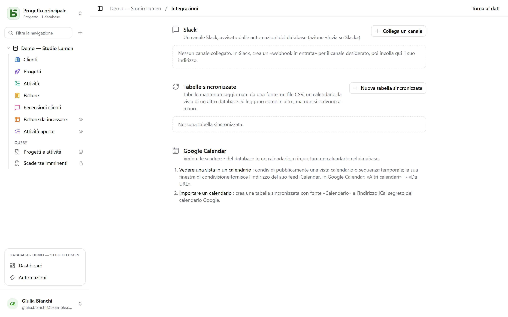

La schermata **Integrazioni** di un database si apre dal menu del profilo, in basso a sinistra.
Richiede il livello **Gestione** e riunisce ciò che collega il database al resto dei tuoi strumenti.

## Slack

**Collega un canale**: in Slack, crea un *webhook in entrata* per il canale desiderato, poi incolla
il suo indirizzo (`https://hooks.slack.com/…`, unica origine accettata). **Prova** invia un messaggio
di prova. L’indirizzo viene cifrato non appena salvato e non viene mai più mostrato.

Il canale collegato diventa poi un’azione delle [automazioni](/basedb/it/fonctionnalites/automatisations/):
**Invia su Slack**, con un messaggio che cita la riga — «Nuova recensione negativa da
{{Auteur}}: {{Avis}}».

## Calendari

Due direzioni, due mezzi:

- **Vedere una vista in un calendario**: condividi pubblicamente una vista calendario o sequenza temporale; la sua
  finestra di condivisione fornisce l’indirizzo di un **feed iCalendar**, a cui ci si abbona da Google
  Calendar («Altri calendari» → «Da URL»), Outlook o Apple Calendar. Vedi
  [Viste condivise](/basedb/it/fonctionnalites/vues-partagees/#un-calendario-nella-tua-agenda).
- **Importare un calendario**: crea una tabella sincronizzata con fonte «Calendario» e l’indirizzo
  iCal segreto del calendario.

## Tabelle sincronizzate

Una tabella sincronizzata è **mantenuta aggiornata da una fonte**: si legge, si filtra e si
mostra in viste come le altre, ma non si scrive a mano — un badge
«Sincronizzata» lo ricorda, e l’API rifiuta qualsiasi scrittura (`TABLE_SYNCED`).

| Fonte | Cosa diventa la tabella |
|---|---|
| **File CSV online** | una colonna per ogni colonna del file, tipizzata in base al contenuto: numero, data o testo |
| **Calendario** (Google Calendar, iCalendar) | un evento per riga: titolo, inizio, fine, luogo, descrizione |
| **Vista condivisa di un basedb** | le righe di una [vista condivisa](/basedb/it/fonctionnalites/vues-partagees/#una-fonte-per-altri-database), su questa istanza o su un’altra |

**Nuova tabella sincronizzata** sceglie la fonte e l’intervallo — da ogni 15 minuti a una
volta al giorno; **Sincronizza** la rilegge subito. Ogni ciclo crea, modifica ed
elimina ciò che serve perché la tabella corrisponda alla fonte, basandosi su un campo
**Chiave di sincronizzazione**. Tutte queste scritture passano per la cronologia.

**Interrompi** la sincronizzazione rende la tabella ordinaria: le sue righe restano, e si possono di
nuovo scrivere a mano.

## Limiti

- Una fonte viene letta entro il limite di 5 MB, 10.000 righe e 10 secondi.
- Una fonte in errore non cancella nulla: la tabella conserva le sue righe fino al ciclo successivo.
- Una colonna comparsa nella fonte dopo la creazione non viene aggiunta.
- Slack si collega tramite webhook in entrata, non ancora tramite un’app Slack.
