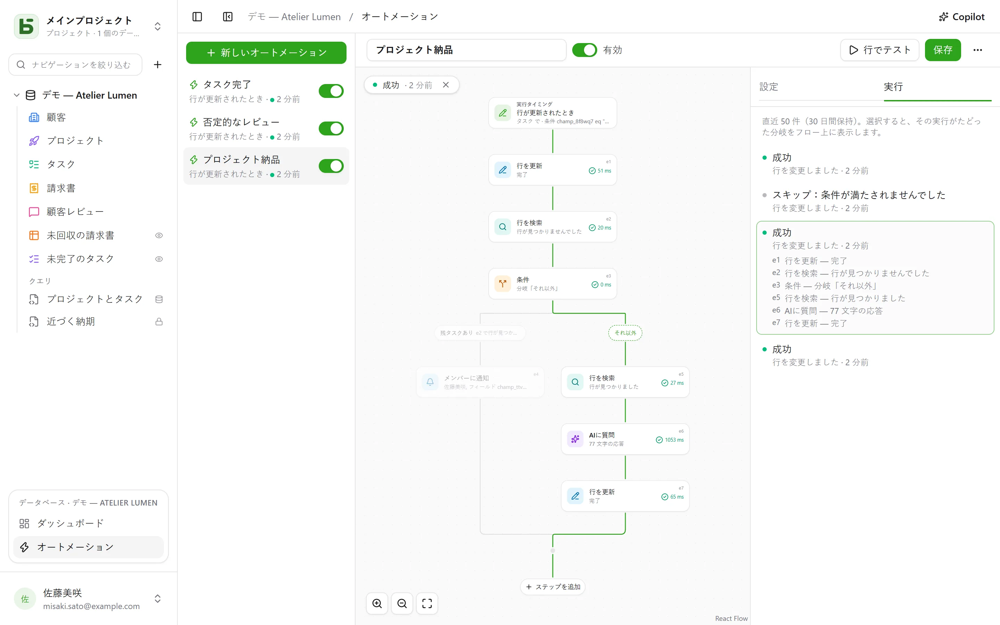

オートメーションは、**いつ**、**どんな条件で**、**何をするか**を定めます。タスクが「Fait」になったら時刻を記録する。否定的なレビューが届いたら担当者に通知してSlackに投稿する。毎週月曜の9時にチームミーティングの行を作成する。1つのアクションでは足りない場合は、**フロー**に沿って進みます。行を検索し、その内容に応じて分岐し、フィルターに一致する行ごとにステップを繰り返し、前のステップで見つけたり書き込んだりしたものを後のステップで再利用し、3日**待機**してから再送し、**PDF**を添付して送ります。

オートメーションは、サイドバー下部にある、開いているデータベースのブロックの**オートメーション**から開きます。**管理**レベルが必要です。



## フロー

フローは上から下へ描かれます。トリガー、そして各ステップです。線上の **+** は、カテゴリー——行、連絡、ドキュメント、AI、ロジック——に分けて検索もできるステップの一覧を開き、選んだステップをその位置に追加します。カードをクリックすると右側に設定が開きます。トリガーとアクションが1つずつの単純なオートメーションなら、カード2枚で済み、これまでどおりに設定できます。

## いつ

| トリガー | 設定 |
|---|---|
| **行が作成されたとき** | テーブル |
| **行が更新されたとき** | テーブル。必要に応じて、監視するフィールドを限定できます |
| **決まった時刻** | 毎時、毎日、または毎週。時刻とタイムゾーンを選びます |
| **ボタンがクリックされたとき** | テーブルの[ボタンフィールド](/basedb/ja/fonctionnalites/tables-et-champs/#ボタン) |
| **行が削除されたとき** | テーブル。ステップは、削除される前の状態の行を引用します |
| **行がフィルターに入ったとき** | テーブルとフィルター。行がフィルターに入ったときにオートメーションが動き、いったん外れるまで再び動きません——「請求書が遅延になった」であって、「遅延中の請求書が更新された」ではありません |
| **日付になったとき** | テーブルの日付フィールド、ずれ——3日前、当日、1週間後——そして時刻。支払期限の督促や契約の記念日などに使えます |
| **Webhookを受信したとき** | なし：オートメーションは自分専用のアドレスを受け取り、それを別のソフトウェアが呼び出します（[詳細](#basedbを呼び出すサービス)） |

行に対するトリガーは、**すべての**書き込みを検知します。インターフェース、API、エージェント、共有フォーム、さらには直接SQLも対象です。オートメーションは、すべての書き込みを記録する履歴を起点に動くためです。

## 条件を満たす場合のみ

任意の条件を[フィルター言語](/basedb/ja/integrations/api-rest/#読み取り)で書きます（`statut eq "fait"`、`montant gte 10000 and payee eq false`）。条件は**実行する時点で**、行に対して評価されます。条件を満たさなかった実行は「スキップ」となり、その旨が表示されます。

## 実行する内容

最大40ステップを順番に実行します。いずれかのステップが失敗すると、それ以降のステップは実行されません——**試行**ブロックの中は除きます（[詳細](#試行)）。

| ステップ | 内容 |
|---|---|
| **行を更新** | トリガーとなった行、またはステップで見つけた・作成した行に値を書き込みます |
| **行を作成** | このテーブル、またはデータベース内の別のテーブルに行を作成します |
| **行を検索** | フィルターに一致する最初の行をテーブルから探し、後続のステップで引用・更新できるようにします |
| **メンバーに通知** | 選んだメンバー、またはメンバーフィールドの人に[通知](/basedb/ja/fonctionnalites/collaboration/#通知)を送ります |
| **メールを送信** | チームのメンバー、メンバーフィールドの人、メールフィールドのアドレス——取引先や仕入先など——、または直接入力したアドレスへ送ります。件名と本文では、行や前のステップを引用できます |
| **Webhookを呼び出す** | サービスへのHTTPSリクエストです。メソッド、アドレス、ヘッダー、本文を自由に設定できます（[詳細](#サービスを呼び出す)）。その応答は後から引用できます |
| **Slackに送信** | [接続済み](/basedb/ja/integrations/synchronisation/#slack)のチャンネルにメッセージを送ります |
| **AIに質問** | 行と前のステップを引用する指示に対して、[AIプロバイダー](/basedb/ja/fonctionnalites/ia/)から回答を得ます（文章の作成、要約、分類など）。回答は、テキスト、数値、はい/いいえ、日付、またはリストの選択肢として読み取られます |
| **条件** | 複数の分岐：条件を満たす最初の分岐が選ばれ、どれも満たさない場合は「それ以外」が選ばれます。分岐はその後で合流します |
| **行ごとに** | 含まれるステップを、フィルターに一致するテーブルの各行について1回ずつ実行します（[詳細](#行ごとに)） |
| **行を削除** | トリガーとなった行、またはステップで見つけた行——ゴミ箱に移動します |
| **集計** | フィルターに一致する行数、その合計、平均、最小値または最大値を求め、後で引用したりテストしたりできます |
| **PDFを生成** | 行の[ドキュメント](/basedb/ja/fonctionnalites/documents/)を作成し、ファイルフィールドに保存するか、メールに添付します |
| **待機** | 指定した時間、またはフィールドの日付まで待ちます（[詳細](#待機)） |
| **試行** | いくつかのステップと、そのいずれかが失敗した場合に実行する別のステップです（[詳細](#試行)） |
| **オートメーションを実行** | データベース内の別のオートメーションを、そのテーブルの行に対して実行します |

検索で何も見つからなくても、フローは止まりません。その行を更新するはずだったステップはスキップされます。その場合に別の処理をしたいときは、検索の下にある<strong>行が見つからない場合…</strong>で、それを判定する条件を追加します。

**条件**は、フィルターで行を判定するか、**値**を判定します。AIの回答、Webhookのコード、合計など——「`{{e2.reponse}}`が緊急と等しい」、「`{{e3.somme.montant}}`が1000以上」。数値は数値どうしで比較し、テキストは大文字小文字とアクセントを無視して比較します。

## 行ごとに

**行ごとに**ステップは、フィルターに一致するテーブルの行を——空なら全件——選んだ順序で、上限（デフォルト50、最大200）まで読み込み、それぞれについて1回ずつ、枠内に置かれたステップを実行します。「毎週月曜、未払いの請求書に督促する」は、**決まった時刻**の後に、`payee eq false and relancee eq false`で絞り込んだ請求書に対する**行ごとに**を置き、ループの中で請求書の連絡先へメールを送り、「督促済み」にチェックを入れる**行を更新**を置く、と書けます。

ループの中では、そのステップの識別子が**ループ中の行**を指します。`{{e1.client}}`でそれを引用でき、**行を更新**では更新できる行の候補としても表示されます。ループの後では、`{{e1.nombre}}`が処理した行数を返します——たとえばSlackへの集計報告などに使えます。フィルターはそれより前のものを引用できます。支払い済みの請求書で発火した場合、`facture eq {{_id}}`でその明細行を絞り込めます。

上限を超えた残りの行は次回の実行を待ち、その旨が示されます。処理済みの行をフィルターから外れるようにしてください——チェック欄や日付など——そうすれば、複数回の実行にわたってすべてを処理できます。ループの中に別のループを置くことはできず、1回の実行は2分で打ち切られます。

## 待機

**待機**ステップは、実行を一時停止します——3時間、2日間——あるいは行のフィールドの日付まで、ずれと時刻を指定して一時停止します：「支払期限の前日、9時に」。実行は**実行**タブに**一時停止**として表示され、再開予定の日時も示されます。

実行は、行を改めて読み直したうえで次のステップに進みます：「見積書を送ってから3日後、まだ承諾されていなければ再送する」は、**待機**3日間、続いてその時点の見積書のステータスを調べる条件、と書けます。オートメーションを無効にすると、一時停止中の実行は止まります。待機は、ループの中にも**試行**ブロックの中にも置けず、最長1年です。

## 試行

**試行**ブロックには2つの経路があります。最初の経路が実行され、そのいずれかのステップが失敗すると、フローは2つ目の経路**失敗時**に続きます。ここでは失敗——`{{e4.erreur}}`（コード）と`{{e4.etape}}`（ステップ）——を引用でき、その後ブロックの後ろに進みます。サービスが応答しないときに、全体を止めずに誰かへ知らせられます。

もっと簡単な方法として、Webhookはサービス障害のあと自動で最大3回まで**再試行**でき、ループは失敗した行があっても**続行**できます。

## PDFとメール

**PDFを生成**は行のドキュメントを作成します——そのテーブルの[テンプレート](/basedb/ja/fonctionnalites/documents/)を使うか、すべてのフィールドを並べた既定の書式になります——そしてファイルフィールドに保存できます。続く**メールを送信**は、ファイルフィールドや画像フィールドのファイルとともに、それを添付できます：

- **宛先ごとに1件**、または**全員に1件**のメール。**CC**の宛先も指定できます。
- 行を引用する**リッチテキスト**のメッセージ（太字、リスト、リンク）。
- **返信先**アドレス：既定ではあなたのアドレス、またはメールフィールドのアドレス。
- 宛先は最大50件、添付ファイルは最大10個、合計15MBまで。

「見積書が承諾済みになったら、請求書を取引先に送り、経理をCCに入れる」：**行がフィルターに入ったとき** `statut eq "accepte"`、**PDFを生成**で請求書テンプレートを使用し、**メールを送信**で取引先のメールフィールドに請求書を添付して送信。

## basedbを呼び出すサービス

**Webhookを受信したとき**トリガーを使うと、オートメーションは専用の秘密のアドレスを受け取り、それを起動させたいソフトウェア——オンラインショップ、外部のフォーム、他のオートメーションツール——に伝えます：

```bash
curl -X POST "https://basedb.example.com/api/v1/hooks/<secret>" \
  -H "content-type: application/json" \
  -d '{"client": {"nom": "Dupont"}, "total": 120}'
```

ステップは送られてきた内容を引用できます：`{{trigger.client.nom}}`、`{{trigger.total}}`。フォームも同様に読み取れ、テキストは`{{trigger.texte}}`で引用します。アドレスはトリガーの設定からコピーできます。**アドレスを変更**で置き換えると、古いアドレスはすぐに無効になります。呼び出しは`202`を受け取り、オートメーションは1秒以内に動き始めます。

## サービスを呼び出す

**Webhookを呼び出す**ステップは、既定では`POST`でオートメーションのデータ——選ばれた行と、前のステップが見つけたり書き込んだりしたもの——を送信します。サービスが期待する形式に合わせて話すために、次を設定できます。

- **メソッド**：`POST`、`PUT`、`PATCH`、`GET`、`DELETE`のいずれか——後の2つには本文がありません。
- **アドレス**：ホスト以降の部分で引用を使えます——`https://api.exemple.fr/clients/{{e2.numero}}`。各値はそこでエンコードされます。
- **ヘッダー**：値の中で引用を使えます：`Idempotency-Key: {{_id}}`。
- **本文**：オートメーションのデータ、**作成するJSON**、**フォーム**（1行につき`キー=値`の組）、または**テキスト**のいずれかです。JSONでは、引用符の中にある引用はテキストとして扱われ、引用符の外にある引用は値——数値、はい/いいえ、リストなど——として扱われます。

```json
{ "facture": "{{e1.numero}}", "montant": {{e1.montant}}, "payee": {{e1.payee}} }
```

APIキーやトークンは、**シークレット**ヘッダー（錠前のアイコン）に入れます。インスタンスの鍵で暗号化され、画面にも、APIにも、Copilotにも二度と表示されず、その値を渡したホストにしか送られません。アドレスのホストを変えると、あらためて入力し直す必要があります。**置き換え**で新しい値を入力します。

## AIに質問

[AIフィールド](/basedb/ja/fonctionnalites/ia/#フィールドのaiオプション)と同じように、このステップは各引用を値に置き換えた指示をプロバイダーに送ります：

```text
Cet avis de {{auteur}} demande-t-il une action de notre part ? {{avis}}
```

**期待する回答**を選びます：自由記述または短いテキスト、数値、はい/いいえ、日付、URL、またはリストからの選択肢です（選択肢は選択フィールドから取り込むこともできます）。モデルにはこの形式が伝えられ、回答にそれが含まれていなければステップは失敗します。後続のステップは`{{e1.reponse}}`で回答を引用します。作成するタスクのタイトル、メッセージ、選択フィールドに使え、選択フィールドでは同じラベルの選択肢に振り分けられます。

指示が引用する内容はプロバイダーに送信されます。そのため、このステップには**同意**が必要で、指示を変更したら改めて同意する必要があります。各呼び出しは記録され、AIフィールドと合わせて`BASEDB_AI_FIELD_QUOTA`（デフォルトで1時間あたり300回）にカウントされます。AIが自ら何かを行うことはありません。書き込みや通知をするのは、その後に置かれたステップです。

## 引用

値、メッセージ、フィルターでは、各テキストの横にある **{ }** ボタンから、それより前のものを引用できます：

- `{{Titre}}`、`{{_id}}`：トリガーとなった行
- `{{e2.titre}}`、`{{e2._id}}`：ステップ`e2`で見つけた・作成した・更新した行。各ステップのカードには、その識別子が表示されています
- `{{e3.statut}}`、`{{e3.reponse.numero}}`：Webhook `e3`の応答
- `{{e4.reponse}}`：AIステップ`e4`の回答
- `{{e5.client}}`：ループ`e5`の中での、ループ中の行。`{{e5.nombre}}`：ループの後で、処理した行数
- `{{e6.nombre}}`、`{{e6.somme.montant}}`、`{{e6.moyenne.montant}}`、`{{e6.max.echeance}}`：ステップ`e6`が集計した値
- `{{e7.erreur}}`、`{{e7.etape}}`：**試行**ブロック`e7`が受け止めた失敗
- `{{e8.nom}}`：ステップ`e8`のPDFの名前
- `{{trigger.client.nom}}`：受信したWebhookが送ってきた内容
- `{{_maintenant}}`：実行時点の日時

引用1つだけからなる値は、値そのものを渡します。リレーション、メンバー、選択肢もそのまま渡るため、作成した行を、検索で見つけた行にリンクできます。フィルター内の引用は常に比較される値であり、フィルター言語として解釈されることはありません。

ステップが引用できるのは、そのステップより前に確実に起きたことだけです。ある分岐で見つけたものは、条件の後では引用できません。エディターは、保存する前にカード上でこれを知らせます。

## Copilot

ヘッダーの**Copilot**を押すと、データベースのオートメーションについて自然言語で会話できるパネルが右側に開きます。「タスクがレビュー中になったら担当者に通知して」「AIによる要約をメモに追加して」「前回の実行はなぜ失敗したの？」。Copilotは回答し、オートメーション全体を**提案**します。画面上のものを変更した案か新しいものかのどちらかで、変更点の一覧も付きます。

Copilotは何も保存しません。**フローに配置**を押すとエディターに提案が表示され、保存する前に確認できます。カード上の**元に戻す**で、フローを元の状態に戻せます。新しいオートメーションは、作成前の状態でエディターに開きます。各提案は保存時と同じように検証され、成り立たない部分は除外され、その旨が示されます。

デフォルトでは、会話とともにAIプロバイダーに送られるのは**構造のみ**です：テーブルとそのフィールド、データベースのオートメーション、エディターに表示されている画面上のオートメーション、そしてその最近の実行(ステータスとエラーコードのみで、値は一切含みません)。メンバーとSlackチャンネルは、識別子ではなく仮の記号（`p1`、`s1`）で送られます。**データの読み取りを許可**にチェックを入れると、その会話の間、Copilotが行を読めるようになります（1回の読み取りにつき最大50行）。読み取った内容は、それぞれ回答の下に一覧表示されます。

## テストと追跡

**行でテスト**は、保存済みのオートメーションを、選んだ行に対して実際に実行します。**実行**タブには、直近50件が30日間保存されます：待機中、実行中、成功、スキップ（理由付き）、失敗（コード付き）。1つを選ぶとフローに重ねて表示され、通った分岐が示され、実行された各ステップが何をしてどれだけ時間がかかったかが表示されます。それ以外の部分はグレーアウトされます。ループの中では、各ステップが実行された回数も表示されます。

## 誰の権限で実行されるか

オートメーションは**最後に保存した人の権限**で動作し、その権限は実行のたびに改めて判定されます。その人が権限を失うと、その権限を必要とするステップは無視されずに失敗し、検索ではその人が閲覧できるものしか見つかりません。履歴には「オートメーション『Tâche terminée』 · …の代理」と表示され、その書き込みも他と同じように元に戻せます。

## 制限事項

- オートメーションによる書き込みは、他のオートメーションをトリガーしません。連続して行うべき処理は、1つのフローにまとめて書くか、**オートメーションを実行**で行います（最大3階層まで）。
- 検索で得られるのは1行（最初の行）だけです。ループは1回の実行につき最大200行を処理します。1回の実行は、待機の時間を除いて最大2分です。
- スクリプトには対応していません。メールはインスタンスの[送信サーバー](/basedb/ja/hebergement/variables/#メール)経由で送られます。
- [データベーステンプレート](/basedb/ja/fonctionnalites/modeles/)に含められるのは、検索、ループ、条件、AIステップのないオートメーションだけで、Webhookは決して含まれません。
- Webhookはリダイレクトに従わず、最大10秒待ちます。2xx以外の応答は、再試行の後にステップを失敗させます。
- 日付になったときのトリガーは1分ごとに確認されます。対象になるのは、オートメーションを保存した後に訪れる日付だけです。
- オートメーションごとに、1時間あたり100回まで実行できます。逃した定時実行は、1回分だけ補われます。
- 書き込みからアクションまでの遅延は、1秒程度です。
