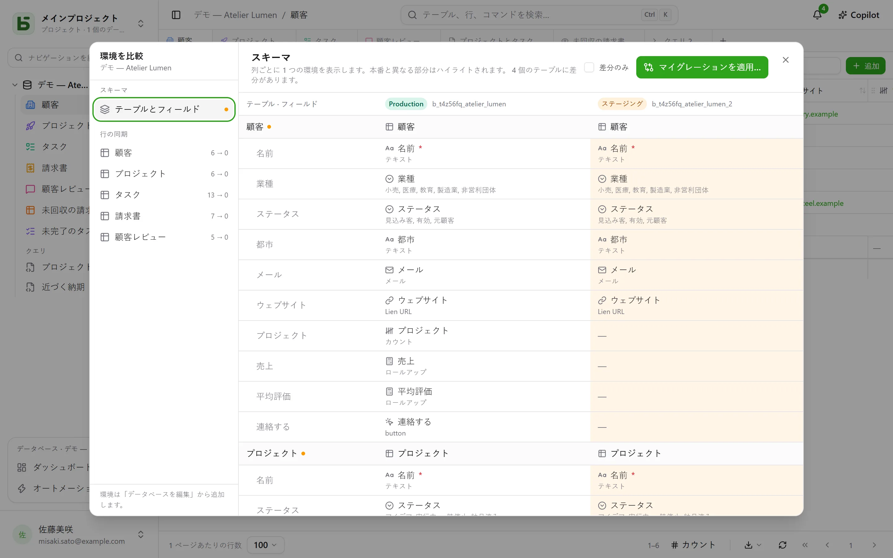

データベースには**環境**を持たせられます：本番、ステージング、開発など。各環境はそれぞれ独立したデータベース（独自のスキーマ、テーブル、行、権限）ですが、すべての環境がデータベース、テーブル、フィールドの**系統**を共有します。

## インターフェースでは

サイドバーには**データベースごとに1行**が表示され、開いている環境を示すバッジから環境を切り替えられます。本番環境しかない間は、バッジは表示されません。

環境の追加、名前の変更、削除は **データベースを編集…** で行います。新しい環境は、別の環境の**構造のコピー**から作られ、行はコピーされません。

## 環境を比較する

データベースのメニューの**その他の操作**にある **環境を比較…** で、ダイアログが開きます：

- **スキーマ**：環境を列に、テーブルとフィールドを行に並べます。本番と異なる部分は強調表示されます。
- **マイグレーションを適用…** は、ある環境から別の環境へ移るための計画を、ステップごとに準備します。移行先で行われたより新しい変更を取り消してしまう項目に、最初からチェックが入ることはありません。
- **行の同期**：テーブルごとに、ある環境から別の環境へ、IDをもとに行を反映します。

## basedbは誰が何を変えたかをどう知るのか

比較は**構造の履歴**に基づいています。テーブルやフィールドの作成、変更、削除はすべてカタログ上のトリガーで記録され、履歴の「スキーマ」タブで確認できます。系統IDが、ステージングのフィールドを本番の対応するフィールドに結びつけます。名前が変わっていても同じです。

## API、SDK、MCPでは

**データベース全体用に作成されたトークン**は、今ある環境も今後追加される環境もすべて開きます。本番とステージングに、トークンは1つで足ります。プログラムまたはエージェントは、呼び出しのたびに環境を選びます：

| 場所 | 方法 |
|---|---|
| [REST API](/basedb/ja/integrations/api-rest/#環境を選ぶ) | ヘッダー`X-Basedb-Environment: recette`、または`?environment=recette` |
| [SDK](/basedb/ja/integrations/sdk/#環境) | `db.environment('recette')` |
| [MCP](/basedb/ja/integrations/mcp/#環境を選ぶ) | アドレス`…/mcp?environment=recette`、またはツールの`environment`引数 |
| [n8n](/basedb/ja/integrations/n8n/#認証情報) | 認証情報の**Environment**フィールド |

どれも指定しなければ、データベース名がそれぞれ自分の環境を指します：本番の名前は本番を、ステージングの名前はステージングを開きます。トークンは、作成時に、表示中の環境だけに限定することもできます。その場合、他の環境は一切見えません。どちらの場合も、トークンの権限は環境ごとに、作成した人の権限と照合されます。

## SQLでは

各環境は1つのスキーマです。本番は`b_t4z56fq_ventes`、ステージングは`b_t4z56fq_ventes_recette`です。スキーマ（または`search_path`）を変えれば、クエリの対象環境が変わります。
