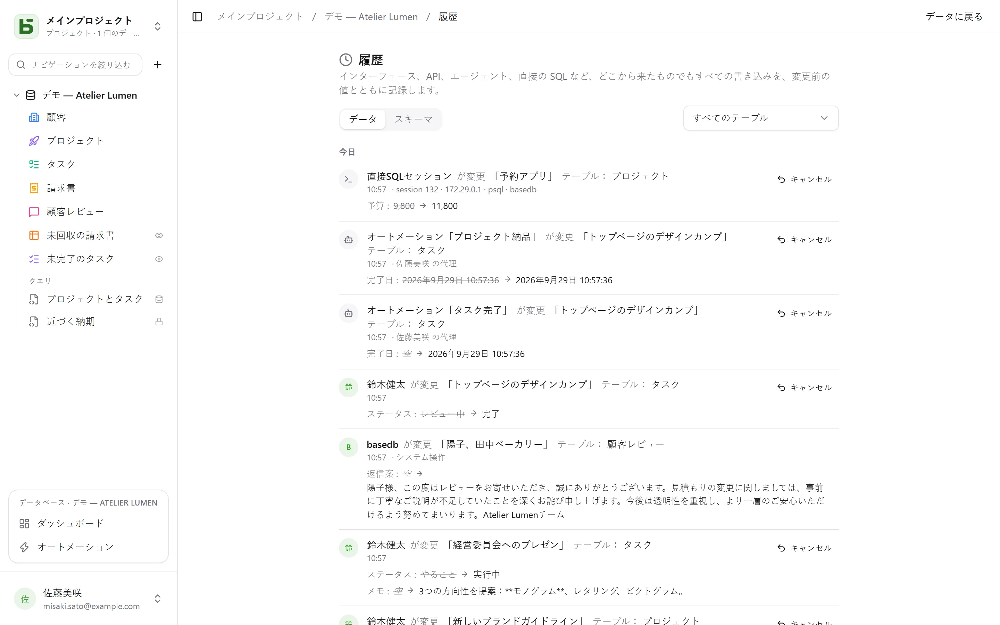

basedbは、どこから来たものでも**すべての書き込み**を履歴に記録します。インターフェース、API、MCPエージェント、公開フォーム、さらには`psql`で手書きしたSQLクエリも対象です。

## 記録のしくみ

記録するのはアプリケーションではなく、書き込みと同じトランザクション内で動く**PostgreSQLのトリガー**です。失敗した書き込みは痕跡を残さず、成功した書き込みが記録から漏れることもありません。リビジョンはその後、月ごとにパーティション分割された不変のログに移されます。

実行者の情報は、各トランザクションの開始時に設定されるセッション変数によって伝えられます。これを持たない書き込み（直接SQL）は、それを実行したセッション（`psql`、アドレス、プロセス）とともに、そのまま記録されます。それを理由に拒否されることはありません。

| 実行者 | 表示 |
|---|---|
| 人 | その人の名前 |
| プログラム（API）またはエージェント（MCP） | トークンを作成した人と、「トークン『…』経由」 |
| 公開フォーム | 「フォーム『…』 · 公開回答」 |
| オートメーション | 「オートメーション『…』 · 〈責任者〉の代理」 |
| 直接SQL | 「直接SQLセッション」 |

## できること

- 行（行の詳細の「履歴」タブ）、テーブル、データベース（データベースの **⋯** メニューの**履歴**）の履歴を**閲覧**し、テーブルで絞り込めます。
- 変更を**元に戻す**：変更前の値が、フィールドごとに再適用されます。
- 削除された行を、その「削除しました」のエントリから**復元**します。
- **構造の履歴**（「スキーマ」タブ）を確認します：作成・変更・削除されたテーブルとフィールド。

## 元に戻す（Ctrl+Z）

グリッドでは、**Ctrl+Z**（Macでは⌘Z）で自分の直前の書き込みを元に戻せます。**Ctrl+Shift+Z**または**Ctrl+Y**でやり直せます。何を元に戻したかはメッセージで確認でき（「元に戻しました：『Montant』の変更」）、元に戻す操作自体を取り消すボタンも付いています。

元に戻せるのは、セル、移動したカードやバー、作成・削除した行、貼り付け、そしてインポート全体（1回の操作として数えます）です。タブごとに、最大50回までさかのぼれます。

これは画面上で元に戻すのではなく、履歴をもとにサーバーが行う**新しい書き込み**であり、これも履歴に記録されます。その後に誰かがその行を変更していた場合は、その人の作業を上書きせずに拒否されます（「元に戻せません：『Statut』はその後変更されています」）。この方法で元に戻せるのは自分の書き込みだけで、直近24時間以内のものに限られ、構造の変更は対象外です。入力中のセル内では、Ctrl+Zはテキストの取り消しとして働きます。

## 権限

履歴は閲覧権限に従います。自分に対して非表示のフィールドは、閲覧するリビジョンに表示されません。
