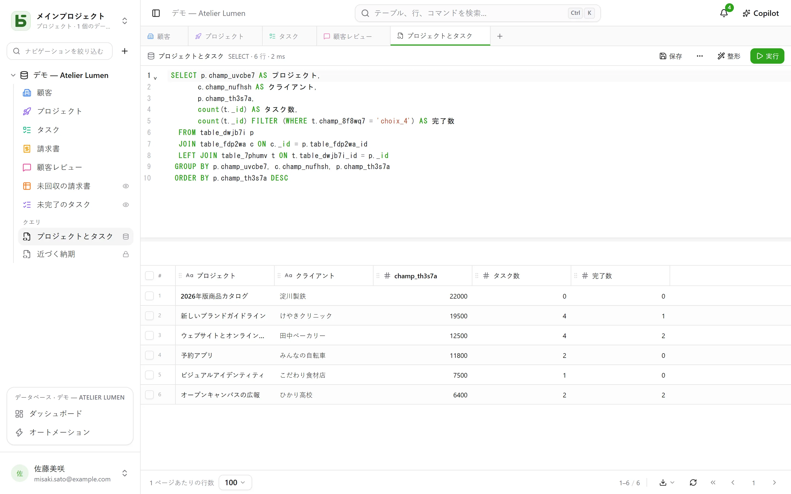
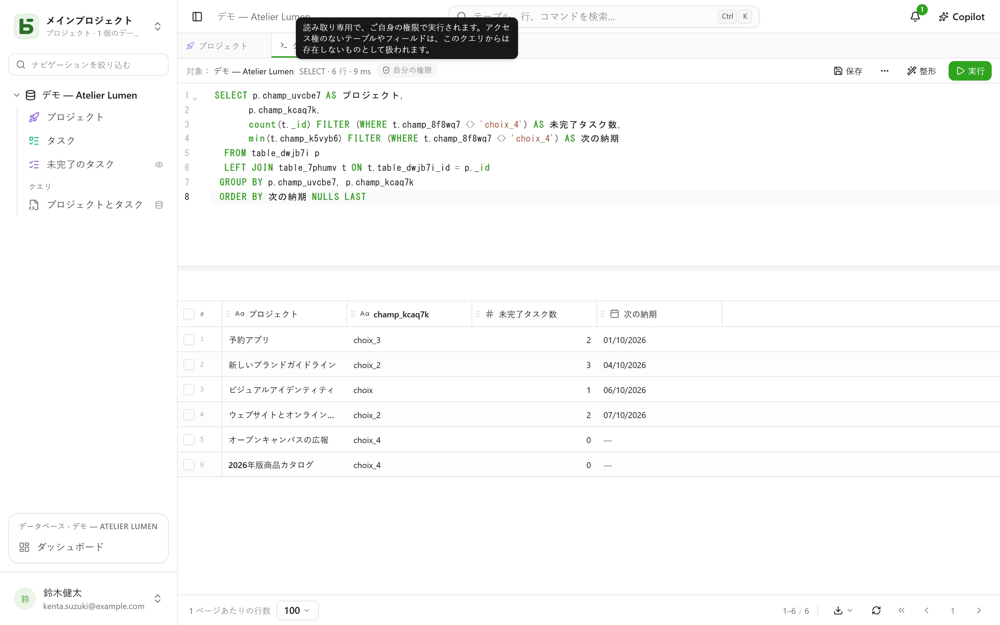
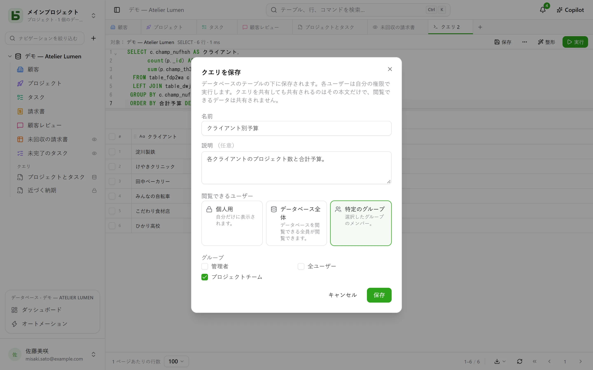
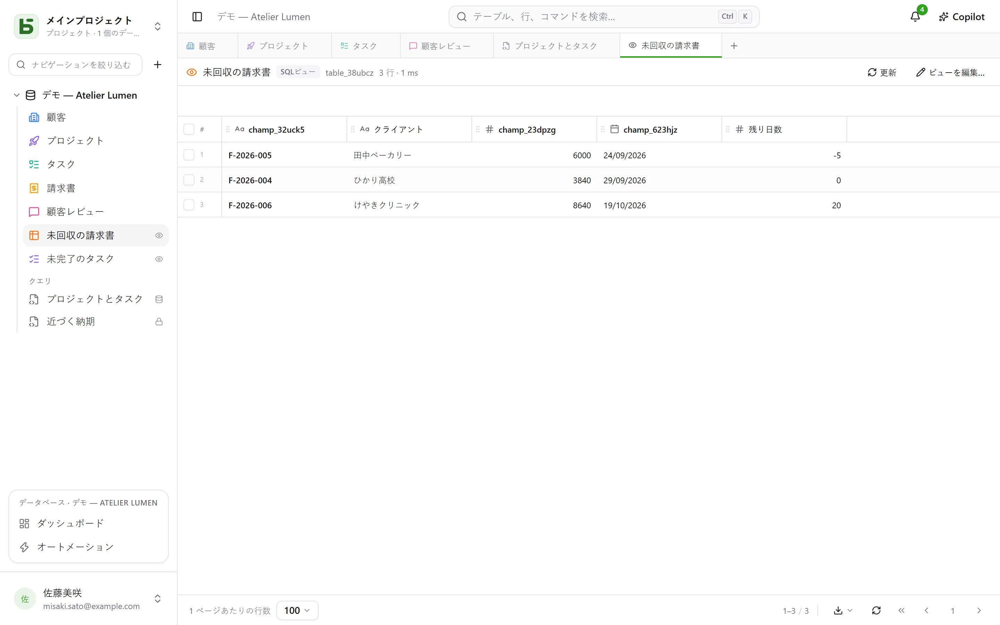
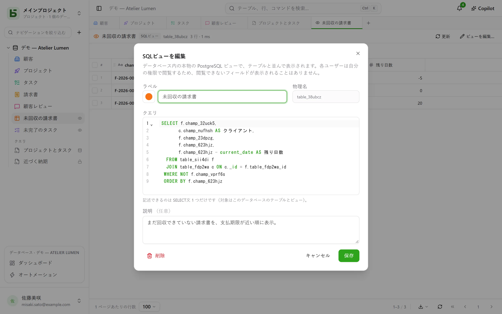

テーブルは本物のPostgreSQLテーブルであり、インターフェースは本来の名前のまま、SQLでテーブルを問い合わせます。データベースのメンバーは誰でもクエリを書き、テーブルの下に**保存**できます（自分用、データベース全体用、または一部のグループ用）。さらに、データベースを管理する人は、それを**SQLビュー**にできます。テーブルと並んで表示される本物のPostgreSQLビューで、`psql`や各種ツールからも読めます。



## 各自の権限で

タブバーの **+**、またはデータベースの **⋯** メニュー → **SQLクエリ** で、SQLタブが開きます。シンタックスハイライトと補完付きのエディターで、**Ctrl+Enter**で実行し、結果はテーブルと同じグリッドに表示されます。クエリが読める範囲は、実行する人によって決まります：

- データベースに対して**管理**レベルがあれば、データベース全体を、書き込みも含めて扱えます。
- **閲覧**または**編集**レベルの場合、クエリは**読み取り専用で、自分の権限で**実行されます。閉じられたテーブルはクエリから見て存在せず、非表示のフィールドは`SELECT *`から消え、テーブル名で修飾しても名前を指定すれば拒否されます。書き込みは拒否されます。結果には**自分の権限**バッジが表示されます。



振り分けているのは画面ではありません。PostgreSQL自体が、その人専用のロールで、列ごとに権限を適用します。そのため、グリッド、API、MCPサーバーで見られないものを、クエリで見ることはできません。

## クエリを保存する

タブのバーにある**保存**で、クエリはデータベースのテーブルの下の**クエリ**セクションに保存されます。クリックひとつで再び開けます。**⋯** → **名前を付けて保存…** でコピーを作成し、**名前と共有…**（タブ内、またはサイドバーのメニュー）で名前の変更、公開範囲の変更、削除ができます——**削除**は、右クリックのメニューからも実行できます。それを表示していたタブは、その内容を保持したままになります。



| 範囲 | 見られる人 | 作成・変更できる人 |
|---|---|---|
| **個人**（鍵アイコン） | 自分のみ | データベースを見られる人なら誰でも（自分用として） |
| **データベース全体** | データベースを見られる人全員 | データベースに対する**管理**レベル |
| **グループ** | 選んだグループのメンバー | データベースに対する**管理**レベル |

**クエリを共有しても、共有されるのはその本文だけで、作成者が読める内容は共有されません。** 各自が自分の権限で実行します。同じクエリでも、2人が開けば、それぞれに見る権利のあるものが表示されます。あるいは、ある列がその人には存在しないことが示されます。

サイドバーから開いたクエリは、**すぐに読み取り専用で実行**されます。何も決めなくても結果が表示されます。その後は **実行** で、そのまま再実行します。名前の横の点は、保存後に本文を変更したことを示します。**保存**すると、変更できるクエリならそこに保存され、そうでなければ新しいクエリとして保存することを提案します。

## SQLビュー

**SQLビュー**は、データベースのスキーマにある本物のPostgreSQLビューです。**テーブルと並んで**配置され、テーブルと同じように色とアイコンを持ち、右側にはビューであることを示す小さな**目**のアイコンが付きます。クリックするとタブで開き、行がグリッドに表示されます。**更新**で読み直せます。



SQLビューは、データベースの **⋯** メニュー → **新しいSQLビュー…** から、またはSQLタブで **⋯** → **SQLビューを作成…** から作成します。後者の場合、タブのクエリがその定義になります。ダイアログでは次の項目を入力します：

- **ラベル**と**外観**：色、アイコン、画像を、テーブルと同じように選びます。
- **技術名**：指定しなければラベルから生成されます。`FROM`の後に書く名前です。
- **クエリ**：データベースのテーブルと他のビューに対する`SELECT`を1つ。PostgreSQLが受け付けないものは拒否され、エディターがその箇所を示します。



作成したビューは、その名前で読めます。インターフェースからも、`psql`やBIツールからも同じです：

```sql
SELECT * FROM b_t4z56fq_demo_atelier_lumen.factures_a_encaisser;
```

**ビューが、見えないフィールドを見せることはありません。** 各自が、ビューが読むすべてのテーブルとすべての列に対して、自分の権限でビューを読みます。サイドバーには、ビューが読むものをすべて閲覧できる人にだけ表示されます。ビューが読めるのは**自分の**データベースだけです。他のデータベースやbasedbのカタログは、作成時点で拒否されます。作成、変更、削除には、データベースに対する**管理**レベルが必要です。**削除**は、サイドバーのメニューから実行でき、スクリプトやツールを含め、全員からそのビューを取り除きます。ビューが読んでいるテーブルは影響を受けません。

### 構造が変わったとき

- テーブルやフィールドの**名前を変更**しても、ビューは壊れません。PostgreSQLが追従します。
- ビューが読む計算フィールドの**数式を変更**すると、ビューはいったん取り除かれ、新しい列に対して再作成されます。成り立たなくなった場合、ビューは定義を保ったまま**要修正**の状態になり、サイドバーに三角形のアイコンが表示されます。**ビューを編集…** から修正して保存してください。
- ビューが読んでいるテーブルはパージされず、他のビューが読んでいるビューは削除されません。拒否の際には、原因となっているビューが示されます。

## クエリ、SQLビュー、質問のどれを使うか

| | 内容 | 置き場所 | 用途 |
|---|---|---|---|
| **保存済みクエリ** | SQLテキスト | テーブルの下、「クエリ」セクション | クエリを見つけ直す、テキストとして共有する |
| **SQLビュー** | 本物のPostgreSQLビュー | テーブルと並べて | 読み取りに名前を付け、インターフェース**と**`psql`、スクリプト、各種ツールで使う |
| **質問** | マウス操作またはSQLで作る読み取りと、その可視化 | [ダッシュボード](/basedb/ja/fonctionnalites/tableaux-de-bord/)内 | 数値、グラフ、クロス集計表をフィルター付きで表示する |

## 制限事項

- グリッドに表示されるのは、画面下部で選んだ**1ページあたりの行数**までです。超えた場合は「切り捨て」と表示されます。クエリは15秒で停止します。
- SQLビューはSQLとインターフェースで読めますが、REST APIとMCPサーバーでは公開されません。
- SQLビューは、作成された環境にとどまります。環境の作成、構造の比較、テンプレートとしての保存では、まだ持ち出せません。
