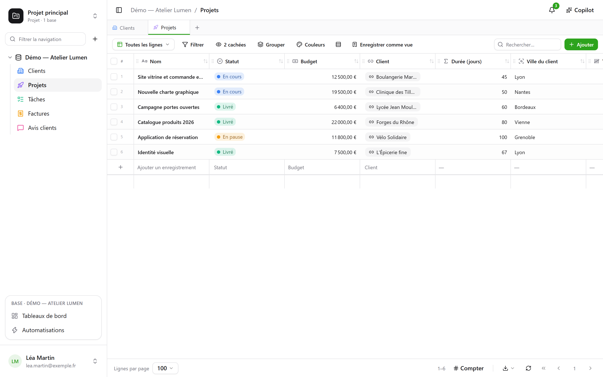
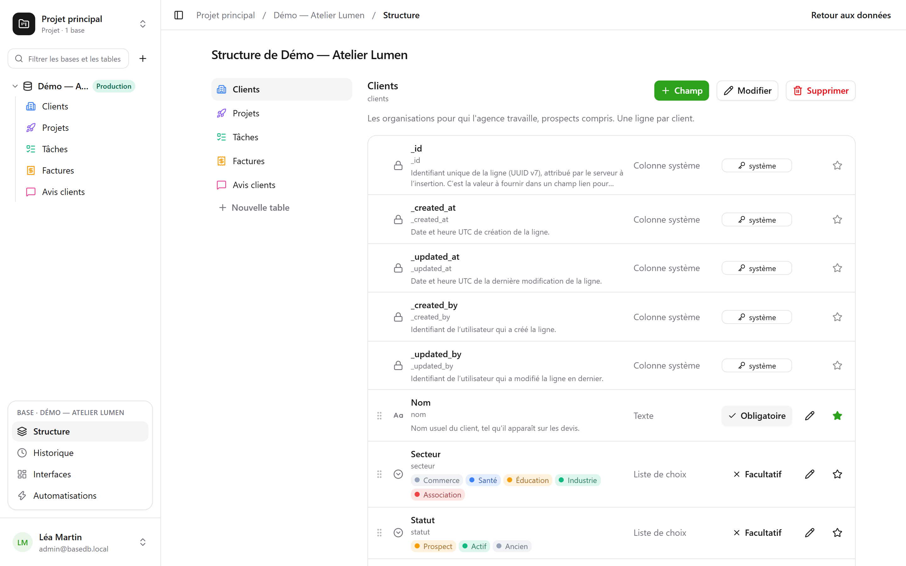

basedbの各テーブルはPostgreSQLのテーブルであり、各フィールドは型付きの列です。入力したラベル（「Échéance」）は、安定した**スラッグ化**によって読みやすい物理名（`echeance`）になります。アクセント記号を除き、小文字にし、予約語を避けます。

## フィールドの型

| 型 | PostgreSQLの列 | 備考 |
|---|---|---|
| 短文テキスト | `text` | 1行 |
| 長文テキスト | `text` | Markdown：グリッドには抜粋、ホバーでレンダリング表示、専用エディター。[列を引用](#リッチテキストと変数)できます |
| リッチテキスト | `text` + `CHECK` | 書き込み時にサニタイズされるHTML。ビジュアルエディターで編集します（[後述](#リッチテキストと変数)） |
| 数値 | `numeric` | 浮動小数点は使いません。金額に誤差が生じません |
| 通貨、パーセント、期間、評価 | `numeric` | 数値とその[表示形式](#表示形式)：`12,50 €`、`15 %`、`1:30`、★★★★☆ |
| チェックボックス | `boolean` | |
| 日付 | `date` | |
| 日時 | `timestamptz` | 絶対的な時点。閲覧者のタイムゾーンで表示されます |
| 単一選択 | `text` + `CHECK` | 選択肢ごとに色、アイコン、画像を設定できます |
| 複数選択 | `text[]` + `CHECK` | 配列演算子でフィルターできます |
| メール | `text` + `CHECK` | データベースが検証するアドレス。クリックで開けます |
| 電話番号、バーコード | `text` | 短文テキストとその形式：発信リンク、等幅フォント |
| URL | `text` + `CHECK` | 入力時に補完されます（`exemple.fr` → `https://exemple.fr`） |
| メンバー | `uuid` | ワークスペースのメンバー。指定するとその人に[通知](/basedb/ja/fonctionnalites/collaboration/)されます |
| 自動採番 | `bigint` IDENTITY列 | 既存の行にも番号を振ります。誰も入力しません |
| リレーション | `uuid` + `FOREIGN KEY` | 対象テーブルへの本物の外部キー |
| 複数リレーション | `uuid[]` | 複数のリンク先の行。整合性はトリガーで保たれます |
| 数式 | 生成列`STORED` | PostgreSQLが計算します（または読み取り時に計算。[数式](#数式)を参照） |
| ルックアップ、ロールアップ、カウント | なし | 読み取り時に、リレーションをたどって計算されます |
| ボタン | なし | アドレスを開くか、[オートメーション](/basedb/ja/fonctionnalites/automatisations/)を実行します |
| ファイル、画像 | `jsonb`（メタデータ） | バイト列は[ファイルストレージ](/basedb/ja/fonctionnalites/fichiers/)に保存されます |

各テーブルには**システム列**もあります：`_id`（UUID v7）、`_created_at`、`_updated_at`、`_created_by`、`_updated_by`。トリガーで管理され、APIから書き込むことはできません。グリッドでは、列メニューの**システム情報**にまとめられています。すべてのテーブルにありますが、役立つ場面は多くありません。



## データベースが保証する制約

インターフェースが約束することを、PostgreSQLが保証します。単一選択は`CHECK`制約、リレーションは`FOREIGN KEY`、URLやメールアドレスは正規表現です。これらに違反する直接SQLでの書き込みは、インターフェースと同じように拒否されます：

```text
Check constraints:
  "ck_opportunites__statut__enum" CHECK (statut = ANY (ARRAY['nouveau', 'qualifie', …]))
Foreign-key constraints:
  "fk_opportunites__clients_id" FOREIGN KEY (clients_id) REFERENCES b_t4z56fq_ventes.clients(_id)
```

## 表示形式

通貨、パーセント、期間、評価、電話番号、バーコードは型と同じように選べますが、実際には**形式**です。列は数値またはテキストのままで、表示だけが変わります。

| 形式 | 対象 | 表示と入力 |
|---|---|---|
| 通貨 | 数値 | `12 500,00 €` — ユーロ、ドル、ポンド、スイスフラン、カナダドル、円 |
| パーセント | 数値 | `15 %` |
| 期間 | 秒数 | `1:30`。`1h30`、`90 min`とも入力できます |
| 評価 | 数値 | 1〜10個の星。クリックで設定します |
| 電話番号 | 短文テキスト | 発信リンク |
| バーコード | 短文テキスト | 等幅フォント |

形式はあとから（フィールドの編集画面の**表示**で）変更でき、保存済みの値には影響しません。形式は値を制限しません。5段階の評価に7を入れても、7のままです。

## 数式

数式はフランス語で書きます。フィールドは角かっこで囲み、引数は`;`で区切ります：

```text
ARRONDI([Montant HT] * (1 + [Taux de TVA]); 2)
SI([Payée]; FAUX; JOURS(AUJOURDHUI(); [Échéance]) > 0)
JOURS([Fin]; [Début])
```

エディターには、挿入できるフィールドと関数のパネルが表示されます。エラーが起きると、原因となったフィールドや文字が示されます。

| 分類 | 関数 |
|---|---|
| 論理 | `SI`、`SIVIDE`、`ESTVIDE`、`ET`、`OU`、`NON`、`VRAI`、`FAUX` |
| 数値 | `ARRONDI`、`ABS`、`PLAFOND`、`PLANCHER`、`MIN`、`MAX` |
| テキスト | `MAJUSCULE`、`MINUSCULE`、`SANSESPACES`、`GAUCHE`、`DROITE`、`LONGUEUR`、`TEXTE`、`NOMBRE` |
| 日付 | `ANNEE`、`MOIS`、`JOUR`、`JOURSEMAINE`、`JOURS`、`AJOUTER_JOURS`、`DATE`、`AUJOURDHUI`、`MAINTENANT` |
| 演算子 | `+ - * /`、テキストの連結には`&`、`= <> < <= > >=` |

数式はPostgreSQLの**生成列**になります。`psql`や各種ツールからも、ほかの列と同じように読めます。日付に依存する数式（`AUJOURDHUI()`、`MAINTENANT()`）や、ルックアップ・ロールアップを参照する数式は**読み取り時に計算**されます。basedb内ではフィルターや並べ替えに使えますが、直接SQLからは存在しません。

数式から別の数式やリレーションを直接参照することはできません。それにはルックアップを使います。テキストの一部の抽出や置換には、今後対応する予定です。

## ルックアップ、ロールアップ、カウント

次の3つのフィールドは、**リレーションをたどって**、どちらの方向にも値を読み取ります。「プロジェクトの顧客」だけでなく、「『Projet』でリンクされたタスク」も対象です：

- **ルックアップ**は、リンク先の行の値、またはその値の一覧を取得します。例：プロジェクトの顧客の都市。
- **ロールアップ**は、リンク先の行について計算します：値の数、合計、平均、最小、最大。例：顧客の売上高、その顧客のレビューの平均評価。
- **カウント**は、リンク先の行を数えます。例：プロジェクトのタスク数。

これらは読み取りのたびに、**読む人の権限で**計算されます。リンク先のテーブルにアクセスできなければ、このフィールドも見えません。フィルターや並べ替えに使えます。たどれるリレーションは1つだけで、書き込みはできず、列を持たないため直接SQLには存在しません。また、インポート、フォーム、履歴にも含まれません。

## リレーション

**リレーション**は、ある行を同じデータベース内の別のテーブルの行に結びつけます。グリッドには対象の行の**表示値**、つまりそのテーブルの表示フィールドとして指定した列の値が表示されます。フィルターはリレーションをたどれます（`clients_id.ville eq "Lyon"`）。ある行を参照している行は、その行の詳細に表示されます。

**複数の行をリンク**にチェックを入れると、リレーションは**複数リレーション**になります。1つのタスクが複数のタスクに依存したり、1つの記事が複数のカテゴリーに属したりできます。リンクされた行はバッジで表示され、検索して選び、行の詳細からクリックで開けます。対象の行を削除すると、それを参照していた一覧から外されます。設定によっては、削除自体を拒否することもできます。`has_any`、`has_all`、`is_null`フィルターが使え、これらもリレーションをたどれます（`taches_ids.titre contains "logo"`）。複数リレーションは、並べ替え、グループ化、インポートにはまだ対応していません。

## ボタン

**ボタン**フィールドには値がなく、アクションを実行します。**アドレスを開く**（`https://`または`mailto:`。行の値を引用できます：`mailto:{{E-mail}}`）か、同じテーブルでボタンをトリガーとする**オートメーションを実行**します。セル、カード、行の詳細に表示されます。

## 説明

データベース、テーブル、フィールドには**説明**を付けられ、マイグレーションなしで変更できます。説明は、`psql`が読む`COMMENT ON`、生成されるドキュメント、そしてエージェントが`describe_table`で読む内容にコピーされます。

## リッチテキストと変数

**リッチテキスト**は長文テキストのHTML版で、フィールドの作成時に選びます（「リッチテキスト (HTML)」）。見出し、太字、斜体、下線、取り消し線、リスト、引用、コード、リンク、区切り線を、ビジュアルエディターで扱えます。HTMLは、インターフェース、API、MCPサーバー、インポートのいずれから来たものでも**書き込み時にサニタイズ**されます。さらに`CHECK`制約が、SQLで直接書き込まれた危険な形式（`<script>`、`on…`属性、`javascript:`）も拒否します。画像、表、色は使えません。データベースが保持しないものは、最初から提供しません。

長文テキスト（通常でもリッチでも）は、**同じ行の列を引用**できます。エディターの**列**メニューで、カーソル位置に引用を挿入します。リッチテキストではバッジとして、Markdownでは`{{Ville}}`として挿入されます。

> 配送予定日は`{{Livraison}}`、配送先は`{{Ville}}`です。

- 列には、書かれたとおりの引用が物理名で保存されます（`{{ville}}`）。これが`psql`で読める内容です。
- それ以外のすべての場所（グリッド、行の詳細、API、MCPサーバー、共有ビュー、オートメーション）では、テキストは**その行の値に置き換えて**読まれます：「配送予定日は02/10/2026、配送先はLyonです。」都市を変えれば、テキストも変わります。
- 単一選択はラベルで、メンバーは名前で、日付は各自の形式で表示されます。リッチテキストに挿入された値が、マークアップとして解釈されることはありません。
- 読む人が閲覧できない列からは何も表示されません。値も名前も出ません。

リッチテキストをAIで埋めることはできません。モデルが書くのはテキストであり、サニタイズされたHTMLではないからです。

## スキーマを変更する

データベースの**スキーマ**画面（サイドバーの **⋯** メニュー内）には、テーブルとそのフィールドが一覧表示されます。追加、名前の変更、必須化、並べ替え、説明の記入、表示フィールドの指定ができます。



構造の変更には**管理**レベルが必要です。このレベルがない場合、画面は閲覧専用になり、ボタンも鉛筆アイコンもハンドルも表示されません。必須設定と表示フィールドは表示されますが、変更はできません。いずれにしてもサーバーはすべての変更を拒否しますが、画面が受け付けるふりをすることもありません。

フィールドの追加、名前の変更、型の変更は**マイグレーションエンジン**を通ります。段階的な計画、短時間のロック、そしてデータを変換できない場合には理由を明示した拒否が行われます。

**名前の変更**は、データベース、テーブル、フィールドのいずれも1つのダイアログで行います。ラベルは常にマイグレーションなしで変わります。管理者には、その下に「データベース上の名前も変更：`clients` → `comptes`」が表示されます。チェックを入れると物理名も変わり、影響分析が表示されます。古い名前を参照しているクエリ、SQLビュー、オートメーションの一覧です。古い名前は、クエリを更新するまでの間、**互換エイリアス**（ビュー）によって引き続き利用できます。

削除しても、すぐには何も消えません。テーブルやデータベースは退避され（`zz_supprime_…`）、SQLでは引き続き読めます。削除したデータベースは復元できます。テーブル単体をインターフェースから復元する機能は[今後対応予定](/basedb/ja/feuille-de-route/)です。完全な**パージ**はシステム管理者だけが実行でき、30日後に、検証済みのCSVエクスポートから始まります。
