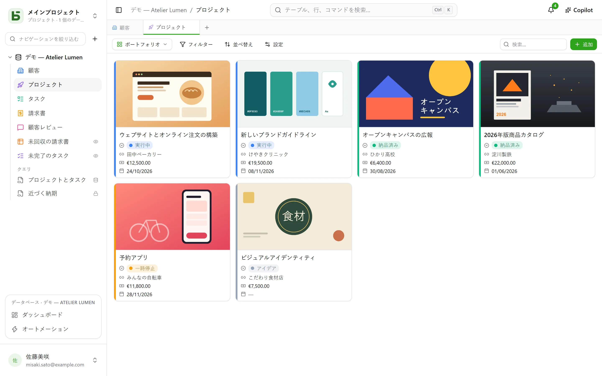
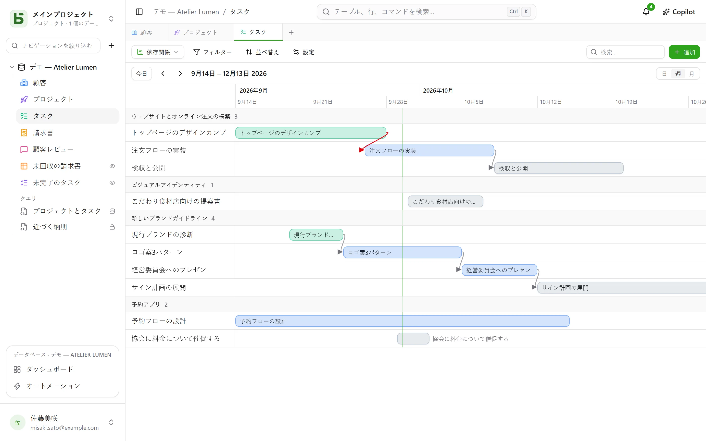
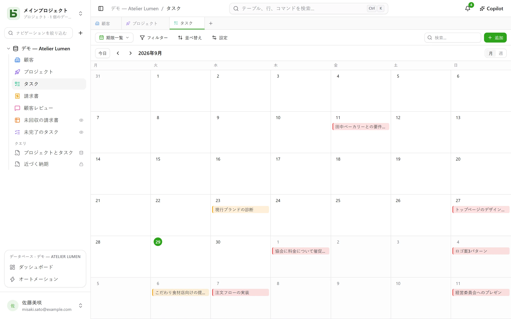
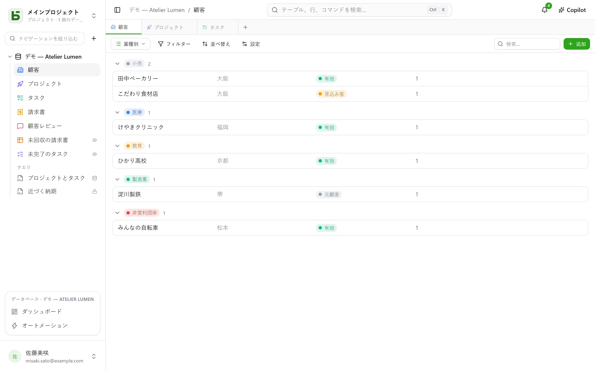

テーブルは**10通りの方法**で表示できます。ビューはデータを一切コピーせず、テーブル自体を超える権限を与えることもありません。

:::note
これらのビューは、**1つの**テーブルを表示する方法です。[SQLビュー](/basedb/ja/fonctionnalites/requetes-et-vues-sql/)は別物で、データベースのテーブルに対してSQLで書かれた本物のPostgreSQLビューであり、サイドバーではテーブルと並んで表示されます。
:::

| ビュー | 表示内容 | 必要なもの |
|---|---|---|
| **グリッド** | 行（フィルター、並べ替え、グループ化、列の選択が可能） | — |
| **カンバン** | 列に並んだカード | 単一選択フィールド |
| **カレンダー** | 日付に配置された行（月表示または週表示） | 日付フィールド |
| **タイムライン** | 2つの日付の間のバーと、その依存関係 | 開始日 |
| **ギャラリー** | カバー画像付きのカード | — |
| **リスト** | 1件につき1行、折りたたみ可能なグループ | — |
| **地図** | 地図上に配置された各行 | 住所、または緯度と経度 |
| **フォーム** | 行を作成するための質問ページ | — |
| **アンケート** | 同じ質問を1画面に1つずつ | — |
| **クイズ** | 採点される質問を1画面に1つずつ、最後にスコアを表示 | — |

## ビューセレクター

「フィルター」の左にあります。「すべての行」はテーブルのグリッドで、誰も保存しておらず、削除もできません。続いて、データベースを構築する人が決めた順序で**コラボレーションビュー**が並び、最後に**マイビュー**が並びます。一番下の**ビューを作成**では、10種類が2つのグループ——**行の閲覧**と**回答の収集**（フォーム、アンケート、クイズ）——に分かれています。

- **コラボレーションビュー**は全員に表示されます。作成、設定、名前の変更、並べ替え、削除には**管理**レベルが必要です。**ロック**することもでき、鍵アイコンがそれを示します。ロックを解除するまで、誰も変更できません。
- **個人ビュー**は自分にしか表示されず、テーブルの閲覧権限だけで作れます。**個人ビューを作成**するか、フィルターと並べ替えをしたあとで**ビューとして保存**します。各自が自分なりの見方を保存でき、他の人には何の影響もありません。コラボレーションビューを**複製**すると、個人用のコピーができます。

## ツールバー

グリッドの上に、次の順で並んでいます：

- **フィルター**：フィールドごとの条件を組み合わせます。
- **列**：表示する項目を選びます。システム列は「システム情報」の下に別にまとめられています。
- **グループ化**：単一の値を持つフィールド（単一選択、リレーション、メンバー、日付、数値、テキスト、チェックボックスなど）で、行を折りたたみ可能なグループにまとめます。各グループには、フィルター全体に対する件数が表示されます。
- **色分け**：単一選択に基づいて、または**ルール**（フィルターと色の組み合わせ、最大20個）に基づいて行に色を付けます。線、背景、またはその両方で表示できます。
- **行の高さ**：低、中、高、特大。
- 右端の **検索…** は、入力に合わせてすべての列を検索します。Escで検索をクリアします。カンバン、カレンダー、タイムライン、ギャラリー、リストでも使え、ビューに保存されることはありません。

各列の下には、ページ内だけでなくフィルターに該当するすべての行で計算された**集計**があります：入力済み、空、一意の値、合計、平均、最小、最大、チェック済み。

## カンバン、カレンダー、タイムライン

- **カンバン**は単一選択に従ってカードを並べます。カードをドラッグすると行が更新され、列の先頭の「+」で、その選択肢が設定された行を作成できます。各カードには、タイトル、カバー画像、選択したフィールド、そして行の値を引用する**説明**が表示されます（「`{{Date}}`に`{{Client}}`へ配送予定」）。説明はビューの設定で、**フィールドを挿入**ボタンを使って書きます。
- **カレンダー**は各行をその日付に配置します（終了日も指定できます）。行を別の日へドラッグすると、日付がずれます。
- **タイムライン**は開始日と終了日の間にバーを描き、単一選択またはリレーションでグループ化します。**依存先**の設定（テーブル自身へのリレーション）を使うと、各タスクから依存先のタスクへ矢印が引かれ、時間をさかのぼる場合は赤く表示されます。

## ギャラリーとリスト

- **ギャラリー**はカードを表示します：**カバー画像**（トリミングまたは全体表示）、サイズ（小、中、大のカード）、単一選択による色分け。
- **リスト**は1件につき1行を表示し、単一選択、リレーション、メンバーで**グループ化**します。

カンバン、ギャラリー、リストでは、カードや行をドラッグして**手動で並べ替え**られます（最大5,000件）。並べ替え条件を指定すると、そちらが優先されます。

## 地図

**地図**は、以下に基づいて各行を配置します：

- **住所**——短文テキストで、できれば**住所**形式（[テーブルとフィールド](/basedb/ja/fonctionnalites/tables-et-champs/)を参照）にします：「12 rue des Lilas, Lyon」のように；
- または**緯度**と**経度**——2つの数値フィールドで、そのままの値が使われます。

ピンは単一選択の**色**をまとい、ホバーで行の**タイトル**を表示し、クリックでその詳細を開きます。地図はビューのフィルターと並べ替えに従い、最大2,000行まで表示します。

住所は、インスタンスのジオコーディングサービス——デフォルトではOpenStreetMap——によって**一度限り特定**されます。そのペースに従うため、新しい地図では応答が届くたびにピンが現れます（1件あたり約1秒）が、以降は即座に表示されます。バッジには、配置済みの行数、まだ特定中の住所の数、特定できなかった住所の数が示されます。見つからない住所は黙って除外されるのではなく、（町名や郵便番号などの）修正が必要であることが示されます。

:::note[サーバーの外に出る情報]
住所のテキストはジオコーディングサービスへ送られ、各閲覧者のブラウザーはタイルサーバーからベースマップを読み込みます。インスタンスの運用者は、別のサービスを選ぶことも、いずれも使わないこともできます。[環境変数](/basedb/ja/hebergement/variables/#地図と住所)をご覧ください。
:::

## フォームとアンケート

質問にチェックを入れて、順序を決めます。各質問には見出し、ヘルプテキスト、回答例があり、必須にすることもできます。フォームにはタイトル、説明文、ボタンのラベル、送信後のお礼メッセージを設定できます。basedb内で入力するほか、[リンクで共有](/basedb/ja/fonctionnalites/formulaires-partages/)することもできます。

最初に設定することは何もありません。新しいフォームは、ステータスや担当者、あとでチームが入力するリレーションではなく（それらが必須でない限り）、回答者が答える内容だけを尋ねます。フォームはテーブルの色をまとい、テーマはライトで、空の各フィールドには適した回答例が表示されます。それ以外はいつでも変更できます。

- **外観**：8つのテーマ——ライト、やわらか、夜明け、海、森、夜、紙、ミニマル——、アクセントカラー、フォント、左揃えまたは中央揃え。
- **今日の日付をあらかじめ入力**：日付の質問に今日の日付が入った状態で表示されます（日時の質問なら現在の時刻も）。回答者はそのまま使うことも、変更することもできます。
- **表示条件を設定…**：直前の回答が求めるときだけ質問が表示されます（「感情がネガティブ」「評価が2以下」）。非表示の質問は必須にならず、送信もされません。
- **その他のオプション**：開始・送信ボタン、番号表示、進捗バー、次の質問への自動送り、メッセージと終了ボタン（「サイトに戻る」）、紙吹雪。

**アンケート**は画面全体を占め、所要時間を伝える開始画面のあと、質問が1つずつスライドして表示されます。キーボードだけでも操作できます：続けるには**Enter**、選択には文字**A**、**B**、**C**…、はい・いいえには**Y**または**N**、評価には数字——単一選択の場合は自動で次の質問に進みます。送信すると、チェックマークが描かれ、フォームの色の紙吹雪が舞ってお祝いします。

## クイズ

クイズは得点を数えるアンケートです。各質問の下で、その**正解**と配点——何も指定しなければ**1点**、最大100点まで——を設定します。

| 質問 | 正解 |
|---|---|
| 単一選択 | 1つの選択肢 |
| 複数選択 | チェックすべき選択肢すべて、それ以外は含めない |
| チェックボックス | はい・いいえ |
| 数値、評価 | 数値 |
| 日付 | 日付 |
| 短文テキスト、メール、URL | `;`で区切った1つまたは複数の正解——大文字・小文字、アクセント記号は区別されません |

正解のない質問——名前やコメントなど——は、採点されずに出題されます。クイズを作成するには、採点対象の質問が少なくとも1つ必要です。

残りは**採点**セクションで設定します。

- **答え合わせ**：**質問ごとに**——回答はすぐに検証され、正しければ緑、間違っていれば赤で正解が示され、画面上部のスコアが増えていきます——、**最後に**——スコアのあと答え合わせ——、または**なし**——スコアのみで、正解は明かされません。
- **合格ライン**：得点のパーセンテージ。終了画面には「合格！」または「今回は不合格…」と表示されます。
- **得点の保存先**：テーブルの数値フィールドで、各回答のスコアが記録されます。これでグリッドを並べ替えれば、順位表になります。「スコア」「得点」「ポイント」という名前のフィールドは自動的に選ばれます。

終了画面には、満ちていくリングでスコアが示され、パーセンテージ、そして「なし」でない限り、採点された各質問について回答と正解が表示されます。直前の回答によって非表示になった質問は、合計に含まれません。

:::note
アプリケーション内では、ビューを閲覧できる人は正解も見られます。[共有リンク](/basedb/ja/fonctionnalites/formulaires-partages/#共有クイズ)からは、正解がサーバーの外に出ることは決してありません。採点も集計もサーバーが行います。
:::

## ビューを共有する

データビュー（グリッド、カンバン、カレンダー、タイムライン、ギャラリー、リスト）は、リンクで**読み取り専用で共有**したり、他のサイトに埋め込んだりできます。カレンダーはカレンダーフィードにもなります。[共有ビュー](/basedb/ja/fonctionnalites/vues-partagees/)をご覧ください。

## 閲覧者に見えないもの

ビューは**閲覧者ごとに再構成**されます。その人に非表示のフィールドは、列、カード、質問から消えます。非表示のフィールドをフィルターに使っているビューは、まったく表示されません。フィルターなしで表示すると、本来見せるべき範囲を超えて表示してしまうからです。
