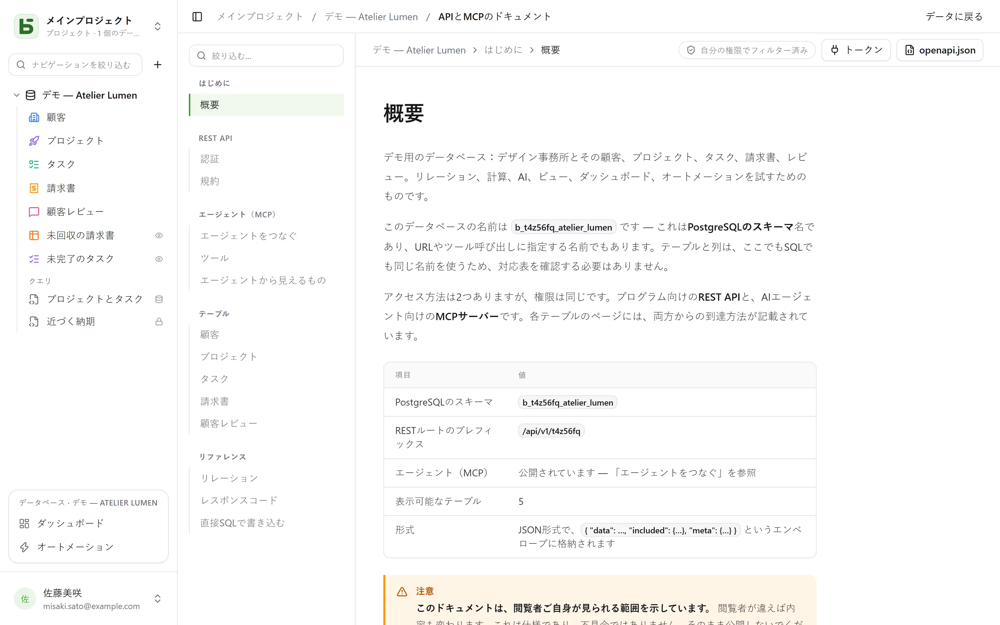

REST APIは、インターフェースが使っているものと同じです。**非公開のルートは存在しません**。URLには物理名が使われます。SQLで読むときと同じ名前です。

```text
/api/v1/<tenant>/data/<base>/<table>
/api/v1/t4z56fq/data/b_t4z56fq_ventes/opportunites
```

## トークン

インターフェースで、データベースの **⋯** メニュー → **APIとエージェント** → **APIとMCPのトークン…** を開きます。データベース、またはそのプロジェクトに対して**管理**レベルを持つ人が、パスワードを確認したうえで、このデータベース（すべての環境、または1つの環境のみ）に限定された**連携トークン**をここで作成します——パスワードを持たず、IDプロバイダーでログインするアカウントは、まだそれができません。デフォルトは読み取り専用です。トークンは一度しか表示されないので、環境変数に保存してください。

トークンは読み取りを行い、書き込み権限で作成されていれば作成・変更も行い、**そのために作成されていれば削除も行います**——「読み取り、書き込みと削除」の権限です。ただし、連鎖的なリレーションによって他の行も一緒に削除されてしまう行は除きます。作成した人を超える権限を持つことはありません。

```bash
export BASEDB_TOKEN=bdb_…
curl "http://localhost:3000/api/v1/t4z56fq/data/b_t4z56fq_ventes/opportunites?limit=20" \
  -H "Authorization: Bearer $BASEDB_TOKEN"
```

## 環境を選ぶ

複数の[環境](/basedb/ja/fonctionnalites/environnements/)——本番、ステージング…——を持つデータベースでも、データベース全体用に作成されたトークンにとっては**1つ**のデータベースのままです。パスには本番の名前でデータベースを指定し、ヘッダー`X-Basedb-Environment`が環境を選びます：

```bash
curl "http://localhost:3000/api/v1/t4z56fq/data/b_t4z56fq_ventes/opportunites" \
  -H "Authorization: Bearer $BASEDB_TOKEN" \
  -H "X-Basedb-Environment: recette"
```

- ヘッダーがなければ、パスが指す環境になります：`b_t4z56fq_ventes`は本番、`b_t4z56fq_ventes_recette`はステージングで——どちらの書き方も有効です。
- `?environment=recette`は、ヘッダーを付けられないクライアント向けに、同じ働きをします。
- 環境は、そのバッジの名前で指定します。大文字・小文字とアクセント記号は区別されません。`production`でも指定できます。データベースにない環境は、存在しないリソースと同じく`404`を返します。
- `GET /api/v1/<tenant>/meta/bases`は、各環境を`environment`ブロック（`label`、`production`）とともに一覧します。ヘッダーを付けると、その環境だけが一覧されます。

作成時に1つの環境だけに限定されたトークンは、他の環境を一切開きません：ヘッダーを付けても何も変わりません。権限は常に、環境ごとに、作成した人の権限と照合されます。

## 読み取り

| パラメーター | 役割 |
|---|---|
| `filter` | 読みやすい式：`statut eq "gagne" and montant gte 10000` |
| `sort` | `-montant,nom` |
| `fields` | 返す列 |
| `limit`、`after` | 暗号化されたカーソルによるページング：あるページの`meta.next_cursor`を`after`に渡すと次のページが得られます（`meta.has_next_page`） |
| `links=display` | リレーションを表示値付きで返します |
| `count=exact` | 総件数（上限は100,000） |
| `variables=raw` | 長文テキストを、[行の値](/basedb/ja/fonctionnalites/tables-et-champs/#リッチテキストと変数)に置き換えず、`{{colonne}}`を含めて書かれたとおりに返します |

演算子：`eq`、`ne`、`eq_ci`、`contains`、`starts_with`、`ends_with`、`in`、`is_null`、`gt`、`gte`、`lt`、`lte`、`between`。これらを`and`、`or`、`not`と括弧で組み合わせます。フィルターはリレーションをたどれます：`clients_id.ville eq "Lyon"`。

## 書き込み

```bash
curl -X POST "http://localhost:3000/api/v1/t4z56fq/data/b_t4z56fq_ventes/opportunites" \
  -H "Authorization: Bearer $BASEDB_TOKEN" -H "content-type: application/json" \
  -d '{"values": {"nom": "Audit RGPD", "statut": "nouveau", "montant": 12000}}'
```

`PATCH …/<table>/<_id>`は、同じ本文`{"values": {…}}`で行を更新します。エラーの形式は1つに統一されています：`{ "code": "…", "details": {…}, "request_id": "…" }`。コードは原因ごとに固定です。

各書き込みは`x-basedb-transaction`ヘッダーを返します。これを`POST /api/v1/<tenant>/history/undo`（`{"transaction": "…"}`）に渡すと、インターフェースのCtrl+Zと同じように書き込みが元に戻ります。その後に行が変更されていた場合は拒否されます。

## 行以外の操作

同じトークンで、次の操作ができます：

| ルート | 役割 |
|---|---|
| `GET …/data/<base>/<table>/aggregate` | フィルターに該当する全行の集計：`aggregates=montant:sum,nom:filled`、`group=statut` |
| `GET …/data/<base>/<table>/<_id>/comments`、`POST` | 行のコメントの読み書き |
| `POST /api/v1/<tenant>/automations/<id>/run` | ボタンをトリガーとするオートメーションを、行に対して実行します（`{"record": "…"}`） |
| `GET /api/v1/<tenant>/meta/bases/<base>/dashboards` | データベースのダッシュボード |
| `GET /api/v1/<tenant>/meta/users` | ワークスペースのメンバー（メンバーフィールド用） |
| `GET /api/v1/<tenant>/meta/templates` | ギャラリーのデータベーステンプレート |
| `GET /api/v1/<tenant>/events?base=<base>&table=<table>` | テーブルをリアルタイムで追跡します：信号を返し、その後は上記のルートで読み直します（[Webhook](/basedb/ja/integrations/webhooks/#webhookなしテーブルを追跡する)を参照） |

[共有ビュー](/basedb/ja/fonctionnalites/vues-partagees/)は、アカウントなしで読めます：`GET /api/v1/views/<jeton>`と`…/rows`はJSONで、`…/calendar.ics`はiCalendarで取得できます。

構築（オートメーション、ダッシュボード、連携の作成）は、インターフェースのセッションに限られます。トークンは行を読み書きするためのもので、データベースを変更するものではありません。

## 色とアイコン

テーブルと、単一選択・複数選択フィールドの各選択肢には、色（`color`、`#rrggbb`）とアイコン（`icon`、インターフェースが描画する[Lucide](https://lucide.dev/icons/)のアイコン名：`truck`、`circle-check`、`flame`…）があります。`GET …/meta/bases/<base>`は、データベース、そのテーブル、フィールドの選択肢について、これらを返します。

これらを指定するには、構造を変更できる人のアクセストークン（`POST /auth/session/access`）を使います——連携トークンはデータベースを変更しません：

| ルート | 本文 |
|---|---|
| `POST …/admin/bases/<base>/tables` | `{"label": "Tickets", "color": "#dc2626", "icon": "flame", "fields": […]}` |
| `PATCH …/admin/bases/<base>/tables/<table>` | `{"color": "#2563eb", "icon": "inbox"}`——3つのキー`color`、`icon`、`image`は一緒に扱われます：1つでも指定すると、3つとも置き換えられます |
| `POST …/admin/bases/<base>/tables/<table>/fields` | `{"label": "Priorité", "kind": "select", "options": [{"value": "haute", "color": "#dc2626", "icon": "flame"}, …]}` |
| `PUT …/admin/bases/<base>/tables/<table>/fields/<champ>/options` | オプションの一覧全体を、順番どおりに、それぞれの色とアイコンとともに渡します |

エージェントは[MCPサーバー](/basedb/ja/integrations/mcp/#色とアイコン)を通じて、これらの変更を**提案**します。フィールドにはアイコンを選ぶ項目がありません：インターフェースは、その型のアイコンを描画します。

## テンプレートからのデータベース作成

インストールされるアプリケーションは、**1回の呼び出し**でデータベースを作成します：サーバーがテンプレートを適用し——テーブル、フィールド、リレーション、サンプル行、ビュー、ダッシュボード、オートメーション——、いずれかのステップが失敗した場合は、データベースを何も残しません。

```bash
curl -X POST "http://localhost:3000/api/v1/t4z56fq/admin/bases" \
  -H "Authorization: Bearer $ACCES" -H "content-type: application/json" \
  -d '{"template": "crm", "label": "Ventes", "rows": false}'
```

`template`は、ギャラリーのテンプレートのキー、または[テンプレート形式](/basedb/ja/fonctionnalites/modeles/)に沿ったテンプレート全体です。`Accept: application/x-ndjson`ヘッダーを付けると、応答は1行ずつ届きます：ステップごとに`{"step": …}`の行が送られ、最後に作成されたデータベースが届きます。この呼び出しには、データベースを作成できる人のアクセストークンが必要です（ログイン後の`POST /auth/session/access`）：連携トークンは既存のデータベースしか開けません。

## トークンの検証

basedbのトークンは、basedbの外では検証できません。トークンを受け取ったアプリケーション——例えば、本人のトークンを使ってbasedbから開かれたツール——は、自分自身の連携トークンを使って、そのトークンの価値を尋ねます（イントロスペクション、RFC 7662）：

```bash
curl -X POST "http://localhost:3000/auth/introspect" \
  -H "Authorization: Bearer $BASEDB_TOKEN" \
  --data-urlencode "token=$JETON_RECU"
```

```json
{ "active": true, "token_type": "access_token",
  "sub": "0195a…", "email": "claire@example.com", "name": "Claire Martin",
  "tenant": "t4z56fq", "groups": ["Commerciaux"], "exp": 1790000000 }
```

価値のないトークン——不明、期限切れ、取り消し済み、セッション終了、別のワークスペース——は、理由を示さずに`{"active": false}`と応答します。応答はリアルタイムで読み取られます：ログアウトはすぐに反映されます。連携トークンの場合、応答にはそれが開くデータベース（`base`、その本番）、すべての環境を開くのか（`environments`：`all`）1つだけなのか（`one`）、そのアクセス権（`read`、`write`、または`delete`）、そしてその窓口も含まれます。

## 生成されるドキュメント

各データベースには、**APIとMCPのドキュメント**ページがあります。テーブルごとに、エンドポイント、列、cURLとJavaScriptの例が載っています。**自分の権限で絞り込まれる**ため、2人の閲覧者はそれぞれ別の版を見ることになり、**画面の言語で**書かれます。OpenAPI 3.1版（`/api/v1/<tenant>/meta/bases/<base>/openapi.json`）もあり、Bearerトークンと`X-Basedb-Environment`ヘッダーが宣言されています。名前、パス、エラーコードは、どの言語でも変わりません。


