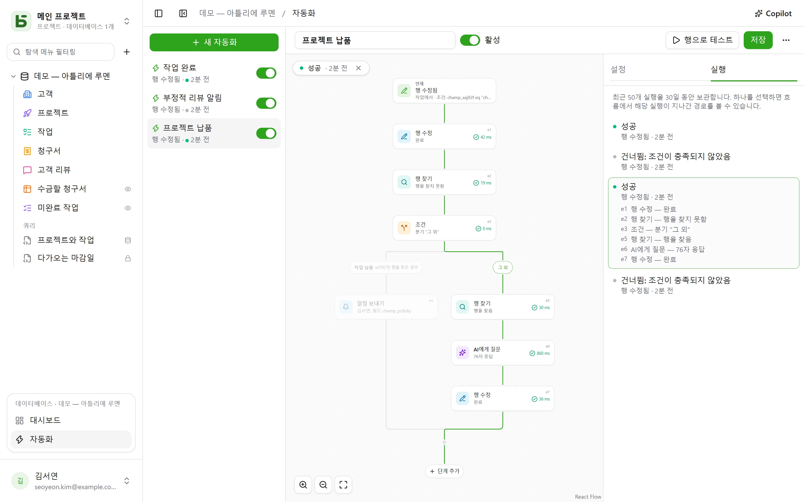

자동화는 **언제**, **어떤 조건에서**, **무엇을** 할지 정합니다. 작업이 “Fait”로 바뀌면 시각을
기록하고, 부정적인 후기가 들어오면 담당자에게 알리고 Slack에 글을 올리며, 매주 월요일 9시에
팀 회의 행을 만듭니다. 동작 하나로 부족할 때는 **흐름**을 따릅니다. 행을 찾고, 그 내용에
따라 이 분기나 저 분기로 가고, 앞 단계에서 찾거나 쓴 것을 다음 단계에서 다시 사용합니다.

자동화는 사이드바 아래쪽의 열린 데이터베이스 블록에 있는 **자동화**에서 열며, **관리** 권한이
필요합니다.



## 흐름

흐름은 위에서 아래로 그려집니다. 먼저 트리거, 그다음 각 단계입니다. 선 위의 **+** 버튼은 그
위치에 단계를 추가하고, 카드를 누르면 오른쪽에 설정이 열립니다. 트리거 하나와 동작 하나로
된 간단한 자동화는 카드 두 장이면 되고, 예전과 같은 방식으로 설정합니다.

## 언제

| 트리거 | 설정 |
|---|---|
| **행 생성됨** | 테이블 |
| **행 수정됨** | 테이블, 필요하면 감시할 필드만 |
| **정해진 시각** | 매시간, 매일 또는 매주, 선택한 시각과 시간대 |
| **버튼 클릭** | 테이블의 [버튼 필드](/basedb/ko/fonctionnalites/tables-et-champs/#버튼) |

행 트리거는 **모든** 쓰기를 봅니다. 인터페이스, API, 에이전트, 공유 양식, SQL 직접 쓰기까지
모두입니다. 자동화는 모든 쓰기를 남기는 기록에서 출발하기 때문입니다.

## 다음 경우에만

[필터 언어](/basedb/ko/integrations/api-rest/#읽기)로 작성하는 선택적 조건입니다
(`statut eq "fait"`, `montant gte 10000 and payee eq false`). 조건은 **동작하는 시점의** 행을
기준으로 평가됩니다. 조건을 충족하지 않은 실행은 “건너뜀”으로 표시되며, 그 이유를 알려 줍니다.

## 그러면

최대 30개 단계가 순서대로 실행되며, 한 단계가 실패하면 이후 단계는 실행되지 않습니다.

| 단계 | 하는 일 |
|---|---|
| **행 수정** | 트리거한 행, 또는 앞 단계에서 찾거나 만든 행에 값을 씀 |
| **행 생성** | 이 테이블이나 데이터베이스의 다른 테이블에 행을 만듦 |
| **행 찾기** | 필터에 맞는 테이블의 첫 번째 행을 찾아, 다음 단계가 인용하거나 수정할 수 있게 함 |
| **알림 보내기** | 선택한 사람들이나 사람 필드에 지정된 사람에게 [알림](/basedb/ko/fonctionnalites/collaboration/#알림)을 보냄 |
| **이메일 보내기** | 팀 구성원에게, 사람 필드에 지정된 사람에게, E-mail 필드의 주소로 — 고객이나 공급업체 —, 또는 직접 입력한 주소로 보냄; 제목과 본문에서 행과 이전 단계를 인용함 |
| **웹훅 호출** | 원하는 주소로 HTTPS `POST`를 보내며, 그 응답을 이후 단계에서 인용할 수 있음 |
| **Slack으로 보내기** | [연결된](/basedb/ko/integrations/synchronisation/#slack) 채널에 메시지를 보냄 |
| **AI에게 질문** | 행과 이전 단계를 인용하는 지시문(작성, 요약, 분류)에 대한 [AI 공급자](/basedb/ko/fonctionnalites/ia/)의 응답을 텍스트, 숫자, 예/아니요, 날짜 또는 목록 중 선택 값으로 읽음 |
| **조건** | 여러 분기: 조건을 충족하는 첫 번째 분기로 가고, 아무것도 충족하지 않으면 “그 외”로 감. 분기는 이후 다시 합쳐짐 |

찾기 단계가 아무것도 찾지 못해도 흐름은 멈추지 않습니다. 찾은 행을 수정해야 했던 단계는
건너뜁니다. 이 경우 다른 동작을 하려면 조건으로 확인합니다. 필터가 비어 있는 분기는 찾기
단계가 행을 찾았을 때 선택됩니다.

## AI에게 질문

[AI 필드](/basedb/ko/fonctionnalites/ia/#필드의-ai-옵션)와 마찬가지로, 이 단계는 각 인용을
해당 값으로 바꾼 지시문을 공급자에게 보냅니다.

```text
{{auteur}} 님의 이 후기에 우리가 조치를 취해야 하나요? {{avis}}
```

**기대하는 응답**을 선택합니다. 자유 텍스트나 짧은 텍스트, 숫자, 예/아니요, 날짜, 웹 주소,
또는 목록 중 선택 값이며, 목록은 단일 선택 필드에서 가져올 수 있습니다. 모델에게도 이 형식이
전달되며, 응답에 해당 형식의 값이 없으면 단계가 실패합니다. 다음 단계는 이 응답을
`{{e1.reponse}}`로 인용합니다. 새로 만드는 작업의 제목이나 메시지에 넣을 수 있고, 단일 선택
필드에 넣으면 레이블이 같은 선택 값으로 들어갑니다.

지시문이 인용하는 내용은 공급자에게 전송됩니다. 그래서 이 단계는 **동의**를 요청하며,
지시문이 바뀌면 다시 동의해야 합니다. 모든 호출은 로그에 남고, AI 필드와 함께
`BASEDB_AI_FIELD_QUOTA`(기본값 시간당 300회)에 포함됩니다. AI는 스스로 아무것도 하지
않습니다. 쓰기나 알림은 그 뒤에 놓인 단계가 합니다.

## 인용

값, 메시지, 필터에서는 각 텍스트 옆의 **{ }** 버튼으로 앞선 내용을 인용합니다.

- `{{Titre}}`, `{{_id}}`: 트리거한 행
- `{{e2.titre}}`, `{{e2._id}}`: `e2` 단계가 찾거나 만들거나 수정한 행. 각 단계의 식별자는
  카드에 표시됩니다.
- `{{e3.statut}}`, `{{e3.reponse.numero}}`: 웹훅 `e3`의 응답
- `{{e4.reponse}}`: AI 단계 `e4`의 응답
- `{{_maintenant}}`: 실행 시각

인용 하나로만 이루어진 값은 값 자체를 그대로 전달합니다. 관계, 사람, 선택 값도
마찬가지입니다. 이렇게 해서 새로 만든 행을 찾기 단계가 찾은 행과 연결합니다. 필터 안의
인용은 항상 비교할 값이며, 필터 언어로 해석되지 않습니다.

단계는 자신보다 앞서 확실히 일어난 일만 인용할 수 있습니다. 한 분기에서 찾은 것은 조건
이후에는 인용할 수 없습니다. 편집기는 저장하기 전에 카드에 이를 표시합니다.

## Copilot

머리글의 **Copilot**을 누르면 오른쪽에 데이터베이스 자동화에 관한 자연어 대화가 열립니다.
“작업이 검토 단계로 넘어가면 담당자에게 알려 줘”, “메모에 AI 요약을 추가해 줘”, “마지막
실행이 왜 실패했어?” 같은 요청을 할 수 있습니다. Copilot은 답하고, 변경 사항 목록과 함께
전체 자동화를 **제안**합니다. 화면에 있는 자동화를 수정한 것일 수도, 새 자동화일 수도
있습니다.

Copilot은 아무것도 저장하지 않습니다. **흐름에 적용**을 누르면 제안이 편집기에 표시되고,
저장하기 전에 검토할 수 있습니다. 카드의 **취소**를 누르면 흐름이 원래대로 돌아갑니다. 새
자동화는 편집기에서 열리며, 직접 만들어야 합니다. 모든 제안은 저장할 때와 똑같이 검증되며,
맞지 않는 부분은 제외되고 그 사실이 표시됩니다.

기본적으로 AI 공급자에게는 대화와 함께 **구조 정보만** 전송됩니다. 테이블과 그 필드,
데이터베이스의 자동화, 편집기에 표시된 그대로의 현재 자동화, 그리고 최근 실행의 상태와 오류
코드이며, 값은 절대 전송되지 않습니다. 사람과 Slack 채널은 식별자 대신 표식(`p1`, `s1`)으로
전송됩니다. **데이터 읽기 허용** 확인란을 선택하면 해당 대화에서 Copilot이 행을 읽을 수
있으며(읽기당 최대 50행), 읽은 내용은 각 응답 아래에 나열됩니다.

## 테스트와 모니터링

**행으로 테스트**는 저장된 자동화를 선택한 행에서 실제로 실행합니다. **실행** 탭에는 최근
50개 실행이 30일 동안 보관됩니다. 대기 중, 진행 중, 성공, 건너뜀(이유 포함), 실패(오류 코드
포함)로 표시됩니다. 실행 하나를 선택하면 흐름 위에 표시됩니다. 거쳐 간 경로가 그려지고,
실행된 각 단계에는 무엇을 했는지와 걸린 시간이 표시되며, 나머지는 흐리게 표시됩니다.

## 누구의 권한으로 동작하나요

자동화는 **마지막으로 저장한 사람의 권한**으로 동작하며, 이 권한은 실행할 때마다 다시
확인됩니다. 그 사람이 권한을 잃으면 그 권한이 필요한 단계는 그냥 넘어가지 않고 실패하며,
찾기 단계는 그 사람이 읽을 수 있는 것만 찾습니다. 기록에는 “자동화 ‘Tâche terminée’ ·
명의: …”로 표시되며, 자동화의 쓰기도 다른 쓰기처럼 실행 취소할 수 있습니다.

## 제한

- 자동화가 쓴 내용은 다른 자동화를 트리거하지 않습니다. 연달아 일어나야 하는 동작은 하나의
  흐름에 작성합니다.
- 찾기 단계는 첫 번째 행 하나만 반환합니다. “각 행에 대해”나 대기(“3일 후”)는 아직 없습니다.
- 스크립트는 없습니다. 이메일은 일반 텍스트로, 수신자마다 한 통씩 — 단계당 최대 스무 통 —
  인스턴스의 [발송 서버](/basedb/ko/hebergement/variables/#이메일)를 통해 보내지며, 답장은
  자동화를 소유한 사람에게 도착합니다.
- 조건은 행을 기준으로 확인합니다. AI의 응답에 따라 분기하려면 먼저 그 응답을 행의 필드에
  쓰세요.
- [데이터베이스 템플릿](/basedb/ko/fonctionnalites/modeles/)에는 찾기, 조건, AI 단계가 없는
  자동화만 포함됩니다.
- 자동화 하나당 시간당 100회까지 실행됩니다. 놓친 정시 일정은 한 번만 따라잡습니다.
- 쓰기와 동작 사이의 지연은 1초 안팎입니다.
