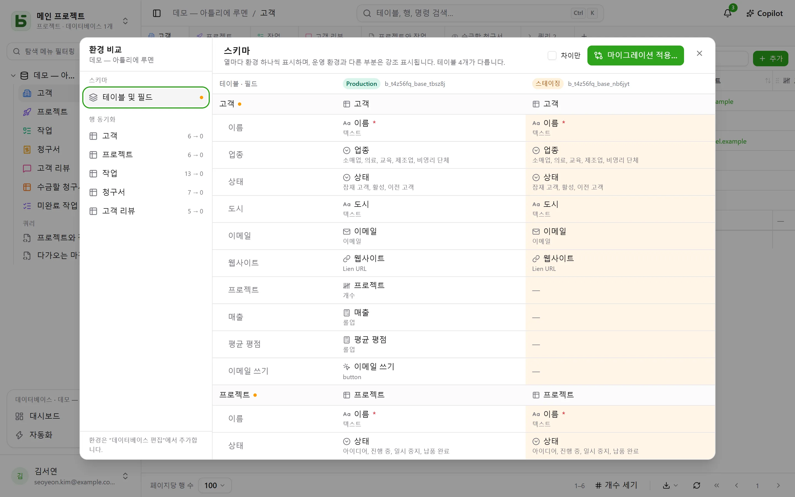

데이터베이스에는 **환경**을 둘 수 있습니다. 운영, 스테이징, 개발 등입니다. 각 환경은 스키마,
테이블, 행, 권한을 모두 갖춘 독립된 데이터베이스이며, 모든 환경은 데이터베이스와 그 테이블,
필드의 **계보**를 공유합니다.

## 인터페이스에서

사이드바에는 **데이터베이스마다 한 줄**이 표시되며, 배지가 열려 있는 환경을 알려 주고 환경을
전환할 수 있게 합니다. 운영 환경만 있는 동안에는 배지가 표시되지 않습니다.

환경은 **데이터베이스 편집…** 메뉴에서 추가하고, 이름을 바꾸고, 삭제합니다. 새 환경은 다른
환경의 **스키마 복사본**으로 만들어지며, 행은 복사되지 않습니다.

## 환경 비교

데이터베이스 메뉴의 **기타 작업** 아래에 있는 **환경 비교…** 메뉴를 누르면 대화 상자가
열립니다.

- **스키마**: 환경을 열로, 테이블과 필드를 행으로 표시합니다. 운영 환경과 다른 부분이
  강조됩니다.
- **마이그레이션 적용…** 버튼은 한 환경에서 다른 환경으로 옮겨 가는 계획을 단계별로
  준비합니다. 대상 환경의 더 최근 수정을 되돌리게 될 항목은 절대 자동으로 선택하지 않습니다.
- **행 동기화**: 테이블별로 한 환경의 행을 식별자 기준으로 다른 환경에 옮깁니다.

## basedb가 누가 무엇을 바꿨는지 아는 방법

비교는 **스키마 기록**을 바탕으로 합니다. 테이블이나 필드의 생성, 수정, 삭제는 모두 카탈로그의
트리거가 기록하며, 기록의 “스키마” 탭에서 볼 수 있습니다. 계보 식별자는 이름이 바뀌었더라도
스테이징의 필드를 운영의 대응 필드와 연결합니다.

## API, SDK, MCP에서

**데이터베이스 전체용으로 만든 토큰**은 지금 있는 환경과 앞으로 추가할 환경을 모두 엽니다. 운영과
스테이징에 토큰 하나면 됩니다. 프로그램이나 에이전트는 호출할 때마다 환경을 선택합니다:

| 위치 | 방법 |
|---|---|
| [REST API](/basedb/ko/integrations/api-rest/#환경-선택) | 헤더 `X-Basedb-Environment: recette` 또는 `?environment=recette` |
| [SDK](/basedb/ko/integrations/sdk/#환경) | `db.environment('recette')` |
| [MCP](/basedb/ko/integrations/mcp/#환경-선택) | 주소 `…/mcp?environment=recette` 또는 도구의 `environment` 인자 |
| [n8n](/basedb/ko/integrations/n8n/#인증-정보) | 인증 정보의 **Environment** 필드 |

이 중 아무것도 쓰지 않으면 각 데이터베이스 이름은 자신의 환경을 가리킵니다. 운영 환경의 이름은 운영을,
스테이징 환경의 이름은 스테이징을 엽니다. 토큰은 만들 때 화면에 표시된 환경 하나로 제한할 수도
있으며, 그러면 다른 환경은 전혀 보이지 않습니다. 어느 경우든 토큰의 권한은 환경마다 토큰을 만든
사람의 권한과 대조됩니다.

## SQL에서

각 환경은 스키마입니다. 운영은 `b_t4z56fq_ventes`, 스테이징은 `b_t4z56fq_ventes_recette`입니다.
스키마나 `search_path`를 바꾸기만 하면 쿼리가 다른 환경을 대상으로 합니다.
