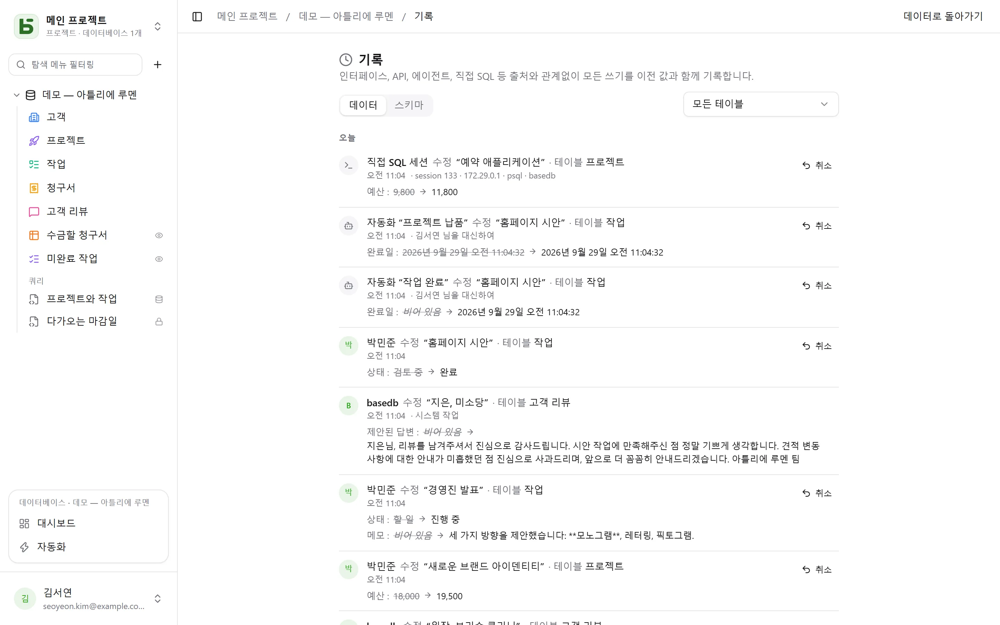

basedb는 출처와 관계없이 **모든 쓰기**를 기록합니다. 인터페이스, API, MCP 에이전트, 공개
양식은 물론 `psql`에서 직접 작성한 SQL 쿼리까지 기록합니다.

## 기록 방식

기록은 애플리케이션이 아니라 **PostgreSQL 트리거**가 쓰기와 같은 트랜잭션 안에서 남깁니다.
실패한 쓰기는 흔적을 남기지 않고, 성공한 쓰기는 빠짐없이 기록됩니다. 그런 다음 리비전은
월별로 파티션된 변경 불가능한 로그로 옮겨집니다.

신원 정보는 각 트랜잭션을 시작할 때 설정되는 세션 변수로 전달됩니다. 이 정보가 없는 쓰기,
즉 SQL 직접 쓰기는 그 사실 그대로, 쓰기를 수행한 세션 정보(`psql`, 주소, 프로세스)와 함께
기록됩니다. 그렇다고 해서 거부되지는 않습니다.

| 행위자 | 표시 |
|---|---|
| 사람 | 그 사람의 이름 |
| 프로그램(API) 또는 에이전트(MCP) | 토큰을 만든 사람, “토큰 …으로” |
| 공개 양식 | “양식 ‘…’ · 공개 응답” |
| 자동화 | “자동화 ‘…’ · 명의:” 다음에 자동화를 책임지는 사람 |
| SQL 직접 쓰기 | “직접 SQL 세션” |

## 활용 방법

- 행(행 세부 정보의 “기록” 탭), 테이블, 데이터베이스(데이터베이스 **⋯** 메뉴의 **기록**)의
  기록을 **읽고**, 테이블별로 필터링합니다.
- 수정을 **되돌립니다**. 이전 값이 필드별로 다시 적용됩니다.
- 삭제된 행을 그 “삭제함” 항목에서 **복원**합니다.
- **스키마 기록**(“스키마” 탭)을 확인합니다. 생성, 수정, 삭제된 테이블과 필드가 표시됩니다.

## 실행 취소(Ctrl+Z)

그리드에서 **Ctrl+Z**(Mac에서는 ⌘Z)를 누르면 마지막 쓰기가 실행 취소되고, **Ctrl+Shift+Z**
또는 **Ctrl+Y**를 누르면 다시 실행됩니다. 무엇이 취소되었는지 메시지로 알려 주며(“실행
취소됨: ‘Montant’ 수정”), 실행 취소를 되돌리는 버튼도 함께 표시됩니다.

셀 하나, 옮긴 카드나 막대, 만들거나 삭제한 행, 붙여 넣기, 그리고 한 번의 동작으로 계산되는
가져오기 전체를 이렇게 실행 취소할 수 있습니다. 탭마다 최대 50개 동작까지 가능합니다.

이것은 화면을 되감는 것이 아니라 서버가 기록을 바탕으로 수행하는 **새로운 쓰기**이며, 이
쓰기도 기록에 남습니다. 그사이 누군가 행을 수정했다면 그 사람의 작업을 덮어쓰지 않도록 실행
취소가 거부됩니다(“실행 취소할 수 없음: 이후 ‘Statut’ 필드가 수정되었습니다”). 이 방법으로는
최근 24시간 동안의 자기 쓰기만 실행 취소할 수 있으며, 스키마 변경은 실행 취소할 수 없습니다.
입력 중인 셀 안에서는 Ctrl+Z가 텍스트 입력의 실행 취소로 동작합니다.

## 권한

기록은 읽기 권한을 따릅니다. 나에게 숨겨진 필드는 내가 읽는 리비전에 나타나지 않습니다.
