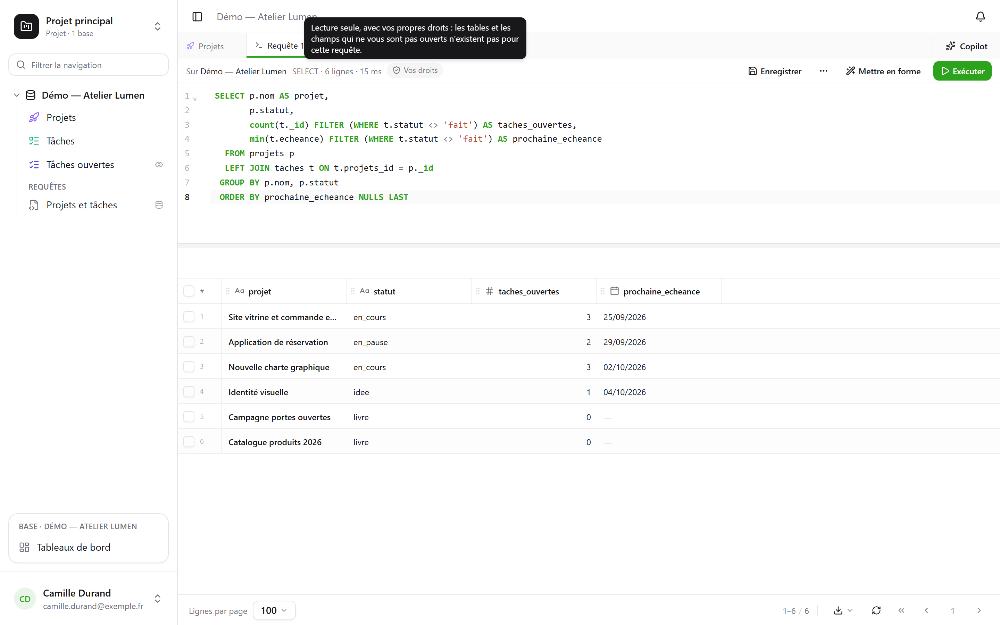
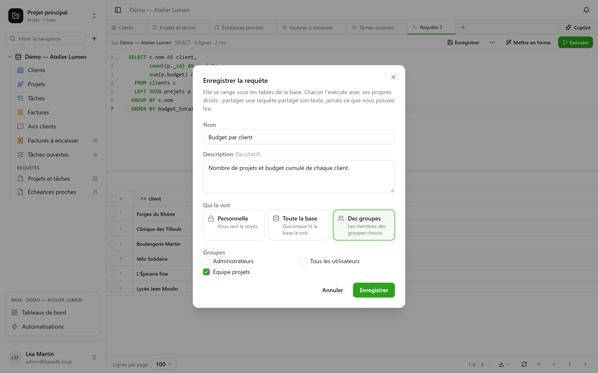
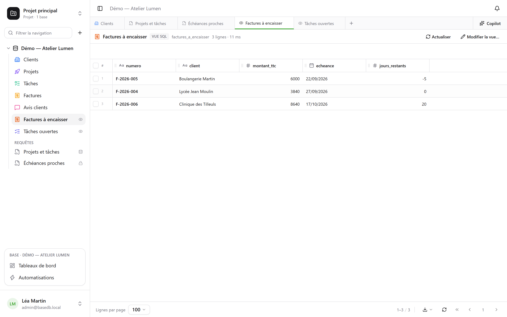
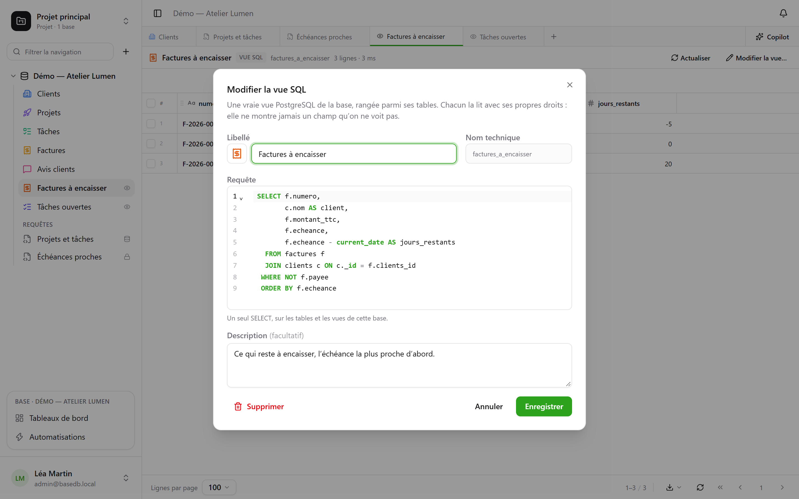

테이블은 실제 PostgreSQL 테이블이며, 인터페이스는 실제 이름을 사용해 SQL로 테이블을
조회합니다. 데이터베이스의 모든 멤버는 쿼리를 작성해 테이블 아래에 **저장**할 수 있습니다(나만,
데이터베이스 전체, 또는 일부 그룹용). 데이터베이스를 관리하는 사람은 쿼리를 **SQL 뷰**로 만들
수 있습니다. SQL 뷰는 테이블 사이에 놓이는 실제 PostgreSQL 뷰로, `psql`과 사용 중인 도구에서도
읽을 수 있습니다.


## 각자의 권한으로

탭 바의 **+** 버튼이나 데이터베이스 **⋯** 메뉴 → **새 SQL 쿼리**를 누르면 SQL 탭이 열립니다.
구문 강조와 자동 완성을 지원하는 편집기이며, **Ctrl+Enter**로 실행하고, 결과는 테이블과 같은
그리드에 표시됩니다. 쿼리가 읽을 수 있는 범위는 실행하는 사람에 따라 달라집니다.

- 데이터베이스에 **관리** 권한이 있으면 쓰기를 포함해 데이터베이스 전체에 접근합니다.
- **읽기** 또는 **편집** 권한이면 쿼리는 **읽기 전용으로, 자기 권한으로** 실행됩니다. 접근할
  수 없는 테이블은 쿼리에서 존재하지 않는 것으로 취급됩니다. 숨겨진 필드는 `SELECT *`에서
  빠지고, 테이블 이름을 붙이더라도 이름으로 지정하면 거부됩니다. 쓰기는 거부됩니다. 결과에는
  **내 권한** 배지가 표시됩니다.



걸러 내는 것은 화면이 아닙니다. PostgreSQL 자체가 사용자 전용 역할에 열 단위로 권한을
적용합니다. 따라서 쿼리는 그리드, API, MCP 서버가 보여 주지 않을 것을 보여 줄 수 없습니다.

## 쿼리 저장

탭 바의 **저장**을 누르면 쿼리가 데이터베이스의 테이블 아래 **쿼리** 항목에 보관됩니다. 클릭
한 번으로 다시 열 수 있습니다. **⋯** → **다른 이름으로 저장…** 메뉴는 복사본을 만들고,
**이름 및 공유…**(탭 또는 사이드바의 쿼리 메뉴)는 이름을 바꾸거나, 볼 수 있는 사람을 바꾸거나,
쿼리를 삭제합니다.



| 범위 | 볼 수 있는 사람 | 만들고 수정할 수 있는 사람 |
|---|---|---|
| **개인**(자물쇠 아이콘) | 나만 | 데이터베이스를 볼 수 있는 누구나, 자신용으로 |
| **데이터베이스 전체** | 데이터베이스를 볼 수 있는 누구나 | 데이터베이스에 대한 **관리** 권한 |
| **그룹** | 선택한 그룹의 멤버 | 데이터베이스에 대한 **관리** 권한 |

**쿼리를 공유하면 텍스트만 공유되며, 작성자가 읽을 수 있는 내용은 절대 공유되지 않습니다.**
각자 자신의 권한으로 실행합니다. 두 사람이 같은 쿼리를 열면 각자 볼 권한이 있는 것만
보이며, 어떤 열이 자신에게는 존재하지 않는다는 메시지를 받을 수도 있습니다.

사이드바에서 연 쿼리는 **바로 읽기 전용으로 실행됩니다**. 아무것도 결정하지 않아도 결과를 볼
수 있습니다. 그다음 **실행**을 누르면 쿼리를 그대로 다시 실행합니다. 이름 옆의 점은 저장한 뒤
텍스트를 바꿨다는 표시입니다. 쿼리를 수정할 수 있으면 **저장**으로 반영되고, 그렇지 않으면
새 쿼리로 저장하도록 제안합니다.

## SQL 뷰

**SQL 뷰**는 데이터베이스 스키마에 있는 실제 PostgreSQL 뷰입니다. 테이블처럼 색상과 아이콘을
가지고 **테이블 사이에** 놓이며, 오른쪽의 작은 **눈** 아이콘이 뷰임을 알려 줍니다. 클릭하면
탭에서 열립니다. 행은 그리드에 표시되고, **새로 고침**을 누르면 다시 읽습니다.



데이터베이스 **⋯** 메뉴 → **새 SQL 뷰…** 로 만들거나, SQL 탭에서 **⋯** → **SQL 뷰 만들기…**
를 선택하면 탭의 쿼리가 뷰의 정의가 됩니다. 대화 상자에서 다음을 입력합니다.

- **레이블**과 **모양**: 테이블과 같은 방식으로 고르는 색상, 아이콘 또는 이미지
- **기술 이름**: 지정하지 않으면 레이블에서 만들어지며, `FROM` 뒤에 쓰는 이름입니다.
- **쿼리**: 데이터베이스의 테이블과 다른 뷰를 대상으로 하는 `SELECT` 하나. PostgreSQL이
  거부하는 것은 그대로 거부되며, 편집기가 문제 위치를 가리킵니다.



이후 뷰는 인터페이스에서든 `psql`이나 BI 도구에서든 그 이름으로 읽습니다.

```sql
SELECT * FROM b_t4z56fq_demo_atelier_lumen.factures_a_encaisser;
```

**뷰는 볼 수 없는 필드를 절대 보여 주지 않습니다.** 각자 뷰가 읽는 모든 테이블과 열에 대해
자신의 권한으로 뷰를 읽습니다. 사이드바는 뷰가 읽는 것을 모두 읽을 수 있는 사람에게만 뷰를
표시합니다. 뷰는 **자신의** 데이터베이스만 읽습니다. 다른 데이터베이스나 basedb 카탈로그는
만들 때부터 거부됩니다. 뷰를 만들고, 수정하고, 삭제하려면 데이터베이스에 대한 **관리** 권한이
필요합니다.

### 스키마가 바뀔 때

- 테이블이나 필드의 **이름을 바꿔도** 뷰는 깨지지 않습니다. PostgreSQL이 따라갑니다.
- 뷰가 읽는 계산 필드의 **수식을 바꾸면** 뷰가 잠시 제거되었다가 새 열을 기준으로 다시
  만들어집니다. 뷰가 더 이상 유효하지 않으면 정의는 유지된 채 **수정 필요** 상태로 남으며,
  사이드바에 삼각형 아이콘이 표시됩니다. **뷰 편집…** 메뉴에서 수정하고 저장하세요.
- 뷰가 읽고 있는 테이블은 영구 삭제되지 않으며, 다른 뷰가 읽고 있는 뷰는 삭제되지 않습니다.
  거부 메시지에 원인이 된 뷰의 이름이 표시됩니다.

## 쿼리, SQL 뷰, 질문 중 무엇을 쓸까요?

| | 무엇인가 | 위치 | 용도 |
|---|---|---|---|
| **저장된 쿼리** | SQL 텍스트 | 테이블 아래 “쿼리” 항목 | 쿼리를 다시 찾고, 텍스트로 공유 |
| **SQL 뷰** | 실제 PostgreSQL 뷰 | 테이블 사이 | 읽기에 이름을 붙여 인터페이스 **그리고** `psql`, 스크립트, 도구에서 사용 |
| **질문** | 마우스나 SQL로 만든 읽기와 그 시각화 | [대시보드](/basedb/ko/fonctionnalites/tableaux-de-bord/) 안 | 필터를 적용한 수치, 차트, 피벗 테이블 |

## 제한

- 그리드에는 화면 아래쪽에서 선택한 **페이지당 행 수**까지만 표시되며, “잘림” 표시로 이를
  알려 줍니다. 쿼리는 15초가 지나면 중단됩니다.
- SQL 뷰는 SQL과 인터페이스에서 읽을 수 있으며, REST API와 MCP 서버에는 노출되지 않습니다.
- SQL 뷰는 만든 환경에만 남습니다. 환경 만들기, 스키마 비교, 템플릿으로 저장에는 아직
  포함되지 않습니다.
