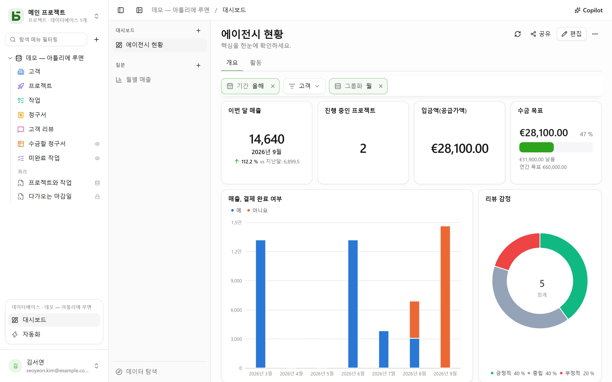
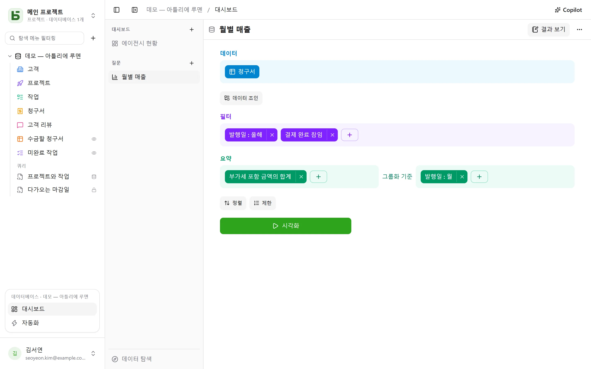
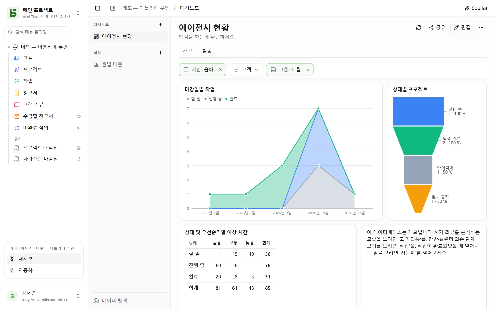

**대시보드**는 팀이 매일 보는 내용을 한 페이지에 모읍니다. 중요한 수치, 월별 추이, 상태별
분포, 다가오는 마감일 같은 것들입니다. 각 카드는 **질문**, 즉 마우스로 만들거나 SQL로 작성한
데이터베이스 읽기를 보여 주며, 페이지 위쪽의 **필터**는 연결된 카드를 제어합니다.



모든 것은 사이드바 아래쪽의 열린 데이터베이스 블록에 있는 **대시보드**에서 엽니다. 왼쪽에는
데이터베이스의 대시보드와 저장된 질문, 그리고 아무것도 저장하지 않고 질문해 볼 수 있는
**데이터 탐색**이 있습니다. 데이터베이스를 읽을 수 있는 사람은 누구나 이를 보고 탐색하며 자신의
질문을 저장할 수 있고, 대시보드를 만들거나 질문을 공유하려면 **관리** 권한이 필요합니다.

저장된 질문은 **개인용**(나만 볼 수 있음)이거나 **데이터베이스 전체** 또는 **그룹**과 공유할
수 있습니다. 질문의 메뉴(마우스 오른쪽 클릭 또는 **⋯**)는 테이블 옆의 탭에서 열거나, 이름과
공유 범위를 바꾸거나, 삭제합니다. 탭 바의 <strong>+</strong>에는 **새 질문**과 **새 SQL 질문**도
있습니다.

질문 머리글의 **저장**은 그대로 보관합니다. 수정할 수 없는 질문에는 대신 **복사본 저장**이
제안되며, 저장하면 나의 것이 됩니다. **⋯**(**기타 작업**)에는 **이름 및 공유…**,
**복사본 저장…**, **질문 삭제**도 있습니다. 이를 보여 주던 탭은 내용을 그대로 유지한 채
저장되지 않은 상태로 돌아갑니다.

## 마우스로 질문 만들기

질문은 여러 단계를 위에서 아래로 쌓아 만듭니다.



| 단계 | 선택하는 것 |
|---|---|
| **데이터** | 시작 테이블, 그리고 요약하지 않을 때 표시할 열 |
| **데이터 조인** | 관계(자동으로 제안됨) 또는 같은 성격의 두 열로 연결한 데이터베이스의 다른 테이블. 왼쪽, 내부, 오른쪽, 완전 조인 |
| **필터** | 열마다 그 타입에 맞는 조건: 같음 / 같지 않음, 포함, 범위, 비어 있음 등. 날짜에는 **기간**: 오늘, 최근 30일, 이번 달, 지난 분기, 시작일~종료일. 또는 보기 바에서처럼 작성한 식 |
| **요약** | 측정값(행 수, 합계, 평균, 중앙값, 최솟값, 최댓값, 고유 값 수, 표준 편차, 누적)을 한 개에서 세 개까지의 열 **기준으로** 계산 |
| **정렬**, **제한** | 행의 순서와 최대 행 수 |

날짜는 **일, 주, 월, 분기, 연도 단위로** 묶거나, 요일, 월, 시각 같은 순번으로 묶을 수
있습니다. 숫자는 구간으로 묶습니다. 다중 선택 필드는 각 행을 선택된 값마다 한 번씩 셉니다.
기간은 사용자의 시간대로 해석되며, 한 주는 설정에서 지정한 요일에 시작합니다.

**시각화**를 누르면 질문이 실행됩니다. 결과는 가장 알맞은 방식(숫자, 선, 막대, 표)으로
표시되며, 화면 아래쪽에서 바꿀 수 있습니다.

| 시각화 | 보여 주는 것 |
|---|---|
| **숫자**, **추세**, **진행률**, **게이지** | 값 하나, 직전 기간 및 전년 같은 기간과 비교한 최근 기간, 목표 대비 진척도 |
| **세로 막대**, **가로 막대**, **선**, **영역**, **콤보** | 한 차원을 따라 놓인 측정값. 계열을 나란히, 누적으로, 또는 100% 누적으로 표시 |
| **원형**, **깔때기** | 비율, 단계 |
| **분산형** | 두 측정값의 관계, 세 번째 측정값은 크기로 표시 |
| **표**, **피벗 테이블** | 정렬할 수 있는 행. 또는 한 차원을 행으로, 다른 차원을 열로 놓고 합계 표시 |
| **지도** | 값에 따라 색칠한 프랑스의 지역(région, département) 또는 국가. 또는 위도와 경도로 찍은 점 |

**설정**에서 표시할 내용을 조정하며, 결과는 **CSV**로 다운로드할 수 있습니다.

### 차트 사용자 지정

| 시각화 | **설정**에서 제공하는 항목 |
|---|---|
| **막대, 선, 영역, 콤보** | 각 계열의 색상과 이름, 누적 여부와 누적 막대 위의 합계, 막대 너비, 부드러운 선 또는 계단형 선과 점 표시 여부, 범주 순서, 축 제목, 눈금, 레이블 기울기, 축 범위, 로그 눈금, 차트 위 값 표시, 목표값 |
| **원형** | 도넛과 그 두께, 반원, 로즈 차트, 가운데 합계, “기타”로 묶기 전까지의 조각 수, 각 조각의 색상과 이름, 조각 위 또는 옆의 레이블, 범례 위치 |
| **깔때기** | 각 단계의 색상과 이름, 단계 순서 |
| **숫자, 추세, 진행률, 게이지** | 색상, 값에 따른 색상, 숫자 아래 설명, 비교, 그리고 감소가 좋은 소식인지 여부 |
| **표, 피벗 테이블** | 열 이름 바꾸기와 순서 변경, 셀 안의 막대, 값에 따른 색상(셀 또는 행 단위), 밀도, 페이지당 행 수, 행 번호, 합계 |
| **지도** | 색조, 지역 이름 |

모든 시각화에 공통으로 숫자 형식(소수 자릿수, 접두사와 접미사, `1,2 k` 형태의 축약)을 지정할
수 있습니다.

## 클릭 한 번으로 탐색

막대, 점, 조각을 클릭하면 그것이 나타내는 내용을 열 수 있습니다.

- **이 행 보기**: 그 지점 뒤에 있는 행을, 그 지점이 나타내는 조건으로 필터링해 보여 줍니다.
- **주별로 상세 보기**: 기간을 더 세밀한 단위로 펼칩니다. 연도는 분기로, 월은 주로 펼칩니다.
- **다음 기준으로 나누기…**: 이 지점의 같은 측정값을 다른 열 기준으로 나눕니다.
- **이 값만**, **이 값 제외**.

각 단계는 별도의 질문이며, 원하면 저장할 수 있습니다. 뒤로 화살표를 누르면 이전 단계로
돌아갑니다. 표의 행을 클릭하면 그 행의 행 세부 정보가 열립니다.

대시보드에서는 같은 클릭으로 **대시보드 필터: “Lyon”** 도 제안되며, 영향을 받는 카드 수가
함께 표시됩니다. 이것은 **임시** 필터로, 저장되지 않고 필터 바에 점선으로 표시되며 클릭 한
번으로 제거할 수 있습니다. 질문이 같은 열을 읽는 모든 카드에 적용되며, 그 열을 테이블에서
직접 읽든 조인으로 읽든 마찬가지입니다. 이 필터는 해당 카드에서 그 열에 이미 연결된 대시보드
필터가 없을 때만 제안되며, 그 열을 읽는 다른 카드가 없으면 회색으로 표시됩니다(“유일한
카드”). SQL 질문에는 적용되지 않습니다.

## SQL로 질문 작성하기

**SQL 질문**은 데이터베이스의 테이블을 실제 이름으로 조회하는 `SELECT`입니다. 관리자를 포함한
모든 사람에게 **읽기 전용으로, 자기 권한으로** 실행됩니다. 접근할 수 없는 테이블은 존재하지
않는 것으로 취급되고, 숨겨진 필드는 거부되며, 쓰기는 불가능합니다. 차트 없이 쿼리를 테이블
아래에 저장만 하거나 실제 PostgreSQL 뷰로 만들려면
[SQL 쿼리와 뷰](/basedb/ko/fonctionnalites/requetes-et-vues-sql/)를 참고하세요.

**변수**는 `{{nom}}`로 씁니다. 값이 없을 때 빼야 하는 부분은 `[[`와 `]]` 사이에 넣습니다.

```sql
SELECT statut, count(*) AS taches
  FROM taches
 WHERE {{periode}} [[AND priorite = {{priorite}}]]
 GROUP BY statut
```

변수는 텍스트, 숫자, 날짜, 또는 **열 필터**일 수 있습니다. 열 필터일 때 `{{periode}}`는 선택한
열(여기서는 `echeance`)에 대한 조건 전체가 되며, 아무것도 선택하지 않으면 `TRUE`가 됩니다.
그래서 대시보드 필터가 다른 질문과 마찬가지로 SQL 질문도 제어할 수 있습니다.

## 대시보드 구성

**편집**을 누르면 대시보드가 편집 모드로 바뀝니다.

- **질문**은 저장된 질문을 배치하거나(개인 질문은 그 안에 복사됨), 해당 카드 전용 질문을
  만듭니다.
- **제목**은 섹션 제목을 추가하고, **텍스트**는 제목·목록·링크가 있는 서식 있는 텍스트를
  추가하며 숫자를 인용할 수 있습니다(아래 참고).
- **삽입 페이지**는 `https://` 주소를 격리된 프레임에 표시하며, 이 프레임에는 세션도 데이터도
  전달되지 않습니다.
- **탭**은 카드를 여러 페이지로 나눕니다. 탭을 더블클릭하면 이름을 바꿀 수 있습니다.

카드는 핸들을 끌어 옮기고 모서리를 끌어 크기를 조정하며, 24열 그리드에 배치됩니다. **저장**은
모든 내용을 보관하고, **취소**는 이전 버전으로 돌아갑니다. 보기 모드에서 카드 제목을 누르면
대시보드 필터가 적용된 상태로 질문이 열려 탐색할 수 있습니다.

### 텍스트 속 숫자

텍스트는 이중 중괄호 사이에 이름을 넣어 값을 인용합니다: “이번 달 매출은
`{{chiffre_affaires}}`, 주문은 `{{commandes}}`건입니다.” 각 이름은 알약 모양 태그가 되며, 클릭
한 번으로 — 또는 편집기 바의 **변수**로 — 다음 중 하나와 연결할 수 있습니다:

| 원천 | 텍스트가 보여 주는 것 |
|---|---|
| 대시보드의 **카드** | 그 카드가 보여 주는 값, 자신의 필터가 적용된 상태로 |
| 데이터베이스 전체의 **저장된 질문** | 그 값, 대시보드 필터는 카드에서처럼 여기에도 연결됨 |
| **텍스트 안에 보관된 질문** | 그 값; 개인 질문을 인용하는 방법이 바로 이것 |
| 대시보드의 **필터** | 필터 자체의 정의대로, 선택된 값 |

질문의 값은 **숫자** 시각화가 보여 주는 값, 곧 마지막 행의 첫 번째 측정값입니다. 이 값은
읽는 사람의 권한으로 계산되며, 항상 텍스트로 표시됩니다. 텍스트 하나는 최대 20개의 값을
인용할 수 있으며, 이름은 소문자, 숫자, `_`로 씁니다. 편집기가 생기기 전에 Markdown으로 쓰인
텍스트는 예전처럼 읽히고, 다시 저장하는 순간부터 서식 있는 텍스트가 됩니다. Copilot은 자신의
텍스트를 Markdown으로 씁니다.

## 필터

**필터**는 대시보드 위쪽에 컨트롤을 추가합니다. **날짜**(기간), **카테고리**(선택할 값),
**텍스트**, **숫자**, 또는 선 차트를 월 단위에서 주나 연 단위로 바꾸는 **날짜 그룹화**가
있습니다.

필터는 연결된 카드(하나, 여러 개, 또는 전체)를 제어합니다. 필터를 만들면 알맞은 열에 자동으로
연결됩니다. 필터를 선택하면 각 카드에서 필터링하는 열이 표시되어 바꾸거나 제거할 수 있고,
**호환되는 모든 카드에 연결**을 누르면 나머지 카드도 연결됩니다. 필터에는 “올해” 같은
**기본값**을 지정할 수 있습니다.

보기 모드에서는 지점을 클릭해 필터를 설정할 수도 있습니다. 도시 열이 “Ville” 필터에 연결된
카드에서 **“Lyon” 기준으로 필터**를 누르는 식입니다.



## Copilot

대시보드 섹션 머리글의 **Copilot**을 누르면 오른쪽에 데이터베이스에 관한 자연어 대화가
열립니다. “월별 매출”, “고객별 필터를 추가해 줘”, “8월에 왜 떨어졌어?” 같은 요청을 할 수
있습니다. 각 제안은 카드로 도착하며 클릭 한 번으로 적용됩니다.

| 제안 | 하는 일 |
|---|---|
| **질문** | 대화 안에서 실행되고 그려짐. 편집기에서 열거나 대시보드에 추가 |
| **대시보드 수정** 또는 새 대시보드 | 카드 추가, 수정, 제거, 텍스트, 해당 열이 있는 카드에 자동으로 연결되는 필터, 탭, 이름. 한 번에 저장되며 카드에서 **실행 취소** 가능 |
| **표시된 필터의 값** | “지난달 보여 줘”: 필터가 설정되며, 아무것도 저장되지 않음 |

질문하기와 필터 설정은 데이터베이스를 읽을 수 있는 누구나 할 수 있고, 대시보드 수정이나
생성에는 **관리** 권한이 필요합니다.

기본적으로 AI 공급자에게는 대화와 함께 **구조 정보만** 전송됩니다. 테이블과 그 필드,
데이터베이스의 대시보드와 저장된 질문, 그리고 표시된 대시보드의 탭, 필터, 카드 정의(질문,
텍스트)입니다. 행, 카드 결과, 그리고 데이터일 수 있는 **필터에서 선택한 값**은 전송되지
않습니다. 필터에 대해서는 값이 있다는 사실만 전송됩니다. 에이전트에게 보이지 않도록 표시한
필드는 전송되지 않으며, 그 필드를 인용하는 카드의 질문도 전송되지 않습니다.

**데이터 읽기 허용** 확인란을 선택하면 해당 대화에서 표시된 필터의 값과 그 필터를 적용한 카드
결과가 추가되어(읽기당 최대 50행, 응답 아래에 나열), 수치를 근거로 설명할 수 있습니다.
[인공지능](/basedb/ko/fonctionnalites/ia/)을 참고하세요.

## 대시보드 공유

대시보드 머리글의 **공유**는 데이터베이스에 대한 **관리** 권한이 있는 사람에게 표시됩니다.
두 가지 방법이 있습니다.

- **데이터베이스 공유…** 는 사람들을 데이터베이스에 초대합니다. 초대받은 사람은 basedb에서
  대시보드를 열며, 각 카드는 그 사람의 권한으로 읽습니다.
- **링크 만들기**는 이 대시보드 **하나만** 가리키는 링크를 만들며, 이 링크로 보는 사람에게는
  데이터베이스 권한이 필요 없습니다.

| 링크 액세스 | 읽는 사람 |
|---|---|
| **공개** | 링크가 있는 누구나, 계정 불필요 |
| **로그인한 멤버** | 로그인한 워크스페이스 멤버(필요하면 특정 그룹으로 제한) |

링크 페이지는 대시보드의 탭, 필터, 카드를 **읽기 전용으로** 보여 줍니다. 탐색도, 행 접근도,
직접 만드는 질문도 없습니다. 카드는 **링크를 게시한 사람의 권한**으로 읽으며, 이 권한은 읽을
때마다 다시 확인됩니다. 그 사람이 데이터베이스 액세스 권한을 잃으면 링크는 **일시 중지**됩니다.
**링크 활성화** 스위치를 끄면 링크를 잃지 않고 끊을 수 있고, **재생성**을 누르면 이전 링크가
무효화됩니다.

**다른 사이트에 삽입 허용**을 선택하면 대화 상자에 `<iframe>` **삽입 코드**가 표시되어,
인트라넷이나 위키에 대시보드를 표시할 수 있습니다.
[공유 보기](/basedb/ko/fonctionnalites/vues-partagees/)와 같은 방식입니다.

## 각자의 권한으로

각 카드는 **보는 사람의 권한으로** 읽습니다. 같은 대시보드라도 각자 볼 권한이 있는 것만
보여 줍니다. 단, 공유 링크는 링크를 게시한 사람의 권한으로 읽습니다. 접근할 수 없는 테이블이나
필드를 대상으로 하는 카드는 일부가 빠진 채 잘못된 수치를 보여 주는 대신 “접근할 수 없는
데이터”를 표시합니다. 질문을 저장하면 질문만 공유되며, 작성자가 읽을 수 있는 내용은 절대
공유되지 않습니다.

## 제한

- 질문 하나는 최대 2,000행을 반환합니다. 요약은 거의 항상 이 범위 안에 들어옵니다.
- 각 카드는 열 때와 필터를 바꿀 때마다 캐시 없이 쿼리를 실행합니다.
- 지도 배경은 프랑스 본토(지역, 데파르트망)와 세계 각국을 다룹니다. 출처: IGN, Admin Express
  (Licence ouverte), Natural Earth.
