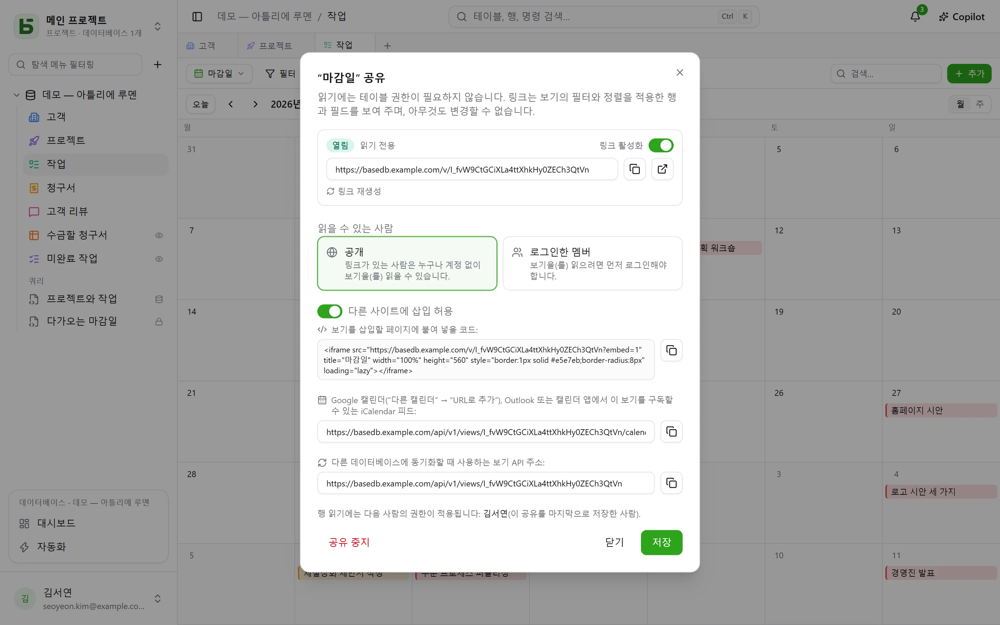
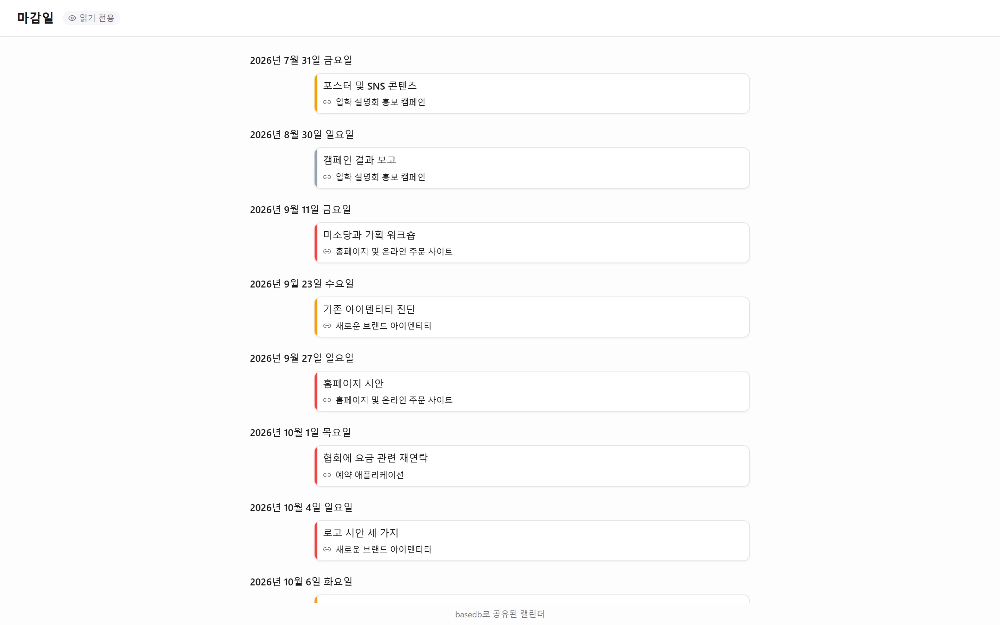

데이터 보기(그리드, 칸반, 캘린더, 타임라인, 갤러리, 목록)는 **읽기 전용으로 공유**할 수
있습니다. `/v/<jeton>` 링크는 basedb를 열 수 없는 사람에게 보기를 보여 주며, 아무것도 쓸 수
없게 합니다. 아무것도 읽지 못하게 하면서 응답만 받는
[공유 양식](/basedb/ko/fonctionnalites/formulaires-partages/)과 짝을 이룹니다.
[대시보드](/basedb/ko/fonctionnalites/tableaux-de-bord/#대시보드-공유)도 같은 방식으로
공유합니다.

## 공유

보기 메뉴 → **공유…**. 그런 다음 액세스를 선택합니다.

| 액세스 | 읽는 사람 |
|---|---|
| **공개** | 링크가 있는 누구나, 계정 불필요 |
| **로그인한 멤버** | 로그인한 워크스페이스 멤버(필요하면 특정 그룹으로 제한) |

**링크 활성화** 스위치를 끄면 링크를 잃지 않고 일시 중지할 수 있습니다. 페이지는
애플리케이션 밖에서 열립니다. 사이드바도, 데이터베이스 이름도, 테이블 이름도 없이 보기와 그
필터, 열만 표시됩니다. 캘린더나 타임라인은 일정표처럼 읽힙니다.

## 누구의 권한으로 읽나요

보기는 **보기를 게시한 사람의 권한**으로 읽히며, 이 권한은 읽을 때마다 다시 확인됩니다. 그
사람에게 숨겨진 필드는 표시되지 않고, 그 사람이 테이블 액세스 권한을 잃으면 링크에는 더 이상
아무것도 표시되지 않습니다.

## 다른 사이트에 삽입

**다른 사이트에 삽입 허용**을 선택하면 대화 상자에 `<iframe>` **삽입 코드**가 표시됩니다.
인트라넷, 위키, 회사 소개 사이트에 붙여 넣으세요. 이 옵션을 선택하지 않으면 페이지는 다른
사이트의 프레임 안에 표시되기를 거부합니다.

## 일정 앱에서 구독하는 캘린더

**공개**로 공유한 캘린더나 타임라인은 대화 상자에 **일정 피드 주소**가 표시됩니다. Google
캘린더, Outlook, Apple Calendar에서 구독할 수 있는 iCalendar 피드(`…/calendar.ics`, 최대
1,000개 이벤트)입니다. 팀의 마감일이 각자의 일정 앱에 나타나고, 테이블이 바뀌면 함께
바뀝니다.

## 다른 데이터베이스의 소스

공개 링크는 **보기 API 주소**도 제공합니다. 보기에 표시되는 행을 JSON으로 내려 줍니다. 이
인스턴스든 다른 인스턴스든 [동기화된 테이블](/basedb/ko/integrations/synchronisation/)이 이를
소스로 사용할 수 있습니다.

## 제한

- 읽기는 주소별, 링크별로 분당 120개 요청으로 제한됩니다.
- 양식은 읽기용으로 공유할 수 없으며,
  [응답을 받기 위해](/basedb/ko/fonctionnalites/formulaires-partages/) 공유합니다.
