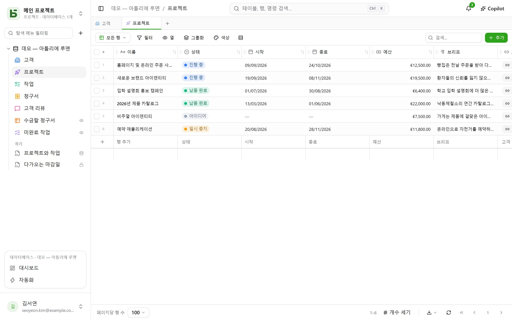

**basedb**는 협업 스프레드시트와 같은 방식으로 쓰는 협업 데이터베이스이며, 직접 호스팅합니다.
그리고 나머지 모든 것을 좌우하는 차이가 하나 있습니다. **데이터가 실제 PostgreSQL 테이블에
저장되며**, 타입이 지정되고 알아보기 쉬운 이름이 붙습니다.

## 단순한 약속

범용 모델도, 무엇이든 담아 두는 `JSONB`도, `field_1837`도 없습니다.

| basedb에서 | PostgreSQL에서 |
|---|---|
| “Ventes” 데이터베이스 | 스키마 `b_t4z56fq_ventes` |
| “Opportunités” 테이블 | 테이블 `opportunites` |
| “Échéance” 필드(날짜) | 열 `echeance date` |
| “Statut” 단일 선택 필드 | `text` 열과 그 `CHECK` 제약 조건 |
| “Client” 관계 필드 | `clients_id uuid` 열과 그 `FOREIGN KEY` |

따라서 `psql`, BI 도구, Python 스크립트를 열어 제품을 거치지 않고 데이터를 읽을 수 있고,
쓸 수도 있습니다. 제약 조건은 그대로 지켜지고, 그 쓰기는 기록에 남습니다.

## 누구를 위한 제품인가요?

- 개발을 기다리지 않고 그리드, 보기, 양식을 쓰고 싶은 **현업 팀**.
- 데이터가 독점 형식에 갇히는 것을 원하지 않고, 평소 쓰던 도구를 연결하고 싶은
  **기술 팀**.
- MCP 서버, 명확한 권한, 사람이 검토하는 제안을 이용하는 **AI 에이전트**.

## 제공하는 기능

- 타입이 있는 [테이블과 필드](/basedb/ko/fonctionnalites/tables-et-champs/), 실제 외래 키인
  관계(다중 관계 포함), PostgreSQL이 계산하는 수식, 관계를 거치는 조회와 롤업.
- 열 가지 [보기](/basedb/ko/fonctionnalites/vues/): 그리드, 칸반, 캘린더, 타임라인,
  갤러리, 목록, 지도, 양식, 설문, 퀴즈. 협업 보기로도, 개인 보기로도 만들 수 있습니다.
- 링크로 공유하는 [양식](/basedb/ko/fonctionnalites/formulaires-partages/)과
  [보기](/basedb/ko/fonctionnalites/vues-partagees/), 그리고 일정 앱에서 구독할 수 있는
  캘린더.
- [협업](/basedb/ko/fonctionnalites/collaboration/): 댓글과 멘션, 알림, 실시간 업데이트.
- [자동화](/basedb/ko/fonctionnalites/automatisations/)와
  [대시보드](/basedb/ko/fonctionnalites/tableaux-de-bord/), 그리고 마우스나 SQL로 만드는 질문.
- 각자 자신의 권한으로 쓰는 [모두를 위한 SQL](/basedb/ko/fonctionnalites/requetes-et-vues-sql/):
  테이블 아래에 보관하는 저장된 쿼리, 그리고 테이블 사이에 놓이는 실제 PostgreSQL 뷰.
- 갤러리에서 고르거나 AI에게 요청하는 [데이터베이스 템플릿](/basedb/ko/fonctionnalites/modeles/).
- 서로 비교하고 마이그레이션하는 [환경](/basedb/ko/fonctionnalites/environnements/): 운영,
  스테이징.
- 직접 실행한 SQL을 포함해 모든 쓰기를 남기는 [기록](/basedb/ko/fonctionnalites/historique/),
  그리고 Ctrl+Z로 실행 취소.
- 그룹별로 필드 단위까지 지정하는 [권한](/basedb/ko/fonctionnalites/droits/).
- [REST API](/basedb/ko/integrations/api-rest/), [MCP 서버](/basedb/ko/integrations/mcp/),
  [웹훅](/basedb/ko/integrations/webhooks/), Slack,
  [동기화된 테이블](/basedb/ko/integrations/synchronisation/).
- 선택 사항인 [AI](/basedb/ko/fonctionnalites/ia/): 모델이 계산하는 필드, Copilot.

## 프로젝트 현황

basedb는 AI 네이티브 소프트웨어 스튜디오 [Eodia](https://eodia.com/fr/)가 개발하는 자유
소프트웨어(AGPL-3.0)이며, 활발히 개발되고 있습니다. 코어, API, MCP 서버, 인터페이스가
동작하며 천 개가 넘는 테스트로 검증됩니다. 앞으로 추가될 기능은
[로드맵](/basedb/ko/feuille-de-route/)에서 확인할 수 있습니다. 20여 개 장으로 이루어진
[아키텍처 문서](https://github.com/eodia/basedb/tree/main/docs/architecture)가 모든 결정을
기록합니다.

:::tip[사용해 보기]
저장소를 클론한 뒤에는 명령 하나면 충분합니다. `docker compose up -d`.
[설치](/basedb/ko/guides/installation/)를 참고하세요.
:::
