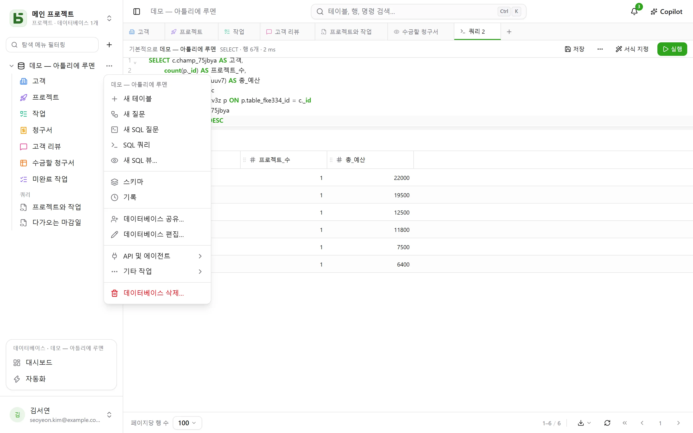
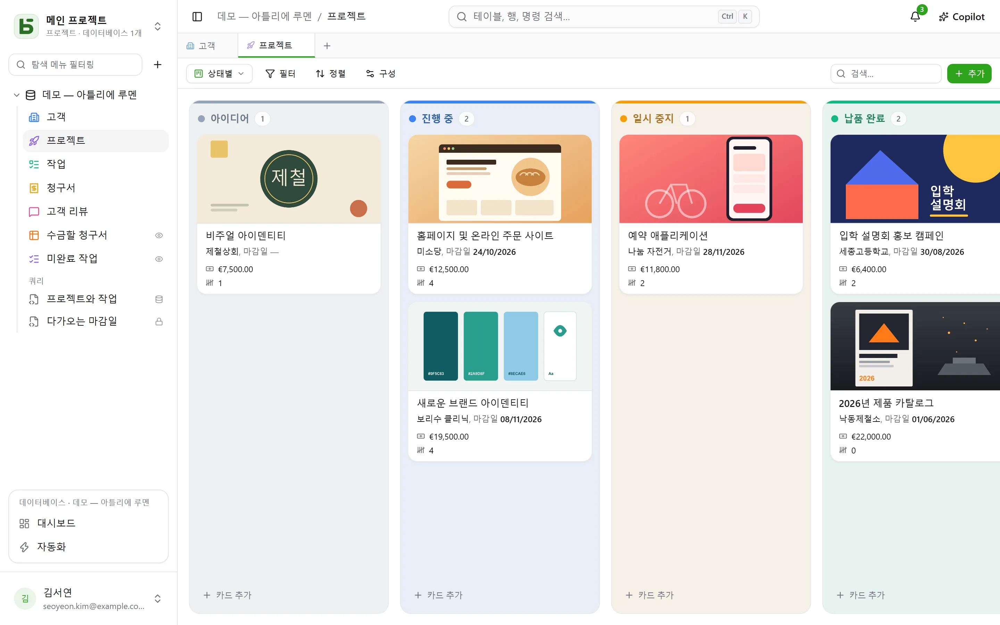

이 과정은 10분이면 끝나며 핵심을 모두 다룹니다. 마치고 나면 테이블 하나, 칸반 보기 하나,
그리고 그 테이블에 행을 추가하는 공개 양식 하나가 생깁니다.

:::tip[한 번에 모두 둘러보려면]
빈 프로젝트에서는 **데모 데이터베이스**를 제안합니다. 작은 에이전시의 고객, 프로젝트, 작업,
청구서, 후기로 이루어져 있으며 수식, 모든 종류의 보기, 대시보드, 자동화가 들어 있습니다.
**새 데이터베이스**를 누르면 [템플릿 갤러리](/basedb/ko/fonctionnalites/modeles/)도 열리며,
여기서 원하는 데이터베이스를 AI에게 설명할 수 있습니다.
:::

## 1. 데이터베이스 만들기

모든 것은 **프로젝트** 단위로 구성됩니다. 사이드바 맨 위의 선택기로 프로젝트를 전환하거나
새로 만듭니다. 사이드바에서 필터 오른쪽의 **+** 버튼을 누르면 데이터베이스가 만들어집니다.
“Ventes”처럼 레이블을 입력하고, 원하면 설명, 색상, 아이콘도 지정하세요.

데이터베이스는 **PostgreSQL 스키마**가 됩니다. 그 물리명(`b_t4z56fq_ventes`)은 입력 창과
자동 생성되는 문서에 표시됩니다.

## 2. 테이블과 필드 만들기

데이터베이스의 **⋯** 메뉴에서 **새 테이블**을 선택합니다. 그런 다음 같은 메뉴에 있는
**스키마**에서 **필드** 버튼으로 필드를 추가합니다.

| 필드 | 타입 |
|---|---|
| Nom | 짧은 텍스트 |
| Statut | 단일 선택 — Nouveau, Qualifié, Gagné, Perdu |
| Montant | 통화 |
| Échéance | 날짜 |
| Client | 관계 → Clients |
| Notes | 긴 텍스트(Markdown) |

나중에 수식(`DAYS([Échéance], TODAY())`), 조회(고객의 도시), 롤업(고객별 총금액)도
같은 방법으로 추가합니다. [테이블과 필드](/basedb/ko/fonctionnalites/tables-et-champs/)를
참고하세요.

Excel 워크북(`.xlsx`), CSV 또는 JSON **파일을 가져올** 수도 있습니다. 가져오기 기능은 타입을
추측하고, 이를 수정할 수 있게 해 주며, 테이블을 새로 만들거나 기존 테이블에 행을 추가하고,
거부한 내용을 행별로 알려 줍니다. 시트가 여러 개인 워크북에서는 원하는 시트를 고를 수 있고,
날짜·금액·확인란은 Excel에 저장된 그대로 반영되며, 수식은 그 결과값이 들어갑니다.



## 3. 입력과 필터링

그리드는 스프레드시트처럼 편집합니다. 셀을 수정하려면 더블클릭하거나 Enter 키를 누르고,
취소하려면 Esc 키를 누릅니다. **필터**는 필드별 조건을 조합하며, 정렬은 열 머리글에서
합니다. 바 오른쪽의 **검색…** 상자는 모든 열을 검색합니다. 모든 변경 사항은 즉시 저장되고
[기록](/basedb/ko/fonctionnalites/historique/)에 남습니다. **Ctrl+Z**를 누르면 마지막 변경이
실행 취소됩니다.

## 4. 보기 추가

“필터” 왼쪽의 보기 선택기에는 “모든 행”과 사용자가 만든 보기가 표시됩니다. “Statut” 필드로
그룹화한 **칸반**을 만드세요. 카드를 한 열에서 다른 열로 끌어 놓으면 해당 행이 수정됩니다.



## 5. 양식 공유

**양식** 보기를 만들고 질문을 선택한 다음 **공유**를 누르세요. “공개”를 선택하고 링크를
복사합니다. 응답이 들어올 때마다 테이블에 행이 하나 추가되며, 응답자에게는 아무 권한도
주어지지 않습니다. 자세한 내용은 [공유 양식](/basedb/ko/fonctionnalites/formulaires-partages/)을
참고하세요.

## 6. SQL로 읽기

데이터베이스의 **⋯** 메뉴 → **SQL 쿼리**: 테이블이 실제 이름 그대로 나타납니다.

```sql
SELECT nom, statut, montant
FROM b_t4z56fq_ventes.opportunites
WHERE statut = 'gagne'
ORDER BY montant DESC;
```

**저장**하면 쿼리가 테이블 아래 “쿼리” 항목에 보관됩니다. 나만 볼 수도, 데이터베이스 전체가
볼 수도 있습니다. **⋯** → **SQL 뷰 만들기…** 메뉴는 이를 테이블 사이에 놓이는 실제
PostgreSQL 뷰로 만듭니다. 누구나 자신의 권한으로 이것들을 읽습니다.
[SQL 쿼리와 뷰](/basedb/ko/fonctionnalites/requetes-et-vues-sql/)를 참고하세요.

`psql`이나 BI 도구에서도 마찬가지입니다. [SQL 직접 사용](/basedb/ko/integrations/sql/)을
참고하세요.
