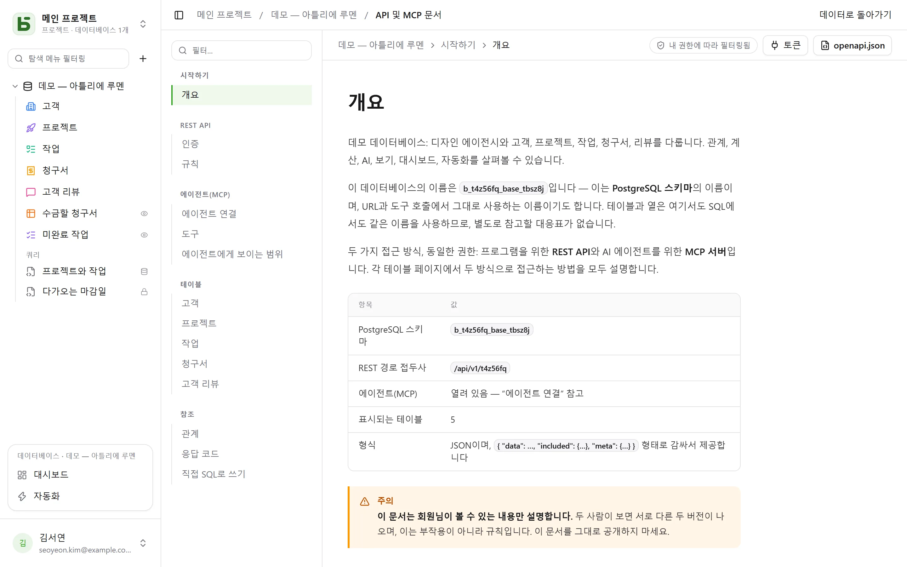

REST API는 인터페이스가 사용하는 API와 같습니다. **비공개 경로는 없습니다**. URL에는 SQL에서도
보는 물리명이 들어갑니다.

```text
/api/v1/<tenant>/data/<base>/<table>
/api/v1/t4z56fq/data/b_t4z56fq_ventes/opportunites
```

## 토큰

인터페이스에서 데이터베이스 **⋯** 메뉴 → **API 및 에이전트** → **API 및 MCP 토큰…** 을
선택하세요. 데이터베이스나 그 프로젝트에 **관리** 권한이 있는 사람이 비밀번호를 확인한 뒤, 이
데이터베이스로 범위가 제한되고(모든 환경 또는 환경 하나) 기본적으로 읽기 전용인 **연동 토큰**을 여기서 만듭니다 —
비밀번호 없이 ID 공급자로 로그인하는 계정은 아직 만들 수 없습니다. 토큰은 한 번만 표시되므로
환경 변수에 넣어 두세요.

토큰은 읽기를 하며, 쓰기 권한으로 만들어졌다면 생성과 수정도 하고, **그 목적으로 만들어진
경우 삭제도 합니다** — “읽기, 쓰기 및 삭제” 권한입니다. 다만 연쇄 관계로 다른 행까지 함께
삭제될 행은 예외입니다. 만든 사람보다 많은 권한을 갖지 않습니다.

```bash
export BASEDB_TOKEN=bdb_…
curl "http://localhost:3000/api/v1/t4z56fq/data/b_t4z56fq_ventes/opportunites?limit=20" \
  -H "Authorization: Bearer $BASEDB_TOKEN"
```

## 환경 선택

[환경](/basedb/ko/fonctionnalites/environnements/)이 여러 개인 데이터베이스(운영, 스테이징…)도 데이터베이스
전체용으로 만든 토큰에는 **하나의** 데이터베이스입니다. 경로에는 운영 환경의 이름으로 데이터베이스를
쓰고, 헤더 `X-Basedb-Environment`가 환경을 선택합니다:

```bash
curl "http://localhost:3000/api/v1/t4z56fq/data/b_t4z56fq_ventes/opportunites" \
  -H "Authorization: Bearer $BASEDB_TOKEN" \
  -H "X-Basedb-Environment: recette"
```

- 헤더가 없으면 경로에 쓴 이름이 가리키는 환경이 사용됩니다. `b_t4z56fq_ventes`는 운영,
  `b_t4z56fq_ventes_recette`는 스테이징이며, 두 표기 모두 계속 유효합니다.
- 헤더를 설정하지 않는 클라이언트는 `?environment=recette`로 같은 일을 할 수 있습니다.
- 환경은 배지에 표시된 이름으로 지정하며, 대소문자와 악센트는 구분하지 않습니다. `production`으로도
  지정할 수 있습니다. 데이터베이스에 없는 환경은 존재하지 않는 다른 리소스와 마찬가지로 `404`를
  반환합니다.
- `GET /api/v1/<tenant>/meta/bases`는 각 환경을 `environment` 블록(`label`, `production`)과 함께
  나열하며, 헤더를 쓰면 해당 환경만 나열합니다.

만들 때 환경 하나로 제한한 토큰은 다른 환경을 전혀 열지 않으며, 헤더를 써도 달라지지 않습니다. 토큰의
권한은 항상 환경마다 토큰을 만든 사람의 권한과 대조됩니다.

## 읽기

| 매개변수 | 역할 |
|---|---|
| `filter` | 읽기 쉬운 식: `statut eq "gagne" and montant gte 10000` |
| `sort` | `-montant,nom` |
| `fields` | 반환할 열 |
| `limit`, `after` | 암호화된 커서로 페이지 나누기: 한 페이지의 `meta.next_cursor`를 `after`로 전달하면 다음 페이지가 옵니다(`meta.has_next_page`) |
| `links=display` | 관계를 표시 값과 함께 반환 |
| `count=exact` | 전체 개수, 최대 100,000 |
| `variables=raw` | 긴 텍스트를 [행의 값](/basedb/ko/fonctionnalites/tables-et-champs/#서식-있는-텍스트와-변수)으로 채우지 않고 `{{colonne}}`를 포함해 작성한 그대로 반환 |

연산자: `eq`, `ne`, `eq_ci`, `contains`, `starts_with`, `ends_with`, `in`, `is_null`, `gt`,
`gte`, `lt`, `lte`, `between`이며, `and`, `or`, `not`과 괄호로 조합합니다. 필터는 관계를 거쳐
적용할 수 있습니다: `clients_id.ville eq "Lyon"`.

## 쓰기

```bash
curl -X POST "http://localhost:3000/api/v1/t4z56fq/data/b_t4z56fq_ventes/opportunites" \
  -H "Authorization: Bearer $BASEDB_TOKEN" -H "content-type: application/json" \
  -d '{"values": {"nom": "Audit RGPD", "statut": "nouveau", "montant": 12000}}'
```

`PATCH …/<table>/<_id>`는 같은 본문 `{"values": {…}}`로 행을 수정합니다. 오류는 항상 같은
형태이며(`{ "code": "…", "details": {…}, "request_id": "…" }`), 원인마다 고정된 코드가
있습니다.

모든 쓰기는 `x-basedb-transaction` 헤더를 반환합니다. 이 값을
`POST /api/v1/<tenant>/history/undo`(`{"transaction": "…"}`)에 전달하면 인터페이스의 Ctrl+Z처럼
쓰기가 실행 취소됩니다. 그사이 행이 수정되었다면 거부됩니다.

## 행 너머

같은 토큰으로 다음을 사용할 수 있습니다.

| 경로 | 역할 |
|---|---|
| `GET …/data/<base>/<table>/aggregate` | 필터에 해당하는 모든 행에 대한 요약: `aggregates=montant:sum,nom:filled`, `group=statut` |
| `GET …/data/<base>/<table>/<_id>/comments`, `POST` | 행의 댓글 읽기와 쓰기 |
| `POST /api/v1/<tenant>/automations/<id>/run` | 버튼으로 트리거되는 자동화를 행 하나에 대해 실행(`{"record": "…"}`) |
| `GET /api/v1/<tenant>/meta/bases/<base>/dashboards` | 데이터베이스의 대시보드 |
| `GET /api/v1/<tenant>/meta/users` | 사람 필드에 쓸 워크스페이스 멤버 |
| `GET /api/v1/<tenant>/meta/templates` | 갤러리의 데이터베이스 템플릿 |
| `GET /api/v1/<tenant>/events?base=<base>&table=<table>` | 테이블을 실시간으로 추적: 신호만 오며, 위의 경로들로 다시 읽습니다([웹훅](/basedb/ko/integrations/webhooks/#웹훅-없이-테이블-추적하기) 참고) |

[공유 보기](/basedb/ko/fonctionnalites/vues-partagees/)는 계정 없이 읽을 수 있습니다.
`GET /api/v1/views/<jeton>`과 `…/rows`는 JSON으로, `…/calendar.ics`는 iCalendar로 제공됩니다.

자동화, 대시보드, 연동을 만드는 등의 구성 작업은 인터페이스 세션에서만 할 수 있습니다. 토큰은
행을 읽고 쓸 뿐, 데이터베이스 자체를 바꾸지는 않습니다.

## 색상과 아이콘

테이블과 단일 선택 필드의 각 선택 항목에는 색상(`color`, `#rrggbb`)과 아이콘(`icon`, 인터페이스가
표시하는 [Lucide](https://lucide.dev/icons/) 아이콘의 이름: `truck`, `circle-check`, `flame`…)이
있습니다. `GET …/meta/bases/<base>`는 데이터베이스, 그 테이블, 필드 옵션의 색상과 아이콘을 반환합니다.

색상과 아이콘을 정하려면 스키마를 수정할 수 있는 사람의 액세스 토큰(`POST /auth/session/access`)을
사용합니다 — 연동 토큰은 데이터베이스를 바꾸지 않습니다:

| 경로 | 본문 |
|---|---|
| `POST …/admin/bases/<base>/tables` | `{"label": "Tickets", "color": "#dc2626", "icon": "flame", "fields": […]}` |
| `PATCH …/admin/bases/<base>/tables/<table>` | `{"color": "#2563eb", "icon": "inbox"}` — `color`, `icon`, `image` 세 키는 함께 움직입니다: 하나를 지정하면 세 개가 모두 교체됩니다 |
| `POST …/admin/bases/<base>/tables/<table>/fields` | `{"label": "Priorité", "kind": "select", "options": [{"value": "haute", "color": "#dc2626", "icon": "flame"}, …]}` |
| `PUT …/admin/bases/<base>/tables/<table>/fields/<champ>/options` | 옵션 전체 목록을 순서대로, 각 옵션에 색상과 아이콘을 포함 |

에이전트는 [MCP 서버](/basedb/ko/integrations/mcp/#색상과-아이콘)를 사용하며, 여기서 이 변경을
**제안**합니다. 필드에는 고를 아이콘이 없습니다. 인터페이스가 필드 유형의 아이콘을 표시합니다.

## 템플릿으로 데이터베이스 만들기

설치되는 애플리케이션은 **한 번의 호출**로 데이터베이스를 만듭니다: 서버가 템플릿 — 테이블, 필드,
관계, 예시 행, 보기, 대시보드, 자동화 — 을 적용하며, 어느 단계에서든 실패하면 데이터베이스를 남기지
않습니다.

```bash
curl -X POST "http://localhost:3000/api/v1/t4z56fq/admin/bases" \
  -H "Authorization: Bearer $ACCES" -H "content-type: application/json" \
  -d '{"template": "crm", "label": "Ventes", "rows": false}'
```

`template`은 갤러리 템플릿의 키이거나, [템플릿 형식](/basedb/ko/fonctionnalites/modeles/)에 맞는
템플릿 전체입니다. `Accept: application/x-ndjson` 헤더를 쓰면 응답이 한 줄씩 도착합니다: 단계마다
`{"step": …}` 한 줄, 그리고 만들어진 데이터베이스. 이 호출에는 데이터베이스를 만들 수 있는 사용자의
액세스 토큰이 필요합니다(로그인 후 `POST /auth/session/access`): 연동 토큰은 이미 있는 데이터베이스만
엽니다.

## 토큰 확인

basedb의 토큰은 basedb 밖에서 확인할 수 없습니다. 토큰을 받은 애플리케이션 — 예를 들어 basedb에서
그 사람의 토큰을 가지고 열린 도구 — 은 자신의 연동 토큰으로 그 값이 무엇인지 확인합니다(인트로스펙션,
RFC 7662):

```bash
curl -X POST "http://localhost:3000/auth/introspect" \
  -H "Authorization: Bearer $BASEDB_TOKEN" \
  --data-urlencode "token=$JETON_RECU"
```

```json
{ "active": true, "token_type": "access_token",
  "sub": "0195a…", "email": "claire@example.com", "name": "Claire Martin",
  "tenant": "t4z56fq", "groups": ["Commerciaux"], "exp": 1790000000 }
```

값이 유효하지 않은 토큰은 — 알 수 없거나, 만료되었거나, 철회되었거나, 세션이 닫혔거나, 다른
워크스페이스의 것이거나 — 이유를 말하지 않고 `{"active": false}`를 반환합니다. 응답은 실시간으로
읽히므로, 로그아웃은 즉시 반영됩니다. 연동 토큰의 경우, 응답은 그 토큰이 여는 데이터베이스(`base`, 운영 환경)와, 모든 환경을
여는지(`environments`: `all`) 하나만 여는지(`one`), 권한(`read`, `write` 또는 `delete`),
그리고 영역도 알려 줍니다.

## 자동 생성 문서

모든 데이터베이스에는 **API 및 MCP 문서** 페이지가 있습니다. 테이블마다 엔드포인트, 열, cURL과
JavaScript 예제를 보여 줍니다. 이 문서는 **내 권한에 따라 필터링되므로** 두 사람이 읽으면 두
가지 버전이 나오고, **화면의 언어로 작성되며**, OpenAPI 3.1 형식으로도 제공되며
(`/api/v1/<tenant>/meta/bases/<base>/openapi.json`), 이 명세는 Bearer 토큰과
`X-Basedb-Environment` 헤더를 선언합니다. 이름, 경로, 오류 코드는 모든 언어에서
동일하게 유지됩니다.


