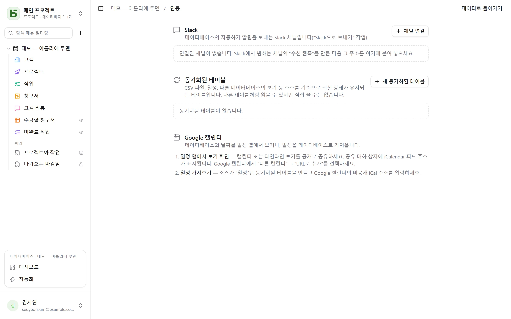

데이터베이스의 **연동** 화면은 왼쪽 아래 프로필 메뉴에서 엽니다. **관리** 권한이 필요하며,
데이터베이스를 다른 도구와 연결하는 기능이 모두 모여 있습니다.

## Slack

**채널 연결**: Slack에서 원하는 채널에 *수신 웹훅*을 만든 다음, 그 주소
(`https://hooks.slack.com/…`, 허용되는 유일한 출처)를 붙여 넣으세요. **테스트**를 누르면 테스트
메시지를 보냅니다. 주소는 저장하는 즉시 암호화되며 다시는 표시되지 않습니다.

연결한 채널은 이후 [자동화](/basedb/ko/fonctionnalites/automatisations/)의 동작으로 쓸 수
있습니다. **Slack으로 보내기** 단계에서 행을 인용하는 메시지를 보냅니다. 예: “{{Auteur}} 님의
새 부정적 후기: {{Avis}}”.

## 일정

방향은 두 가지, 방법도 두 가지입니다.

- **일정 앱에서 보기 확인**: 캘린더 보기나 타임라인 보기를 공개로 공유하세요. 공유 대화 상자에
  **iCalendar 피드** 주소가 표시되며, Google 캘린더(“다른 캘린더” → “URL로 추가”), Outlook,
  Apple Calendar에서 구독할 수 있습니다.
  [공유 보기](/basedb/ko/fonctionnalites/vues-partagees/#일정-앱에서-구독하는-캘린더)를
  참고하세요.
- **일정 가져오기**: 소스가 “일정”인 동기화된 테이블을 만들고, 일정의 비공개 iCal 주소를
  입력하세요.

## 동기화된 테이블

동기화된 테이블은 **소스를 기준으로 최신 상태가 유지됩니다**. 다른 테이블처럼 읽고, 필터링하고,
보기로 표시할 수 있지만 직접 쓸 수는 없습니다. “동기화됨” 배지가 이를 알려 주며, API는 모든
쓰기를 거부합니다(`TABLE_SYNCED`).

| 소스 | 테이블의 모습 |
|---|---|
| **온라인 CSV 파일** | 파일의 열마다 하나의 열, 내용에 따라 숫자, 날짜, 텍스트로 타입 지정 |
| **일정**(Google 캘린더, iCalendar) | 행마다 이벤트 하나: 제목, 시작, 종료, 장소, 설명 |
| **basedb 공유 보기** | 이 인스턴스나 다른 인스턴스에 있는 [공유 보기](/basedb/ko/fonctionnalites/vues-partagees/#다른-데이터베이스의-소스)의 행 |

**새 동기화된 테이블**에서 소스와 주기(15분마다부터 하루 한 번까지)를 선택합니다. **동기화**를
누르면 즉시 다시 읽습니다. 동기화할 때마다 **동기화 키** 필드를 기준으로 테이블이 소스와
같아지도록 필요한 행을 만들고, 수정하고, 삭제합니다. 이 모든 쓰기는 기록에 남습니다.

동기화를 **중지**하면 테이블이 일반 테이블로 돌아갑니다. 행은 그대로 남고, 다시 직접 쓸 수
있습니다.

## 제한

- 소스는 5MB, 10,000행, 10초 한도 안에서 읽습니다.
- 소스를 읽지 못해도 아무것도 지워지지 않습니다. 다음 동기화까지 테이블은 행을 유지합니다.
- 테이블을 만든 뒤 소스에 새로 생긴 열은 추가되지 않습니다.
- Slack은 수신 웹훅으로 연결하며, Slack 앱을 통한 연결은 아직 지원하지 않습니다.
