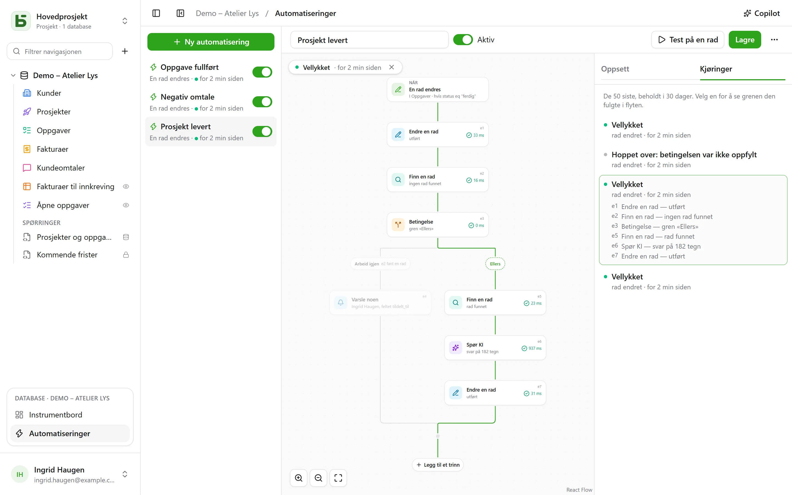

En automatisering sier **når**, **hvis** og **så**: når en oppgave går over til «Fait», notere
klokkeslettet; når en negativ tilbakemelding kommer inn, varsle den ansvarlige og skrive i Slack; hver
mandag kl. 9 opprette raden for teammøtet. Og når én handling ikke er nok, følger den en
**flyt**: finne en rad, ta én gren eller en annen ut fra hva den inneholder, gjenta trinn
på hver rad som samsvarer med et filter, gjenbruke i ett trinn det et tidligere trinn har
funnet eller skrevet.

De åpnes fra **Automatiseringer**, i blokken for den åpne databasen nederst i
sidepanelet, og krever nivået **Administrere**.



## Flyten

Flyten tegnes ovenfra og ned: utløseren, deretter hvert trinn. En **+** på en linje
legger til et trinn på det stedet; et kort åpner innstillingene sine til høyre. En enkel
automatisering – én utløser og én handling – får plass på to kort, og settes opp som før.

## Når

| Utløser | Innstillinger |
|---|---|
| **En rad opprettes** | tabellen |
| **En rad endres** | tabellen, og ved behov bare feltene som skal overvåkes |
| **På fast tidspunkt** | hver time, hver dag eller hver uke, på valgt klokkeslett og i valgt tidssone |
| **Noen klikker på en knapp** | et [Knapp-felt](/basedb/nb/fonctionnalites/tables-et-champs/#knapp) i tabellen |

En utløser på rader ser **all** skriving: grensesnittet, API-et, en agent, et
delt skjema og til og med direkte SQL – automatiseringene tar utgangspunkt i historikken, som
fanger opp alt.

## Bare hvis

En valgfri betingelse, i [filterspråket](/basedb/nb/integrations/api-rest/#lese) –
`statut eq "fait"`, `montant gte 10000 and payee eq false` – som vurderes på raden **i det øyeblikket
den skal handle**. En kjøring der betingelsen ikke er oppfylt, blir «forkastet», og sier det.

## Så

Opptil tretti trinn, i rekkefølge; det første som mislykkes, stopper de neste.

| Trinn | Hva det gjør |
|---|---|
| **Endre en rad** | skriver verdier i raden som utløste – eller i den et trinn har funnet eller opprettet |
| **Opprett en rad** | i denne tabellen eller en annen i databasen |
| **Finn en rad** | den første raden i en tabell som samsvarer med et filter, slik at de neste trinnene kan referere til eller endre den |
| **Varsle noen** | et [varsel](/basedb/nb/fonctionnalites/collaboration/#varsler) til utvalgte personer, eller til den i et Person-felt |
| **Send en e-post** | til personer i teamet, til personen i et Person-felt, til adressen i et E-post-felt – en kunde, en leverandør – eller til adresser du skriver inn; emnet og teksten refererer til raden og de forrige trinnene |
| **Kall en webhook** | en HTTPS-forespørsel til en tjeneste – metode, adresse, headere og brødtekst du styrer selv ([detaljer](#kall-en-tjeneste)); svaret kan refereres til etterpå |
| **Send til Slack** | en melding i en [tilkoblet](/basedb/nb/integrations/synchronisation/#slack) kanal |
| **Spør KI** | et svar fra [KI-leverandøren](/basedb/nb/fonctionnalites/ia/) på en instruksjon som refererer til raden og de forrige trinnene – skrive, oppsummere, klassifisere –, lest som en tekst, et tall, ja eller nei, en dato eller et valg i en liste |
| **Betingelse** | flere grener: den første der betingelsen er oppfylt, blir tatt, «Ellers» når ingen er det; grenene møtes igjen etterpå |
| **For hver rad** | trinnene den inneholder, én gang for hver rad i en tabell som samsvarer med et filter ([detaljer](#for-hver-rad)) |

Et søk som ikke finner noe, stopper ikke flyten: trinnene som skulle endre raden det skulle finne,
hoppes over. For å gjøre noe annet i det tilfellet tester en betingelse det – en gren
med tomt filter tas så snart søket har funnet noe.

## For hver rad

Trinnet **For hver rad** leser radene i en tabell som samsvarer med filteret sitt – tomt:
alle –, i den valgte rekkefølgen, opp til grensen sin (50 som standard, høyst 200), og
utfører så trinnene som er lagt i det, én gang for hver rad. «Hver mandag, purre på ubetalte
fakturaer» skrives slik: **På fast tidspunkt**, deretter **For hver rad** av fakturaene
`payee eq false and relancee eq false`, og i løkken en e-post til fakturaens kontakt og
**Endre en rad** som krysser av «Relancée».

I løkken navngir trinnets identifikator **gjennomgangens rad**: `{{e1.client}}` refererer
til den, og **Endre en rad** foreslår den blant radene som kan endres. Etter løkken forteller
`{{e1.nombre}}` hvor mange rader den har gjennomgått – for eksempel til et sammendrag på
Slack. Filteret kan referere til det som kom før: utløst av en betalt faktura, gjennomgår
`facture eq {{_id}}` detaljradene til den.

Utover grensen venter de gjenstående radene til neste kjøring, som sier ifra om det: la
filteret utelukke dem som allerede er behandlet – en «Relancée»-avkrysningsboks, en dato –
for å behandle dem alle etter hvert som kjøringene skjer. En løkke kan ikke inneholde en
annen, og en kjøring stopper etter to minutter.

## Kall en tjeneste

Trinnet **Kall en webhook** sender som standard, i `POST`, automatiseringens data: den
valgte raden og det de forrige trinnene har funnet eller skrevet. For å snakke med en
tjeneste slik den forventer, stiller du inn:

- **metoden**: `POST`, `PUT`, `PATCH`, `GET` eller `DELETE` – de to siste uten brødtekst;
- **adressen**, som kan referere til noe etter verten sin – `https://api.exemple.fr/clients/{{e2.numero}}`;
  hver verdi kodes der;
- **headere**, der verdien kan referere til noe: `Idempotency-Key: {{_id}}`;
- **brødteksten**: automatiseringens data, en **JSON å sette sammen**, et **skjema**
  (et par `nøkkel=verdi` per linje) eller en **tekst**. I en JSON er en referanse i
  anførselstegn tekst, og utenfor anførselstegn en verdi – et tall, ja eller nei, en liste:

```json
{ "facture": "{{e1.numero}}", "montant": {{e1.montant}}, "payee": {{e1.payee}} }
```

En API-nøkkel eller et token settes i en **hemmelig** header (hengelåsen): kryptert med
instansnøkkelen vises den aldri igjen – verken på skjermen, i API-et eller til Copilot –
og den sendes bare til verten du har gitt den til. Skifter adressens vert, må du gi den på
nytt; **Erstatt** lar deg skrive inn en ny.

## Spør KI

Som et [KI-felt](/basedb/nb/fonctionnalites/ia/#ki-alternativet-for-et-felt) sender trinnet
instruksjonen sin til leverandøren, der hver referanse er erstattet med verdien sin:

```text
Cet avis de {{auteur}} demande-t-il une action de notre part ? {{avis}}
```

Du velger **forventet svar** – en fri eller kort tekst, et tall, ja eller nei, en dato,
en nettadresse, eller et valg i en liste, som kan hentes fra et valgfelt. Modellen
får beskjed om det, og et svar som ikke inneholder det, får trinnet til å mislykkes. De neste trinnene
refererer til det med `{{e1.reponse}}`: i tittelen på en opprettet oppgave, en melding eller et valgfelt,
der det plasseres på valget med samme etikett.

Det instruksjonen refererer til, sendes til leverandøren: trinnet ber om **samtykket** ditt, som må gis på nytt
når instruksjonen endres. Hvert kall logges og telles, sammen med KI-feltene, i
`BASEDB_AI_FIELD_QUOTA` (300 per time som standard). KI gjør ingenting på egen hånd: det er
trinnene som kommer etter den, som skriver eller varsler.

## Referanser

Verdiene, meldingene og filtrene refererer til det som kom før, via knappen **{ }** ved siden av
hver tekst:

- `{{Titre}}`, `{{_id}}`: raden som utløste;
- `{{e2.titre}}`, `{{e2._id}}`: raden som ble funnet, opprettet eller endret av trinnet `e2` – hvert
  trinn viser identifikatoren sin på kortet;
- `{{e3.statut}}`, `{{e3.reponse.numero}}`: det webhooken `e3` svarte;
- `{{e4.reponse}}`: svaret fra KI-trinnet `e4`;
- `{{e5.client}}` i løkken `e5`, gjennomgangens rad; `{{e5.nombre}}` etter den, antall rader
  den har gjennomgått;
- `{{_maintenant}}`: tidspunktet for kjøringen.

En verdi som består av én enkelt referanse, sender selve verdien: en relasjon, en person, et
valg – slik kobles en opprettet rad til den et søk har funnet. I et
filter er en referanse alltid en verdi som sammenlignes, aldri filterspråk.

Et trinn kan bare referere til det som med sikkerhet har skjedd før det: det en gren har funnet,
kan ikke refereres til etter betingelsen. Editoren viser det på kortet før lagring.

## Copilot

**Copilot**, i toppfeltet, åpner til høyre en samtale på naturlig språk om
databasens automatiseringer: «når en oppgave går til gjennomgang, varsle personen som er
tildelt», «legg til et KI-sammendrag i notatene», «hvorfor mislyktes den siste
kjøringen?». Den svarer og **foreslår** en hel automatisering – den du har på skjermen,
endret, eller en ny –, med en liste over hva som endres.

Ingenting lagres av Copilot: **Legg på flyten** viser forslaget i editoren,
der du leser gjennom det før du lagrer – og **Angre**, på kortet, setter flyten tilbake slik den
var. En ny automatisering åpnes i editoren, klar til å opprettes. Hvert forslag
kontrolleres slik en lagring ville blitt; det som ikke holder, forkastes, og det sies ifra.

Som standard sendes **bare strukturen** til KI-leverandøren, sammen med samtalen: tabellene
og feltene deres, databasens automatiseringer, den som er på skjermen slik editoren viser den, og
de siste kjøringene av den – statusene og feilkodene deres, aldri en verdi. Personer
og Slack-kanaler sendes under stedfortredere (`p1`, `s1`), aldri med identifikatoren sin. Avkrysningsboksen
**Tillat lesing av dataene** lar Copilot, for samtalen, lese rader
(høyst 50 per lesing), og hver lesing listes under svaret.

## Test og følg opp

**Test på en rad** kjører den lagrede automatiseringen på en valgt rad, på
ordentlig. Fanen **Kjøringer** tar vare på de 50 siste, i 30 dager: venter, pågår, vellykket,
forkastet med årsak, mislyktes med kode. Velger du en, legges den på flyten – grenen
som ble tatt, er tegnet opp, hvert trinn som ble utført, forteller hva det gjorde og hvor lang tid det tok, resten er
nedtonet. I en løkke forteller hvert trinn også hvor mange ganger det ble kjørt.

## Hvem den handler på vegne av

En automatisering handler med **tillatelsene til personen som lagret den sist**,
vurdert på nytt ved hver kjøring: hvis denne personen mister en tillatelse, mislykkes trinnet som trengte den,
i stedet for å gå videre, og et søk finner bare det vedkommende kan lese.
Historikken viser den som «Automatisering ‹Tâche terminée› · på vegne av …», og skrivingene den gjør,
kan angres som alle andre.

## Begrensninger

- Det en automatisering skriver, utløser ingen andre: det som skal henge sammen, skrives
  i én og samme flyt.
- Et søk gir én rad, den første; en løkke gjennomgår høyst 200 per kjøring, og det første
  trinnet som mislykkes, stopper den. Ingen venting («tre dager etterpå»).
- Ingen skript. En e-post sendes som ren tekst, én per mottaker — høyst tjue per trinn —, via
  [utsendingsserveren](/basedb/nb/hebergement/variables/#e-poster) til instansen; et svar går til
  personen som eier automatiseringen.
- En betingelse tester en rad: for å velge gren ut fra KI-svaret må det først
  skrives i et felt i raden.
- En [databasemal](/basedb/nb/fonctionnalites/modeles/) tar bare med automatiseringer uten
  søk, løkke, betingelse eller KI-trinn, og aldri en webhook.
- En webhook følger ingen omdirigering og venter høyst 10 sekunder; et annet svar enn 2xx
  gjør at trinnet mislykkes.
- 100 kjøringer per time og per automatisering; et tapt timetidspunkt tas bare igjen
  én gang.
- Forsinkelsen mellom skrivingen og handlingen er i størrelsesorden ett sekund.
