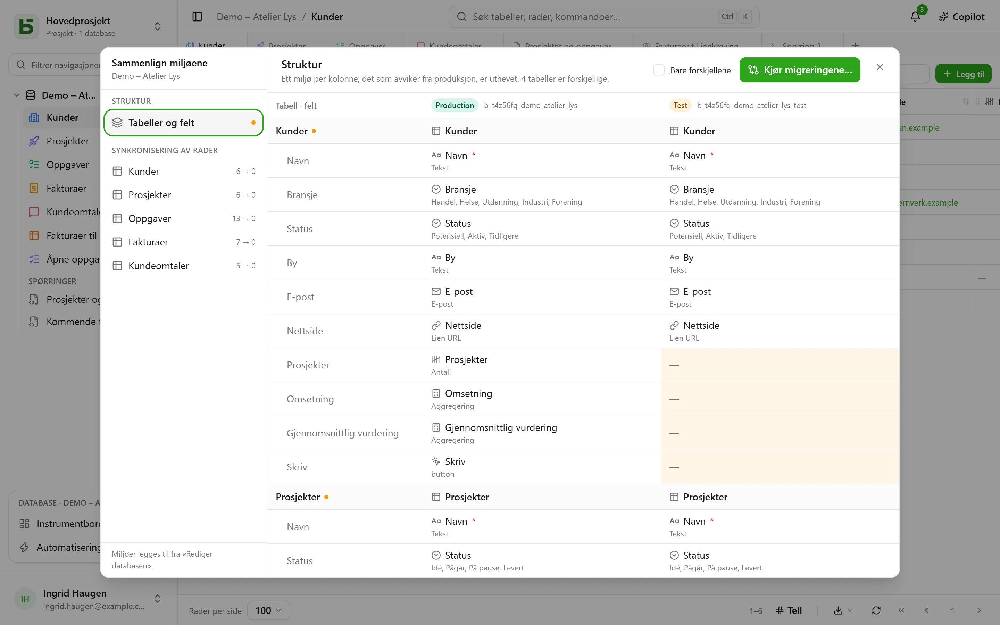

En database kan ha **miljøer**: produksjon, test, utvikling … Hvert av dem er en
fullverdig database – med eget skjema, egne tabeller, rader og tillatelser – og alle deler
**avstamningen** til databasen, tabellene og feltene.

## I grensesnittet

Sidepanelet viser **én linje per database**, med et merke som viser hvilket miljø som er åpent, og
lar deg bytte. Merket vises ikke så lenge det bare finnes produksjon.

Miljøer legges til, får nytt navn og slettes i **Rediger databasen…**: et
nytt miljø oppstår fra en **kopi av strukturen** til et annet, uten radene.

## Sammenlign miljøene

Fra databasens meny, under **Flere handlinger**, åpner **Sammenlign miljøer…** en dialog:

- **Struktur**: miljøene i kolonner, tabeller og felt i rader; det som avviker fra
  produksjon, er uthevet.
- **Ta i bruk migreringer…** forbereder planen for å gå fra ett miljø til et annet, trinn
  for trinn. Den krysser aldri av på forhånd for noe som ville oppheve en nyere endring i
  målet.
- **Synkronisering av rader**: tabell for tabell, overfør rader fra ett miljø til
  et annet, etter identifikator.

## Hvordan basedb vet hvem som endret hva

Sammenligningen bygger på **strukturhistorikken**: hver opprettelse, endring eller
sletting av en tabell eller et felt fanges opp av en trigger på katalogen, og kan leses i
fanen «Struktur» i historikken. Avstamningsidentifikatorene kobler et felt i test
til motstykket i produksjon, selv om det har fått nytt navn.

## I SQL

Hvert miljø er et PostgreSQL-skjema: `b_t4z56fq_ventes` for produksjon,
`b_t4z56fq_ventes_recette` for test. Spørringene dine bytter miljø ved å bytte
skjema – eller `search_path`.
