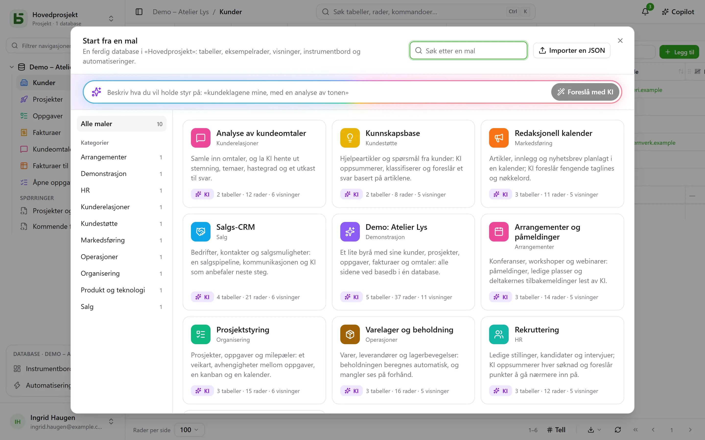

En **mal** oppretter en hel database med ett klikk: tabellene og relasjonene mellom dem, eksempelrader,
visninger, et instrumentbord, automatiseringer og felt som KI fyller ut
selv. [Malgalleriet](/basedb/nb/modeles/) viser dem basedb tilbyr.

## Start fra en mal

**Ny database**, deretter **Start fra en mal, eller be KI om en**: galleriet åpnes.



Hver mal kan leses i sin helhet før den tas i bruk – tabellene og feltene deres, visningene,
automatiseringene og instruksjonen for hvert av KI-feltene. **Opprett databasen** ber om
etiketten og, hvis det finnes KI-felt, samtykket ditt til at verdiene de refererer til,
sendes til instansens KI-leverandør. Uten dette samtykket er de vanlige
felt, fylt ut med eksempelverdiene sine.

**Last inn eksempeldata**, avkrysset som standard, fyller tabellene med eksempelrader for å se
databasen i bruk. Fjernes avkrysningen, forblir tabellene tomme, klare for dine egne data –
visninger, instrumentbord og automatiseringer opprettes likevel.

Et tomt prosjekt tilbyr også **demodatabasen**: et lite byrå med kunder,
prosjekter, oppgaver, fakturaer og tilbakemeldinger, som viser alle sidene ved basedb.

## På ditt språk

De offisielle malene leses og opprettes **i skjermens språk**: tabeller, felt, valg,
eksempelrader, visninger, instrumentbord, automatiseringer og KI-instruksjoner. Eksempelradene
bytter verden med språket: den franske «Boulangerie Martin» i Lyon blir til «Martins bakeri»
i Bergen på bokmål.

En mal som er importert til instansen din, eller lagret fra en database, er skrevet av noen:
den leses slik den ble skrevet.

## Be KI om en mal

Øverst i galleriet beskriver du behovet ditt med én setning – «oppfølging av reklamasjoner fra
kundene mine, med en analyse av tonen». KI foreslår en komplett database: tabeller, troverdige
eksempelrader, visninger, et instrumentbord og KI-felt der bruken tilsier det. Du
leser den som en mal, du kan **finjustere** den («legg til en tabell med leverandører»),
og så opprette den. KI mottar bare setningen din – ingen data fra noen database – og ingenting blir
opprettet før du klikker.

## Skriv en mal i JSON

En mal er et JSON-dokument. Her er skjelettet:

```json
{
  "format": 1,
  "key": "suivi-tickets",
  "label": "Suivi de tickets",
  "summary": "Une phrase pour la galerie.",
  "category": "Produit et technique",
  "icon": "bug",
  "color": "#ef4444",
  "tables": [
    {
      "key": "tickets",
      "label": "Tickets",
      "fields": [
        { "label": "Titre", "kind": "short_text" },
        { "label": "Statut", "kind": "select", "options": ["Nouveau", "En cours", "Résolu"] },
        { "label": "Ouvert le", "kind": "date" },
        { "label": "Description", "kind": "long_text" },
        { "label": "Catégorie", "kind": "select", "options": ["Bug", "Demande"],
          "ai": { "prompt": "Classe ce ticket : {{Titre}} — {{Description}}" } },
        { "label": "Âge (jours)", "kind": "formula", "formula": "JOURS(AUJOURDHUI(); [Ouvert le])" }
      ]
    },
    { "key": "produits", "label": "Produits", "fields": [{ "label": "Nom", "kind": "short_text" }] }
  ],
  "links": [{ "from": "tickets", "label": "Produit", "to": "produits" }],
  "rows": {
    "produits": [{ "$key": "app", "Nom": "Application mobile" }],
    "tickets": [{ "Titre": "Crash au démarrage", "Statut": "En cours", "Ouvert le": "-3d", "Produit": "@app" }]
  },
  "views": [
    { "table": "tickets", "label": "Tableau", "kind": "kanban", "spec": { "group_by": "Statut" } }
  ],
  "dashboards": [
    { "label": "Vue d’ensemble", "blocks": [
      { "kind": "number", "title": "Ouverts", "table": "tickets", "filter": "[Statut] ne \"Résolu\"" },
      { "kind": "chart", "title": "Par catégorie", "table": "tickets", "group_by": "Catégorie", "style": "pie" }
    ] }
  ],
  "automations": []
}
```

De viktigste reglene:

- **Alt refereres til med etikett**: et felt i en visning, et filter (`[Statut] ne "Résolu"`), en
  formel (`[Prix] * [Quantité]`), en KI-instruksjon eller en melding (`{{Titre}}`). Et valg
  angis med etiketten sin.
- Det **første feltet** i en tabell er visningsfeltet: en tekst, et tall, en dato,
  en e-post eller en adresse.
- En **relasjon** deklareres i `links`, aldri som et felt; en rad peker til den med
  `"@clé"`, `$key` til en rad i måltabellen.
- En **dato** kan være relativ til dagen malen tas i bruk: `"today"`, `"+3d"`,
  `"-2w"`, `"+1m"`; en dato med klokkeslett legger til tiden, `"+1d 14:30"`. En person skrives `"$moi"`.
- Et **KI-felt** har `"ai": { "prompt": "…" }` og kan få en eksempelverdi, som bare skrives
  når KI ikke brukes.
- En mal inneholder **aldri** delinger, tillatelser, webhooks, filer eller andre personer
  enn `"$moi"`: den kommer noen ganger utenfra, og skal ikke åpne noe.

Den fullstendige referansen – alle felttyper, alle nøkler for visninger, grensene – står i
kapittel 20 i arkitekturdokumentasjonen, i depotet.

## Publiser en mal for alle instanser

Malene i det offisielle galleriet er filene i mappen
[`packages/templates/catalog`](https://github.com/eodia/basedb/tree/main/packages/templates/catalog)
i depotet, én fil per mal, navngitt etter `key`. Det offentlige nettstedet lager
[galleriet](/basedb/nb/modeles/) av dem og publiserer hele katalogen på adressen
[`/basedb/modeles/catalogue.json`](/basedb/modeles/catalogue.json). Hver instans leser den
når noen åpner galleriet, og beholder den i en time: å endre en fil og publisere
nettstedet på nytt er nok til å endre galleriet på alle instanser.

Hver mal kontrolleres når nettstedet bygges, av den samme validatoren som serveren:
en ugyldig mal får byggingen til å mislykkes i stedet for å nå brukerne.

En offisiell mal skrives én gang, på fransk. Tekstene i et annet språk er en ordbok,
[`packages/templates/i18n/<langue>/<clé>.json`](https://github.com/eodia/basedb/tree/main/packages/templates/i18n)
– den franske teksten, så oversettelsen –, som nettstedet publiserer ved siden av katalogen
(`/basedb/modeles/i18n/<langue>.json`). Instansen setter inn hver tekst der og følger hver
etikett der den siteres – formler, filtre, visninger, instruksjoner –, og leser så resultatet på
nytt: en ordbok som ville ødelagt malen, blir ikke servert, den franske malen blir det. En tekst
som mangler i ordboken, forblir på fransk.

Instansen leser adressen `BASEDB_TEMPLATES_URL` – som standard det offentlige nettstedets. Pek den
mot en egen katalog, eller sett `off` for ikke å lese noen: instansen serverer da
malene som er innebygd i versjonen.

## Malene på instansen din

En administrator kan **importere en JSON-mal** til instansen sin, fra galleriet
(«Importer JSON»): den blir med i galleriet for alle brukerne, og erstatter en mal
med samme nøkkel. Et forslag fra KI kan legges til der med ett klikk.

Enhver database kan også bli en mal: **Lagre som mal** i databasens meny,
under **Flere handlinger**. Tabellene, feltene, KI-instruksjonene, relasjonene, de delte visningene, instrumentbordene og
automatiseringene – og, om du vil, opptil 50 rader per tabell – lastes ned i
JSON, klare til å bli med i den offisielle katalogen eller instansens. En automatisering som
finner en rad, tar grener eller refererer til et tidligere trinn, holdes utenfor foreløpig,
og skjermen sier ifra om det.
